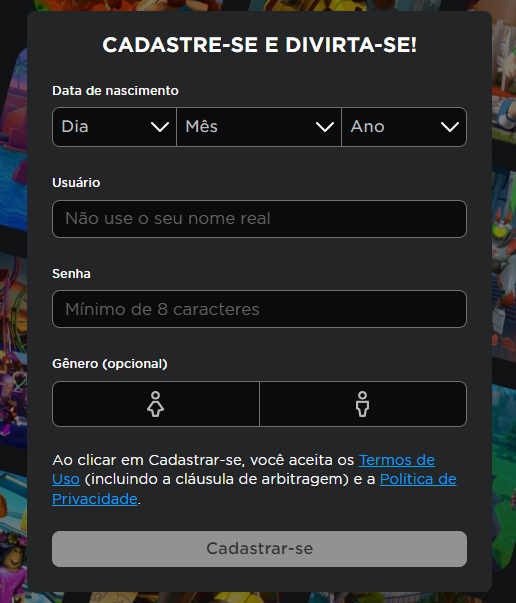
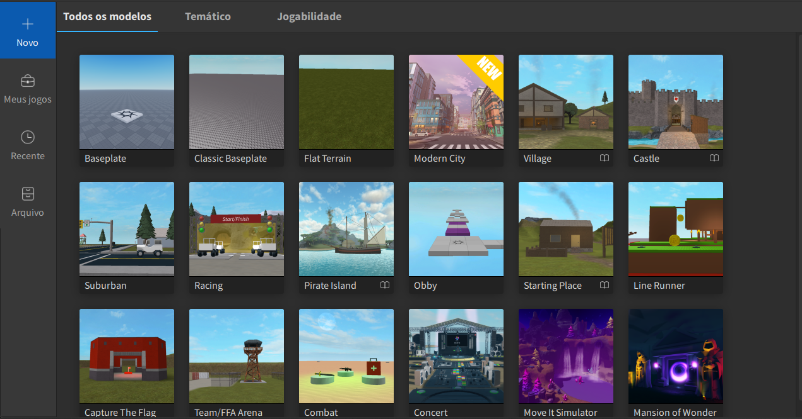
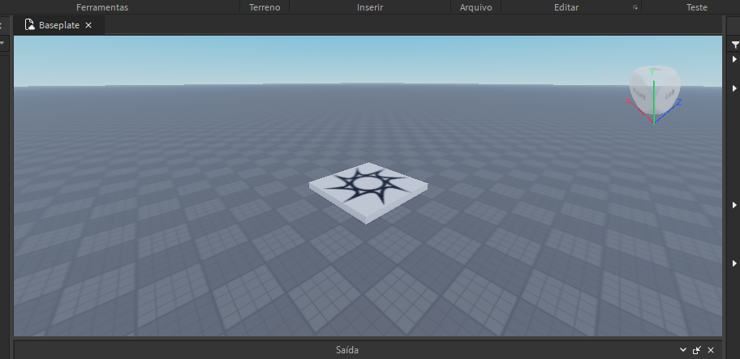
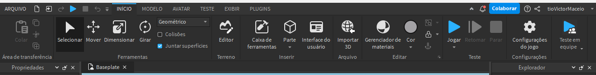
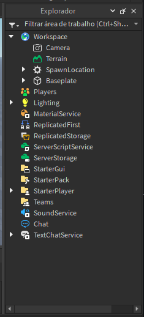
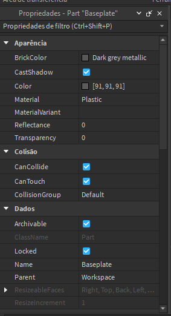
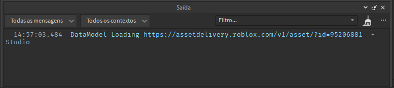
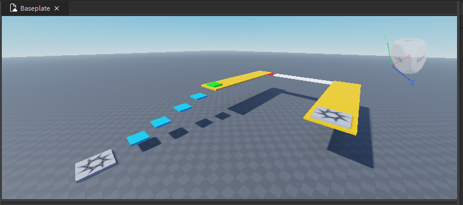

# Introdução

## Pré-aula
Para esta e para as aulas subsequentes verifique se é mais simples acessar o computador através do Roblox Studio ou através do site do Roblox, isso é variável entre os computadores, e essa questão ainda não foi diagnosticada.

Neste primeira aula não teremos programação.

## Criando contas
Vamos começar ensinando a criar uma conta no Roblox pelo computador. Isto normalmente é feito pelo site do [Roblox](https://www.roblox.com) e é um procedimento realmente simples, basta preencher os campos que são os mesmo da imagem abaixo e o cadastro será realizado, podendo acessar sua conta do Roblox Studio tanto pelo site quanto diretamente pelo programa.

Após a criação da conta basta acessar o Roblox Studio e então teremos a seguinte tela:

## Criando um projeto
Através desta janela podemos criar um novo projeto, ver projetos que estávamos fazendo antes e até os projetos que acessamos mais recentemente.

Para criar um projeto precisamos estar no menu **Novo** e então podemos escolher o **template** que iremos utilizar para iniciar o nosso projeto.

Um **template** é apenas um modelo de um projeto com alguns elementos já inclusos, mas sem programação a não ser dos elementos inclusos. Em outras palavras é um recurso que acelera o desenvolvimento do nosso projeto, mas que por mais que ele possa acelerar nada nele virá exatamente como queremos.

No nosso caso iremos escolher a opção **Baseplate** ou **Classic Baseplate** para iniciar o nosso projeto. Estes templates não tem nada além de um piso simples.

## Interface
Agora vamos conhecer a interface do Roblox Studio, suas abas e as partes mais importantes da tela para nós que estaremos usando o programa.

> Neste ponto não se foque tanto em todas as telas possíveis
> vá direto ao ponto
> 
> - Explorador
> - Propriedades
> - Saída
> 
> Apenas estas

### **Cenário**
Cenário é o local onde montamos o nosso jogo. Adicionando, removendo e até moldando elementos para que fiquem da forma como queremos que fiquem.

Ele fica bem no meio da nossa tela e no nosso caso é este local aqui

### **Menu**
O menu do Roblox é o local que mais iremos visitar pois é lá onde vamos quando queremos adicionar elementos simples (chamadas de *Part*), modificar algumas propriedades e até testar o jogo para ver como está ficando. 

É lá também que vamos quando queremos exibir configurar algo no nosso projeto, como por exemplo as janelas que ficarão abertas durante o desenvolvimento.

Falando em abas existem 3 que não podem faltar enquanto estamos nisso.

### **Explorador**
Esta aba do Studio é muito importante pois ela representa o nosso jogo. 

Nela estarão listados todos os elementos que compoem a nossa cena, até mesmo os que deixarmos invisíveis e os que criamos para o jogo, mas que optamos por não deixar livres na cena o tempo todo, como projéteis e também é onde vamos quando queremos adicionar um Script à algum de nossos objetos.

### **Propriedades**
Essa janela é muito importante pois é nela que vemos cada detalhe do objeto selecionado, como posição, tamanho, cor, material, transparência e todos os detalhes possíveis que possamos alterar.

### **Saída**
Esta última janela não pode ficar de fora, pois apesar de não aparentar ela tem muita importância no desenvolvimento do nosso jogo.

Iremos programar alguns objetos que usaremos no nosso cenário, mas é provável que cometamos erros, seja por pressa, por colocar uma letra errada ou algo do tipo, mas iremos errar e isso é normal. A janela de Saída é onde poderemos ver em que parte de qual Script o nosso erro está para que assim possamos corrigir.

## Construindo um Mapa
Agora que já vimos os elementos mais importantes da interface vamos começar a construção do nosso mapa.

Vamos fazer uma escada para que possamos subir até uma plataforma, no começo dessa plataforma teremos um botão que servirá para nos dar mais velocidade e no final dela teremos um botão conectado a uma ponte que nos levará para uma segunda plataforma. No final dessa segunda plataforma teremos um Spawner.

Depois de adicionar esse Spawner os alunos podem construír o resto do mapa como preferirem.

A primeira parte fica como na imagem abaixo:

O restante do mapa fica a critério dos alunos