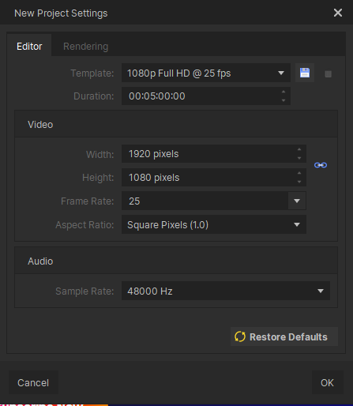
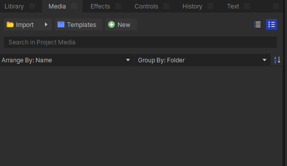
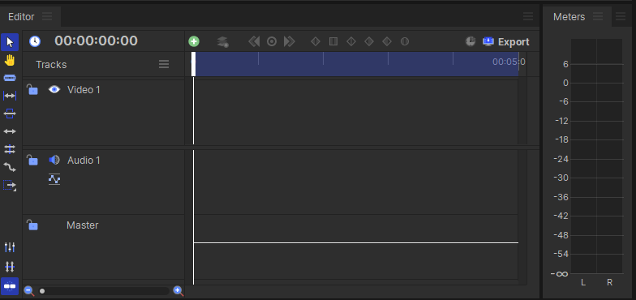
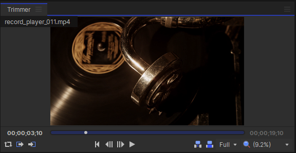
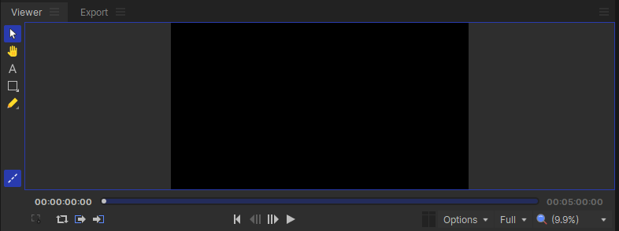

# Edição de Vídeo

## Pré-aula
Para esta aula estaremos utilizando o [HitFilm](https://fxhome.com/product/hitfilm) e para isto os aluno precisarão de contas. Caso não tenha contas prontas com os e-mails da escola faça contas para os alunos, mas lembre-os que ele precisarão ter as próprias contas caso usem este programa em casa.

Tenha vídeos preparados previamente para que os alunos possam praticar os comandos de edição de vídeo.

## Editor de Vídeo
O **HitFilm** é um programa de edição de vídeos profissional e com uma interface muito semelhante a outro programa já bem consolidado no mercado: o **Adobe Premier**.

Para utilizar o HitFilm a primeira coisa que precisamos é ir até o site e criar uma conta, quando criamos uma conta o site já inicia o download do [HitFilm](https://account.fxhome.com/register) para o nosso computador e a partir daí precisamos apenas instalar e então executar o programa.

Com o programa aberto precisamos criar um novo projeto para poder iniciar a edição, então clique no botão azul *Create New* e a janela abaixo irá aparecer para você:

Aqui iremos configurar o básico sobre o nosso vídeo, mas não subestime o básico pois é ele quem irá dar ao seu vídeo a cara que você quer que ele tenha.

### **Width e Height**

Primeiro temos o **Width** e **Height** que são, respectivamente a largura e a altura do seu vídeo em *pixels*, para quem não sabe a tela do computador e feita por várias luzinhas pequenininhas e elas são os nossos pixels. Essas opção vão nos ajudar a definir a qualidade do nosso vídeo: 

- HD: 720p
- Full HD: 1080p
- 4k: 2160p

Esse **p** no final é de pixels e esses valores são referentes a altura do nosso vídeo. A quantidade de pixels na largura de um monitor pode variar pois o formato de um pixel pode mudar, mas a altura é sempre a mesma e por isso é ela quem define a qualdiade do vídeo. Para o YouTube sempre escolha no mínimo em Full HD.

### **Frame Rate**

Depois disso temos o **Frame Rate**, que é um número bem importante para a nossa produção. Um vídeo nada mais é do que várias imagens passando rapidamente, o Frame Rate é o número de imagens que passaram em 1 segundo de vídeo. Esse número não altera a qualdiade do vídeo nem nada, mas ele é importante pois produções para mídias diferentes tem frame rates diferentes pois precisam causar uma sensação diferente para o espectador.

Por exemplo temos a diferença entre um filme e uma novela, mesmo que ambos estejam em Full HD a sensação de um filme é sempre diferente da novela, é como se a novela fosse mais fluida. E isso acontece pois o frame rate de uma novela é maior que o do cinema. No cinema tudo é feito para rodar a **24 fps** (Frame Per Second) já uma novela é feita para rodar a **48 fps**.

É claro que isso não é obrigatório, é uma escolha do direto/produtor da mídia, um exemplo disso foi que o filme O Robit foi feito em 48 fps pois o diretor quis inovar, acabou não conseguindo, mas o foco aqui é que ele fez por que quiz. No caso de jogos tudo é feito em 60 fps pois gamers gostam de fps alto e funciona bem até hoje.

### **Aspect Ratio**
Por último mas não menos importante temois o **Aspect Ratio** que diz qual o formato do pixel que estamos uzando nessa produção. É aqui que marcamos qual mídia será o nosso alvo. Se foi para computador então escolhemos o Square Pixel, se for outra mídia escolhemos outra opção, mas como estaremos nos preparando para o YouTube vamos manter o Square Pixel.

### **Template**
Para que não tenhamos que escolher opção por opção durante a criação do projeto podemos apenas escolher um template que nos dê o formato da tela e o FPS, colocamos o Aspect Ratio que queremos e facilitamos a criação do projeto.

Para finalizar basta clicar em OK.

> a: **Mas professor e a duração**?
> 
> p: A duração do projeto pode ser definida durante a edição do vídeo então não precisamos nos preocupar com ela no momento.

## **Partes de um Editor**
Todo programa de edição de vídeo é dividido em partes para simplificar seu uso e ainda assim permitir multiplas funcionalidades para quem está utilizando o software.

Isso não é diferente para o **HitFilm**, o programa que estaremos utilizando durante as aulas.

Os nomes das partes e a região da tela que ocupam podem mudar de um programa para o outro, mas o sua funcionalidade mais básica ainda é a mesma.

### **Media**
Esta parte é responsável por conter todos os arquivos que estaremos utilizando no nosso projeto. 

No HitFilm neste mesmo lugar podemos alterar a aba selecionada e então ir para a a parte de efeitos e outros elementos que são úteis no nosso vídeo.

### **Timeline**
Timeline ou Linha do Tempo está presente em um projeto e é nela que adicionamos os efeitos, realizamos os cortes e várias outras coisas.

Um mesmo projeto pode ter várias timelines e normalmente tem.

Além disso as timelines de áudio e vídeo são separadas.

Para adicionar algum recurso para a nossa timeline é preciso primeiramente ter este vídeo importado no nosso projeto. Tendo ele adicionado ao nosso projeto basta que arrastemos o vídeo para a nossa timeline.

### **Trimmer**
Nesta região podemos ter uma previsualização do arquivo que importamos no projeto e no caso de ser um vídeo ou um áudio e de não precisarmos adicionar ele todo na Time Line, nós podemos fazer um corte prévio e adicionar apenas a sessão do arquivo que nós queremos.

### **Viwer**
Neste local nós pdoemos assistir ao nosso vídeo como está ficando enquanto estamos editando.

