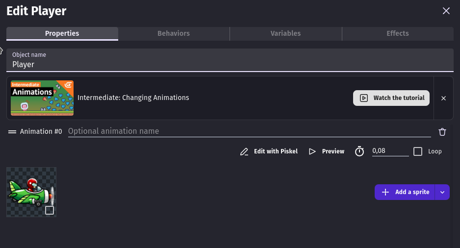

# Level 1

## Pré-aula
Antes do início da aula alguns arquivos devem ser deixados de prontidão pra serem utilizados na aula

O arquivo se chama [Assets](Assets.zip) e recomendo que deixe/pocure no caminho **Documentos/Aulas Demonstrativas/Level 1** já extraído para ser utilizado.

Alguns tópicos devem ser abordados no início da aula:
* Apresente-se
* Converse com o aluno
* Apresente a escola
* Verifique se ele tem algum conhecimento de programação
* Verifique o que ele gosta de jogar pois pode ser útila mais pra frente

> O programa é deixado em inglês para enfatizar a utilização do idioma durante todas as aulas, então garanta que o GDevelop está em inglês tanto no seu computador quanto no do aluno

## Aula
Crie um projeto novo com o aluno e então abra o **Project Manager**

Será aberta a janela abaixo

Na lista de cenas (Scenes) renomeie a *Untitled scene* para *Game*

Vá em **Properties/Resoluton and rendering** e altere o tamanho da tela para 800x600 e clique em **Apply**

Agora basta clicar em Game para reabrir a cena

> Dos passos acima nenhum é obrigatório, mas recomendo pois é como ensina no portal.

Estando na cena vamos criar os objetos que usaremos no jogo. Isto é feito na aba **Objects** ao clicar no botão **Add a new object**

Esta aba normalmente fica no lado direito da tela, mas pode ser colocado em outra região da tela. Para ter certeza se essa aba está aberta veja se a opção abaixo está marcada

As outras opções podem, caso estejam marcadas, servem para abrir outras abas. Abra caso haja necessidade, mas não precisa fechar se não estiver usando.

Vamos começar criando a imagem de fundo do nosso jogo, então clique em **Add a new object** escolha **Tiled Sprite**, dê o nome de **Fundo** e escolha a imagem que será usada clicando em **chose a file** (ela irá mostrar algumas opções, mas basta clicar em *chose a file* novamente), ela se encontra no caminho **Documentos/Aulas Demonstrativas/Assets/spritesADLevel1/fundo** e o aluno pode escolher qualquer uma delas:

Depois alteramos o tamanho do Fundo para o tamanho da nossa tela que no início foi configurado em 800x600 e então clicamos em **Apply**

Agora criams mais três objetos do tipo **Sprite**: Player, Inimigo e Tiro

É posível encontrar todos na pasta **Documentos/Aulas Demonstrativas/Assets/spritesADLevel1/**

Após clicar para criar um objeto **Sprite** estaremos nesta janela:

Então damos um nome:

Então adicionamos um animação:

E adicioamos uma sprite na animação. O resultado final é o segunte:

Repita o processo para o Inimigo e o Tiro. Ao final teremos isto:

Então montamos o cenário colocando o Fundo na posição X=0, y=0 e o Player em algum lugar da tela no lado esquerdo:

## Comportamento
Comportamentos são programações que já vem prontas e que podemos apenas adicioar aos nossos objetos para que eles funcionem no jogo.

Faremos isto inicialmente com o **Player** então abra-o e vá até a aba **Behaviors**:

Nele vams adicionar o comportamento **Top-down Movement** e ele desativamos o **Rotate Object**

Para testar clicamos em **Preview** (lembre-se de fechar o jogo ao terminar o teste senão o botão de *Preview* não aparecerá novamente)

Após testar vamos adicionar *Behaviors* para o Tiro e o Inimigo. Ambos terão o mesmo comportamento porém configurados de formas diferentes.

## O Inimigo
Abra o **Inimigo** e vá até a aba de comportamentos e clique em *Add a behavior*. Ela terá duas abas:
- Installed Behaviors
- Search new behaviors

Escolha *Search new behaviors* e nele pesquise pelo behavior **Linear Movement** (não precisa digitar o nome todo) e então instale-o o projeto.

Instalar no Projeto não quer dizer que o Inimigo já tem o behavior nele, então é preciso voltar até a aba de **Behaviors** e lá adicionar o *Linear Movement* 

Altera o **Speed on X axis** para -350

## O Tiro
O comportament do **Tiro** será o mesmo, mas agora o **Linear Movement** já está instalado no projeto então podemos apenas escolher ele e colocar seu **Speed on X axis** para 350

## Porgramando o Jogo
Agora é preciso explicar para o aluno como é a programação no GDevelop. Aqui temos a ideia de eventos e ações.

Cada programação será um evento.

Para que um evento aconteça é preciso que uma ou mais condições aconteçam ao mesmo tempo.

Após o evento acontecer uma sequência de uma ou mais ações irá se desenrolar.

> Neste momento é bom saber do que o aluno gosta de jogar e então fazer um paralelo, por exemplo: No Minecraft é preciso apertar o botão de espaço para pular, então quando você aperta espaço todas as condições se cumprem, o evendo acontece e então as ações são realizadas.
> Mas é preciso entender que qualquer coisa pode ser um evento, por exemplo, ainda no Minecraft: quando se chega perto do Creeper ele explode.

Para programar precisamos sair da janela **Game** e ir para a janela **Game (Events)** e começe deletando todos os eventos que já existem por lá.

### Fazendo atirar
Para o Player atirar a programação é a seguinte:

- Condições:
- - Other Conditions > Keyboard > Key Pressed > Space
- - Other Conditions > Events and control flow > Trigger once while true
- Ações:
- - Tiro > Create Object ( X=Player.X(), Y=Player.Y() )

### Spawn dos Inimigos
Para criar os Inimigos no jogo vamos precisar de dois novos eventos um para iniciar o cronômetro para o Inimigo e outro para verificar se já deu o tempo de nascero o Inimigo:

**Criar o Timer/Cronometro:**
- Condição:
- - Other Conditions > Scene > At the beginning of the scene
- Ação:
- - Other Actions > Timers and time > Start (or reset) a Scene timer ( Timer's name = "spawn" )

> Para criar o timer o nome do timer precisa conter aspas na criação para que ele identifique como String não como uma variável

**Criando Inimigos**
- Condição:
- - Other Conditions > Timer and time > Value of a scene timer ( Timer's name = "spawn", Sign of the test = greater or equal to, Time in secnds = 3 )
- Ação:
- - Inimigo > Create Object ( X=850, Y=RandomInRange(80, 520) )
- - Other Actions > Timers and time > Start (or reset) a Scene timer ( Timer's name = "spawn" )

Ao testar o inimigo já nasce.

### Colisões
É preciso fazer o Tiro bater com o Inimigo pra que eles se destruam e o mesmo para quando o Player bate no Inimigo

**Tiro Destruindo Inimigos**
- Condição
- - Tiro > Collision > Inimigo
- Ação
- - Tiro > Delete the object
- - Inimigo > Delete the object

**Inimigo destruindo Player e reset do jogo**
- Condição
- - Inimigo > Collision > Player
- Ação
- - Inimigo > Delete the object
- - Player > Delete the object
- - Other Actions > Timers and time > Wait X seconds ( Time to  wait = 3 )
- - Other Actions > Scene > Change Scene ( Name = Game )

## Sobrando tempo...
Caso sobre tempo na aula é possível fazer um sistema de pontuação

Para isto adicione um novo objeto do tipo Text

Dê a ele o nome de Placar e altere a cor da fonte e tamanho conforme desejar. Caso necessário pode voltar e alterar estes valores. E no campo *Initial text to display* escreva **Pontos: 0**

Agora posicione-o onde achar melhor na tela.

Antes de partir para a programação vamos criar uma variável global para armazenar os pontos
- vá novamente até o **Project Manager**
- clique em **Global Variables**
- cliquem em **Add a variable**
- crie um variável pontos, tipo Number, com valor 0

Na programação vá até o ponto que o Inimigo é destruído pelo Tiro e adicione duas novas ações:

- Other Action > Variables > Global Variables > Change Number Variable ( Variable = pontos, Modification = add, Value = RandomInRange(10, 40) )
- Placar > Modify the text ( Modification = Set, "Pontos: " + GlobalVariableString(pontos) )

## Ainda sobrando tempo...
Adicione um sistema de paralax ao background para dar a impressão de que o Player se move.

Para isto adicione um evento sem condições e neste evento teremos como ação:
- Fundo > Image X Offset ( Modification = add, Value = 2 )

## Sobrando mais tempo...
Podemos adicionar um sistema de particulas que aparece quando o inimigo é destruído para que ele não apenas desapareça quando for destruído.

Para isto adicione um novo objeto **Particles Emitter** com nome KBoom e altere os seguintes campos:

- Number of particles in tank: 100
- Flow of particles: 500
- Spray cone angle: 360

Agora onde o Tiro destruir um inimigo adicione uma ação para criar as partículas:

- KBoom > Create an object ( X = Inimigo.CenterX(), Y = Inimigo.CenterY() )

