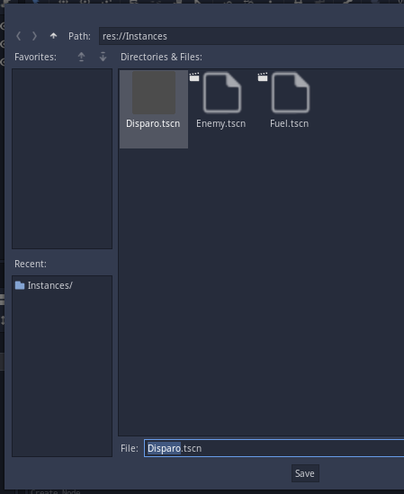

  # Dia dos Pais

  ## Pré-aula
  Os projetos devem estar prontos.
  
  Os seguintes elementos já devem estar criados no projeto:

  - Background com paralax
  - Intância do Fuel e do Enemy - aqui não deve ter programação, apenas o body, sprite e collision
  - A fase 1 onde já teremos o background funcionando, o fuel e o enemy ainda não funcionando

A **fase 1** deve estar aberta antes do início da aula juntamente com o **enemy** e o **fuel**

## Kanban da aula
- [Dia dos Pais](#dia-dos-pais)
  - [Pré-aula](#pré-aula)
  - [Kanban da aula](#kanban-da-aula)
    - [Fazendo o Player](#fazendo-o-player)
    - [Programando Combustivel](#programando-combustivel)
    - [Criar e Programando tiro](#criar-e-programando-tiro)
    - [Atirando](#atirando)
    - [Programar movimentação do Enemy e Fuel](#programar-movimentação-do-enemy-e-fuel)
    - [Programar destruição do Player](#programar-destruição-do-player)
    - [Reabastecimento](#reabastecimento)
    - [HUD para Combustível](#hud-para-combustível)

### Fazendo o Player

Comece adcionando um *KinematicBody2D* e então adicione como filhos dele um *AnimatedSprite* e um *CollisionShape2D*


Renomeie o KinematicBody2D para Player, para facilitar


vamos adicionar uma animação para o Player. Para isto vamos selecionar o *AnimatedSprite* dele e ao lado direito da tela teremo uma aba chamada Inspector que mostra as propriedades do elemento selecionado. Vamos então na primeira propriedade que está preenchida com *[ empty ]* e mudar para *[ New SpriteFrames ]* e então vamos clicar no campo criado


Uma janela irá aparecer abaixo para que possamos criar a animação. Vamos então clicar no botão em forma de grade e procurar pelo *SpriteSheet* do **Player**


Seremos levados para a tela onde devemos fatiar o a imagem, basta configurar da mesma forma como na imagem abaixo, selecionar todas as naves e avançar.


Teremos o seguinte resultado:


Agora vamos ajustar o *CollisionShape2D* para que ele dê uma forma para a nossa nave. Para isto vamos selecionar o *CollisionShape2D* e ir até o *Inspector*. Sua primeira propriedade se chama *Shape* e está marcada como *[ empty ]*, vamos clicar nela e então escolher *New RectangleShape2D* e então clicar na opçã RectangleShape2D para configurar


Com ele configurado vamos posicionar o **Player** na tela, mas primeiro precisamos ativar uma propriedade nele, etão selecione-o e marque a opção de agrupar:


Então arraste-o para o centro da tela e depois coloque-o um pouco para baixo


Agora vamos selecionar o **Player** para adicionar um novo Script. Para isto clicamos com o botão direito nele e selecionamos a opção **Attach Script**


Na nova janela que irá aparecer basta clicar em *Create* e você será recebido por esta tela:


Para movermos o player teremos a seguinte programação:

```lua
extends KinematicBody2D

var motion = Vector2()
var speed = 4

func _process(delta):
	if Input.is_action_pressed("ui_right"):
		motion.x = 1
	elif Input.is_action_pressed("ui_left"):
		motion.x = -1
	else:
		motion.x = 0
	
	move_and_collide( motion * speed )

```

Com isso temos o Player se movendo e podemos ir para o próximo passo.

[back](#kanban-da-aula)

### Programando Combustivel

Para que o combustível possa reduzir e nós morramos após gastarmos todo o combustível precisamos ter onde armazenar o combustível e de alguma forma contar o tempo para que o combustível vá descendo.

Vamos começar indo até o Script do Player para criar uma variável que armazene o valor do combustível do Player, criaremos também uma forma de alterar o valor do combustível para que bossamos reabastecer ele no futuro.

```lua
var combustivel = 200

func enche_o_tanque(quantidade):
	if combustivel < 200:
		combustivel = combustivel + quantidade
```

Para fazer o combustível baixar vamos adicionar um Timer ao Player, configurar e conectar ao script do Player.


Agora configuramos o Timer para ser acionado a cada 0.1 segundos e para que ele inicie automaticamente.


Tendo feito isso vamos alterar a programação do Player para que reduza o combustível.

```lua
func _on_Timer_timeout():
	combustivel -= 0.75
```

[back](#kanban-da-aula)

### Criar e Programando tiro

Agora devemos criar o nosso Tiro. Para isso crie uma nova aba na Godot


Escolha *Other Node* e adicione um *KinematicBody2D*, então adicione um *Sprite*, um *CollisionShape2D* e um *Timer*


Renomeie o KinematicBody2D para Disparo e então salve na pasta Instances - lembre-se que é preciso entrar na pasta para salvar



Adicione o Sprite do Disparo e então configure o CollisionShape2D como na figura abaixo


Então adicione um Script ao Disparo - salve em uma pasta que não seja a Instances

Configure o timer para 2 segundos, para iniciar automaticamente e então conecte-o ao script do Disparo pois após 2 segundos o disparo deve ser destruído.

```lua
extends KinematicBody2D

var speed = 10

func _process(delta):
	move_and_collide( Vector2.UP * speed )

func _on_Timer_timeout():
	queue_free()
```

Agora vamos modificar esse script para que ele consiga causar a destruição do Fuel e do Enemy.

```lua
extends KinematicBody2D

var speed = 10

func _process(delta):
	var info = move_and_collide( Vector2.UP * speed )
	if info:
		var other = info.collider
		if "Enemy" in other.name:
			other.queue_free()
			queue_free()
		if "Fuel" in other.name:
			other.queue_free()
			queue_free()

func _on_Timer_timeout():
	queue_free()
```

Entretanto é interessante que o nosso Player ganhe pontos quando destruir estes objetos então vamos fazer com que o tiro saiba quem é o Player para que ele possar fazer o Player ganhar pontos.

```lua
extends KinematicBody2D

var speed = 10
var player

func _process(delta):
	var info = move_and_collide( Vector2.UP * speed )
	if info:
		var other = info.collider
		if "Enemy" in other.name:
			player.add_score(50)
			other.queue_free()
			queue_free()
		if "Fuel" in other.name:
			player.add_score(80)
			other.queue_free()
			queue_free()

func _on_Timer_timeout():
	queue_free()

```

[back](#kanban-da-aula)

### Atirando

Para atirar vamos fazer alguns preparativos:
1. Criar uma pontuação para o player
2. Criar uma forma de modificar a pontuação do Player
3. Criar uma variável para termos o tiro atual
4. Criar uma variável que carregue o modelo de tiro que criamos anteriormente

O código ficara como abaixo, apenas tome cuidado ao fazer o carregamento do arquivo do tiro corretamente pois ele e o seu script possuem o mesmo nome:

```lua
var combustivel = 200
var score = 0

var current_fire = null
var fire = preload("res://Instances/Disparo.tscn")

func enche_o_tanque(quantidade):
	if combustivel < 200:
		combustivel = combustivel + quantidade

func add_score(pontos):
	score += pontos
```

[back](#kanban-da-aula)

### Programar movimentação do Enemy e Fuel

[back](#kanban-da-aula)

### Programar destruição do Player

[back](#kanban-da-aula)

### Reabastecimento

[back](#kanban-da-aula)

### HUD para Combustível

[back](#kanban-da-aula)