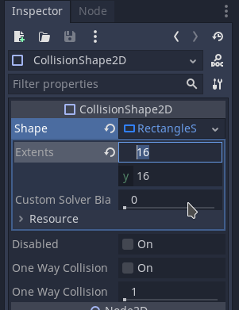

  # Dia dos Pais

  ## Pré-aula
  Os projetos devem estar prontos.
  
  Os seguintes elementos já devem estar criados no projeto:

  - Background com paralax
  - Intância do Fuel e do Enemy - aqui não deve ter programação, apenas o body, sprite e collision
  - A fase 1 onde já teremos o background funcionando, o fuel e o enemy ainda não funcionando

A **fase 1** deve estar aberta antes do início da aula juntamente com o **enemy** e o **fuel**

## Kanban da aula
- [Dia dos Pais](#dia-dos-pais)
  - [Pré-aula](#pré-aula)
  - [Kanban da aula](#kanban-da-aula)
    - [Fazendo o Player](#fazendo-o-player)
    - [Programando Combustivel](#programando-combustivel)
    - [Criar e Programando tiro](#criar-e-programando-tiro)
    - [Atirando](#atirando)
    - [Programar movimentação do Enemy e Fuel](#programar-movimentação-do-enemy-e-fuel)
    - [Programar destruição do Player](#programar-destruição-do-player)
    - [Reabastecimento](#reabastecimento)
    - [HUD para Combustível](#hud-para-combustível)

### Fazendo o Player

Comece adcionando um *KinematicBody2D* e então adicione como filhos dele um *AnimatedSprite* e um *CollisionShape2D*


Renomeie o KinematicBody2D para Player, para facilitar


vamos adicionar uma animação para o Player. Para isto vamos selecionar o *AnimatedSprite* dele e ao lado direito da tela teremo uma aba chamada Inspector que mostra as propriedades do elemento selecionado. Vamos então na primeira propriedade que está preenchida com *[ empty ]* e mudar para *[ New SpriteFrames ]* e então vamos clicar no campo criado


Uma janela irá aparecer abaixo para que possamos criar a animação. Vamos então clicar no botão em forma de grade e procurar pelo *SpriteSheet* do **Player**


Seremos levados para a tela onde devemos fatiar o a imagem, basta configurar da mesma forma como na imagem abaixo, selecionar todas as naves e avançar.


Teremos o seguinte resultado:


Agora vamos ajustar o *CollisionShape2D* para que ele dê uma forma para a nossa nave. Para isto vamos selecionar o *CollisionShape2D* e ir até o *Inspector*. Sua primeira propriedade se chama *Shape* e está marcada como *[ empty ]*, vamos clicar nela e então escolher *New RectangleShape2D* e então clicar na opçã RectangleShape2D para configurar




Com ele configurado vamos posicionar o **Player** na tela, mas primeiro precisamos ativar uma propriedade nele, etão selecione-o e marque a opção de agrupar:


Agora vamos selecionar o **Player** para adicionar um novo Script. Para isto clicamos com o botão direito nele e selecionamos a opção **Attach Script**


Na nova janela que irá aparecer basta clicar em *Create* e você será recebido por esta tela:


Para movermos o player teremos a seguinte programação:

```lua
extends KinematicBody2D

var motion = Vector2()
var speed = 4

func _process(delta):
	if Input.is_action_pressed("ui_right"):
		motion.x = 1
	elif Input.is_action_pressed("ui_left"):
		motion.x = -1
	else:
		motion.x = 0
	
	move_and_collide( motion * speed )

```

[back](#kanban-da-aula)

### Programando Combustivel

[back](#kanban-da-aula)

### Criar e Programando tiro

[back](#kanban-da-aula)

### Atirando

[back](#kanban-da-aula)

### Programar movimentação do Enemy e Fuel

[back](#kanban-da-aula)

### Programar destruição do Player

[back](#kanban-da-aula)

### Reabastecimento

[back](#kanban-da-aula)

### HUD para Combustível

[back](#kanban-da-aula)