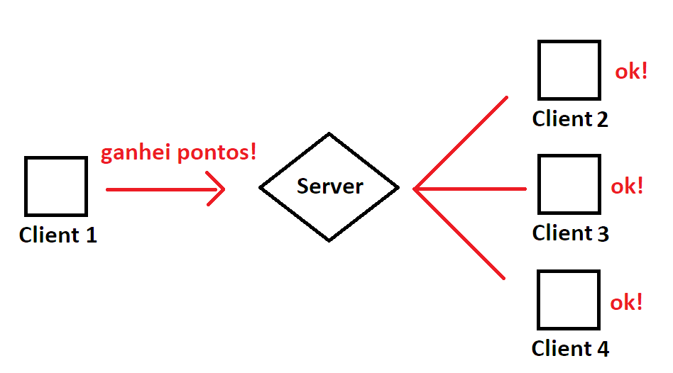
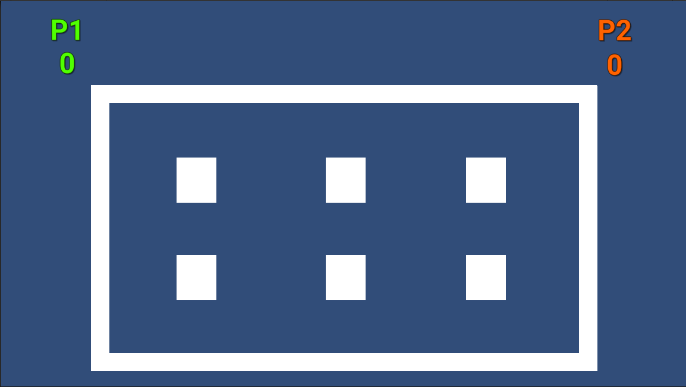
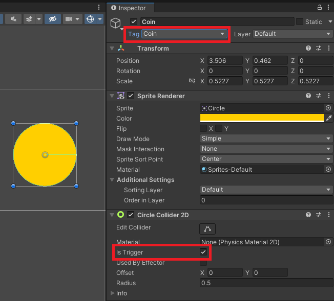
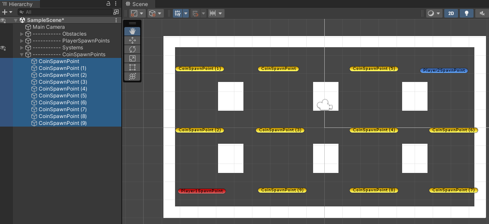
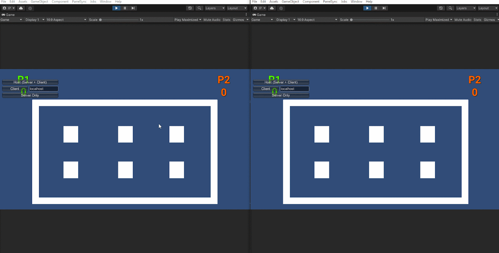

# Comunicação Client & Server

#### Pré-aula
Na aula de hoje veremos sobre atributos de rede que são responsáveis por modificar o comportamento de alguns métodos e também sobre como utilizar outros objetos na rede.

### Atributos de Rede
Sabemos que o server é responsável pelo que acontece na cena e pelos objetos spawnados, porém o que acontece se um Player ganha pontos? Ou perde/ganha HP? Ou ainda, se o Player destrói algo na cena? Tudo isso acontece somente naquele client e os outros não saberão que isso aconteceu. Para que os outros clients fiquem sabendo dessas informações, o nosso Player deve comunicar o server das mudanças e ele então atualiza para todos os outros Players o que houve.



Essa comunicação é possível usando atributos especiais que modificam as funções e variáveis de um script. Um deles é o atributos **[Command]**, usado quando queremos que uma função do client seja executada no Server.<br>
Vamos modificar o Player e fazer uma função que seja chamada no servidor.
```cs
[Command]
void TalkToServer()
{
    Debug.Log("Player pediu uma mensagem!");
}
```
Feito isso vamos fazer com que o Player chame essta função quando for apertada a tecla E. Basta modificar o código do método Update:
```cs
if (isLocalPlayer)
{
    inputX = Input.GetAxis("Horizontal");
    inputY = Input.GetAxis("Vertical");

    body.velocity = new Vector2(inputX, inputY);

    if (Input.GetKeyDown(KeyCode.E))
        TalkToServer();
}
```
Teste e verá que uma mensagem irá aparecer no server, mesmo sendo o Client quem enviou. <br>
Outros atributos que podemos usar são:
* **[Client]**: Usado quando queremos que uma função seja executada somente no client e não no server
* **[Server]**: Quando a função é executada somente no server e não no client
* **[Command]**: Função criada no client, porém é executada no server (claro que por questões de segurança, é muito importante checar no server se essa função pode prejudicar a experiência do jogo, então sempre faça a validação das informações que chegam ao server)
* **[ClientRpc]**: Função que é executada pelo server em todos os clients conectados (muito usada para atualizar nos clients alguma mudança na cena, na HUD, em valores globais, etc.)
* **[TargetRpc]**: Função que é executada pelo server em um client específico (usado para que um client possa se comunicar com outro, como por exemplo: troca de itens, mensagens privadas, etc.)
Agora vamos testar outro atributo para enviar uma mensagem do Player para todos os outros clientes:
```cs
[ClientRpc]
void TalkToAll()
{
    Debug.Log("E aí galerinha!");
}
```
Vamos chamar no Update
```cs
if (isLocalPlayer)
{
    inputX = Input.GetAxis("Horizontal");
    inputY = Input.GetAxis("Vertical");

    body.velocity = new Vector2(inputX, inputY);

    if (Input.GetKeyDown(KeyCode.E))
        TalkToServer();
    if (Input.GetKeyDown(KeyCode.R))
        TalkToAll();
}
```
Lembrando que com o atributo ClientRpc é usado em métodos executados pelo server nos clientes. Isso quer dizer que, como estamos criando o método no Player, precisamos de um Host para testar essa função e a mensagem irá aparecer onde tivermos um cliente conectado (lembrando que Host = Server + Client).<br>
Se executarmos o método a partir do Host todos recebem a mensagem, mas se tentarmos isso a partir do Client teremos o seguinte:


Agora que entendemos como esses atributos funcionam, vamos desenvolver no jogo os coletáveis! Os players deverão coletar moedas pela cena e uma HUD será atualizada mostrando os pontos de cada um. Usaremos os atributos já vistos para que o client comunique ao server toda vez que ganhar pontos.

Começaremos com a montagem inicial da HUD (Canvas), ela será bem simples por enquanto: duas caixas de texto para o Player 1 (uma para o texto “P1” e outra para mostrarmos a quantidade de pontos) e duas para o Player 2. Aproveite o momento para ajustar a câmera na sua preferência e colocar alguns obstáculos na cena. Não se preocupe com o visual, trabalharemos nele mais adiante nas nossas units.



Observação: Sempre use o TextMeshPro para desenvolver os textos em um Canvas, pois há muito mais opções de formatação e eles ficam bem melhores que um Text comum.

### Spawnando Coletaveis
Com a HUD pronta, vamos criar a moeda! Ela será bem simples: um sprite com collider (não se esqueça de ativar a opção IsTrigger) e a tag “Coin”.



Essa moeda deverá ser spawnada pelo Server, então vamos também colocar o componente *Network Identity*. Agora podemos salvar essa moeda como prefab e no objeto NetworkController da cena, vamos colocar esse prefab na lista de prefabs que serão spawnados. 

Ótimo! Você pode apagar a moeda que ficou na cena, pois vamos criar cada uma delas através do server! Primeiro vamos criar alguns pontos de spawn na cena, fique a vontade para criar quantos quiser, pois quando fizermos o código, elas irão surgir de forma aleatória! 



Vamos abrir o nosso script *TeuNomeNetworkManager* e e programar para que a quantidade de moedas spawnadas não ultrapasse um limite de moedas e que as que forem spawnadas sejam posicionadas de forma aleatória na cena:

```cs
public List<Transform> coinSpawnPoints;
public int maxCoinsInGame = 2;
public static int spawnedCoins = 0;

public void SpawnCoin()
{
    if(spawnedCoins < maxCoinsInGame)
    {
        Vector3 local = coinSpawnPoints[ Random.Range(0, coinSpawnPoints.Count) ].position;
        
        GameObject new_coin = Instantiate( spawnPrefabs.Find(prefab => prefab.name == "Coin"), local, transform.rotation);
                
        NetworkServer.Spawn(new_coin);
        spawnedCoins++;
    }
}
```
Tendo os atributos que irão definir as regras do jogo e o método que irá spawnar as moedas aleatóriamente na tela, só precisamos chamar esse método repetidas vezes após o jogador 2 entrar no jogo. Para isso vamos usar um comando chamado **InvokeRepeting** que nos permite chamar um método passando o nome do método em questão, o tempo de atraso para chamar o método e quanto tempo deve demorar para o método ser chamado novamente.

Com ele o spawn dos jogadores fica da seguinte forma:

```cs
public class TioNetworkManger : NetworkManager
{
    public Transform player1SpawnPoint;
    public Transform player2SpawnPoint;
    public List<Transform> coinSpawnPoints;
    public int maxCoinsInGame = 2;
    public static int spawnedCoins = 0;

    public override void OnServerAddPlayer(NetworkConnectionToClient conn)
    {
        Transform startPoint;

        if (numPlayers == 0)
        {
            startPoint = player1SpawnPoint;
        }
        else
        {
            startPoint = player2SpawnPoint;
            /* 
             * aqui estamos chamando SpawnCoin 2 segundos após o segundo jogador
             * e fazemos com que a função se repita a cada 2 segundos
             */
            InvokeRepeating("SpawnCoin", 2, 2);
        }

        GameObject new_player = Instantiate(playerPrefab, startPoint.position, startPoint.rotation);
        NetworkServer.AddPlayerForConnection(conn, new_player);
    }

    public void SpawnCoin() { /* ... */ }
    
    public override void OnStartServer() { /* ... */ }

    public override void OnStopServer() { /* ... */ }

    public override void OnClientConnect() { /* ... */ }

    public override void OnClientDisconnect() { /* ... */ }
}
```
Essa parte é feita após o Segundo Player conectar para que o Primeiro não tenha vantagem.

Vá até o NetworkController e preencha os campos do TeuNomeNetworkManger para que o script possa funcionar corretamente e então teste

Se tudo estiver funcionando corretamente você terá o seguinte

 

Com isto vemos como o servidor por ir instanciando elementos no cenário. Agora vamos fazer o player coletar as moedas.

Para coletar as moedas o Player precisa de uma variável pra armazenar o total de moedas e do método OnTriggerEnter2D programado para detectar a colisão com a moeda para então fazer a contagem. 

Então no script do Player adicione uma variável pública inteira para guardar as moedas e porgrame o método OnTriggerEnter2D:

```cs
public int coins;

private void OnTriggerEnter2D(Collider2D collision)
{
    if(collision.CompareTag("Coin"))
    {
        coins++;
        TeuNomeNetworkManager.spawnedCoins--;
        Destroy(collision.gameObject);
    }
}
```

Com esse código adiciona ao Player nós já conseguimos coletar as moedas, mas elas não aparecem na HUD. As mudanças na HUD ficarão para a próxima aula.

----------

Se sobrar tempo de aula tente fazer os alunos modificarem algo no código para fazer do jeito que querem. Como mudar a cor do Player ou tentar adiantar o conteúdo da próxima aula.

## Seja criativo