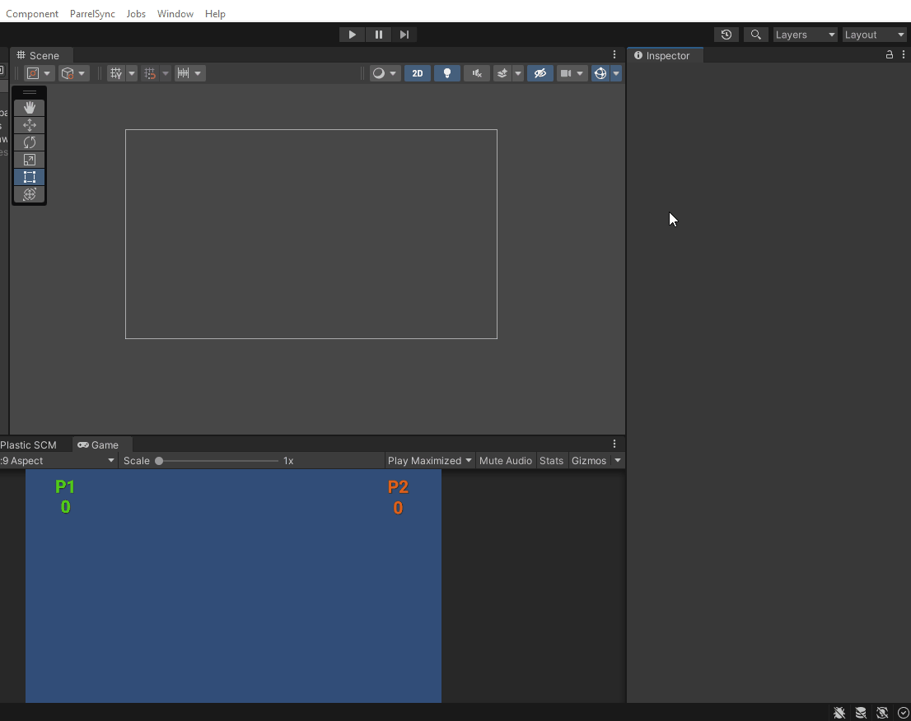
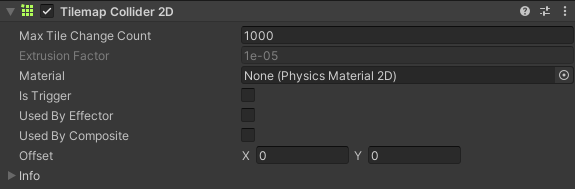
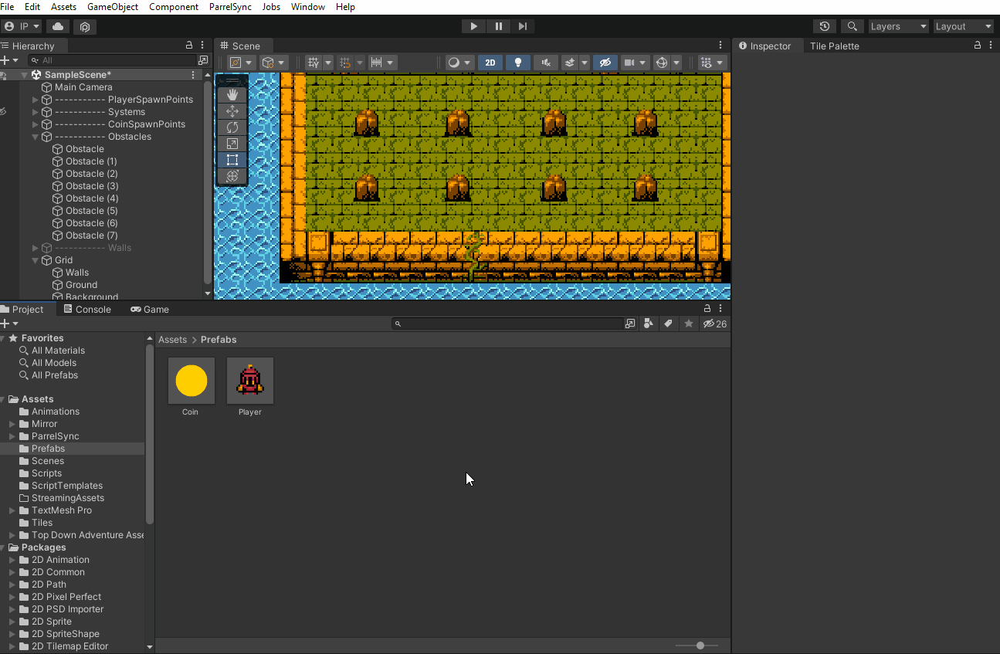

# Projeto 1 - pt1

## Pré-aula
Este será o primeiro projeto Multiplayter do alunos. Ele é uma continuação do projeto anterior.

Existem Assets para baixar e adicionar ao projeto então deixe disponível para o aluno apenas usar.

## Tilemaps
Nosso projeto está pronto para receber melhorias visuais e algumas mecânicas novas, portanto nessa e na próxima unit vamos trabalhar nessas melhorias! Começaremos baixando os assets que disponibilizamos no seu material didático. Eles podem ser encontrados também na Asset Store da Unity com o nome Top Down Adventure Assets.


Esse pacote vem com todos os sprites que precisaremos para deixar nosso jogo incrível! Que tal começarmos pelo Tilemap?

Primeiro vamos ocultar as paredes e obstáculos do nosso jogo (eles serão substituídos por versões melhoradas) e em seguida vamos inserir os Tilemaps que usaremos. Nesse caso, faremos 3 Tilemaps: Walls, Ground e Background. Cada um deles será usado para desenhar as partes do jogo (como se fossem camadas).

Vamos clicar com o botão direito na Hierarquia e depois 2D Object > Tilemap > Rectangular (Após o primeiro Tilemap, clique com o botão direito na Grid e repita o processo, renomeando cada um deles)


Agora que temos nossos Tilemaps, vamos criar as nossas paletas de desenho (Tile Paletts) que terão todos os sprites que usaremos. Para isso vamos em Window > 2D > Tile Pallet e, se quiser, reposicione essa janela como preferir.

Podemos agora criar uma nova paleta clicando em Create New Palett. Nessa hora o projeto perguntará qual pasta essa paleta será salva, então podemos criar uma pasta só para esses arquivos.



Muito bem! Com nossa paleta criada, agora podemos definir quais serão os sprites que usaremos! Encontre na pasta dos assets o Tileset que usaremos, ele está em Top Down Adventure Assets > Visuals > ENVIRONMENT > tilesets.


> Nesta parte, caso os Sprites tenham sido baixados do portal, elas já vem cortados corretamente.
>
> As configurações dos Assets quando importados da Unity Assets Store não foram verificadas
>
> Dada a situação anterior será dada continuidade considerando que os Assets não foram configuradas e cortados

Porém, para usá-lo, precisaremos dividir cada sprite para que a Unity entenda que ele é composto de várias imagens. No Inspector, opção Sprite Mode, vamos colocar como Multiple. Em Pixels Per Unit coloque 16 (tamanho dos sprites) e após aplicar as mudanças clique em Sprite Editor para fazermos os cortes


Já no Sprite Editor, selecione a opção Slice, em seguida escolha Grid By Cell Size e nos tamanhos coloque 16 por 16. Clique em Slice e depois Apply. Com isso os sprites serão separados e agora podemos usar eles no Tile Pallet.


Arraste o tileset que acabamos de ajustar para o Tile Palett, com isso você poderá agora escolher qual o tile que quer desenhar e com a ferramenta pincel pode já iniciar sua arte! Deixe a aba Game aberta para que você possa ver em tempo real como está ficando o jogo, ficará muito mais fácil assim!


> Observação importante: Preste muita atenção em qual dos tilemaps está ativo antes de fazer os desenhos! 
> 
> As paredes devem ser desenhadas no Tilemap Walls, o chão será no Tilemap Ground e a água será desenhada no Tilemap Background.
>
> 

Caso você tente desenhar algum tile e ele fique atrás de outro, basta clicar no tilemap desejado na Hierarquia e alterar a opção Order In Layer. Essa opção define a ordem das camadas de desenho, então podemos deixar o Background em zero, o Ground em 1 e Walls em 2. A mesma coisa acontece com o Player, mude sua Order In Layer para 3, senão ele não será mostrado quando executarmos o jogo.


O resultado final dependerá da sua criatividade! O meu ficou assim:


Se executarmos o jogo, veremos que o Player ainda atravessa as paredes, então podemos resolver aplicando um Collider no Tilemap em que elas foram desenhadas. Para isso, clique no Tilemap Walls e adicione o componente Tilemap Collider 2D.



## Preparando Obstáculos
Agora que nosso Tilemap está pronto, vamos ajustar os obstáculos: volte a habilitá-los e defina um sprite para eles (Mude o Pixels Per Unit do sprite que for usar para 16, assim como fizemos nos sprites usados no Tilemap). Não se esqueça de alterar a Order In Layer também, para que apareçam no jogo.


Faça agora os ajustes que forem necessários: arrume o tamanho dos obstáculos, coloque mais deles na cena, enfim, use sua criatividade!

## Animações
Chegou a hora de melhorarmos o visual do Player e suas animações. Os sprites que usaremos estão no caminho **Top Down Adventure Assets > Visuals > CHARACTERS > player** e a primeira tarefa será selecionarmos todas as imagens e mudar o Pixels Per Unit para 16 (perceba que estamos padronizando o tamanho dos sprites para que não fiquem desproporcionais).

Agora podemos abrir o prefab do Player e definir um Sprite padrão. Se quiser, teste o game para ver se o tamanho do sprite está OK com relação à cena.


Nosso player ainda não possui animações, então vamos criá-las!  Volte no prefab do Player e vamos clicar em **Window > Animation > Animation** ou utilize o atalho **Ctrl + 6**. Selecione o Player e clique em *Create*, em seguida defina a pasta que a animação será salva (vamos fazer a animação *Player_Idle*) e arraste os sprites dessa animação para a janela.

> Nas aulas anteriores não foram criadas pastas para animação pois ainda não estavamos trabalhando com isto, então agora é o momento para criar.


O processo vai se repetir para as demais animações, faremos as animações *Player_WalkHorizontal* (não se preocupe se a animação mostrar o Player indo para a esquerda, pois vamos *“flipar”* o sprite no script quando ele for para a direita), *Player_WalkDown* e *Player_WalkUp*.

Quando estiver fazendo as animações, perceba que podemos clicar em Preview para testarmos se sua velocidade está adequada. Caso a animação esteja muito rápida, podemos clicar nos três pontinhos abaixo do botão de fechar da janela e selecionar a opção *Show Sample Rate*, em seguida é só reduzir o valor (por padrão será 60). Quanto menor o valor, mais lenta será a animação.


## Troca de animações
Quando todas as animações estiverem prontas, vamos fazer um script novo que será responsável pela troca de animações do Player. Seu nome será **PlayerAnimations**.

```cs
using System.Collections;
using System.Collections.Generic;
using UnityEngine;

public class PlayerAnimations : MonoBehaviour
{
   Animator anim;

   void Start()
   {
       anim = GetComponent<Animator>();    
   }

   public void ChangeAnimation(float inputX, float inputY)
   {
       if (inputX != 0)
       {
           anim.Play("Player_WalkHorizontal");
           transform.localScale = new Vector3(-inputX, 1, 1);
       }
       else if (inputY > 0)
           anim.Play("Player_WalkUp");
       else if (inputY < 0)
           anim.Play("Player_WalkDown");
       else
           anim.Play("Player_Idle");
   }
}
```

A função ChangeAnimation recebe dois valores que correspondem à direção que o Player está indo e faz a troca das animações. Mas como chamaremos essa função? Podemos fazer de várias formas, mas como vimos sobre os UnityEvents, que tal criarmos um evento que, quando disparado, chama essa função e passa os dois valores?

Vamos criá-la e dispará-la no script do Player (O código abaixo não está completo, as linhas com comentários são as modificações):

```cs
using System.Collections;
using System.Collections.Generic;
using UnityEngine;
using Mirror;
using UnityEngine.Events;
using System;

[Serializable]
public class FloatEvent : UnityEvent<float> { }

// Aqui é novo -----
[Serializable]
public class InputEvent : UnityEvent<float, float> { }
// -----------------

public class Player : NetworkBehaviour
{

    Rigidbody2D rb;
    float inputX;
    float inputY;
    public float speed;

    [SyncVar]
    public float coins;

    [SyncVar]
    public Color playerColor;

    public FloatEvent OnCoinCollect;

    // Aqui é novo -----
    public InputEvent OnDirectionChanged;
    // -----------------

    void Update()
    {

        if (isLocalPlayer)
        {
            inputX = Input.GetAxisRaw("Horizontal");
            inputY = Input.GetAxisRaw("Vertical");

            // Aqui é novo -----
            OnDirectionChanged.Invoke(inputX, inputY);
            // -----------------

            rb.velocity = new Vector2(inputX, inputY) * speed; 
        }
        
    }
}
```

Perceba que criamos lá no início do código uma nova classe: InputEvent. Ela será um *UnityEvent* que enviará 2 valores do tipo float quando disparada. Criamos então um evento chamado *OnDirectionChanged* e o disparamos no Update logo após os inputs do Player.

Voltando para a Unity, coloque esse script no Player e chame a função através do evento. Teste o jogo e veja se as animações estão sendo trocadas corretamente.



Você notará que nos outros clients a animação não acontece, para resolvermos esse problema nosso Player deverá ter um novo componente: o NetworkAnimator. Ele funciona da mesma forma que o NetworkTransform: O Server notificará todos os clients toda vez que houver uma alteração.

É importante habilitar a opção Client Authority (O client é quem faz a mudança, e não o Server) e arrastar para a opção Animator o componente Animator que já está no Player.


Caso você note que os outros clients também não mostram o “flip” do personagem ao andar para a esquerda e direita, ative no NetworkTransform a opção Sync Scale. Isso ocorre pois esse “flip” no código está sendo feito ajustando a escala do player para um valor negativo ou positivo (transform.localScale = new Vector3(-inputX, 1, 1)) então a escala também deve ser atualizada pelo Server.


> **Observação**: caso o Player não apareça quando ocorrer o "Flip" verifique o Script de movimentação do Player se o inputX está como **Input.GetAxisRaw**.
>
> A diferença entre o GetAxis e o GetAxisRaw é que o Raw vai te retornar apenas valores inteiros, já o GetAxis te retorna valores tipo Float