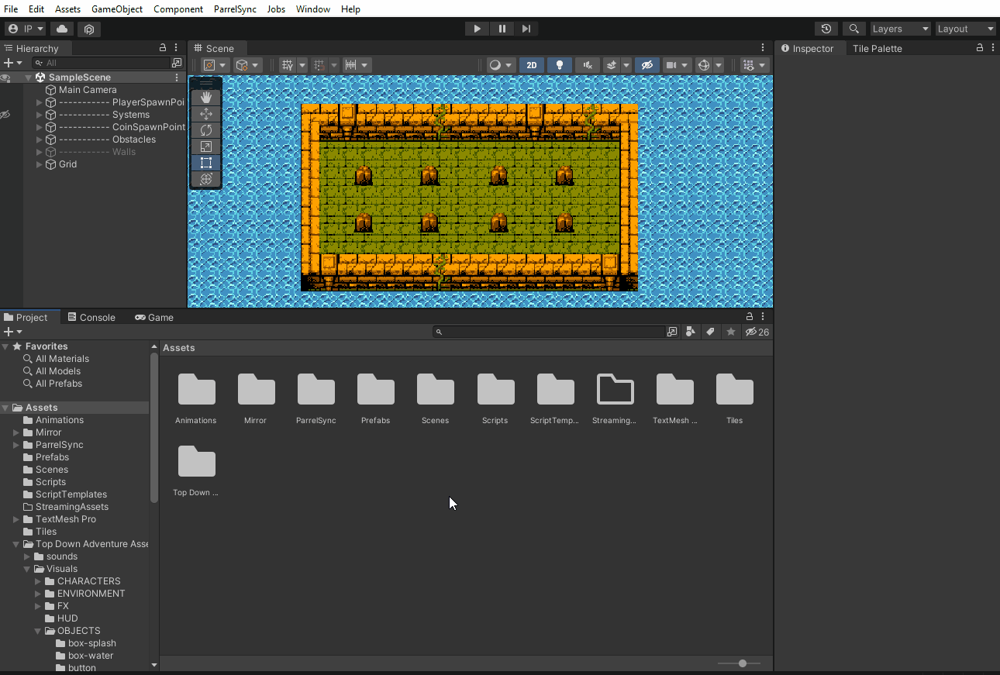
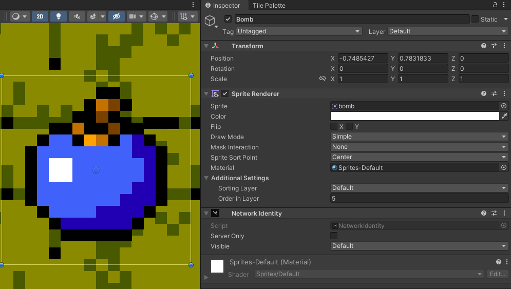
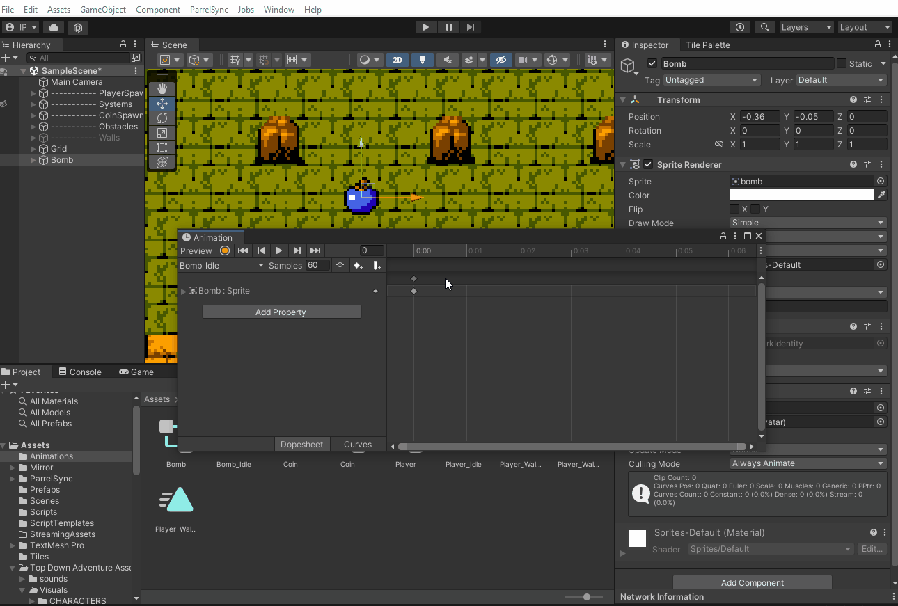
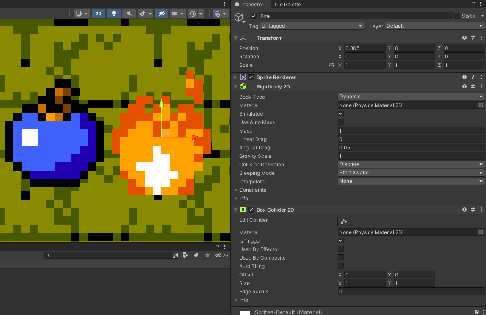
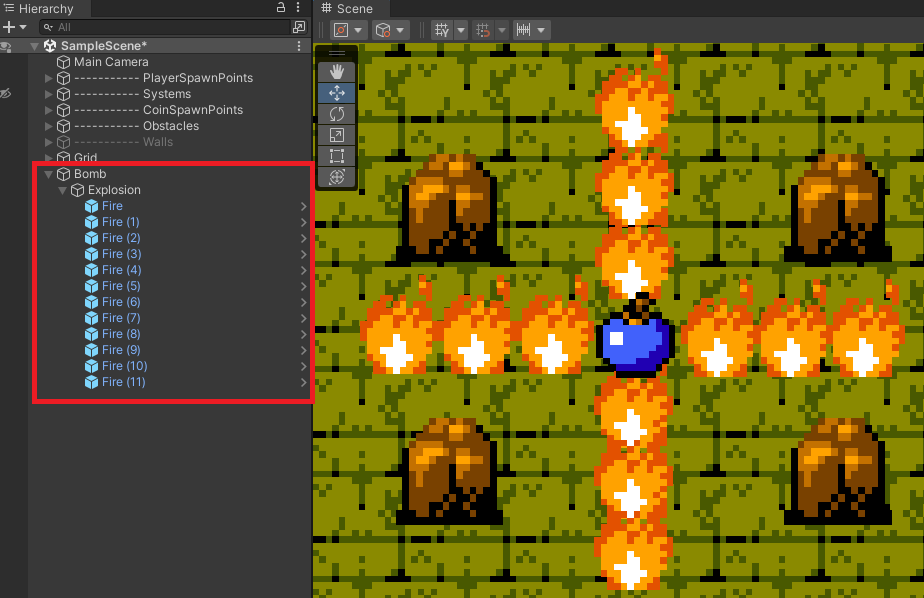
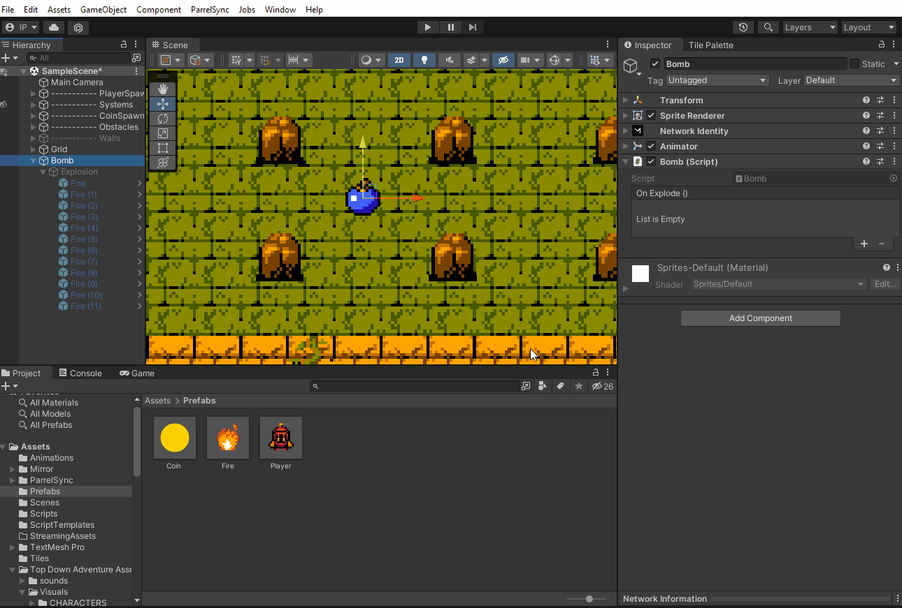
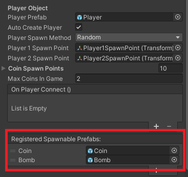
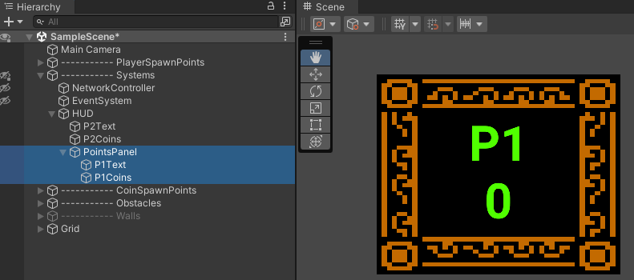
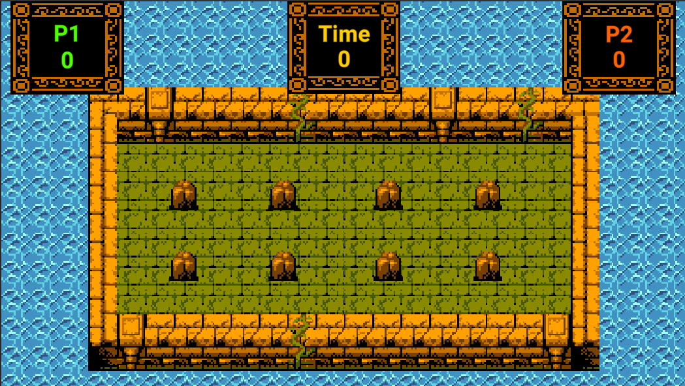

# Projeto 1 - pt2

## Pré-aula
Esta aula é uma continuação do projeto da aula anterior. Então é importante ter uma cópia do projeto no computador de cada aluno para começar a aula.

## Melhorias e Bombas
As animações do Player já estão funcionando corretamente e agora podemos fazer também as animações das moedas. Os seus sprites estão no caminho **Top Down Adventure Assets > Visuals > OBJECTS > coins**. Selecione todas as imagens e altere o Pixels per Unit para 8.

Vamos agora para o Prefab da Coin e faça a sua animação (Não se esqueça de alterar o Order In Layer do componente Sprite Renderer).



Até o momento no nosso jogo os Players não podem afetar a pontuação dos outros, mas isso vai mudar! Vamos criar uma bomba que poderá ser spawnada pelo Player e remover as moedas do oponente se ele for atingido pela explosão!


Crie um novo objeto no jogo (*2D Objects > Sprite > Circle*) e mude seu sprite para ser a bomba. Ele está localizado no caminho **Top Down Adventure Assets > Visuals > OBJECTS > items**. Essa bomba deverá ter o componente NetworkIdentity.



Para sua animação, podemos criar uma em que ela está normal (Idle) e uma em que está prestes a explodir. Nesse caso podemos alternar entre a cor vermelha e a original clicando em Add Property e escolhendo na opção *Sprite Renderer* a **Color**. Em seguida clique em algum ponto da linha do tempo e mude a cor da bomba para vermelho, depois salve essa mudança clicando no ícone que inclui um Key Frame.



Mas como faremos a explosão atingir o Player? Vamos criar um novo objeto dentro da bomba que nós chamaremos de **Fire**. Ele terá os componentes *RigidBody2D (Gravity Scale 0)* e *BoxCollider2D (Ative o Trigger)*. Há 3 opções de sprites de fogo nos nossos assets e eles estão no caminho **Top Down Adventure Assets > Visuals > FX > fire**, escolha um de sua preferência.



Você já pode salvar esse fogo como prefab e agora vamos usá-lo para definir qual será a área da explosão. Crie um objeto vazio dentro da bomba chamado Explosion e coloque dentro dele como você vai querer que o fogo apareça. No meu caso, quando a bomba explodir eu quero que os fogos apareçam em formato de +, como está ilustrado abaixo:



Esse objeto Explosion será desabilitado por enquanto, pois quando nosso Player colocar a bomba na cena, nós ativaremos ele novamente através de código.

## Ativando a Bomba
Para que tudo funcione de acordo, precisaremos de 3 scripts: um para o fogo (para que ele remova as moedas do oponente quando atingi-lo ou seja destruído se atingir uma pedra ou parede), um para a bomba (para ativar a explosão após um tempo) e um para o Player (para que ele possa spawnar bombas).

Começaremos com o Script que colocaremos no nosso prefab **Fire**, ele verificará se houve colisão com o **Player**, caso contrário ele será destruído:

```cs
using System.Collections;
using System.Collections.Generic;
using UnityEngine;

public class Fire : MonoBehaviour
{
   private void OnTriggerEnter2D(Collider2D collision)
   {
       Player player = collision.GetComponent<Player>();

       if (player)
       {
           player.RemoveCoins(10);
       }
       else
       {
           Destroy(gameObject);
       }
   }
}
```

A função **RemoveCoins()** ainda não foi criada no script do Player, então nesse momento o código apresentará um erro. Vamos no script do Player criar essa função:

```cs
[Server]
public void RemoveCoins(float value)
{
    coins -= value;
    if (coins < 0) coins = 0;
    OnCoinCollect.Invoke(coins);
}
```

Para a **bomba**, faremos um script que vai chamar a animação de explosão depois de um tempo assim que for criada e disparar o evento **OnExplode**, que usaremos depois para ativar o objeto Explosion dentro da bomba.

```cs
using System.Collections;
using System.Collections.Generic;
using UnityEngine;
using UnityEngine.Events;

public class Bomb : MonoBehaviour
{
   Animator anim;
   public UnityEvent OnExplode;

   void Start()
   {
       anim = GetComponent<Animator>();
       Invoke("PlayBombAnimation", 1f);
   }

   void PlayBombAnimation()
   {
       anim.Play("Bomb_Explode");
       Invoke("Explode", 2f);
   }

   void Explode()
   {
       OnExplode.Invoke();
       Destroy(gameObject, 1);
   }

}
```

Antes de criarmos o script do Player para o Spawn das bombas, vamos voltar na Unity e colocar os scripts que já fizemos nos objetos. Na bomba, defina que ao disparar o evento, o objeto Explosion será ativado.



Em seguida, vamos salvar a bomba como prefab e removê-la da cena, pois o Server precisa registrá-la no momento do Spawn. Clique no objeto **NetworkController** da cena e adicione na opção **Registered Spawnable Prefabs** a bomba que criamos.



Agora sim! Nossa bomba está pronta para ser spawnada! Vamos criar um script para o Player poder fazer isso, ele se chamará **Player_Bomb**.

```cs
using Mirror;
using System.Collections;
using System.Collections.Generic;
using UnityEngine;

public class Player_Bomb : NetworkBehaviour
{
   public GameObject bombPrefab;
   public float deployDelay = 2;
   float timer;

   private void Start()
   {
       timer = deployDelay;
   }

   void Update()
   {
       if (isLocalPlayer)
       {
           timer -= Time.deltaTime;
           timer = Mathf.Clamp(timer, 0, deployDelay);

           if (Input.GetKeyDown(KeyCode.Space))
           {
               if (timer <= 0)
               {
                   DeployBomb();
                   timer = deployDelay;
               }
           }
       }
       
   }

   [Command]
   void DeployBomb()
   {
       GameObject bomb = Instantiate(bombPrefab, transform.position, transform.rotation);
       NetworkServer.Spawn(bomb);
   }
}
```

**Observação:** Caso o fogo das bombas não apareça após a explosão, pode ser que eles estejam próximos demais e os seus colliders estão se encostando, fazendo com que sejam destruídos. Para resolver é muito simples: diminua o collider do prefab do fogo, ou afaste os objetos para que não encostem na hora da explosão!

## Ajustes finais
Os últimos ajustes do nosso game ficarão com a HUD! Vamos criar dois painéis para nossos pontos clicando com o botão direito na **HUD > UI > Panel** e insira dentro deles as caixas de texto que criamos, elas ficarão mais destacadas dessa forma. A imagem que podemos usar para esses painéis fica no caminho Top Down Adventure **Assets > Visuals > HUD > hud-tileset**.



Vamos criar um terceiro painel para marcar o tempo da partida, ele pode ficar no canto superior da HUD, como abaixo:




Agora podemos trabalhar com o tempo do jogo, vamos no script da HUD e adicionar:

```cs
[SyncVar]
float time = 100;

[SyncVar]
public bool canStartTime;

private void Update()
{
    if (canStartTime)
    {
        if(time > 0)
        {
            time -= Time.deltaTime;
            timeText.text = time.ToString("n0");
        }
        else
        {
            Time.timeScale = 0;

            if(p1.coins > p2.coins)
                timeText.text = "P1 Win!";

            else if (p2.coins > p1.coins)
                timeText.text = "P2 Win!";

            else
                timeText.text = "Draw!";
        }
    }
}
```

Essa adição é bem simples: nós teremos o tempo que vai dimuindo a cada segundo e quando chegar a zero fazemos uma verificação de qual player possui mais pontos e marcamos na caixa de texto quem venceu ou se foi um empate. Perceba que, quando isso ocorre, nós paramos o tempo usando *Time.timeScale = 0*. Para que o tempo volte ao normal basta colocar o valor como 1 novamente.


No início criamos duas variáveis: uma que define o tempo (*time*) e a outra que usaremos de controle para que o tempo só começe a diminuir quando os dois players estiverem na cena (*canStartTime*). O valor dessa variável nós mudaremos no script **MyNetworkManager**, como abaixo em vermelho:

```cs
public override void OnServerAddPlayer(NetworkConnectionToClient conn)
{

    Transform startPoint;
    Color color;

    if(numPlayers == 0)
    {
        startPoint = player1SpawnPoint;
        color = Color.green;
    }
    else
    {
        startPoint = player2SpawnPoint;
        InvokeRepeating("SpawnCoin", 2, 2);
        color = Color.red;
        // código novo na linha abaixo
        GameObject.FindGameObjectWithTag("HUD").GetComponent<HUD>().canStartTime = true;
    }

    GameObject player = Instantiate(playerPrefab, startPoint.position, startPoint.rotation);

    player.GetComponent<Player>().playerColor = color;

    NetworkServer.AddPlayerForConnection(conn, player);

}
```


É claro que podemos modificar ainda mais nosso game, mas vou deixar isso com você! Melhore o cenário, a HUD e os Players como preferir, mostre aos amigos e se divirta!