# Inventário - Montando o Canvas

## Pré-aula
Agora estaremos iniciando um novo projeto. Ele, assim como o Geek Hero, é inspirado no The Legend of Zelda, e estaremos fazendo o inventário e gerenciamento de itens.

Este projeto não é iniciado do zero. É preciso fazer download da primeira parte dele no próprio portal e a versão da Unity que foi utilizada é a **2021.3.24**, então atente-se a isso pois este projeto será executado apenas nesta versão ou superior.

Garanta que no computador de cada aluno terá uma versão deste projeto e a versão correta da Unity instalada.

## Iniciando
Comece utilizando a Unity HUB para abrir o projeto e então testando para saber em que ponto o projeto está e se está funcionando corretamente para todos os alunos.

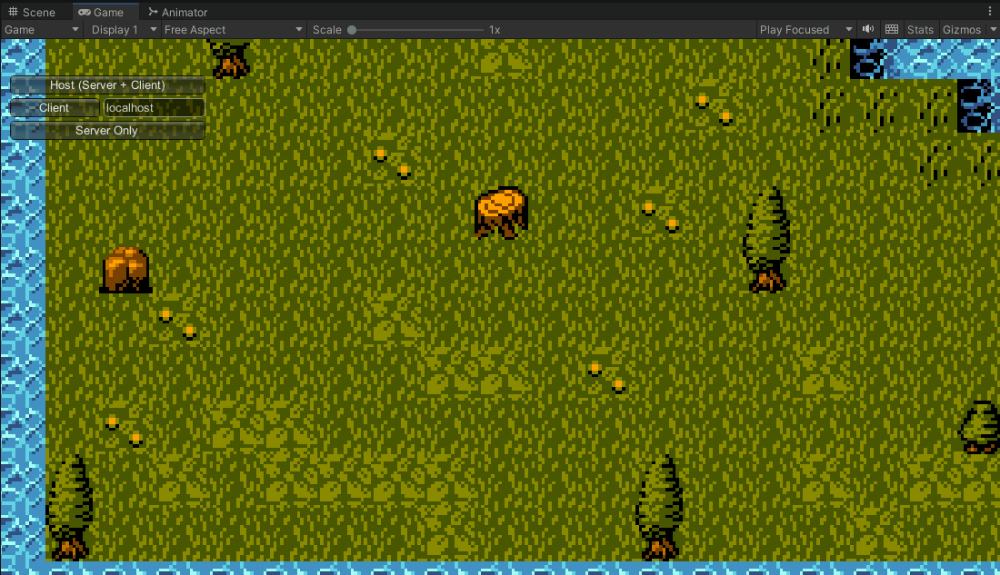

Ao testar note que o tilemap que acompanha o projeto ocupa uma área muito maior do que câmera pode mostrar, então a primeira configuração que faremos será essa câmera seguir o player. Para isso usaremos o pacote **Cinemachine**. Ele pode ser encontrado no Package Manager da Unity, mas no nosso caso ele já faz está adicionado e precisamos apenas usar.

Então vamos abrir o prefab do Player e inserir nele uma nova câmera virtual (GameObject > Cinemachine > 2D Camera). Arraste o Player para a opção Follow, isso já será suficiente para que a câmera siga o Player.


Há um pequeno detalhe: Se você executar o server e um client, notará que somente um deles terá a câmera perseguindo. Mas por que isso ocorre? A Cinemachine nada mais é do que um controlador da câmera principal, ou seja, quando colocamos uma “câmera virtual” como fizemos no player, ela irá controlar a posição da Main Camera (por isso é importante nunca apagar a Main Camera que está na cena, ela ainda é usada!). Se houverem várias na cena, somente uma delas será o controlador principal e a outra ficará em espera: caso a câmera virtual seja desativada ou apagada, o controle passará para a próxima. Como cada player possui uma câmera virtual (2D Camera), quando estiverem juntos na cena, somente um terá sua câmera o perseguindo. Mas como vamos resolver?

Vamos modificar o script do Player, onde faremos que a câmera seja desabilitada caso ele não seja o “localPlayer”:

```cs
public GameObject myCamera;

void Start()
{
    rb = GetComponent<Rigidbody2D>();
    if (isLocalPlayer == false)
    {
        myCamera.GetComponent<CinemachineVirtualCamera>().enabled = false;
    }
}
```

A Cinemachine pode ter também um limite de até onde deve mostrar a cena, você deve ter percebido que se o Player ir até algum canto da cena, ele mostrará a parte azul em que não há nada desenhado.

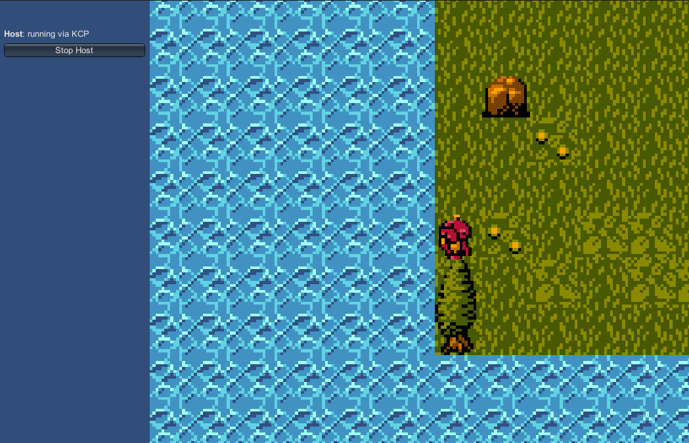

Para corrigir esse problema vamos criar um objeto vazio na cena e chamá-lo de CameraLimit, nele colocaremos o componente **PolygonCollider2D** (não pode ser outro e *ative o trigger*!) e ajuste o collider para pegar toda a área do tilemap.

Coloque uma tag nesse objeto (poder ser “CameraLimit”) e agora abra o prefab do Player e clique na Câmera. Vamos adicionar uma nova extensão à ela: o **CinemachineConfiner2D**.

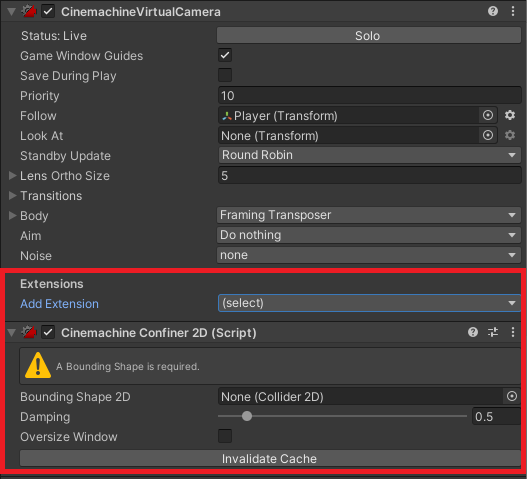

> Este componente só pode ser encontrado através da propriedade ***Extensions*** do componente ***Cinemachine Virtual Camera***

```cs
void Start()
{
    rb = GetComponent<Rigidbody2D>();
    
    PolygonCollider2D collider = GameObject.FindGameObjectWithTag("cameraLimit").GetComponent<PolygonCollider2D>();
    myCamera.GetComponent<CinemachineConfiner>().m_BoundingShape2D = collider;

    myCamera.SetActive( isLocalPlayer );
}
```

## Criando o Canvas
Agora que fizemos os ajustes da câmera, vamos criar o Canvas que será a nossa HUD para o Inventário. Vamos clicar com o botão direito na Hierarquia > UI > Canvas.

Antes de colocar qualquer coisa nela é super importante ajustarmos o auto ajuste da escala no componente Canvas Scaler. Mudando para Scale With Screen Size, nossa HUD se ajustará de acordo com o tamanho da tela em que o jogo está sendo executado:

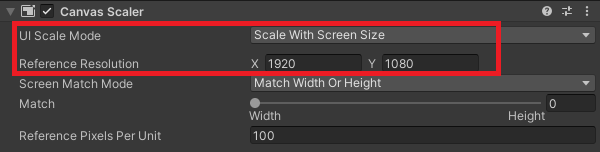

Vamos estruturar nossa HUD da seguinte forma: colocaremos nela um **Painel (UI > Panel)** que será nosso Inventário, dentro dele um **Texto (UI > TextMeshPro)** para o título e outro Painel que mostrará o ícone de cada item do nosso inventário. O resultado será mais ou menos esse:

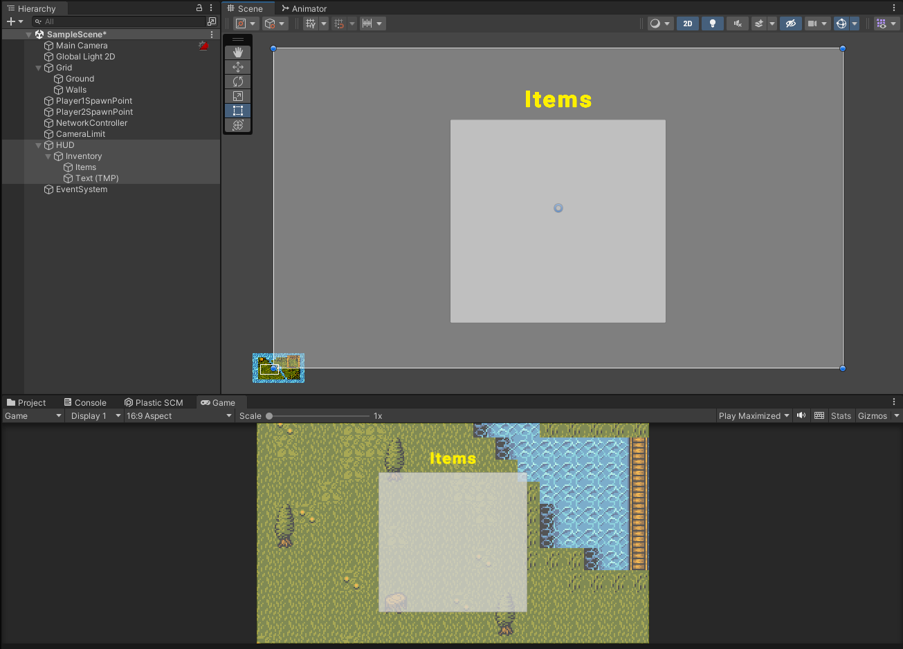

É claro que ajustaremos o visual mais adiante nas nossas aulas, mas por enquanto esse protótipo já nos ajudará com o que precisamos. Como você deve imaginar, cada item terá um ícone que irá representá-lo no painel Items, então vamos criar um prefab que servirá de base para cada **item: Ui > Image** e dentro dessa Image colocaremos um *TextMeshPro* para mostrar a quantidade de cada item.

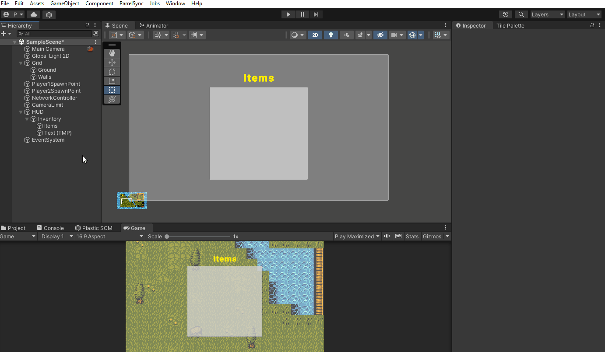

Essa será a base! Coloque na Image algum item que está no caminho **Top Down Adventure Assets > Visuals > OBJECTS > items** e o resultado deverá ficar assim:

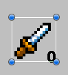

Mas e se tivermos vários itens no inventário? Como vamos organizar dentro do painel cada um desses itens? Colocaremos dentro do painel Items o componente **Grid Layout Group**! Esse componente irá organizar cada filho do painel de acordo com a distância em X e Y que podemos definir.

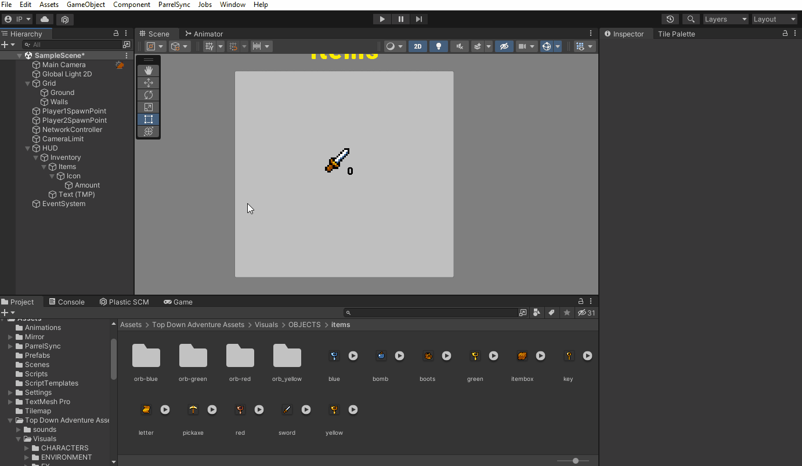

Caso você queira que os objetos fiquem mais próximos ou distantes, basta ajustar a opção Cell Size e Spacing

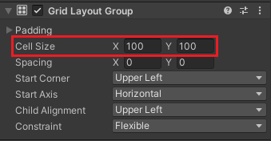

Faça um prefab para cada item que você vai ter em seu jogo! A dica é manter todos organizados dentro da pasta Prefabs, pois usaremos cada um deles nas próximas aulas.

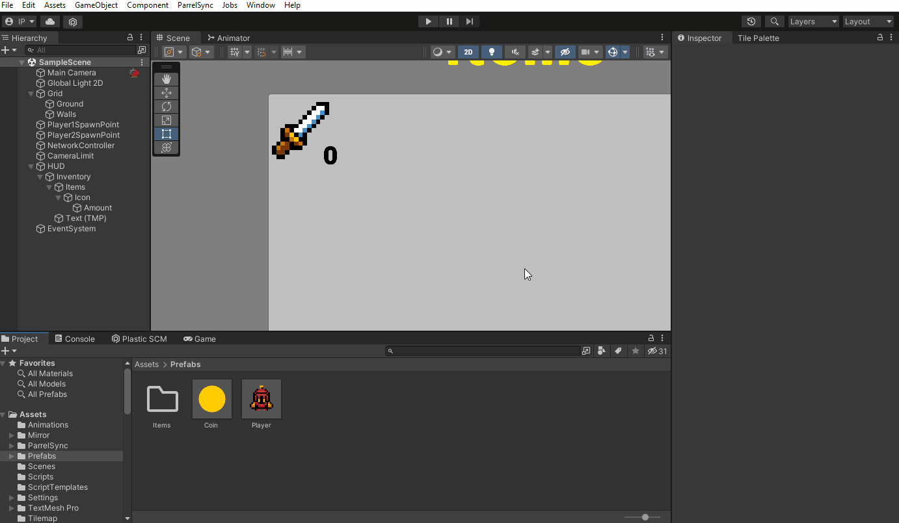

## Dados dos itens com ScriptableObjects
Após criar os prefabs de cada item, nós temos pronto tudo o que precisamos para o visual do nosso inventário. Chegou a hora de definirmos quais são os dados de cada um desses itens.

Jogos no estilo RPG (Final Fantasy, Dragon Quest, Pokémon, entre outros) e Action RPGs (The Legend of Zelda, Monster Hunter, Dark Souls, etc.) geralmente possuem inventários com bastante detalhes nos itens, mas tudo depende do jogo e do quanto será mostrado ao jogador. Há vários games que mostram uma lista enorme de informações de cada item e outros preferem deixá-las escondidas do jogador.

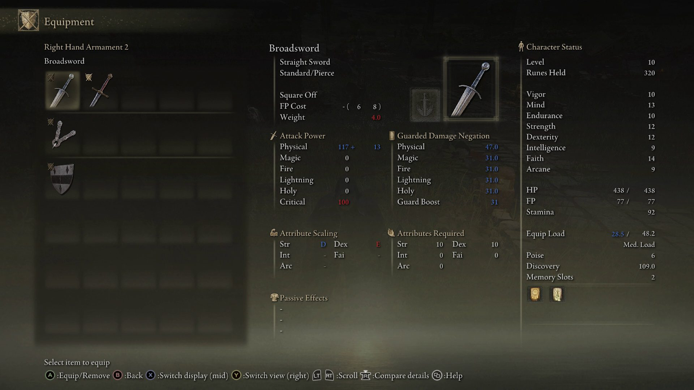

Jogos como Elden Ring possuem uma quantidade enorme de itens e cada um deles com muitos dados. Na Unity podemos administrar facilmente esses dados usando **ScriptableObjects**.

ScriptableObjects são objetos que podemos gerar através de script no editor da Unity e colocar grandes quantidades de dados neles (em resumo, são contêineres de dados). Podemos salvar dados não só de itens, mas também dos inimigos, quests, progresso do jogador, enfim, há projetos inteiros baseados em ScriptableObjects no seu funcionamento.

Antes de começarmos a programá-los, vamos primeiro definir como será a estrutura do nosso código: Todo item possui informações que são genéricas (como o nome, descrição, tipo ou valor) e informações específicas (no caso de armas, por exemplo, podemos ter o bônus de ataque e nas armaduras o bônus de defesa). Vamos criar um script que representará um Item genérico (base) e os scripts que serão os itens específicos, como representado no desenho abaixo:

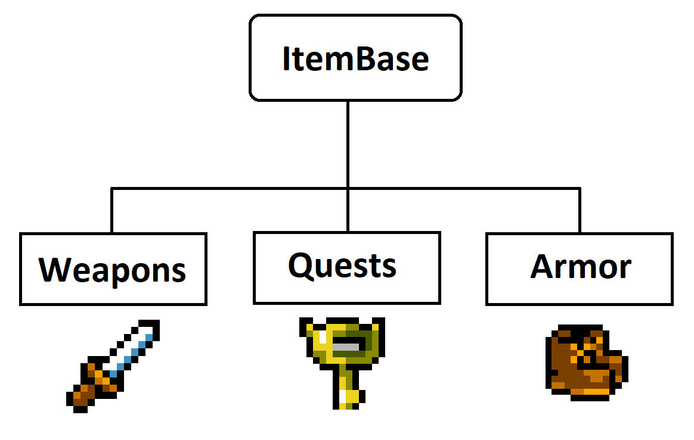

Começaremos pela programação do *ItemBase* e, para isso, criaremos um script chamado **SO_ItemBase** (cada ScriptableObject que faremos começará com SO_ para organização).

```cs
using UnityEngine;

public enum ItemType
{
   quest,
   weapon,
   armor,
   food
}


public class SO_ItemBase : ScriptableObject
{
   public string itemName;
   public string description;
   public float value;
   public ItemType type;

    public GameObject icon;

}
```

Criamos nesse script um enum chamado ItemType para definir o tipo do item. Enums são valores pré-definidos que podemos escolher, no exemplo acima o usuário poderá escolher somente os valores que definimos (quest, weapon, armor e food).

Note que nosso script não herda mais suas informações de *MonoBehaviour* ou *NetworkBehaviour* como fizemos nos outros scripts, ele herdará de *ScriptableObject* e não será colocado em nenhum GameObject, pois os dados não dependerão de um objeto da cena para existirem.

Agora que temos a base, vamos criar um script que terá os dados das armas do jogo, ele se chamará **SO_Weapons**

```cs
using UnityEngine;

[CreateAssetMenu(menuName = "Items/Weapon")]
public class SO_Weapon : SO_ItemBase
{
    public float attackBonus;
    public float durability;

    private void Awake()
    {
        type = ItemType.weapon;
    }
}
```

Há vários pontos interessantes que podemos apontar nesse código! Veja que SO_Weapons herda as informações de SO_ItemBase, então ele além de obter todas as variáveis criadas no pai, ele também será um ScriptableObject.

Na primeira linha do código temos um atributo novo: o **CreateAssetMenu**, mas qual é a sua utilidade? Agora que temos o ScriptableObject definido e quais serão as variáveis, está na hora de definir os dados de cada arma do jogo. É aí que entra o **CreateAssetMenu**, pois ele permite que criemos um novo menu na Unity e através dele podemos criar um novo asset na ferramenta, como está sendo mostrado abaixo:

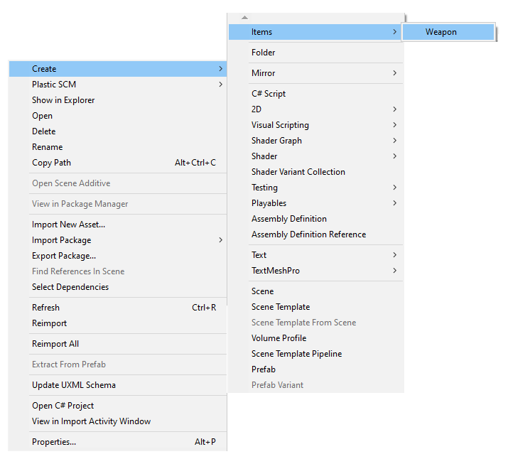

Um objeto novo surgirá e nós podemos renomeá-lo para o nome da arma que usaremos:

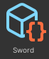

Veja que no inspector, todas as informações que definimos no script aparecem para editarmos na Unity:

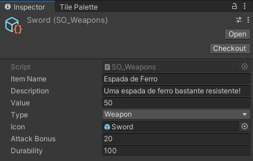

Não é incrível!? Podemos criar vários objetos como esse (um para cada arma do jogo) e definirmos os dados de cada um deles, só não se esqueça de criar o ícone para o item na HUD e colocá-lo no Icon do ScriptableObject.

Aproveite e faça um ScriptableObject para os outros itens do jogo! Nós usaremos cada um deles na nossa próxima unit e vamos programar o funcionamento do inventário. Até a próxima!
