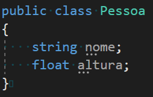
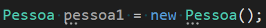
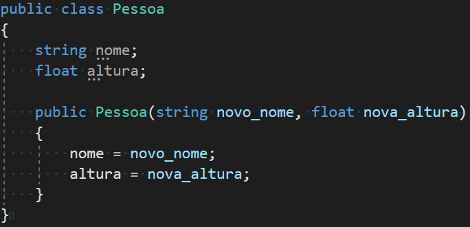
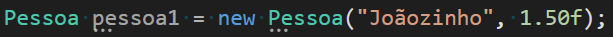

# Inventário - Coletando Itens

## Pré-aula
Esta aula continua a partir da etapa final do projeto da aula passada. É necessário ter os icones do inventário, bem como os ScriptableObjects programados corretamente.

## Slots
O inventário, assim como os itens, será um ScriptableObject! Como faremos mais adiante no curso a troca de itens entre Players e um NPC no jogo, cada um terá um inventário diferente (podemos até colocar um inventário para cada inimigo do jogo, onde o Player pode coletar os itens que estavam com ele quando morrer). A melhor forma de administrar esses inventários será então os ScriptableObjects, da mesma forma que fizemos na unit anterior.

O nome do nosso script será SO_Inventory:
```cs
using System.Collections;
using System.Collections.Generic;
using UnityEngine;


[CreateAssetMenu(menuName = "Items/Inventory")]
public class SO_Inventory : ScriptableObject
{
   
}
```

Ótimo! Bom, quando pensamos em um inventário logo é fácil de imaginar que nele haverá uma Lista guardando todos os itens do Player correto? Mas como faremos?

Não podemos simplesmente criar uma lista de GameObjects. Isso porque em um inventário há duas informações essenciais para cada entrada: o item e a quantidade! No exemplo acima estamos criando uma lista de SO_ItemBase (lembre-se que como os outros itens herdam desse script, eles podem ser colocados na lista normalmente), mas não temos como definir de forma fácil a quantidade coletada. Vamos pensar de outra forma: um inventário não é um conjunto de itens, mas sim de slots, onde cada slot possui seu item e sua quantidade. Parece bem melhor não?

Vamos criar então uma outra classe chamada InventorySlot (ela pode ficar no mesmo script que SO_Inventory, como demonstrado abaixo):

```cs
using System;
using System.Collections;
using System.Collections.Generic;
using UnityEngine;


[CreateAssetMenu(menuName = "Items/Inventory")]
public class SO_Inventory : ScriptableObject
{
   
}

[Serializable]
public class ItemSlot
{
   public SO_ItemBase item;
   public int amount;

   public ItemSlot(SO_ItemBase new_item, int new_amount)
   {
       item = new_item;
       amount = new_amount;
   }

   public void AddAmount(int value)
   {
       amount += value;
   }

   public void RemoveAmount(int value)
   {
       amount -= value;
   }
}
```

Essa nova classe possui tudo o que precisamos: o item, sua quantidade e as funções para aumentá-la ou diminuí-la quando o Player coletar ou perder itens. Há apenas uma função diferente:

```cs
public ItemSlot(SO_ItemBase new_item, int new_amount)
{
  item = new_item;
  amount = new_amount;
}
```

Vamos fazer uma pausa aqui para entender porque ela é “diferente”. Perceba que o nome dela é o mesmo nome da classe, ou seja, essa função é então o Construtor da classe. O Construtor é uma função que toda classe possui (se ela não for escrita, a linguagem usará um Construtor padrão) que define como um objeto daquela classe será criado.


Para exemplificar, imagine que temos uma classe chamada Pessoa:




Podemos criar um objeto dessa classe da seguinte forma:



No exemplo acima estamos criando um objeto chamado pessoa1 da classe Pessoa, mas perceba que no final há um Pessoa() para inicializar o objeto e não deixar ele vazio. Como você deve ter notado há parêntesis abrindo e fechando, isso significa que Pessoa() é uma função (a função Construtora!). Mas, e se quisermos, no nosso exemplo, que quando esse objeto for criado, já inicie com um nome e altura? Nesse caso podemos criar um Construtor que faça isso:




Agora se quisermos criar uma pessoa nova podemos fazer das duas formas:



Muito útil não? Aliás é importante destacar: uma classe pode ter vários construtores diferentes, então se você quiser definir na sua classe várias formas diferentes de criar os objetos, você pode!

Agora que entendemos o que é um Construtor, vamos voltar ao nosso código do SO_Inventory, dessa vez criando a lista de slots: