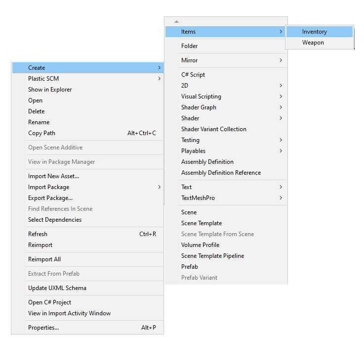

# Inventário - Coletando Itens

## Pré-aula
Esta aula continua a partir da etapa final do projeto da aula passada. É necessário ter os icones do inventário, bem como os ScriptableObjects programados corretamente.

## Slots
O inventário, assim como os itens, será um ScriptableObject! Como faremos mais adiante no curso a troca de itens entre Players e um NPC no jogo, cada um terá um inventário diferente (podemos até colocar um inventário para cada inimigo do jogo, onde o Player pode coletar os itens que estavam com ele quando morrer). A melhor forma de administrar esses inventários será então os ScriptableObjects, da mesma forma que fizemos na unit anterior.

O nome do nosso script será SO_Inventory:
```cs
using System.Collections;
using System.Collections.Generic;
using UnityEngine;


[CreateAssetMenu(menuName = "Items/Inventory")]
public class SO_Inventory : ScriptableObject
{
   
}
```

Ótimo! Bom, quando pensamos em um inventário logo é fácil de imaginar que nele haverá uma Lista guardando todos os itens do Player correto? Mas como faremos?

Não podemos simplesmente criar uma lista de GameObjects. Isso porque em um inventário há duas informações essenciais para cada entrada: o item e a quantidade! No exemplo acima estamos criando uma lista de SO_ItemBase (lembre-se que como os outros itens herdam desse script, eles podem ser colocados na lista normalmente), mas não temos como definir de forma fácil a quantidade coletada. Vamos pensar de outra forma: um inventário não é um conjunto de itens, mas sim de slots, onde cada slot possui seu item e sua quantidade. Parece bem melhor não?

Vamos criar então uma outra classe chamada InventorySlot (ela pode ficar no mesmo script que SO_Inventory, como demonstrado abaixo):

```cs
using System;
using System.Collections;
using System.Collections.Generic;
using UnityEngine;


[CreateAssetMenu(menuName = "Items/Inventory")]
public class SO_Inventory : ScriptableObject
{
   
}

[Serializable]
public class ItemSlot
{
   public SO_ItemBase item;
   public int amount;

   public ItemSlot(SO_ItemBase new_item, int new_amount)
   {
       item = new_item;
       amount = new_amount;
   }

   public void AddAmount(int value)
   {
       amount += value;
   }

   public void RemoveAmount(int value)
   {
       amount -= value;
   }
}
```

Essa nova classe possui tudo o que precisamos: o item, sua quantidade e as funções para aumentá-la ou diminuí-la quando o Player coletar ou perder itens. Há apenas uma função diferente:

```cs
public ItemSlot(SO_ItemBase new_item, int new_amount)
{
  item = new_item;
  amount = new_amount;
}
```

Vamos fazer uma pausa aqui para entender porque ela é “diferente”. Perceba que o nome dela é o mesmo nome da classe, ou seja, essa função é então o Construtor da classe. O Construtor é uma função que toda classe possui (se ela não for escrita, a linguagem usará um Construtor padrão) que define como um objeto daquela classe será criado.


Para exemplificar, imagine que temos uma classe chamada Pessoa:


Podemos criar um objeto dessa classe da seguinte forma:


No exemplo acima estamos criando um objeto chamado pessoa1 da classe Pessoa, mas perceba que no final há um Pessoa() para inicializar o objeto e não deixar ele vazio. Como você deve ter notado há parêntesis abrindo e fechando, isso significa que Pessoa() é uma função (a função Construtora!). Mas, e se quisermos, no nosso exemplo, que quando esse objeto for criado, já inicie com um nome e altura? Nesse caso podemos criar um Construtor que faça isso:


Agora se quisermos criar uma pessoa nova podemos fazer das duas formas:


Muito útil não? Aliás é importante destacar: uma classe pode ter vários construtores diferentes, então se você quiser definir na sua classe várias formas diferentes de criar os objetos, você pode!

Agora que entendemos o que é um Construtor, vamos voltar ao nosso código do SO_Inventory, dessa vez criando a lista de slots:

```cs
[CreateAssetMenu(menuName = "Items/Inventory")]
public class SO_Inventory : ScriptableObject
{
   public List<ItemSlot> itemList = new List<ItemSlot>();
}
```

Podemos criar o ScriptableObject na Unity clicando com o botão direito > Create > Items > Inventory e vamos dar o nome de Player_Inventory para ele



Perceba que no Inspector podemos definir o item e sua quantidade, como foi programado nos slots:


## Mostrando os itens na HUD
Vamos fazer com que os itens que estão no nosso inventário possam ser mostrados na HUD, para isso precisaremos criar um script para ela:

```cs
using System.Collections;
using System.Collections.Generic;
using TMPro;
using UnityEngine;

public class InventoryHUD : MonoBehaviour
{
   public SO_Inventory playerInventory;
   public GameObject itemPanel;

   private void Start()
   {
       DrawInventory();
   }

   void DrawInventory()
   {
       foreach (ItemSlot slot in playerInventory.itemList)
       {
           GameObject new_icon = Instantiate(slot.item.icon, itemPanel.transform);
           new_icon.GetComponentInChildren<TextMeshProUGUI>().text =
               slot.amount.ToString();
       }
   }
}
```

Nesse script temos a função DrawInventory() que é responsável por pegar cada item da lista (usando o foreach) e, para cada um deles, faz uma cópia do ícone e coloca ele como filho do painel (itemPanel):


Depois (para cada item) é buscado dentro do objeto o TextMeshPro que guarda o texto mostrando a quantidade que temos daquele item:


Coloque esse script na HUD e não se esqueça de arrastar os objetos que ela pede (o ScriptableObject do inventário e o Panel em que os itens serão colocados)


Se tudo estiver OK, você verá os itens que existem no inventário sendo desenhados na sua HUD (por enquanto ela aparece o tempo todo, mas faremos ainda ela ser ativada quando o jogador quiser)


## Coletando itens

É claro que nosso inventário começará sempre vazio e o Player deve coletar os itens pelo cenário para preenchê-lo. Nesse caso vamos programar a coleta desses itens e a forma como atualizaremos a HUD.

Crie um Sprite na cena (2D Object > Sprite > Square) e insira algum collider com trigger ativo. Caso a imagem não apareça na cena, aumente o valor da opção Order In Layer, para que a imagem seja desenhada na frente do tilemap.


Você deve se lembrar que criamos os ScriptableObjects para definir os dados de cada item, mas como vamos associar esses objetos com os itens na cena? Para isso criaremos um script Item:

```cs
using UnityEngine;

public class Item : MonoBehaviour
{
   public SO_ItemBase itemData;
}
```

Coloque-o no item da cena e defina qual ScriptableObject está associado à ele


Antes de fazermos a programação para que o Player colete esse item, primeiro voltaremos ao script SO_Inventory para criarmos uma função que adiciona um item na lista:

```cs
[CreateAssetMenu(menuName = "Items/Inventory")]
public class SO_Inventory : ScriptableObject
{
   public List<ItemSlot> itemList = new List<ItemSlot>();

   public void AddItem(SO_ItemBase item, int amount)
   {
       bool itemExists = false;

       foreach (ItemSlot slot in itemList)
       {
           if (slot.item == item)
           {
               slot.AddAmount(amount);
               itemExists = true;
               break;
           }
       }

       if (itemExists == false)
       {
           ItemSlot slot = new ItemSlot(item, amount);
           itemList.Add(slot);
       }
   }
}
```

A função verifica primeiro se há na lista o item que foi coletado e, caso ele já exista, é adicionado à sua quantidade o valor que coletamos (ao invés de criar um novo slot). Caso o item não exista na lista é criado um slot novo com ele e em seguida adicionado na lista.

Essa função será chamada toda vez que o Player coletar um item novo, então criaremos um script para ele chamado Player_CollectItem:

```cs
using System.Collections;
using System.Collections.Generic;
using UnityEngine;
using UnityEngine.Events;

public class Player_CollectItem : MonoBehaviour
{
   public SO_Inventory inventory;

   public UnityEvent OnItemCollect;


   private void OnTriggerEnter2D(Collider2D collision)
   {
       Item collectedItem = collision.GetComponent<Item>();

       if (collectedItem)
       {
           inventory.AddItem(collectedItem.itemData, 1);
           OnItemCollect.Invoke();
           Destroy(collision.gameObject);
       }
   }

}
```

Verificamos na função OnTriggerEnter2D se o Player colidiu com algum objeto que possui o script Item e ele é adicionado ao inventário usando a função AddItem. Veja que disparamos também um evento chamado OnItemCollect, ele será usado mais adiante para atualizarmos a HUD após a coleta.

Vamos testar! Primeiro coloque esse script no Player e arraste o Player_Inventory onde se pede o inventário, em seguida limpe o inventário apagando qualquer item que colocamos nele para teste, pois quando o Player coletar o item, devemos ver no ScriptableObject uma nova entrada:


## Atualizando a HUD
Nosso Player_Inventory está sendo atualizado corretamente, porém nossa HUD não mostra os itens coletados. Isso acontece porque no script fizemos a chamada da função DrawInventory() no Start(), então ela carregará os itens que estão no inventário apenas uma vez. Vamos voltar no script InventoryHUD e adicionar uma função para atualizar o Canvas quando um item for coletado:

```cs
public class InventoryHUD : MonoBehaviour
{
   public void UpdateInventory()
   {
       foreach (Transform child in itemPanel.transform)
       {
           Destroy(child.gameObject);
       }

       DrawInventory();
   }
}
```

A função **UpdateInventory()** primeiro destrói todos os filhos que estão no painel itemPanel e depois refaz o inventário chamando a função **DrawInventory()**, isso deve acontecer para que não exista duplicatas nos itens que estão na HUD.

Para que essa função seja chamada, precisaremos colocar a função como Listener (ouvinte) do evento OnItemColect do script Player_CollectItem. Abra esse script e adicione:

```cs
public class Player_CollectItem : MonoBehaviour
{
   InventoryHUD hud;

   void Start()
   {
       hud = GameObject.FindGameObjectWithTag("HUD").GetComponent<InventoryHUD>();
       OnItemCollect.AddListener(hud.UpdateInventory);
   }
}
```

Só não se esqueça de criar a tag “HUD” e colocá-la na HUD da cena! Faça o teste e você deve ver que a HUD agora atualizará quando os itens forem coletados.


## Ajustes
Testando o multiplayer, você deverá notar que quando um Player coleta um item, os demais têm a sua HUD atualizada também. Para resolver esse problema vamos fazer uma alteração no script Player_CollectItem

```cs
using Mirror; // aqui
using System.Collections;
using System.Collections.Generic;
using UnityEngine;
using UnityEngine.Events;

public class Player_CollectItem : NetworkBehaviour //aqui
{

   private void OnTriggerEnter2D(Collider2D collision)
   {
       Item collectedItem = collision.GetComponent<Item>();

       if (collectedItem)
       {
           if (isLocalPlayer) // aqui
           {
               inventory.AddItem(collectedItem.itemData, 1);
               OnItemCollect.Invoke();
           }

           Destroy(collision.gameObject);
        }
   }
}
```

Agora o script herdará de NetworkBehaviour para que possamos alterar a função OnTriggerEnter2D:. O item somente será adicionado no inventário caso o jogador for o Player local (isLocalPlayer) mas será destruído para todos os Players após a colisão.


Para finalizarmos com chave de ouro: vamos ativar/desativar a HUD com o apertar de um botão. Deixe o painel Inventory desativado dentro da HUD e no script do Player_CollectItem adicione:

```cs
private void Update()
{
    if (isLocalPlayer)
    {
        if (Input.GetKeyDown(KeyCode.I))
        {
            GameObject inventoryPanel =
                hud.transform.GetChild(0).gameObject;

            inventoryPanel.SetActive(!inventoryPanel.activeSelf);
        }
    }
}
```

O funcionamento é bem simples: ao apertar a tecla I, o código buscará o primeiro filho da HUD (que nesse caso é o painel Inventory que desativamos) e irá inverter seu estado de ativação (se estava desativado, agora ele será ativado e vice-versa)

