# Inventário - Gestão dos Itens

## Envent Triggers
Olá, aluno! Nesta aula veremos como fazer a mecânica de “swap” no nosso inventário, onde o jogador poderá clicar e arrastar um item em cima de outro, invertendo as posições de cada um. Ela será usada também para criarmos na próxima unit as janelas de vendas, onde o Player poderá comprar e vender itens de um NPC apenas arrastando ele entre essas janelas.

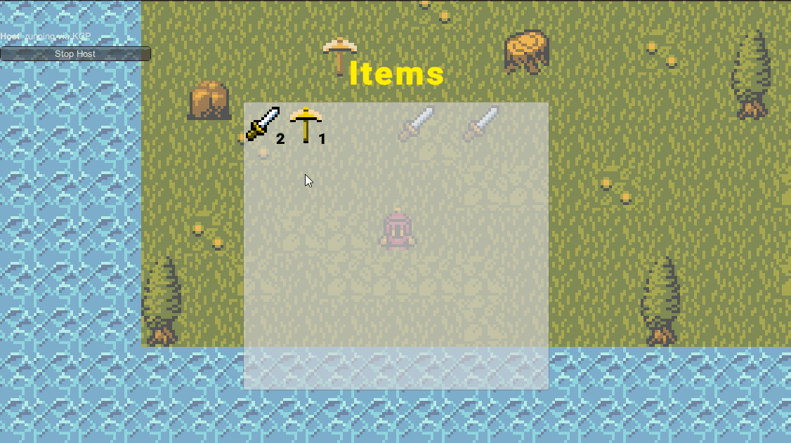

O primeiro passo será verificar se um item da HUD foi clicado. A melhor forma de fazer essa checagem é transformando os ícones em botões, então selecione todos eles e coloque o componente **Button**. Mude apenas a opção **Navigation** para None, pois dessa forma não poderemos trocar a seleção dos itens por teclado, será somente mouse.

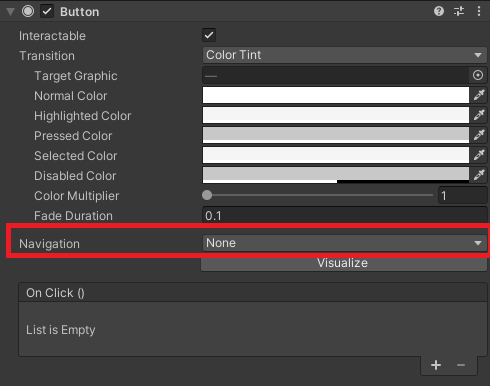

Note que o componente Button possui o evento **OnClick()** em que podemos chamar uma função toda vez que o botão for clicado, porém precisamos de outras informações: quando ele foi arrastado, quando paramos de arrastar, quando passamos o ponteiro em cima do botão, entre outras. Nesse caso precisaremos de mais um componente: o **EventTrigger**.

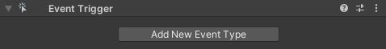

Perceba que ao clicar em *Add New Event Type*, várias opções aparecem com os eventos que precisamos, como Drag, PointerEnter, PointerExit e vários outros.

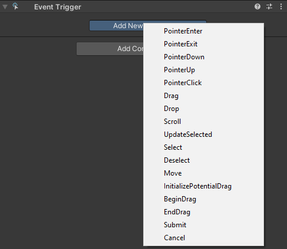

Mas colocar cada um dos eventos que precisamos dessa forma será muito trabalhoso não? Imagine se tivermos 100, 200 ou 500 ícones… Demoraríamos um bom tempo fazendo isso. Como somos programadores, sabemos que isso também pode ser feito através de script!

Vamos acessar o script **InventoryHUD** e preparar uma função que fará esse processo:

```cs
void AddTriggerEvent(GameObject obj, EventTriggerType type, UnityAction<BaseEventData> action)
{
  EventTrigger trigger = obj.GetComponent<EventTrigger>();
  var eventTrigger = new EventTrigger.Entry();
  eventTrigger.eventID = type;
  eventTrigger.callback.AddListener(action);
  trigger.triggers.Add(eventTrigger);
}
```

> **var** pode ser usado apenas quando uma variável local é declarada e inicializada na mesma instrução.
> A variável não pode ser inicializada como nula, um grupo de métodos ou uma função anônima. 
> **var** não pode ser usado em campos no escopo da classe.

Essa função pede 3 argumentos: um GameObject que representa o ícone da HUD, um EventTriggerType que representa o tipo de evento que queremos adicionar ao Event Trigger (como o Drag, PointerEnter e outros) e por fim um **UnityAction<BaseEventData>** que representa a função que será chamada quando o evento for disparado.

A função funciona da seguinte forma: 
- Primeiro pegamos o EventTrigger do ícone
- Em seguida criamos uma nova “entrada” do EventTrigger, ou seja, estamos adicionando um novo evento.
- Depois definimos qual será o tipo que esse evento terá (Drag, PointerEnter, DragExit, etc.) e qual será a função que ele adicionará como Listener (ouvinte). Ela será executada quando o evento for disparado.
- Por fim, adicionamos essa nova entrada ao EventTrigger
- Ótimo! A função está pronta e pode ser chamada para adicionarmos quantos eventos quisermos em quantos ícones forem necessários. Vamos chamá-la na função DrawInventory(), pois é lá que estamos adicionando os ícones à HUD.

```cs
void DrawInventory()
{
  foreach (ItemSlot slot in playerInventory.itemList)
  {
    GameObject new_icon = Instantiate(slot.item.icon, itemPanel.transform);

    new_icon.GetComponentInChildren<TextMeshProUGUI>().text = slot.amount.ToString();

    AddTriggerEvent(new_icon, EventTriggerType.PointerEnter, delegate { OnEnter(new_icon); });

    AddTriggerEvent(new_icon, EventTriggerType.PointerExit, delegate { OnExit(new_icon); });

    AddTriggerEvent(new_icon, EventTriggerType.BeginDrag, delegate { OnStartDrag(new_icon); });

    AddTriggerEvent(new_icon, EventTriggerType.Drag, delegate { OnDrag(new_icon); });

    AddTriggerEvent(new_icon, EventTriggerType.EndDrag, delegate { OnStopDrag(new_icon); });
  }
}
```

Repare que chamamos a função 5 vezes para adicionar os eventos PointerEnter, PointerExit, BeginDrag, Drag e EndDrag. Usaremos cada um deles na nossa mecânica de troca de itens e, para isso, eles precisam disparar as funções que estão sendo passadas através do comando especial **delegate**. 

Você deve ter notado que nosso código está apresentando erros:

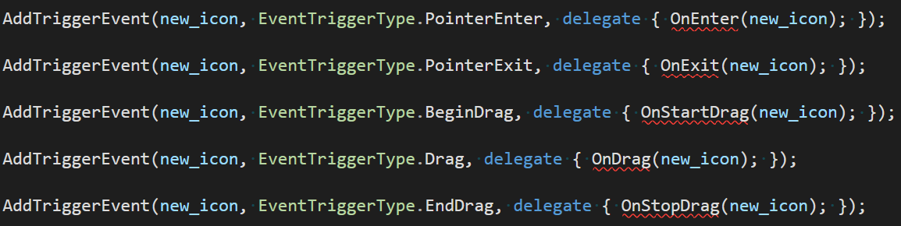

Isso acontece pois ainda não criamos as funções que serão chamadas, então vamos criá-las:

```cs
public void OnEnter(GameObject obj) //quando o ponteiro passar pelo ícone
{

}

public void OnExit(GameObject obj) //quando o ponteiro sair de cima do ícone
{

}

public void OnStartDrag(GameObject obj) //quando começamos a arrastar o ícone
{

}

public void OnDrag(GameObject obj) //quando estamos arrastando o ícone
{

}

public void OnStopDrag(GameObject obj) //quando paramos de arrastar o ícone
{

}
```

Com essas funções criadas, os erros devem sumir e podemos dar sequência no código.

## Mostrando o Ícone no Ponteiro
Precisamos que, quando o ícone for clicado e arrastado, uma miniatura dele apareça no ponteiro do Mouse, mostrando qual é o item que foi selecionado.

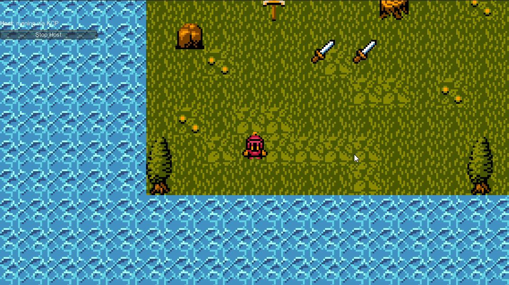

Vamos criar então uma classe que representa o ponteiro do Mouse:

```cs
public class MouseItem
{
  public GameObject itemIcon;
  public ItemSlot slotClicked;
  public ItemSlot slotHovered;
}
```

Essa classe possui 3 objetos: o ícone do item que está sendo arrastado (Drag), as informações do slot clicado (item e quantidade) e qual slot estamos passando o ponteiro em cima (PointerEnter).

Com isso podemos voltar à classe InventoryHUD e criar um objeto MouseItem.

```cs
MouseItem mouse = new MouseItem();  
```

Agora podemos fazer a programação da função OnStartDrag.

```cs
public void OnStartDrag(GameObject obj)
{
  GameObject pointerIcon = new GameObject();
  RectTransform rect = pointerIcon.AddComponent<RectTransform>();
  rect.sizeDelta = new Vector2(32, 32);
  pointerIcon.transform.SetParent(transform);
  Image img = pointerIcon.AddComponent<Image>();
  img.sprite = obj.GetComponent<Image>().sprite;
  img.raycastTarget = false;

  mouse.itemIcon = pointerIcon;
}
```

Fique tranquilo pois vamos explicar passo a passo o que está acontecendo. Primeiro a função cria um objeto vazio que representa o ícone em miniatura que acompanhará o ponteiro do mouse:

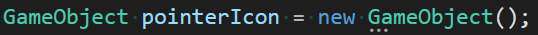

Em seguida é colocado nesse objeto o componente RectTransform. Ele será necessário para que o ícone seja mostrado no Canvas enquanto arrastamos ele pela tela. Definimos também seu tamanho (32 por 32, mas você pode ajustar o tamanho de sua preferência)

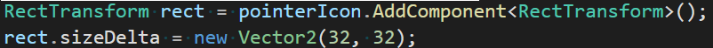

O próximo passo é super importante: o ícone precisa ser filho do Canvas para que apareça no jogo quando clicamos e arrastamos o ícone, caso contrário ele não será mostrado.

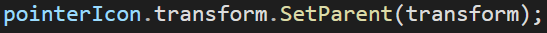

O RectTransform sozinho não mostra nenhuma imagem, então colocamos o componente Image com o ícone do item clicado. Desativamos também a opção raycastTarget para que esse ícone não atrapalhe na hora de clicarmos em outros objetos

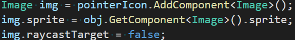


Por fim definimos que esse novo ícone estará no nosso objeto mouse.

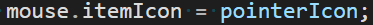

Para que esse ícone acompanhe o mouse quando se movimenta vamos atualizar a função OnDrag

```cs
public void OnDrag(GameObject obj)
{
  if(mouse.itemIcon != null)
  {
    mouse.itemIcon.GetComponent<RectTransform>().position = Input.mousePosition;
  }
}
```

Se tudo estiver OK, poderemos ver que o ícone é gerado toda vez que clicamos e arrastamos o item:


Note que, quando soltamos o clique do mouse, o ícone fica na HUD e podemos até criar vários e vários deles. Para corrigir o problema, vamos destruir esse ícone quando paramos de arrastá-lo na função OnExit

```cs
public void OnStopDrag(GameObject obj)
{
  Destroy(mouse.itemIcon);
}
```

## Troca dos Itens
Já temos uma forma de saber qual ícone foi clicado, mas precisamos associar esse ícone ao slot do inventário. Essa associação pode ser feita através de um **Dictionary**.

Um dicionário é uma forma de associarmos uma palavra a um significado certo? Quando pesquisamos uma palavra o dicionário nos retorna um texto mostrando qual o resultado encontrado. A ideia é a mesma na programação! Quando criamos um dicionário podemos definir qual é o valor que vamos pesquisar e o que o dicionário deve retornar.

No nosso caso queremos perguntar ao dicionário qual ItemSlot está associado ao ícone que clicamos, então podemos prepará-lo dessa forma:

```cs
public Dictionary<GameObject, ItemSlot> GetSlotByIcon;
```

É claro que esse dicionário começa vazio, precisamos preenchê-lo! E podemos fazer isso na própria função DrawInventory()

```cs
void DrawInventory()
{
  // mudança aqui
  GetSlotByIcon = new Dictionary<GameObject, ItemSlot>();

  foreach (ItemSlot slot in playerInventory.itemList)
  {
    GameObject new_icon = Instantiate(slot.item.icon, itemPanel.transform);

    new_icon.GetComponentInChildren<TextMeshProUGUI>().text = slot.amount.ToString();

    // mudança aqui
    GetSlotByIcon.Add(new_icon, slot); 
    ...
```

Perfeito! Temos agora esse dicionário preenchido e sempre que quisermos verificar qual é o slot pelo ícone clicado, podemos fazer isso a qualquer momento.  

Vamos aproveitar então para modificar a função **OnDragStart**

```cs
public void OnStartDrag(GameObject obj)
{
  GameObject pointerIcon = new GameObject();
  RectTransform rect = pointerIcon.AddComponent<RectTransform>();
  rect.sizeDelta = new Vector2(32, 32);
  pointerIcon.transform.SetParent(transform);
  Image img = pointerIcon.AddComponent<Image>();
  img.sprite = obj.GetComponent<Image>().sprite;
  img.raycastTarget = false;

  mouse.itemIcon = pointerIcon;
  // mudança aqui
  mouse.slotClicked = GetSlotByIcon[obj];
}
```

Sempre que começarmos a arrastar um item, agora no nosso objeto mouse teremos também a informação de qual slot é aquele, isso será essencial para que possamos fazer a troca dos itens no inventário.

Ao passarmos o ponteiro em cima de outro slot, precisamos verificar se é um slot válido, ou seja, se ele foi incluído no dicionário antes de fazermos a troca e adicioná-lo ao objeto mouse. Essa checagem poderá ser feita na função OnEnter. Precisamos também colocar um valor nulo caso tiremos o ponteiro do mouse do ícone, isso pode ser feito na função OnExit

```cs
public void OnEnter(GameObject obj)
{
  if (GetSlotByIcon.ContainsKey(obj))
  {
    mouse.slotHovered = GetSlotByIcon[obj];
  }
}

public void OnExit(GameObject obj)
{
  mouse.slotHovered = null;
}
```

Agora que temos tudo preparado vamos no script **SO_Inventory** para criar a função que trocará os itens de lugar (o item que estamos arrastando e o item que nosso ponteiro está em cima).

```cs
public void SwapItems(ItemSlot itemClicked, ItemSlot itemHovered)
{
  if(itemList.Contains(itemClicked) && itemList.Contains(itemHovered))
  {
    int i1 = itemList.IndexOf(itemClicked);
    int i2 = itemList.IndexOf(itemHovered);

    itemList[i1] = itemHovered;
    itemList[i2] = itemClicked;
  }
}
```

A função pega os dois itens e inverte sua posição dentro da lista (usando duas variáveis int de forma temporária para salvar a posição de cada um na lista)

Para chamar essa função voltaremos ao script **InventoryHUD** e vamos atualizar a função **OnStopDrag**

```cs
public void OnStopDrag(GameObject obj)
{
  if(mouse.slotHovered != null)
  {
      playerInventory.SwapItems(mouse.slotClicked, mouse.slotHovered);
      UpdateInventory();
  }
  Destroy(mouse.itemIcon);
  mouse.itemIcon = null;
}
```

Ao fazer a troca dos itens, imediatamente chamamos a função UpdateInventory() para que o inventário seja refeito e a troca seja vista na HUD. Podemos testar!

