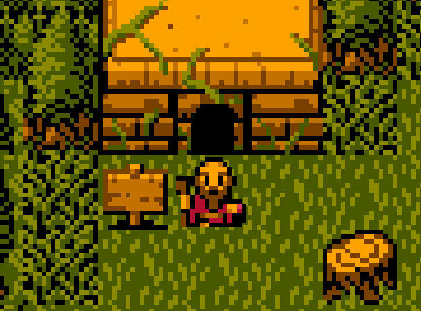
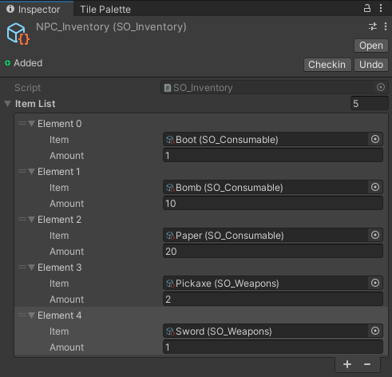
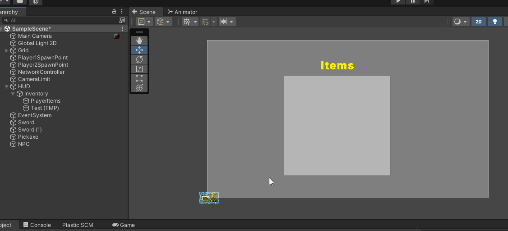
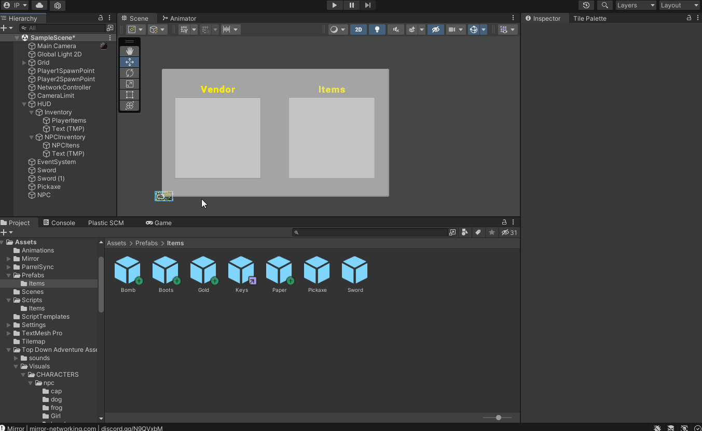
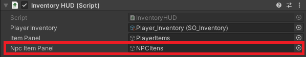
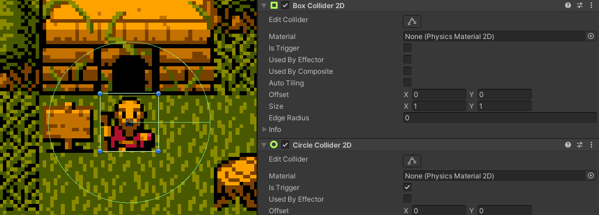
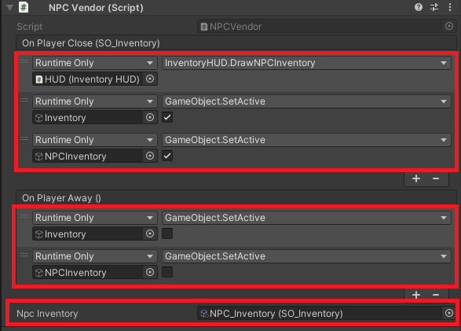
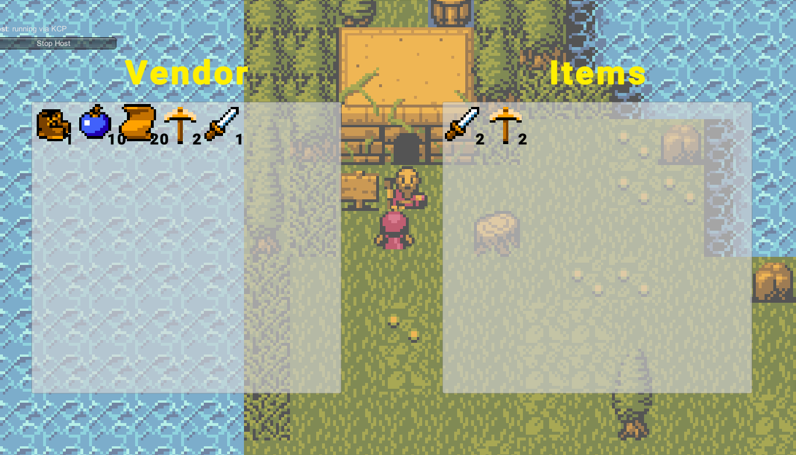

# NPC's - Vendendo Itens - Part 1

## Resumo
Na última unit trabalhamos com sistema de troca de itens do nosso inventário, onde podemos clicar e arrastar o item em cima de outro para inverter sua posição. É claro que podemos usar esse sistema de várias formas e uma delas será criarmos uma janela de “vendas”, onde um NPC (Non-Playable Character, que significa Personagem Não-Jogável) terá um inventário com seus itens e nosso Player poderá comprar ou vender.

### **Planejamento**
- Criar NPC 
  - escolha um Sprite e adicione um BoxCollision2D)
  - Criar NPC SO Inventory (faça da mesma forma que foi feita com o Jogador, escolha os itens que ele poderá vender)
  - Criar NPC Inventory HUD (para isto duplique o inventário do player no Canvas e ajuste a posição)
- Itens do NPC na HUD
  - Vá até o Inventory HUD e desenvolva um método para desenhar o inventário do NPC, use o DrawInventory como base, mas o método ficará diferente
  - Vá até o Script **CustomEvents** e crie um evento que será lançado quando o Jogador interagir com o NPC
  - Adicione um CircleCollider2D marcado como *Is Trigger* ao NPC para sabermos quando o jogador está suficientemente próximo ao NPC para que possamos abrir ou fechar a loja
  - Faça o script **NPCVendor** para programar as ações do NPC
  - Adicione o script ao NPC e configure o lançamento dos eventos
- Compra de Itens
  - Precisamos que o **SO_Inventory** tenha os métodos **AddItem** e **RemoveItem**
  - Na *InventoryHUD* altere o método **DrawNPCInventory** para que os itens chamem um método ao serem clicados
  - Crie o método que será chamado quando um item receber um clique duplo

## Criando NPC
Para isso acontecer, primeiro criaremos o objeto que representará esse NPC: ele terá um Sprite e BoxCollision2D



Esse NPC terá seu próprio inventário para que possamos trocar os itens, então assim como fizemos para o Player, criaremos um novo ScriptableObject com as informações dos itens que ele carregará. Ele se chamará NPC_Inventory.



Agora precisamos organizar nossa HUD, então vamos duplicar o painel Inventory que está nela e ajustar o texto e a posição dos componentes (não se esqueça de renomear os objetos também!).



Perceba que, como um painel está em cima do outro, o lado direito do Canvas parece mais claro. Podemos ajustar mudando a opção de transparência nas cores (alpha). É muito importante também desabilitar a opção RaycastTarget, pois senão apenas um dos painéis poderá ser clicado.



**Importante**: Não se esqueça de desabilitar o objeto NPCInventory e o Inventory, pois eles serão habilitados em momentos específicos do jogo

## Itens do NPC na HUD
Vamos fazer os itens do NPC aparecerem na HUD! Faremos uma modificação no script InventoryHUD, adicionando um objeto que será o painel dos itens do NPC e uma função que será responsável por desenhar os ícones nesse painel:

```cs
public GameObject npcItemPanel;

public void DrawNPCInventory(SO_Inventory npcInventory)
{
    foreach (Transform child in npcItemPanel.transform)
    {
        Destroy(child.gameObject);
    }

    foreach (ItemSlot slot in npcInventory.itemList)
    {
        GameObject new_icon = Instantiate(slot.item.icon, npcItemPanel.transform);

        new_icon.GetComponentInChildren<TextMeshProUGUI>().text =
            slot.amount.ToString();

    }
}
```
Perceba que a função tem um funcionamento parecido com a função DrawInventory(), porém dessa vez ela recebe um SO_Inventory (que será o inventário dos NPCs que podemos interagir) e antes de criar os ícones dos itens ela já destrói cada filho para que não haja duplicatas.

Não se esqueça de colocar o painel do NPC no script da HUD na Unity:



Para fazermos a interação com o Player, primeiro vamos no script CustomEvents, pois precisamos criar um evento que nos retorna um Inventário toda vez que é disparado.

```cs
[Serializable]
public class NPCVendorEvent : UnityEvent<SO_Inventory> { }
```

Agora vamos colocar no nosso NPC um **CircleCollider2D** com *Is Trigger* ativo, pois quando o Player entrar nessa área a HUD do NPC será habilitada e nós poderemos ver quais são os itens que ele possui.




Fazer essa interação será possível com um script para esse NPC, então vamos criá-lo:

```cs
using Mirror;
using UnityEngine;
using UnityEngine.Events;

public class NPCVendor : NetworkBehaviour
{
  public NPCVendorEvent OnPlayerClose;
  public UnityEvent OnPlayerAway;
  public SO_Inventory npcInventory;

  private void OnTriggerEnter2D(Collider2D collision)
  {
    Player player = collision.GetComponent<Player>();
    if(player != null && player.isLocalPlayer)
    {
      OnPlayerClose.Invoke(npcInventory);
    }
  }

  private void OnTriggerExit2D(Collider2D collision)
  {
    Player player = collision.GetComponent<Player>();
    if (player != null && player.isLocalPlayer)
    {
      OnPlayerAway.Invoke();
    }
  }
}
```

O script possui duas funções principais: OnTriggerEnter2D e OnTriggerExit2D. Nelas nós checamos se é o Player que entrou na área ou saiu dela (e se ele é o Player local), com isso disparamos o evento OnPlayerClose ou OnPlayerAway, que serão usados para ativarmos e desativarmos os painéis da HUD na Unity.

Coloque o Script no NPC e defina nos eventos quais funções serão chamadas e também qual é o SO_Inventory do NPC:



Se tudo estiver OK, você deverá ver a tela do vendedor e do Player ao se aproximar dele



## Comprando Itens
Para que o Player possa comprar os itens do NPC, vamos fazer que ao clicar nesses itens eles sejam removidos de um inventário e colocados no outro. Vamos voltar ao script **SO_Inventory** para criarmos uma função que faz essa remoção

```cs
public void RemoveItem(SO_ItemBase item, int amount)
{
  foreach (ItemSlot slot in itemList)
  {
    if (slot.item == item)
    {
      if(slot.amount > 1)
      {
        slot.RemoveAmount(amount);
      }
      else
      {
        itemList.Remove(slot);
      }

      break;
    }
  }

}
```

Agora precisaremos chamar essa função toda vez que clicarmos nos itens do painel do NPC, então vamos voltar ao script InventoryHUD e modificar a função **DrawNPCInventory**

```cs
public void DrawNPCInventory(SO_Inventory npcInventory)
{
  foreach (Transform child in npcItemPanel.transform)
  {
    Destroy(child.gameObject);
  }

  foreach (ItemSlot slot in npcInventory.itemList)
  {
    GameObject new_icon = Instantiate(slot.item.icon, npcItemPanel.transform);

    new_icon.GetComponentInChildren<TextMeshProUGUI>().text =
        slot.amount.ToString();

    // novo \/
    new_icon.GetComponent<Button>().onClick.
        AddListener(delegate {OnClick(slot, npcInventory);});

  }
}
```

Nesse trecho de código fazemos com que o evento **onClick** do botão chame uma função que criaremos logo na sequência

```cs
void OnClick(ItemSlot slot, SO_Inventory inventory)
{
  playerInventory.AddItem(slot.item, 1);
  inventory.RemoveItem(slot.item, 1);
  UpdateInventory();
  DrawNPCInventory(inventory);
}
```

Essa função faz exatamente o que precisamos: adiciona no inventário do Player o item clicado, remove do inventário do NPC e atualiza a HUD dos dois painéis.


Por enquanto podemos apenas clicar em qualquer item e ele será colocado no inventário do Player, mas na nossa próxima unit veremos como adicionar moedas ao inventário para que sejam gastas quando essa compra for feita. Te vejo lá!