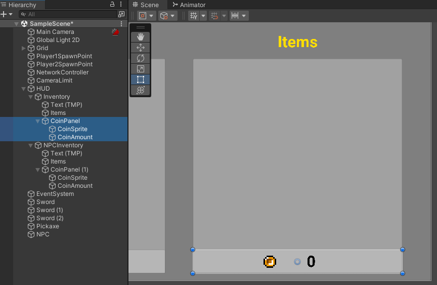
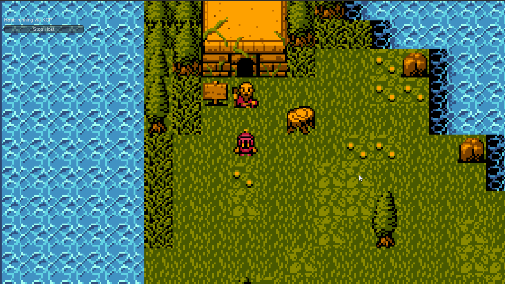
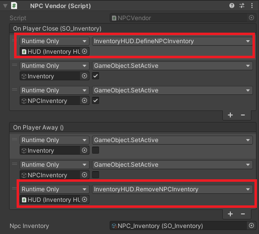
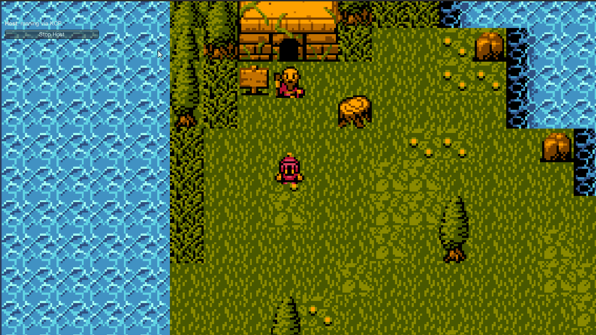
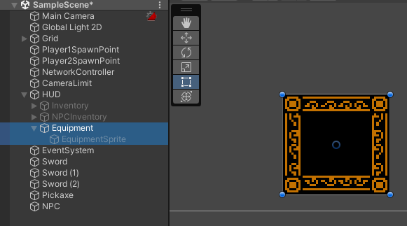
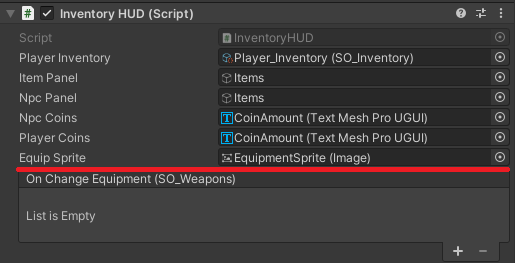

# NPC's - Vendendo Itens - Part 2

## Resumo
Na nossa última unit estávamos trabalhando com o inventário do NPC e fizemos um sistema de compras, onde o Player pode clicar em um item e ele irá para seu inventário. Hoje vamos desenvolver a venda do item e principalmente o sistema econômico, onde o Player e o NPC terão moedas para a compra e venda desses itens.

### **Planejamento**
- Compra com moedas
  - Criar na HUD os contadores de moedas do NPC e do jogador
  - Programar no **SO_Inventory** para que tenhamos os métodos **AddCoins** e **SpendCoins**
  - Programe na InventoryHUD para que seja exebido a quantidade de moedas do jogador e do NPC, no **DrawInventory** e no **DrawNPCInventory**
  - Modifique o **OnClick** para que realize a opreação apenas caso hajam moedas o suficiente
- Venda com Moedas - para a venda dos itens precisaremos de várias modificações feitas nos nossos scipts
  - Crie um atributo para armazenar qual o NPC Inventory a ser desenhado na tela, ele não pode ser público
  - Crie os métodos para alterar o atributo anterior. Eles devem se chamar **DefineNPCInventory** e **RemoveNPCInventory**
  - Altere o **DrawInventory** para que os itens sejam tratados como botões e chamem pelo método **OnClick()**
  - Altere o **OnClick** para que ele receba o Slot que está sendo usado, o inventário que está realizando a compra e o inventário que está realiando a venda
  - Reconfigure o NPCVendorScript do NPC para que execute os métodos corretos
- Equipando Itens - esta parte fica para uma segunda aula
  - Crie na HUD o Slot do Equipamento
  - Em **CustomEvents** crie o evento **EquipEvent**
  - No **InventoryHUD** crie os atributos para equipSprite e o evento que iremos lançar quando o item for equipado
  - Crie o método **ChangeEquipment** que irá equipar o item que está no Slot será clicado
  - Altere o **OnClick** para pode chamar o **ChangeEquipment** quando não puder vender o item
  - No script **Player** adicione os atributos *isWeaponEquipped* e *attack*
  - Crie o método **EquipWeapon** e altere o Start para fazer com que o método EquipWeapon seja ouvinte do evento OnChangeEquipment
  - Altere o Update para que seja possível atacar
  - Volte na Unity e corrija o InventoryHUD

## Compra com moedas
O primeiro passo será modificarmos a HUD para que ele mostre a quantidade de moedas do Player. Para isso vamos criar um painel que conterá a Image da moeda e o TextMeshPro da quantidade (repita o processo para o NPC).



Agora para as mudanças nos scripts: começaremos criando uma variável coins no script **SO_Inventory** e duas funções que adicionam e removem as moedas respectivamente.

```cs
public float coins;

public void SpendCoins(float value)
{
  coins -= value;
  coins = Mathf.Clamp(coins, 0, 999);
}

public void AddCoins(float value)
{
  coins += value;
  coins = Mathf.Clamp(coins, 0, 999);
}
```

No script **InventoryHUD** vamos adicionar os objetos que representam os textos das moedas

```cs
public TextMeshProUGUI npcCoins;
public TextMeshProUGUI playerCoins;
```

Ainda nesse script, na função **DrawInventory()**, vamos atualizar o texto com as moedas do Player:

```cs
playerCoins.text = playerInventory.coins.ToString();
```

A mesma coisa vale para a função DrawNpcInventory(), pois nela vamos atualizar o texto com as moedas do NPC:

```cs
npcCoins.text = npcInventory.coins.ToString();
```

O último passo será modificarmos a função OnClick(), onde verificaremos se o Player possui moedas suficientes para fazer a compra e, se tiver, faremos ele perder moedas:


```cs
void OnClick(ItemSlot slot, SO_Inventory inventory)
{
  if(playerInventory.coins >= slot.item.value)
  {
    playerInventory.AddItem(slot.item, 1);
    playerInventory.SpendCoins(slot.item.value);

    inventory.AddCoins(slot.item.value);
    inventory.RemoveItem(slot.item, 1);

    UpdateInventory();
    DrawNPCInventory(inventory);
  }
}
```

Se tudo estiver OK, veja que ao clicar nos itens do NPC, as moedas do Player são removidas.



## Venda com Moedas
Para a mecânica de vendas, faremos algumas modificações na nossa programação bastante importantes, pois até o momento desenvolvemos nosso NPC vendedor pensando apenas na mecânica de compras.

A primeira e a maior mudança será na função **OnClick()**, pois vamos adaptá-la para que funcione na compra e também na venda ao clicarmos nos itens. Ela ficará assim:

```cs
void OnClick(ItemSlot slot, SO_Inventory buyInventory, SO_Inventory sellInventory)
{
  if(buyInventory == null || sellInventory == null)
  {
    return;
  }

  if (buyInventory.coins >= slot.item.value)
  {
    buyInventory.AddItem(slot.item, 1);
    buyInventory.SpendCoins(slot.item.value);

    sellInventory.AddCoins(slot.item.value);
    sellInventory.RemoveItem(slot.item, 1);

    UpdateInventory();
    DrawNPCInventory();
  }
}
```

Agora a função recebe 3 argumentos: o slot representando o item que está sendo vendido/comprado, o inventário de quem está comprando (buyInventory) e o inventário de quem está vendendo (sellInventory).

Caso esses inventários sejam null, então a função é cancelada com o return. O resto do código é o que desenvolvemos anteriormente: verificamos se quem está comprando possui moedas suficientes e em seguida fazemos a transação.

Perceba que na função **DrawNpcInventory()** está sendo apresentado um erro, então vamos corrigi-lo:

```cs
new_icon.GetComponent<Button>().onClick.AddListener (delegate { OnClick(slot, playerInventory, npcInventory); });
```

Nesse caso estamos definindo que o buyInventory é o inventário do Player e o sellInventory é o inventário do NPC. Ótimo!

Mas agora precisaremos fazer com que, ao clicar em qualquer item do Player, ele seja vendido ao NPC. Então vamos criar um objeto que representará o **SO_Inventory** do NPC.

```cs
{
  public SO_Inventory playerInventory;
  SO_Inventory npcInventory; // novo
  // ...
}
```

Agora na função **DrawInventory()** vamos adicionar no evento **onClick** de cada botão que eles executarão nossa função **OnClick()** que acabamos de alterar acima

```cs
new_icon.GetComponent<Button>().onClick.AddListener(delegate { OnClick(slot, npcInventory, playerInventory); });
```

Perceba que aqui fizemos o contrário da função **DrawNpcInventory()**, pois nesse caso o buyInventory é o inventário do NPC e o sellInventory é o inventário do Player.

Falta apenas um único detalhe: se cada item do Player vai precisar de um npcInventory, como faremos quando o Player não estiver interagindo com ninguém? Ou até mesmo, como faremos se interagirmos com 2 ou mais NPCs diferentes? Neste caso faremos duas funções:

```cs
public void DefineNPCInventory(SO_Inventory inventory)
{
  npcInventory = inventory;
  if (npcInventory)
  {
    DrawNPCInventory();
    UpdateInventory();
  }
}

public void RemoveNPCInventory()
{
  npcInventory = null;
}
```

A primeira define quem é o NPC assim que fizermos a interação. Perceba que ele também chama a função UpdateInventory() para que o inventário seja atualizado e cada botão receba agora o npcInventory que antes era null.

A segunda é usada para “limpar” o inventário no momento que o Player pare de interagir com o NPC, isso vai evitar que possamos vender os itens mesmo longe dele.

Essas funções serão chamadas no nosso NPC que está na Unity, em seu script NPCVendor.



Faça o teste e veja se está tudo OK!



## Equipando Itens
Agora que montamos o sistema de compras e vendas, que tal equipar uma das armas do inventário? Parece bom!

Vamos criar um painel na nossa HUD indicando que é um slot para equipamentos e dentro dele uma Image que terá o sprite, ela ficará desabilitada pois vamos mostrá-la ao clicar no item que queremos equipar



Começaremos adicionando no script **CustomEvents** um evento que nos retorna um SO_Weapon, pois ele será disparado quando trocarmos as armas:

```cs
[Serializable]
public class EquipEvent : UnityEvent<SO_Weapons> { }
```

No script **InventoryHUD** vamos adicionar esse evento e também a Image que terá o sprite da arma:

```cs
public EquipEvent OnChangeEquipment;
public Image equipSprite;
```

Faremos também uma função *ChangeEquipment*(), ela será responsável por mudar o sprite da arma no slot de equipamento e disparar o evento (poderíamos remover o item do inventário ao equipá-lo, mas fica a seu critério se é interessante fazer isso)

```cs
void ChangeEquipment(ItemSlot slot)
{
  if (slot.item.type == ItemType.weapons)
  {
    equipSprite.gameObject.SetActive(true);
    equipSprite.sprite = slot.item.icon.GetComponent<Image>().sprite;
    //playerInventory.RemoveItem(slot.item, 1);
    //UpdateInventory();
    OnChangeEquipment.Invoke(slot.item as SO_Weapons);
  }
}
```

Essa função será chamada no *OnClick*(), isso significa que para equipar o item devemos clicar nele no inventário, e não arrastá-lo!

```cs
void OnClick(ItemSlot slot, SO_Inventory buyInventory, SO_Inventory sellInventory)
{
  if(buyInventory == null || sellInventory == null)
  {
    ChangeEquipment(slot);
    return;
  }
...
```

Mas o que esse evento OnChangeEquipment vai fazer exatamente? No script do Player há um trecho de código que deixamos pronto, porém comentado:

```cs
//inputAttack = Input.GetKeyDown(KeyCode.Space);
//OnAttack?.Invoke(inputAttack);
```

Já deixamos todo o ataque pronto para você! Falta apenas ativá-lo, então vamos lá!

Adicione no **Player** uma variável para sabermos se estamos equipados e outra para definir o ataque do Player:

```cs
public bool isWeaponEquipped;
public float attack;
```

Agora uma função para mudarmos o equipamento:

```cs
void EquipWeapon(SO_Weapons weapon)
{
  isWeaponEquipped = true;
  attack = weapon.attackBonus;
}
```

Agora vamos adicionar no *Start*() essa função como Listener do evento OnChangeEquipment

```cs
GameObject.FindGameObjectWithTag("HUD").GetComponent<InventoryHUD>().OnChangeEquipment.AddListener(EquipWeapon);
```

Ótimo! Lembra daquele código comentado com o ataque? Podemos finalmente usá-lo:

```cs
if(isWeaponEquipped)
{
  inputAttack = Input.GetKeyDown(KeyCode.Space);
  OnAttack?.Invoke(inputAttack);
}
```

Voltando para a Unity, não se esqueça de definir na HUD quem será a Image com o sprite da arma:




Para que o Player ataque, basta clicar em alguma arma do inventário e apertar Espaço!

