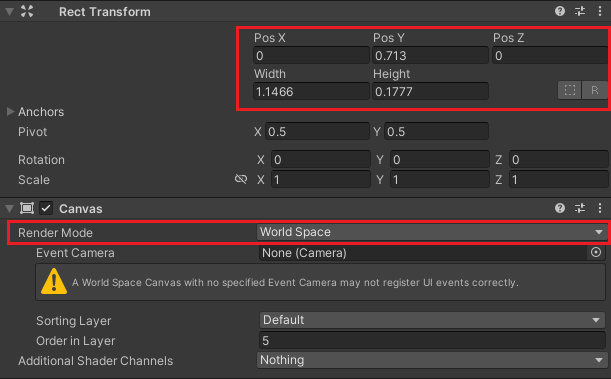
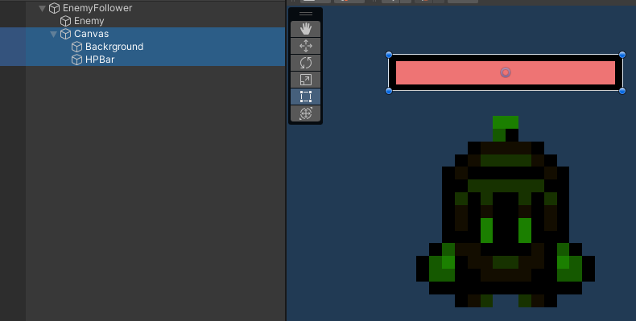
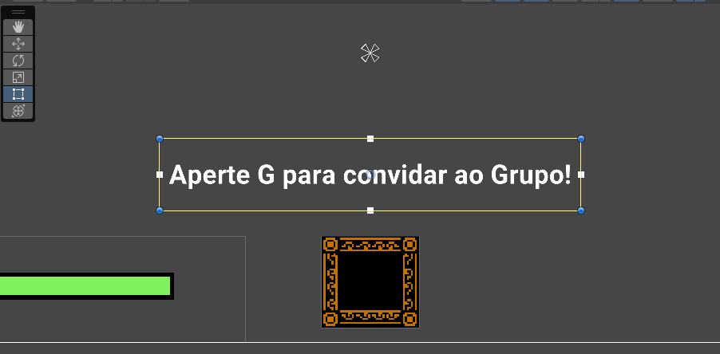
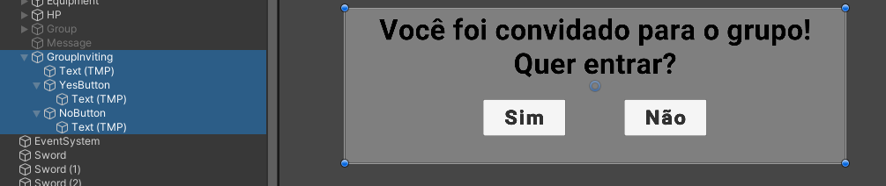
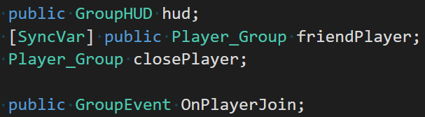
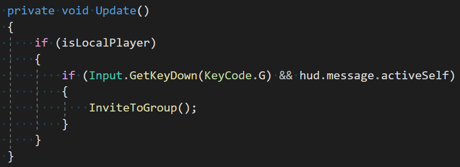
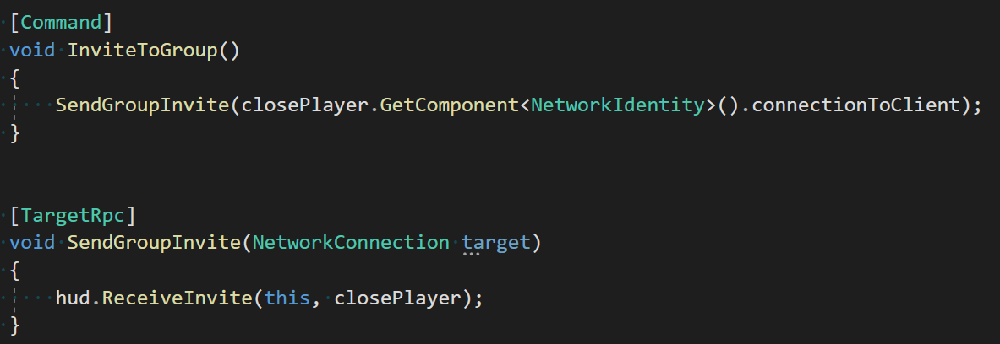
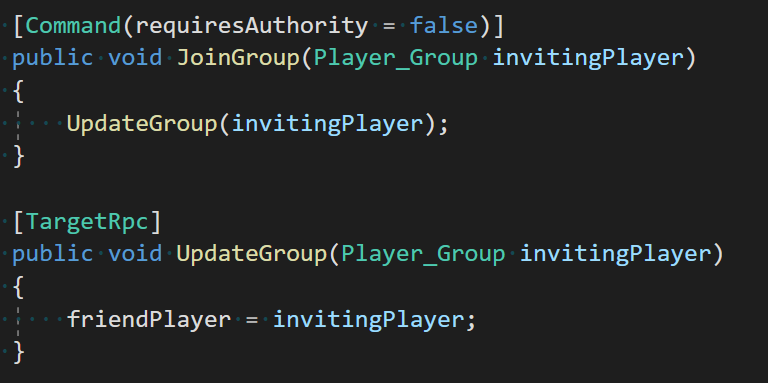
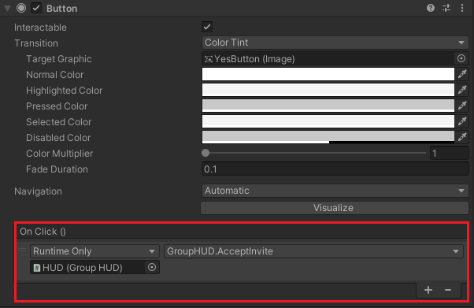
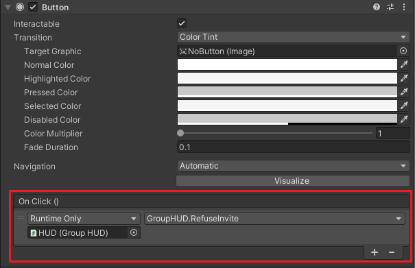

# Inimigos

- [X] Pathfinding
  - [X] Criando Estrutura do Inimigo
  - [X] Importando NavMeshPlus
- [X] Preparação do NavMesh
  - [X] [Criando o NavMeshSurface2D e configurando](#criando-o-navmeshsurface2d-e-configurando)
  - [X] [Aplicando NavMeshModifier no mapa e nos obstáculos](#aplicando-o-navmeshmodifier)
  - [X] [NavMeshAgent e programação do Inimigo](#navmeshagent-e-programação-do-inimigo)
  - [ ] [Configurar NetworkManager para conter o Enemy e o EnemySpawn](#enemy-spawn)
- [X] Ajustando Animações
  - [X] Criando Animation Controller
  - [X] Adicionando as animações
  - [X] Criando Animator, NetworkAnimator e NetworkTransform
- [ ] Dano e Knockback

## Pathfinding
Olá, aluno! Tudo mamão com açúcar? Na aula de hoje criaremos nossos primeiros inimigos do jogo e vamos implementar um sistema de equipes, onde o jogador pode se unir a outros para enfrentar os desafios da cena! Vamos lá?

O primeiro passo será definirmos a estrutura do nosso inimigo: Vamos criar um objeto vazio chamado EnemyFollower e dentro dele um Sprite2D que chamaremos de Enemy.


Usaremos o sprite (e também as animações) do Player pois é o único personagem do pacote que tem sprites olhando para todas as direções, mas fique a vontade para escolher outros se preferir!

Nosso inimigo se movimentará usando Inteligência Artificial! Neste caso usaremos uma IA chamada Pathfinding, onde um objeto se move através de uma área navegável (chamada de NavMesh) desviando de obstáculos e escolhendo a melhor rota para chegar a um alvo.


A Unity já possui componentes para implementação de Pathfinding, porém eles funcionam apenas no 3D. Para que possamos usar essa técnica em nosso projeto, vamos baixar um pacote criado pela comunidade que permite a utilização no 2D! Esse pacote se chama NavMeshPlus e pode ser encontrado no link abaixo:

[https://github.com/h8man/NavMeshPlus](https://github.com/h8man/NavMeshPlus)


Para baixá-lo, basta clicar em Code, em seguida selecionar Download ZIP

> Atualmente o projeto foi testado com a versão disponível no portal, então utilize-a para evitar erros



O arquivo baixado deve ser descompactado e seu conteúdo deve ser arrastado para a Unity (para melhor organização, vamos criar uma pasta chamada **Pathfinding**).



## Preparação do NavMesh

### Criando o NavMeshSurface2D e configurando 
Para que possamos definir qual será a área que o nosso inimigo pode se mover (e principalmente quem são os obstáculos), vamos criar um objeto vazio chamado **NavMesh**. Dentro dele coloque o componente **NavMeshSurface2D** (esse é um dos componentes que acompanha o pacote que baixamos).

**Importante**: Mude a *Rotação em X do objeto para -90*, pois senão ele fará a área navegável em pé e não deitada, que é o que precisamos.

### Aplicando o NavMeshModifier
Por enquanto nosso NavMesh ainda não possui dados suficientes para criar a área navegável, pois temos que definir quais locais do nosso Tilemap são obstáculos e quais são andáveis. Vamos clicar no nosso Tilemap Ground e colocar o componente **NavMeshModifier**, em seguida ative a opção **Override Area** e em **Area Type** seleciona **Walkable** (área andável).

O mesmo deve ser feito no Tilemap **Walls** da cena, porém ao invés de Walkable, selecionamos **Not Walkable** (obstáculos). Por fim, volte no NavMesh e clique na opção **Bake** para que ele construa a área navegável (se tudo der certo você verá que a cena terá áreas azuis, indicando onde a IA pode se mover)


### NavMeshAgent e programação do Inimigo
Ótimo! Mas como vamos definir que o nosso inimigo pode se mover por essa área? Vamos colocar nele (EnemyFollower) o componente **NavMeshAgent**. Ele define que o objeto agora é um agente, ou seja, é controlado por IA e podemos fazer várias modificações nesse componente, como a velocidade e aceleração que andará pelo NavMesh, a distância que ele deve ficar do alvo, qual é o tamanho que ele terá para desviar dos obstáculos, entre outras.


Vamos agora criar um script para esse inimigo, ele se chamará **EnemyFollow**

```cs
using Mirror;
using UnityEngine;
using UnityEngine.AI;

public class EnemyFollow : NetworkBehaviour
{
   Transform target;
   NavMeshAgent agent;

   void Start()
   {
       agent = GetComponent<NavMeshAgent>();
       agent.updateRotation = false;
       agent.updateUpAxis = false;
   }

   void Update()
   {
       if (target)
       {
           agent.SetDestination(target.position);
       }
   }
}
```

O código possui 2 objetos principais: **Transform target** que será nosso alvo (Player) e **NavMeshAgent agent** que será o objeto controlado pela IA (inimigo).

Logo no **Start()** definimos quem é o agent usando o **GetComponent<NavMeshAgent>()**, desabilitamos a rotação do sprite ao seguir o alvo (*agent.updateRotation = false*) e desabilitamos também que o agent seja influenciado pela orientação do NavMesh (*agent.updateUpAxis = false*).

Perceba que nós definimos a movimentação no Update, usando a função **SetDestination(target.position)**, mas temos que arranjar uma forma de sabermos quem é o alvo! Que tal por aproximação? Vamos fazer que, quando um Player chegar perto desse inimigo, ele começará a persegui-lo.

Para que essa mecânica funcione, vamos colocar no nosso inimigo um **CircleCollider2D** com **Is Trigger** ativo e defina o tamanho desse círculo (quanto maior, mais longe o inimigo nos “enxergará” e começará a nos perseguir).



Agora podemos voltar no script e adicionar as funções abaixo (não se esqueça de verificar se o Player possui a tag “Player”):

```cs
private void OnTriggerStay2D(Collider2D collision)
{
  if (collision.CompareTag("Player") && target == null)
  {
    target = collision.gameObject.transform;
    agent.isStopped = false;
  }
}

private void OnTriggerExit2D(Collider2D collision)
{
  if (collision.CompareTag("Player"))
  {
    target = null;
    agent.isStopped = true;
    // anim.Play("Enemy_Idle");
  }
}
```

### Enemy Spawn
Com a lógica de movimento pronta, podemos agora spawná-lo pelo Server. Coloque o script no inimigo e salve-o como prefab, em seguida vamos colocá-lo no **MyNetworkController > Registered Spawnable Prefabs**. Você pode apagar o inimigo da cena!



Crie na cena um objeto vazio chamado **EnemySpawnPoint** e coloque-o onde você quiser que o inimigo apareça. No script *MyNetworkController* vamos adicionar a função:

```cs
public Transform enemySpawnPoint;

void SpawnEnemy()
{
  GameObject new_enemy = Instantiate(
          spawnPrefabs.Find(prefab => prefab.name == "EnemyFollower"),
          enemySpawnPoint.position, enemySpawnPoint.rotation);

  NetworkServer.Spawn(new_enemy);
}
```

Você pode chamar essa função logo após o segundo Player ser spawnado (em vermelho):

```cs
public override void OnServerAddPlayer(NetworkConnectionToClient conn)
{
  Transform startPoint;

  if(numPlayers == 0)
  {
    startPoint = player1SpawnPoint;
  }
  else
  {
    startPoint = player2SpawnPoint;
    Invoke("SpawnEnemy", 5);
  }

  GameObject player = Instantiate(playerPrefab, startPoint.position, startPoint.rotation);

  NetworkServer.AddPlayerForConnection(conn, player);
}
```

Com isso temos o suficiente para testar! Não se esqueça de arrastar o EnemySpawnPoint no script!

## Ajustando as Animações

Nosso inimigo já está perseguindo o Player, porém ainda não está executando as animações, vamos ajustá-las!

O primeiro passo será criarmos um novo **AnimatorController** com as animações que nos interessam, então abra a pasta *Animations* e com o botão direito, clique em **Create > Animator Controller**. Dentro dele arraste as animações do Player que precisaremos: Idle e WalkHorizontal (se quiser usar as animações de WalkUp e WalkDown também, fique a vontade!). Você pode renomeá-las se preferir.



Dentro do prefab do inimigo, vamos colocar no objeto Enemy um Animator e arrastar o Animator Controller que acabamos de criar na opção Controller


Clique no objeto pai (**EnemyFollower**) e coloque um **NetworkAnimator**, ele será usado para que todos os players vejam as animações serem executadas. É importante também colocarmos o **NetworkTransform**, pois quando se movimentar, todos os players devem atualizar sua posição



Agora vamos atualizar o script do inimigo:

```cs
public class EnemyFollow : NetworkBehaviour
{
  public Transform target;
  NavMeshAgent agent;
  Animator anim; // linha nova

  void Start()
  {
      agent = GetComponent<NavMeshAgent>();
      agent.updateRotation = false;
      agent.updateUpAxis = false;
      anim = GetComponentInChildren<Animator>(); // linha nova
  }

  void Update()
  {
      if (target)
      {
          agent.SetDestination(target.position);
          ChangeAnimation(); // linha nova
      }
  }

  // método novo
  void ChangeAnimation()
  {
      if (transform.position.x > target.position.x)
      {
          anim.Play("Enemy_WalkHorizontal");
          transform.localScale = new Vector3(1, 1, 1);
      }
      else if (transform.position.x < target.position.x)
      {
          anim.Play("Enemy_WalkHorizontal");
          transform.localScale = new Vector3(-1, 1, 1);
      }
      
  }
...
```

Criamos uma função chamada **ChangeAnimations()** que verifica se o player está à esquerda ou direita do inimigo e toca a animação **WalkHorizontal** flipando o sprite se necessário.

## Dano e Knockback

Está na hora do nosso inimigo tomar dano do Player! Vamos colocar nele uma **BoxCollider2D** e um **RigidBody2D**, neste último precisamos mudar a opção Body Type para Kinematic para que o Player não possa empurrá-lo.



Vamos criar um script para definir como o inimigo se comportará quando atingido, ele se chamará **EnemyDamage**.

```cs
public class EnemyDamage : NetworkBehaviour
{
  [SyncVar]
  public float hp;
  public float maxHP;

  Rigidbody2D rb;

  private void Start()
  {
    rb = GetComponent<Rigidbody2D>();
  }
}
```

Antes de fazermos o inimigo perder HP, é importante deixar claro que ele tomará dano somente quando for atingido pela arma do Player. Mas vamos ver como ela foi definida no jogo:



Abrindo o prefab podemos ver que a arma está dentro do Player o tempo todo (ela é ativada somente na animação de ataque) e nela há o componente **CircleCollider2D**. Esse é um ponto importante que precisa ser notado: quando fizermos a colisão com o inimigo usando a função **OnCollisionEnter2D** o inimigo saberá apenas que o GameObject do Player o atingiu, mas não a arma. Para contornar esse problema precisamos definir no script do Player qual é o collider da arma, pois isso facilitará nas checagens futuras que faremos no inimigo.

Retorne ao script do Player e adicione:

```cs
public Collider2D weaponCollider;
```

Vamos voltar no prefab do Player e arraste a arma no script onde é pedido esse collider:



Agora podemos voltar no script **EnemyDamage** e verificar a colisão com a função **OnCollisionEnter2D()**

```cs
[Command(requiresAuthority = false)]
void TakeDamage(float value)
{
  hp -= value;
}

private void OnCollisionEnter2D(Collision2D collision)
{
  Player player = collision.gameObject.GetComponent<Player>();
  if(player && collision.collider == player.weaponCollider)
  {
    TakeDamage(player.attack);

    Vector2 direction = (transform.position - player.transform.position).normalized;
    rb.velocity = direction * 10;

    Invoke("StopMoving", 0.2f);
  }
}

void StopMoving()
{
  rb.velocity = Vector2.zero;
}
```

Vamos entender o que está acontecendo:

Ao acontecer a colisão, verificamos se o objeto colidido é o Player e logo em seguida verificamos se o collider que nos atingiu é o collider da arma.



Removemos o HP do inimigo de acordo com o ataque do Player (executada no Server para poder ser atualizada em todos os clients, já que a variável é SyncVar) e fazemos uma mecânica de **knockback**: é verificada qual é a direção que veio o Player e nós empurramos o inimigo na direção contrária usando o **rb.velocity**.


Por fim é chamada uma função para que o inimigo pare de se mover após 0.5 segundos, isso é muito importante pois senão nosso inimigo será empurrado para longe sem parar até bater em uma parede.


Podemos fazer também no Update uma checagem para ver se o inimigo morreu:

```cs
private void Update()
{
  if (hp <= 0)
    Destroy(gameObject);
}
```

Vamos testaaaaar! Não se esqueça de definir o HP do Inimigo no script, senão ele morrerá com apenas 1 golpe!

