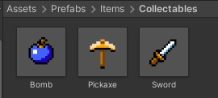
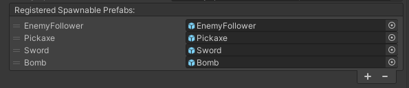
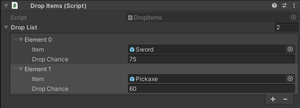
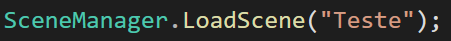
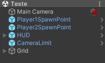

# PROJETO 2

Nesta unit fizemos algumas mecânicas adicionais no projeto, melhorando a experiência de jogo e trabalhando com conceitos ainda não vistos, como por exemplo: sistema de drop de itens, troca de cenas e sons!

- [PROJETO 2](#projeto-2)
  - [Drop de Itens](#drop-de-itens)
    - [Criando os Prefabs](#criando-os-prefabs)
    - [DropItem \& ItemChance](#dropitem--itemchance)
    - [Moedas](#moedas)
  - [Troca de Cenas](#troca-de-cenas)
    - [Preparando a nova cena](#preparando-a-nova-cena)
    - [Build Settings](#build-settings)
    - [Mudança de Cenas no Multiplayer](#mudança-de-cenas-no-multiplayer)
  - [Sons](#sons)
    - [Criando Play List de sons](#criando-play-list-de-sons)

## Drop de Itens

### Criando os Prefabs
Antes de qualquer coisa é importante termos os prefabs dos itens que serão spawnados no jogo. Note que eles não são os ícones dos itens, mas os objetos que aparecem no cenário para o player pegar, portanto cada item deverá ter o seu.



Também é importante que os itens estejam registrados no NetworkManager, na lista de Spawn



### DropItem & ItemChance
Para a programação comece criando o Script **DropItem** e dentro dele teremos as seguintes classes

```cs
using Mirror;
using System;
using System.Collections.Generic;
using UnityEngine;

public class DropItems : NetworkBehaviour
{
   
}

[Serializable]
public class ItemChance
{
    
}
```

Vamos entender como o script funciona! Primeiro é importante observar que nosso script possui uma classe **ItemChance**. Precisamos dela pois cada item terá uma chance de ser spawnado, então ao invés de criarmos uma lista de GameObjects, vamos criar uma lista de ItemChance, onde podemos definir qual é o GameObject (item) e qual é a sua chance de cair (dropChance). Logo ela ficará assim:

```cs
[Serializable]
public class ItemChance
{
   public GameObject item;
   public float dropChance;
}
```

Na classe **DropItems** teremos apenas uma função que será responsável pelo spawn dos itens. Criamos inicialmente uma lista desses itens:

```cs
public List<ItemChance> dropList;
```

**Perceba que, ao colocar esse script no inimigo, podemos definir na Unity quais serão esses itens e suas respectivas chances:**



A função **Drop()** é a responsável pelo spawn, onde ela passa por cada item dentro da lista e gera um número aleatório (entre 0 e 100) que determinará se ele será ou não dropado.

```cs
public void Drop()
{
    foreach (ItemChance item in dropList)
    {
        float chance = UnityEngine.Random.Range(0, 100);
    }
}
```

Caso o número sorteado seja menor que a chance de drop do item, é definido o local onde ele aparecerá de forma aleatória, onde verificamos qual é a posição que o inimigo está e sorteamos um número que vai de X -1 para X +1 (o mesmo vale para Y e quanto maior for o número que estamos somando/subtraindo, maior é a distância que o item será spawnado). Por fim é criada uma cópia do item com o Instantiate() e ele é spawnado pelo Server.

```cs
public void Drop()
{
    foreach (ItemChance item in dropList)
    {
        float chance = UnityEngine.Random.Range(0, 100);

        if (chance <= item.dropChance)
        {
            Vector2 dropPosition = new Vector2(
                UnityEngine.Random.Range(transform.position.x-1, transform.position.x+1),
                UnityEngine.Random.Range(transform.position.y-1, transform.position.y+1)
            );  

            GameObject new_item = Instantiate(item.item, dropPosition, transform.rotation);
            NetworkServer.Spawn(new_item);
        }
    }
}
```

Para que essa função seja chamada, vamos adicionar no **Update()** do script **EnemyDamage** o código abaixo:

```cs
private void Update()
{
    enemyHPBar.fillAmount = hp / maxHP;

    if (hp <= 0)
    {
        GetComponent<DropItems>().Drop(); // essa linha aqui
        Destroy(gameObject);
    }
}
```

Podemos testar! Coloque o Script no inimigo e defina quais itens podem ser dropados e suas chances.


### Moedas

Para as moedas, o processo é um pouco diferente, pois nesse caso precisaremos do prefab dela com uma **tag** (pode ser **Coin**) e não é necessário ter o script Item. Esse prefab já está no projeto (pasta **Prefabs**) e você pode alterar seu Sprite se preferir.

Vamos editar o script **Player_CollectItem** para verificarmos a colisão com a moeda:

```cs
private void OnTriggerEnter2D(Collider2D collision)
{
    Item collectedItem = collision.GetComponent<Item>();
    if (collectedItem)
    {
        if (isLocalPlayer)
        {
            inventory.AddItem(collectedItem.itemData, 1);
            OnItemCollect.Invoke();
        }
        
        Destroy(collision.gameObject);
    }
    // todo esse ELSE é novo
    else if (collision.CompareTag("Coin"))
    {
        if (isLocalPlayer)
        {
            inventory.AddCoins(10);
            OnItemCollect.Invoke();
        }

        Destroy(collision.gameObject);
    }
}
```

Não esqueça de definir a moeda no MyNetworkManager e também no inimigo (com sua chance de drop).

## Troca de Cenas
Quando desenvolvemos um game no modo Single Player (apenas 1 jogador) a forma como podemos trocar de cena é usando a classe SceneManager como abaixo:



Porém no modo multiplayer essa não é a forma mais adequada, pois quem deve administrar a troca de cenas é o Server! Vamos ver na prática como podemos fazer uma troca de cenas em que os clients possam continuar jogando juntos.

Vamos criar uma cena com tudo o que precisamos: **HUD**, os **SpawnPoints** dos Players e o **CameraLimit** (salve o prefab de cada um desses objetos da cena que estávamos).



### Preparando a nova cena

### Build Settings

### Mudança de Cenas no Multiplayer

## Sons

### Criando Play List de sons