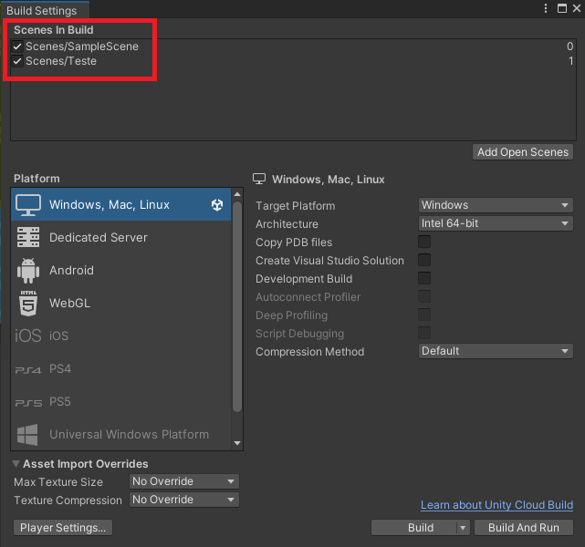

# Equipes

Olá, aluno! Tudo chique? Hoje vamos dar sequência no nosso projeto, desenvolvendo a barra de vida dos Players e Inimigos. Faremos também a mecânica de grupos, onde os jogadores podem se unir para enfrentar os desafios do jogo!

- [x] [Barra de HP do Player](#barra-de-hp-do-player)
- [x] [Barra de HP do Inimigo](#barra-de-hp-do-inimigo)
- [x] [PVP](#pvp)
- [ ] Equipes
  - [ ] [Preparando a HUD](#preparando-a-hud)
  - [ ] [Convidando para a Party](#convidando-ao-grupo)

## Barra de HP do Player
Vamos criar primeiro a barra de HP do Player: na HUD insira um Panel e coloque duas Images (uma será um Background e a outra será a barra de vida) como ilustrado abaixo:


A Image que representa o Background será da cor preta e a barra de vida pode ser da cor desejada, perceba que fizemos ela um pouco menor, dando o efeito de “borda”.

Para que possamos aumentar e diminuir essa barra conforme o HP do Player, primeiro precisamos definir que essa Image será preenchida de acordo com um valor. Precisaremos de um sprite que irá nessa barra de vida, então vamos criar no projeto um quadrado branco clicando com o **botão direito > Create > 2D > Sprites > Square**.

Arraste esse quadrado para a opção **Source Image** e em seguida na opção **Image Type** defina como **Filled**. Essa opção nos permite dizer de que forma a imagem será preenchida, então podemos, logo abaixo na opção Fill Method, selecionar se queremos que ela seja preenchida de forma Horizontal, Vertical, entre outras.


Criaremos um script para essa barra de vida, ele se chamará **StatsHUD**

```cs
public class StatsHUD : MonoBehaviour
{
   public Image playerHPBar;

   public void UpdateHPBar(float value)
   {
       playerHPBar.fillAmount = value;
   }
}
```

O script pede a Image que será nossa barra de vida e terá uma função que altera o preenchimento da barra de acordo com um valor que vai de 0 a 1, sendo 0 vazio e 1 totalmente preenchido. Para que essa função seja chamada, precisaremos antes definir qual será o HP do Player e como ele irá tomar dano do inimigo.

Abra o script Player e adicione:

```cs
  [SyncVar]
  public float hp;
  public float maxHP;

  public FloatEvent OnHPChanged;

  bool isTakingDamage;


  private void OnCollisionStay2D(Collision2D collision)
  {
    EnemyDamage enemy = collision.gameObject.GetComponent<EnemyDamage>();

    if (enemy && weaponCollider.gameObject.activeSelf == false && isTakingDamage == false)
    {
        hp -= enemy.attack;
        OnHPChanged.Invoke(hp / maxHP);

        Vector2 direction = (transform.position - enemy.transform.position).normalized;

        rb.velocity = direction * 10;
        isTakingDamage = true;

        Invoke("StopTakingDamage", 0.3f);
    }
  }

  void StopTakingDamage()
  {
    isTakingDamage = false;
  }
```

> O Script vai ter erro. Para corrigir basta criar uma variável pública chamada attack em EnemyDamage

No início criamos as variáveis de **HP**, **MaxHP** e **isTakingDamage** (ela será usada para quando o Player tomar dano e for empurrado, ele não possa se mexer por um período de tempo).

A função **OnCollisionStay()** funcionará de forma muito parecida com o que fizemos no script EnemyDamage na última aula: ele verifica se quem colidiu conosco foi o inimigo e se a espada está ativa (senão o Player vai atacar o inimigo e também sofrer dano e knockback), remove HP do Player de acordo com o ataque do inimigo e em seguida faz o knockback do Player, empurrando ele para a direção contrária.

É importante também mudarmos o Update do player (comentários):

```cs
void Update()
{
  if (isLocalPlayer)
  {
    inputX = Input.GetAxisRaw("Horizontal");
    inputY = Input.GetAxisRaw("Vertical");
    OnDirectionChanged?.Invoke(inputX, inputY);

    if(isWeaponEquipped)
    {
      inputAttack = Input.GetKeyDown(KeyCode.Space);
      OnAttack?.Invoke(inputAttack);
    }

    // não podemos nos mover enquanto recebemos o dano
    if(isTakingDamage == false)
    {
      rb.velocity = new Vector2(inputX, inputY) * speed;
    }
  }
}
```

Essa mudança é necessária, pois o inimigo só poderá se mover enquanto não estiver tomando dano!

Lembra da função **UpdateHPBar()** do script **StatsHUD**? Vamos colocá-la como Listener do evento **OnHPChanged** do script Player. Altere o **Start()** desse script como mostrado abaixo (comentários):

```cs
void Start()
{
  rb = GetComponent<Rigidbody2D>();

  PolygonCollider2D collider = GameObject.FindGameObjectWithTag("CameraLimit").
      GetComponent<PolygonCollider2D>();

  myCamera.GetComponent<CinemachineConfiner2D>().m_BoundingShape2D = collider;

  if(isLocalPlayer == false)
  {
      myCamera.GetComponent<CinemachineVirtualCamera>().enabled = false;
  }
  // esse else é coisa nova, adapte-o de acordo com o código do aluno pois o IF pode ter sido feito diferente
  else
  {
      OnHPChanged.RemoveAllListeners();
      OnHPChanged.AddListener(GameObject.FindGameObjectWithTag("HUD").
          GetComponent<StatsHUD>().UpdateHPBar);
  }

  GameObject.FindGameObjectWithTag("HUD").
      GetComponent<InventoryHUD>().OnChangeEquipment.AddListener(EquipWeapon);

}
```

Perceba que removemos todos os Listeners do evento usando a função **RemoveAllListeners()**, pois não queremos que nossa barra de vida mostre o HP de outros Players, apenas o Player local!

Antes de testarmos, alguns lembretes: não esqueça de definir na Unity o ataque do Inimigo em seu prefab e qual o valor de HP e MaxHP do Player também em seu prefab. Deve-se também colocar o script StatsHUD na HUD e arrastar a barra de vida para ele.


## Barra de HP do Inimigo

Para a barra de vida do nosso inimigo, faremos um pouco diferente: criaremos um Canvas dentro do prefab do inimigo com algumas configurações importantes: Mudaremos a opção **Render Mode** para **World Space**, isso fará com que o Canvas não se ajuste de acordo com o tamanho da tela, mas sim com um tamanho e posição específicos que podemos definir (nesse caso vamos diminuir o Width e Height do **Rect Transform** e também as suas posições X, Y e Z para 0)


Note que o Canvas vai aparecer (bem menor) onde está o inimigo e você pode arrastá-lo para onde desejar e ajustar seu tamanho manualmente. Insira duas Images, assim como fizemos com o Player, uma para Background e outra para ser a barra de vida (defina a Image como Filled e o Fill Method para Horizontal também).


Abra o script Enemy_Damage e adicione:

```cs
 public Image enemyHPBar;

  private void Update()
  {
    enemyHPBar.fillAmount = hp / maxHP;

    if (hp <= 0)
        Destroy(gameObject);
  }
```

Perceba que pedimos a Image que representa a barra de vida e seu valor é atualizado no Update(). É necessário dividir o HP pelo MaxHP, pois queremos um valor que está entre 0 e 1, fazendo isso pegamos a porcentagem do quanto o inimigo possui de vida.

Faça o teste e veja se está tudo OK! Não se esqueça de arrastar a barra de vida no script do Inimigo lá no prefab.


> Lembre de alterar o **Order in Layer** do Canvas do Enemy para 2

Só há uma coisa para corrigir: quando o inimigo “flipa” a barra de vida também! Podemos arrumar diretamente na função **ChangeAnimation()** do script **EnemyFollow**:

```cs
void ChangeAnimation()
{
  if (transform.position.x > target.position.x)
  {
    anim.Play("Enemy_WalkHorizontal");
    transform.localScale = new Vector3(1, 1, 1);
    GetComponent<Enemy_Damage>().enemyHPBar.fillOrigin = 0;
  }
  else if (transform.position.x < target.position.x)
  {
    anim.Play("Enemy_WalkHorizontal");
    transform.localScale = new Vector3(-1, 1, 1);
    GetComponent<Enemy_Damage>().enemyHPBar.fillOrigin = 1;
  }
}
```

Agora, toda vez que o inimigo “flipa”, nós mudamos a forma com que a barra é preenchida: a opção fillOrigin determina se a barra vai ser preenchida da esquerda para a direita (0) ou da direita para a esquerda (1)

## PVP

Como já fizemos as mecânicas de dano e knockback nos inimigos e players, podemos agora implementar a mecânica de PVP do game, fazendo com que um Player possa atingir o outro.

Vamos adicionar o dano da espada no script do **Player**:

```cs
private void OnCollisionEnter2D(Collision2D collision)
{
  Player player = collision.gameObject.GetComponent<Player>();
  if (player && player != this && collision.collider == player.weaponCollider)
  {
    hp -= player.attack;
    OnHPChanged.Invoke(hp / maxHP);

    Vector2 direction =
        (transform.position - player.transform.position).normalized;
    rb.velocity = direction * 10;

    isTakingDamage = true;
    Invoke("StopTakingDamage", 0.3f);
  }
}
```

Perceba que essa função checa se o objeto que está colidindo conosco é o Player, mas fazemos uma verificação importante: **player != this**. Ela é necessária pois não queremos que o Player tome dano da própria arma, mas sim das armas dos outros players, então verificamos se o objeto é diferente do Player que foi colidido.

### Otimização do dano

Note que as funções **OnCollisionStay2D()**, que usamos para verificar se o Player está colidindo com o inimigo e **OnCollisionEnter2D()**, que estamos usando para o dano da arma, são bem semelhantes. Podemos fazer uma alteração no código para que não haja muito “copia e cola” no código:

```cs
void TakeDamage(float value)
{
    hp -= value;
    if(hp <= 0)
    {
        Destroy(gameObject);
    }
    OnHPChanged.Invoke(hp / maxHP);
    
    isTakingDamage = true;
    Invoke("StopTakingDamage", 0.3f);
}

private void OnCollisionStay2D(Collision2D collision)
{
    Enemy_Damage enemy = collision.gameObject.GetComponent<Enemy_Damage>();

    if (enemy && weaponCollider.gameObject.activeSelf == false 
        && isTakingDamage == false)
    {
        TakeDamage(enemy.attack);
        Vector2 direction =
            (transform.position - enemy.transform.position).normalized;
        rb.velocity = direction * 10;
    }
}

private void OnCollisionEnter2D(Collision2D collision)
{
    Player player = collision.gameObject.GetComponent<Player>();
    if (player && player != this && collision.collider == player.weaponCollider)
    {
        TakeDamage(player.attack);
        Vector2 direction =
            (transform.position - player.transform.position).normalized;
        rb.velocity = direction * 10;

    }
}
```


Criamos uma função TakeDamage() cuidar do HP do Player (inclusive checar se ele morreu agora) e estamos chamando ela nas funções, evitando retrabalho de código.


## Equipes

### Preparando a HUD

Com o PVP concluído, trabalharemos na mecânica de grupos! Há várias formas de fazer isso, mas faremos o seguinte: quando um Player se aproximar de outro, vamos mostrar uma mensagem que diz “Aperte G para convidar ao grupo” e, quando o Player apertar a tecla G, um painel aparecerá no outro client perguntando se ele quer se juntar.

Começaremos do visual: crie um TextMeshPro na HUD e coloque o texto que combinamos acima.



Faremos também um painel que mostra a mensagem para se juntar:


Manteremos o texto e esse painel desabilitados, pois serão habilitados por script. Falando em script, criaremos um para o Player que cuidará do grupo, ele será chamado **PlayerGroup**.

```cs
public class PlayerGroup : NetworkBehaviour
{
  public GroupHUD hud;
  [SyncVar] public PlayerGroup friendPlayer;
  PlayerGroup closePlayer;

  public GroupEvent OnPlayerJoin;


  private void Start()
  {
      hud = GameObject.FindGameObjectWithTag("HUD").GetComponent<GroupHUD>();
  }


  private void OnCollisionEnter2D(Collision2D collision)
  {
      Player player = collision.gameObject.GetComponent<Player>();
      if (player && collision.collider != player.weaponCollider)
      {
          if(friendPlayer == null)
          {
              closePlayer = player.GetComponent<PlayerGroup>();
              hud.message.SetActive(true);
          }
          else
          {
              hud.message.SetActive(false);
          }

      }
  }

  private void OnCollisionExit2D(Collision2D collision)
  {
      Player player = collision.gameObject.GetComponent<Player>();
      if (player && collision.collider != player.weaponCollider)
      {
          hud.message.SetActive(false);
      }
  }
}
```

Você notará que algumas linhas estão apresentando erros, nós vamos corrigi-los! Primeiro criaremos um evento dentro do script CustomEvents:

```cs
[Serializable]
public class GroupEvent : UnityEvent<PlayerGroup> { }
```

E criaremos também o script GroupHUD (esse vai ser colocado na HUD, não no Player) para controlar o visual que cuidará do grupo:

```cs
public class GroupHUD : NetworkBehaviour
{
   public GameObject message;

   public GameObject groupInvitingPanel;

   PlayerGroup myPlayer;
   PlayerGroup friendPlayer;
}
```

Voltando ao script **PlayerGroup** você pode perceber que não há mais erros… mas o que ele faz? Esse script possui alguns objetos que usaremos:


Nós usaremos o objeto **“hud”** para habilitar e desabilitar a mensagem que criamos na HUD pedindo ao Player para apertar G. o objeto **“friendPlayer”** será futuramente o Player que estará no nosso grupo (estamos considerando, nesse caso, que no jogo haverão só 2 Players, mas se houvessem mais, poderíamos substituir esse objeto por uma lista). O objeto **“closePlayer”** armazenará temporariamente o Player que está perto de nós e possivelmente fará o convite.

As funções **OnCollisionEnter2D()** e **OnCollisionExit2D()** vão verificar se há algum Player perto de nós, se sim, será mostrada a mensagem na tela, caso ele se afaste ela será desabilitada.

Antes de testar, não se esqueça de colocar o esse script no Player e o script **GroupHUD** na HUD. Arraste para ele a caixa de mensagem criada e o painel que mostra o convite.


### Convidando ao Grupo

