# Introdução à Realidade Aumentada

## **Lesson 01 | Entendendo a Realidade Estendida**

Olá, aluno! Tudo bem? Neste curso vamos nos aprofundar no incrível mundo da Realidade Estendida, onde vamos desenvolver games que usam diversas tecnologias que trazem imersão e novas formas de jogar.

Para entendermos melhor, a Realidade Estendida (XR) é o termo usado para se referir a todas essas tecnologias imersivas, como a Realidade Aumentada (AR), a Realidade Virtual (VR) e a Realidade Mista (MR). Abaixo vamos ver alguns exemplos de cada uma:

- Aplicativos de Realidade Aumentada (AR) permitem inserir objetos virtuais no mundo real, como é o caso do popular Pokémon GO, em que podemos ver os monstrinhos no mundo real para captura ou Wizards Unite, que permite uma interação com os elementos da série Harry Potter.

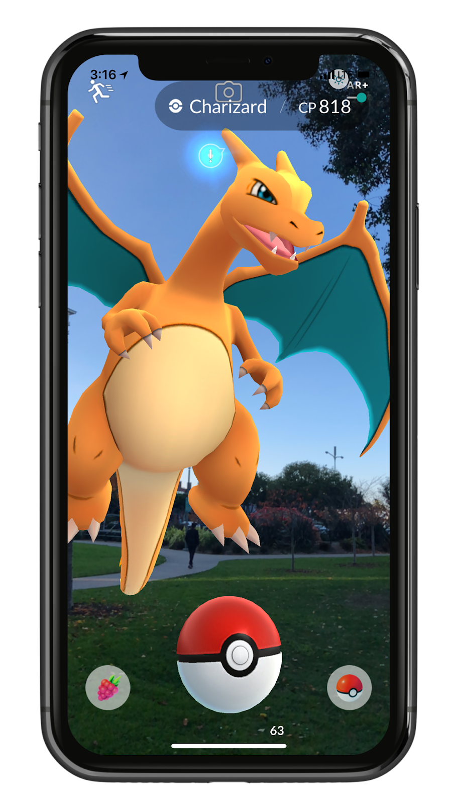 

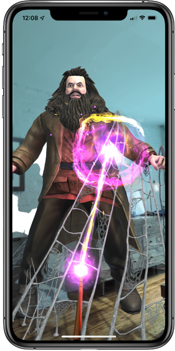

- Já a Realidade Virtual (VR) nos permite entrar em um ambiente simulado usando um óculos de realidade virtual, onde podemos interagir e navegar por ele. Diversos games são feitos para essas plataformas, como Skyrim VR, Among Us VR entre muitos outros

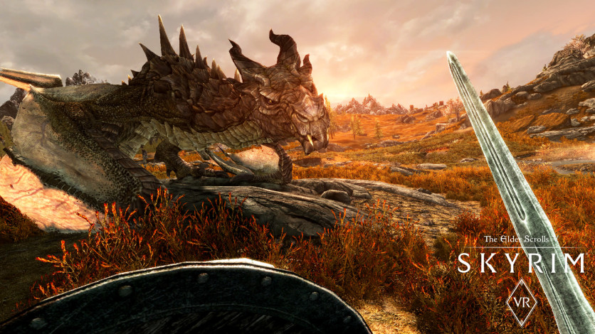

- A Realidade Mista (MR) é uma mistura entre a Realidade Aumentada e a Virtual, onde objetos reais e virtuais se misturam e são apresentados juntos em uma única tela. Um exemplo de MR é o excelente Mario Kart Live Home Circuit, onde podemos montar uma pista usando objetos da casa e ver através do Nintendo Switch a câmera do carrinho.

## **Lesson 02 | Configurando a Unity**

Para que possamos desenvolver nosso primeiro projeto em AR, precisaremos que a Unity esteja devidamente configurada, pois a partir daqui, nossos projetos serão feitos para Smartphones. O primeiro passo é verificar se a Unity possui o módulo para Android instalado, então vamos abrir o Unity Hub e clicar em Installs. Note que essa tela mostrará todas as versões da Unity que estão na máquina e, ao lado dela(s) estará um símbolo de engrenagem, clicando nele poderemos ver a opção Add Modules.

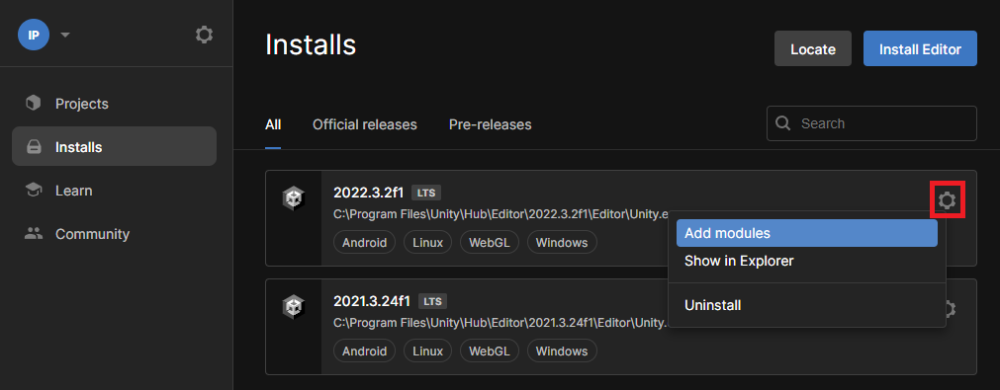

> > **Observação**: para este curso, usaremos a **Unity 2022.3**

Nessa opção deveremos selecionar Android Build Support como mostrado abaixo e clicar em Continue para que as alterações sejam baixadas e tenham efeito.

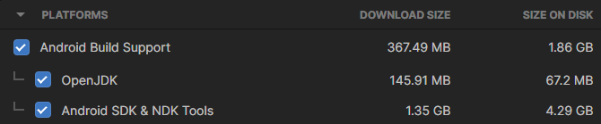

Ótimo! Agora podemos criar nosso projeto! Vamos voltar à opção Project e selecionar New Project. Aqui nós podemos usar um template da Unity para nosso game em AR, basta selecionar AR Core, baixá-lo clicando em Download Template e em seguida definir um nome e pasta em que ele será salvo.

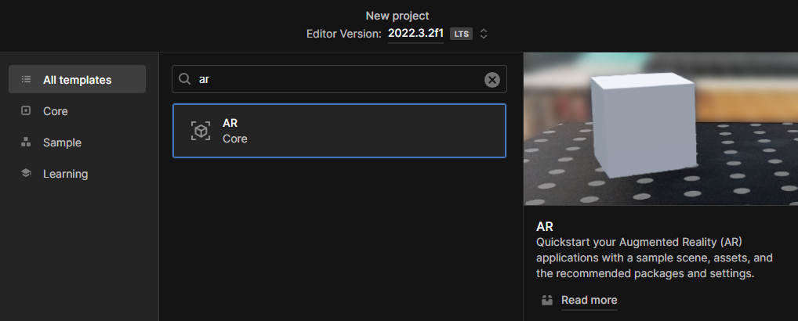

## **Lesson 03 | Configurando o Projeto**

Para que possamos fazer a build do projeto e que ele funcione corretamente nos dispositivos móveis, vamos fazer todas as configurações necessárias. Primeiro vamos em **File > Build Settings** e selecionar **Android**, em seguida **Switch Platform**.

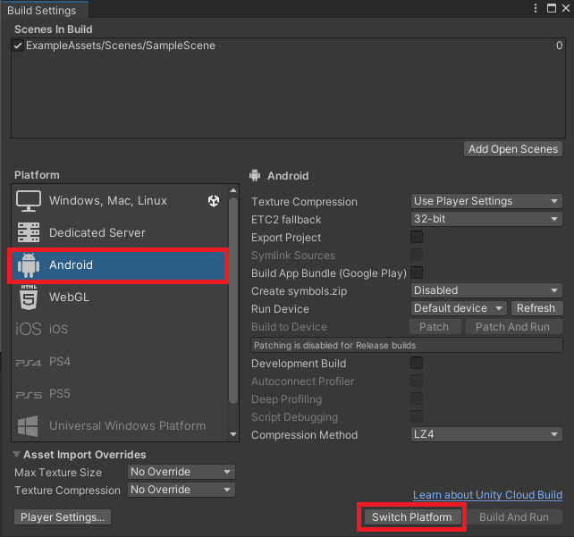

Agora precisamos definir qual tecnologia de AR que o projeto usará, para isso vamos em **Edit > Project Settings > XR Plug-in Management** e selecionar **Google ARCore**.

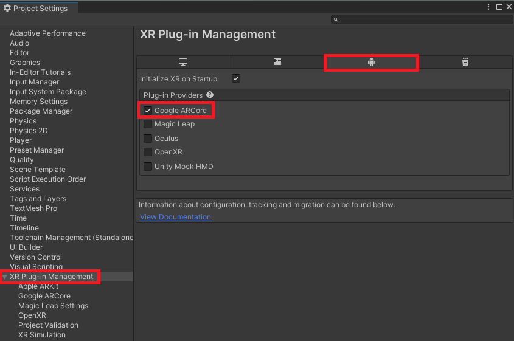

Podemos fazer outras configurações importantes também, como para qual versão do Android que a build será feita, se permitiremos rotação da tela, entre outras. Todas eles ficam em **Edit > Project Settings > Player**. Para impedir a auto rotação, podemos ir na opção **Resolution and Presentation** e na opção **Default Orientation** podemos selecionar se queremos a tela em pé (*Portrait*) ou deitada (*Landscape*).

Caso queira selecionar uma versão específica do Android ou superior, podemos ir em **Other Settings** e na opção **Minimum API Level** selecionar qual será essa versão (para os testes vistos neste projeto, manterei a versão 7 ou superior).

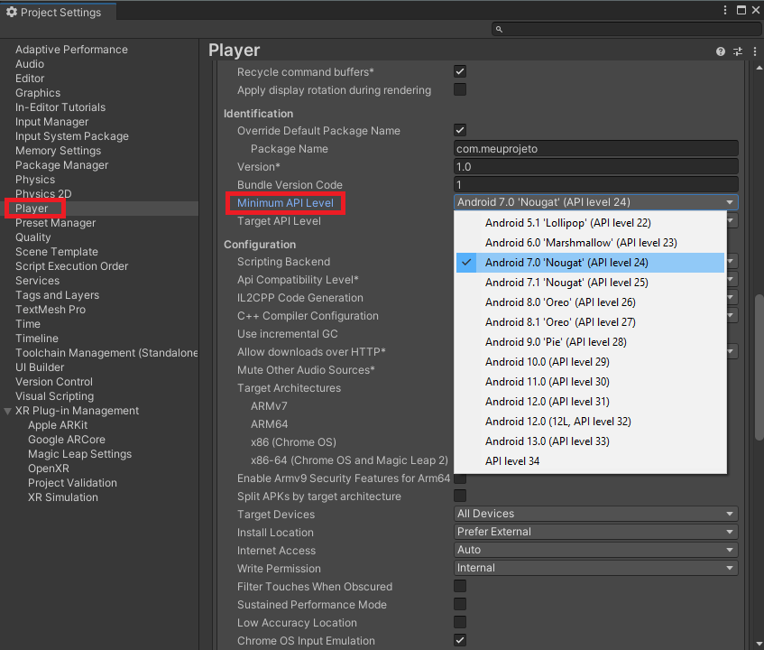

## **Lesson 04 | Objetos e Componentes do Projeto**

Agora que fizemos os ajustes principais, podemos entender quais são os objetos e componentes que estão na cena:

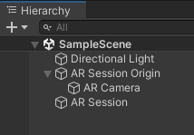

- Directional Light é basicamente a luz geral do projeto, ou seja, o “Sol” e como ele está configurado.
- AR Session Origin é o objeto que permite o controle da cena em AR. Nele estão os principais componentes para detectar os objetos vistos pela câmera, como o AR Plane Manager, responsável por detectar áreas planas e até mesmo componentes que usam Raycast para calcular a distância entre a câmera e os objetos da cena, como o AR Raycast Manager.

  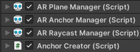

- AR Session é o objeto responsável por iniciar o modo AR do dispositivo. Nele existem os componentes AR Session (responsável por criar a sessão AR e configurar como será feita a renderização) e o AR Input Manager (responsável por coletar os inputs do usuário, como os toques na tela) 
  
  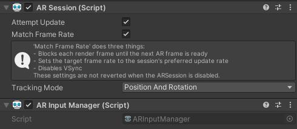

- Por fim, o objeto AR Camera é a câmera do nosso game e nela há alguns componentes interessantes: Tracked Pose Driver é responsável por detectar o movimento do dispositivo para ajustar a posição e rotação da câmera, AR Camera Manager cuida de como ela se comporta no AR e de que forma as luzes serão renderizadas. Já o AR Camera Background cuida do fundo que será mostrado na câmera. 
  
  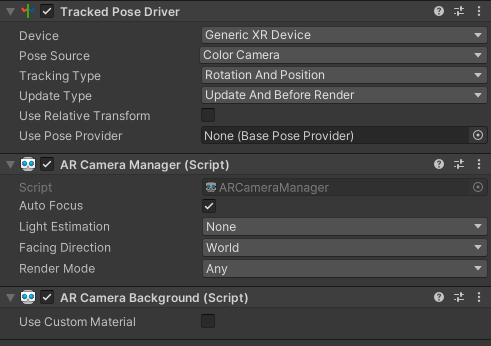

Agora que entendemos tudo o que está neste template, vamos desenvolver na próxima unit os nossos primeiros scripts para criar objetos virtuais no mundo real. Até a próxima!