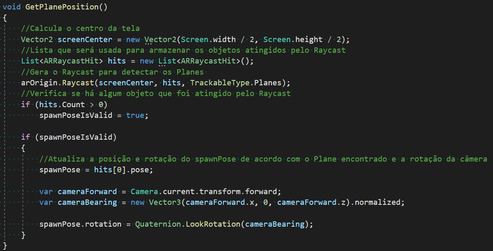
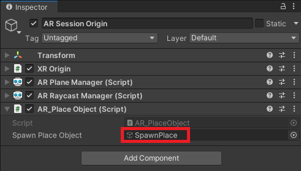
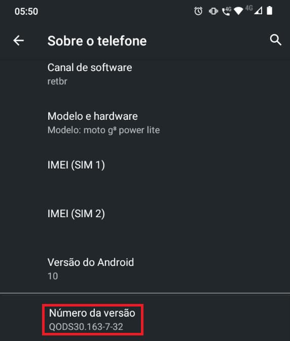
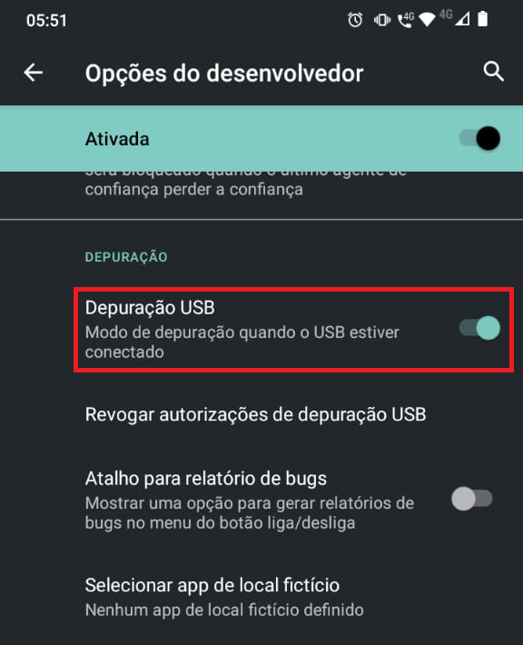
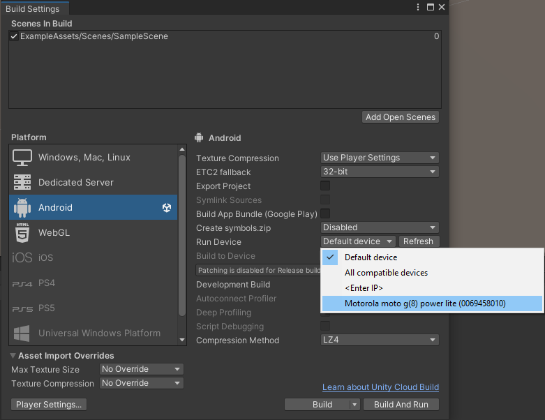
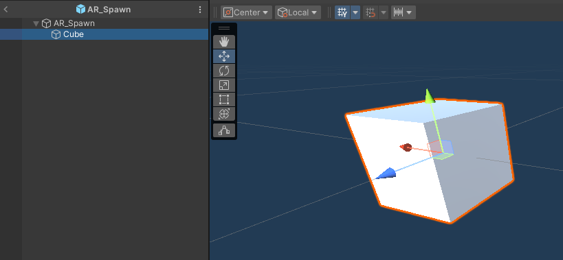
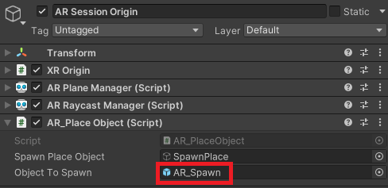

# Spawnando Objetos

Este projeto é continuaão do projeto da aula anterior apesar de no portal aparentar ser diferente.

## **Lesson 01 | Preparando os objetos**

Olá, aluno! Preparado para a aula de hoje? Vamos iniciar o primeiro game deste curso e desenvolver a mecânica de spawn de um objeto em AR assim que tocarmos na tela do dispositivo.

O primeiro passo será configurarmos o objeto **AR Session Origin**, pois nem todos os componentes que estão lá nós usaremos agora, inclusive ele deve estar assim no momento:


Vimos na aula anterior que todos esses componentes são usados para administrar nossa cena em AR e como vamos interagir com ela, porém há um aviso no componente **AR Session Origin**: ele está marcado como **Deprecated**! Isso significa que nesta versão do pacote esse componente não é mais atualizado (porém funciona normalmente até o momento) e ele pode ser substituído pelo componente **XROrigin** que é mais atual e recomendado pela ferramenta. É importante destacar que isso é absolutamente comum entre as linguagens e ferramentas de programação que usamos no dia a dia, pois elas atualizam constantemente e determinados códigos ou componentes são substituídos por outros com melhorias.

Vamos seguir o conselho da Unity e substituir o AR Session Origin pelo XROrigin e, para isso, precisaremos remover todos os outros componentes desse objeto, ficando assim:


Não se esqueça de arrastar a câmera do projeto para o objeto Camera do Script como mostra a imagem acima! Agora sim podemos colocar os demais componentes: para o início do projeto usaremos os componentes **AR Plane Manager** (para detectar superfícies planas na cena) e o **AR Raycast Manager** (para que o aplicativo possa calcular a distância entre a câmera e o plano, além de identificar para onde estamos “mirando”).


A ideia é que, ao mirar com a câmera em algum lugar, o aplicativo detecte tudo o que for plano e indique que ali algum objeto possa ser spawnado! Vamos então criar uma “mira”, que aparecerá quando esse plano for encontrado: Na cena crie um objeto vazio chamado **SpawnPlace** e dentro dele um Quad com tamanho 0.1 no X, Y e Z (essa configuração é importante pois na nossa cena em AR a escala é medida em metros) e 90 de rotação em X para que esse Quad apareça deitado e não em pé:


Podemos pegar uma imagem que represente esse alvo, como essa por exemplo:


E para colocá-la nesse Quad, vamos arrastar a imagem para a Unity e em **Texture Type** mudaremos para **Sprite (2D and UI)**


Em seguida criaremos um material e vamos arrastar essa imagem para a opção **Albedo**, em seguida definiremos a opção **Rendering Mode** para **Cutout**, como mostra a imagem abaixo:


Por fim basta arrastar o material para o Quad e o resultado será esse:


## **Lesson 02 | Lógica para Detectar os Planos**
Agora que temos um alvo, podemos atualizar sua posição e definir qual objeto será spawnado através de um script! Vamos criar um chamado **AR_PlaceObject** que terá o seguinte código:

```cs
using System.Collections.Generic;
using UnityEngine;
using UnityEngine.XR.ARFoundation;
using UnityEngine.XR.ARSubsystems;

public class AR_PlaceObject : MonoBehaviour
{
  public GameObject spawnPlaceObject;
  ARRaycastManager arOrigin;
  Pose spawnPose;
  bool spawnPoseIsValid = false;

  void Start()
  {
    arOrigin = FindObjectOfType<ARRaycastManager>();
  }

  void Update()
  {
    GetPlanePosition();
    UpdateSpawnPlacePosition();
  }

  void GetPlanePosition()
  {
    Vector2 screenCenter = new Vector2(Screen.width / 2, Screen.height / 2);
    List<ARRaycastHit> hits = new List<ARRaycastHit>();

    arOrigin.Raycast(screenCenter, hits, TrackableType.Planes);

    if (hits.Count > 0)
      spawnPoseIsValid = true;

    if (spawnPoseIsValid)
    {
      spawnPose = hits[0].pose;

      var cameraForward = Camera.current.transform.forward;
      var cameraBearing = new Vector3(cameraForward.x, 0, cameraForward.z).normalized;

      spawnPose.rotation = Quaternion.LookRotation(cameraBearing);
    }
  }

  void UpdateSpawnPlacePosition()
  {
    if (spawnPoseIsValid)
    {
      spawnPlaceObject.SetActive(true);
      spawnPlaceObject.transform.SetPositionAndRotation(
        spawnPose.position, spawnPose.rotation
        );
    }
    else
    {
      spawnPlaceObject.SetActive(false);
    }
  }
}
```

Vamos entender o que está acontecendo? O script possui duas funções principais: **GetPlanePosition()** e **UpdateSpawnPlacePosition()**

**GetPlanePosition()** é usada para gerar um Raycast partindo do meio da tela para detectar se há alguma superfície plana. Em seguida, se algum plano foi encontrado, é atualizada a posição e rotação do objeto spawnPose que será usado depois como referência para nossa mira (SpawnPlace).



Já a função **UpdateSpawnPlacePosition()** verifica se estamos olhando para uma posição válida (plane) e ativamos a mira com sua posição e rotação atualizadas.


Não podemos nos esquecer de colocar esse script no objeto **Ar Session Origin** e arrastar o SpawnPlace para ele. **Este objeto ficará desabilitado**, pois a mira aparecerá somente quando o plane for detectado:



## **Lesson 03 | Fazendo a Build**

Para fazer a build precisaremos primeiro configurar nosso smartphone para que ele permita a conexão USB e o envio do aplicativo diretamente. No seu smartphone, acesse **Configurar > Sobre o telefone** e toque 7 vezes na opção **Número da versão**



> 
> > Obs.: Caso tenha um modelo de dispositivo com opções diferentes, aqui está uma referência oficial do Android para ativar o modo de desenvolvedor em vários dispositivos: **Configure on-device developer options | Android Studio**
>

Em seguida vamos na opção **Configurar > Sistema > Opções do Desenvolvedor** e vamos habilitar a opção **Depuração USB**.



Agora podemos conectar o smartphone no computador e, se tudo estiver OK, na tela de build da Unity ele aparecerá em Run Device (no seu smartphone ele mostrará um aviso perguntando se você permite a conexão USB neste dispositivo, basta aceitar).



Agora basta clicar em Build and Run e fazer o teste!

>
> Esta parte do **Build and Run** ainda não foi testado pois no momento de preparação desta aula (19/10/2023) meu aparelho não era compatível
>
> Tente com um aparelho mais recente
>

## **Lesson 04 | Spawnando Objetos**

Podemos agora melhorar nosso script para spawnar algum objeto. Vamos primeiro criar um prefab vazio e dentro dele um mesh de sua preferência (por enquanto farei com um cubo). Assim como o SpawnPlace, a escala do objeto pai deve ser reduzida senão o objeto será spawnado muito grande, então colocaremos 0.1 no X, Y e Z.



No script vamos adicionar algumas mudanças para que o objeto seja spawnado: criaremos um objeto chamado **objectToSpawn**, uma função **SpawnObject()** para instanciar o objeto. Já no Update() vamos verificar se o usuário tocou na tela enquanto estamos olhando para o plane e spawnar o objeto.

```js
using System.Collections.Generic;
using UnityEngine;
using UnityEngine.XR.ARFoundation;
using UnityEngine.XR.ARSubsystems;

public class AR_PlaceObject : MonoBehaviour
{
  public GameObject spawnPlaceObject;
  public GameObject objectToSpawn; // variável nova

  ARRaycastManager arOrigin;
  Pose spawnPose;
  bool spawnPoseIsValid = false;


  void Start()
  {
    arOrigin = FindObjectOfType<ARRaycastManager>();
  }

  void Update()
  {
    GetPlanePosition();
    UpdateSpawnPlacePosition();

    // IF novo
    if (spawnPoseIsValid && Input.touchCount > 0 && 
        Input.GetTouch(0).phase == TouchPhase.Began)
    {
      SpawnObject();
    }
  }

  void GetPlanePosition()
  {
    Vector2 screenCenter = new Vector2(Screen.width / 2, Screen.height / 2);
    List<ARRaycastHit> hits = new List<ARRaycastHit>();
    arOrigin.Raycast(screenCenter, hits, TrackableType.Planes);

    if (hits.Count > 0) spawnPoseIsValid = true;

    if (spawnPoseIsValid)
    {
      spawnPose = hits[0].pose;

      var cameraForward = Camera.current.transform.forward;
      var cameraBearing =
      new Vector3(cameraForward.x, 0, cameraForward.z).normalized;

      spawnPose.rotation = Quaternion.LookRotation(cameraBearing);
    }
  }

  void UpdateSpawnPlacePosition()
  {
    if (spawnPoseIsValid)
    {
      spawnPlaceObject.SetActive(true);
      spawnPlaceObject.transform.SetPositionAndRotation
      (spawnPose.position, spawnPose.rotation);
    }
    else
    {
      spawnPlaceObject.SetActive(false);
    }
  }

  void SpawnObject() // método novo
  {
    Instantiate(objectToSpawn, spawnPose.position, spawnPose.rotation);
  }
}
```

Para finalizar, na Unity vamos arrastar o prefab para o script:

