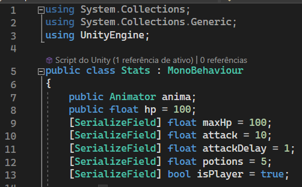

# **RA - HUD**

Na aula anterior apenas vimos como é o início de um projeto em IA e fizemos algo simples que é a criação de um modelo 3D sempre que clicamos na tela. Nesta aula fomos mais longe: vamos baixar um modelo 3D no Mixamo juntamente com as animações, e faremos uma HUD com dois botões um para fazer nosso personagem atacar e outro para curar o nosso personagem.

Recomendação sobre a lista abaixo: comece com os tópicos fechados e apenas em caso de dúvida abra-os, ou terá muito conteúdo aparecendo na tela para consulta

- Baixe o modelo no Mixamo e suas animações
  - T-Pose
  - FIGHTING IDLE ou IDLE
  - ROUNDHOUSE KICK ou KICK
  - DEATH
- Configure a T-Pose
  - Extraia os Materiais e as Texturas para corrigir as cores do personagem
  - Crie um novo esqueleto a partir desse modelo
- Configure as animações
  - Faça com que use o esqueleto criado na T-Pose
  - IDLE
    - Ative o Loop Time
    - Ative Root Transform Rotation
      - Based Upon: Original
    - Ative Root Transform Position (y)
      - Based Upon: Original
    - Ative Root Transform Position (x,z)
      - Based Upon: Center of Mass
  - KICK
    - Ative Root Transform Rotation
      - Based Upon: Original
    - Ative Root Transform Position (y)
      - Based Upon: Original
    - Ative Root Transform Position (x,z)
      - Based Upon: Center of Mass
  - DEATH
    - Ative Root Transform Rotation
      - Based Upon: Original
    - Ative Root Transform Position (y)
      - Based Upon: Original
    - Ative Root Transform Position (x,z)
      - Based Upon: Center of Mass
- Crie um Animation Controller para as animações
  - Crie o parâmetro boolean Attacking
  - Crie as transições entre animações
    - 
  - Configure as transições envolvendo o IDLE e o KICK (veja as a imagens abaixo com calma)
    -  
- Vá até o prefab que é spawnado quando clicamos na tela do celular, remova o cubo e coloque no lugar a T-Pose que baixamos no início.
  - Adicione ao Animator o Animator Controller que foi criado nos passos anteriores
- Crie a HUD
  - Cena
    - 
  - Hierarchy
    - 
  - Inspector do Canvas
    - 
- Crie um script de nome HUD e adicione-o ao Canvas
  - o código está abaixo
    - 
  - Preencha os campos do Script
    - 
  - Desative o CombatPanel
- Para a troca de animações teremos outro script que irá interagir com o Canvas e será colocado no nosso Prefab (AR_Object)
- Crie o script de nome **Stats** (só tem o A de vogal mesmo, pq eu quis assim)
  - Crie os atributos
    - 
  - Programe o método Start
    - Devem aparecer erros nos AddListeners, mas é assim mesmo
    - 
  - Crie o método UsePotion
    - 
  - Crie o método Attack e Reset Attack
    - 
- Com os campos do script Stats preenchidos basta realizar a build e testar no telefone
- Vale lembrar que o Animator vai vir do objeto filho do nosso Prefab (AR_Object)