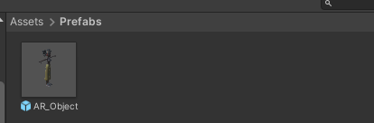
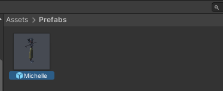
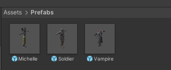
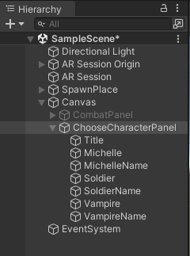
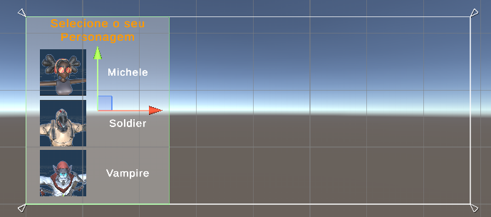
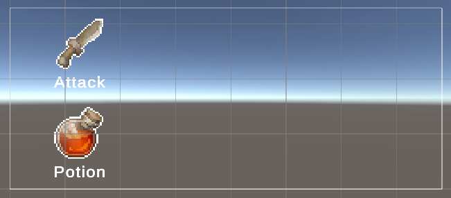
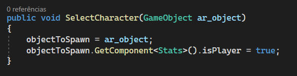
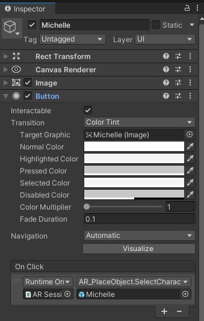

# Seleção de Personagens

Tento um personagem que ataca se recupera a ideia agora é podermos escolher entre personagens para usar no nosso jogo e com mais alguma ajuda do Mixamo desenvolvemos os novos personagens e o sistema de seleção.

- Baixe 2 novos modelos no Mixamo com T-Pose, IDLE, ATTACK e DEATH
  - Já foram deixados modelos preparados para não ser necessário baixar durante a aula
- Configure os novos modelos da mesma forma com foi feito com o modelo da aula anterior
- Crie o Animation Controller
- Ele deve ser feito igual ao da aula anterior, repetindo até mesmo o nome dos parâmetros
  - Isso deve ser feito dessa forma pois usaremos sempre o mesmo script para aterar os parâmetros do Animator do personagem
- Renomeie o Prefab AR_Object para o nome que você deseja para o primeiro personagem e então duplique-o para fazer os outros dois personagens
  - Antes
    - 
  - Depois
    - 
  - No final
    - 
- Lembre de adicionar os Animator Controller dos novos personagens
- Lembre-se de configurar o script **Stats** para cada um deles e alterar a escala
- Construa no Canvas a HUD de seleção de personagens usando a imagem de cada personagem nos botões
  - Para conseguir a imagem basta tirar um print do rosto do personagem
    - Herarchy
      - 
    - Cena
      - 
  - Lembre-se de configurar o Image Type para Sprite (2D and UI)
- **Opcional**: configure o CombatPanel para que ele tenha Icones nos botões
  - Exemplo:
    - 
- Deixe o CombatPanel e o AR_PlaceObject desabilitados
- Deixe o ChooseCharacterPanel habilitado
- Vá nos prefabs dos personagens e altere a propriedade isPlayer para **false**, pois apenas o que nós selecionarmos deve ter este valor como **true**
- No script AR_PlaceObject devemos criar uma nova função chamada SelectCharacter
  - 
- Outra mudança que ocorre na programação é que a variável **isPlayer** do script Stats deve ser **public** e que o variável **objectToSpawn** deve ser **private**
- Adicione o componente Button nas fotos dos personagens do painel de seleção
  - No evento OnClick devemos fazer uma chamada para o método SelectCharacter e passar como parâmetro o personagem
  - Habilitar o AR_PlaceObjects
  - Desabilitar o ChooseCharacterPanel
    - 
- Repita o processo anterior para todos os personagens