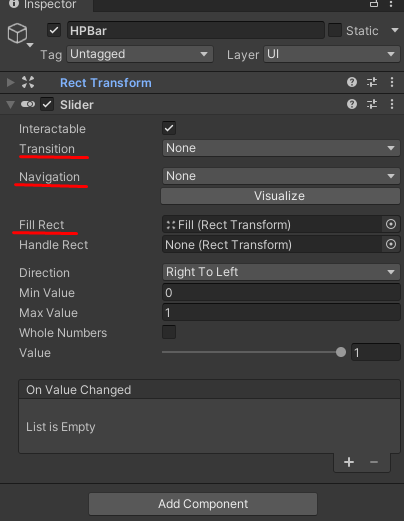
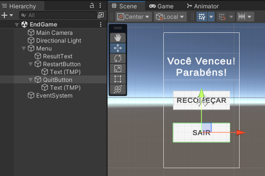

# Sistema de Batalha

Hoje chegamos na etapa final do nosso projeto em AR desenvolvendo o sistema de batalhas, onde definimos como será aplicado o dano de cada lutador, a barra de vida, a derrota e a vitória.

- Comece criando a barra de vida dos personagens
  - Adicione um Canvas - chame-o de **Character HUD**
    - Render Mode: World Space
    - Posicione o Canvas acima da cabeça do personagem
    - Adicione um Objeto Vazio (chame-o de HPBar) e configure o Anchor Preset
      - 
    - Insira 2 Images como filhos do HPBar
      - Elas devem ocupar a mesma posição, mas possuir tamanhos diferentes
        - 
      - O Anchor Mode de ambas também deve ser **Stretch**
    - Adicione o componente Slider ao HPBar
      - Configure o HPBar
        - 
  - Programe o Stats para que ele possa alterar o preenchimento do HPBar
    - 
  - Retorne para a Unity e configure o Stats do personagem
    - 
  - Recomendação: faça do Character HUD um prefab para não ter que recriar do zero para os outros personagens
- Repita o processo anterior para os outros personagens
- Adicione a tag **MainCamera** na **AR Camera**
- Pograme no Stats o sistema de dano
  - Crie a vairiável **public bool isAlive = true;**
  - Altere o UsePotion() para funcionar apenas se o personagem estiver vivo
    - 
  - Crie o método TakeDamage() para os personagens sofrerem dano
    - 
  - Altere o método Attack() para realizar o attack apenas apenas se opersonagem estiver vivo
  - Altere o método Attack() para realizar uma chamada ao TakeDamage() do opponent
    - 
- Faça o inimigo atacar
  - Altere o método Update() para realizar chamadas ao método attack caso o personagem não seja o jogador e esteja vivo
    - 
- Para a morte funcionar corretamente altere no Animator Controller o nome do estado de morte para **Death**
- **TESTE**
- No CombatPanel adicione ao botão Potion um texto com a quantidade de poções restantes
  - 
- Vá até o script HUD e adicione uma variável para um objeto do tipo texto e um método para atualizar o contador de poções
  - Quando a quantidade for atualizada o texto deve ser atualizado junto
  - Caso a quantidade atual de poções seja menor ou igual a zero a interação com o botão deve ser desabilitada
  - Caso a quantidade atual de poções seja menor ou igual a zero pegue o component Image presente no botão e altere sua cor para preto
    - 
- Preencha os campos da HUD
- No script Stats crie um evento com retorno Float chamado **OnUsePotion**
  - Caso esse script esteja sendo executado pelo player devemos fazer com que o UpdatePotionsAmount seja um Listener do evento OnUsePotion
  - Neste caso e sempre que atualizarmos a quantidade de poções vamos invokar este evento
    - 
- Crie um nova cena com um menu para o final do jogo
  - Dê a ela a seguinte aparência
    - 
- Crie um script de nome GameStatics para conter algumas variáveis estáticas
  - crie a vairiável **public static bool youWin;**
    - useramos esta variável para informar se nós vencemos ou perdemos
- Atualize o script Stats 
  - crie um método chamado EndGame que irá levar o jogo para a cena de EndGame
    - 
  - Altere o TakeDamage() para determinar o vencedor do duelo e levar para a tela de EndGame
    - 
- Crie o script EndGameMenu
  - Programe as funcionalidades dos botões
  - Utilize o método Start para alterar o texto na tela
    - 
- Aplique o script EndGameMenu no objeto menu
  - Configure-o
- Configure os botões para chamarem as respectivas funções do EndGameMenu
