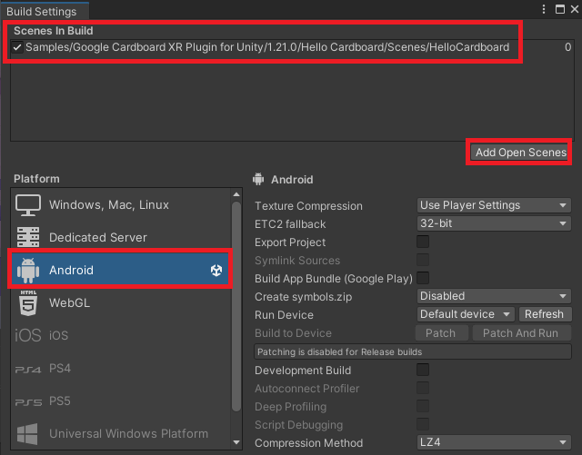

# Preparação do Projeto VR

> 
> Lista de aparehos com suporte ao Google Cardboard, verifique a compatibilidade
> 
> [https://mrcardboard.eu/list-of-google-cardboard-compatible-phones-that-work-with-virtual-reality-glasses/](https://mrcardboard.eu/list-of-google-cardboard-compatible-phones-that-work-with-virtual-reality-glasses/)
>

- Comece criando um projeto VR na Unity
- Enquanto o projeto é criado comente sobre a história da VR e ao final fale sobre o Cardboard
  - A ideia de um ambiente simulado surgiu em 1930 com o Link Trainer, um dispositivo para treinar pilotos de voos comerciais
  - Com o crescimento da computação é que ela se popularizou e atingiu novas áreas como games, medicina, arquitetura, simuladores e etc.
  - Para este projeto estaremos usando o Google Cardboard.
    - Ele é uma iniciativa do Google para entrar no mercado de VR com óculos de baixo custo (feitos de papelão)
    - O conceito é simples: 
      - essa tecnologia permite transformar o Smartphone em uma câmera VR e ele pode ser encaixado nesse dispositivo para que possamos usar como óculos
      - Diferente dos demais que existem no mercado, o Google Cardboard não é acompanhado dos controles, a interação com os objetos virtuais é através do olhar
- Instale o Git (caso não tenham nos computadores)
- Reinicie a Unity
- Acesse o Package Manager e faça download através dessa Git URL: **https://github.com/googlevr/cardboard-xr-plugin.git**
- Após a instalação do pacote, podemos baixar exemplo que o acompanha, basta irmos em Samples e clicar no botão Import do exemplo Hello Cardboard.
  - Abra o Hello Cardboard
  - Em **File > Build Settings** vamos apagar a cena *SampleScene* que estava lá e adicionar essa nova cena clicando em Add Open Scenes, em seguida vamos selecionar o Android e clicar em *Switch Platform*.
    - 
  - Em **Edit > Project Settings > XR Plug-in Management** vamos selecionar a opção **Cardboard XR Plugin** (Necessário para que a build já inicie com as configurações que estamos fazendo).
    - 
  - Agora vamos em **Edit > Project Settings > Player> Resolution and Presentation** e na opção *Default Orientation* vamos selecionar Landscape, dessa forma o app sempre abrirá com a tela deitada, melhorando a experiência.
    - 
  - Ainda na opção **Player**, mas dessa vez em **Other Settings**, vamos selecionar na opção **Minimum API Level** o *Android 7.0 Nougat (API Level 24)* e na opção **Internet Acess** vamos selecionar *Require*
    - 
  - Por fim, vamos agora em **Publishing Settings** e selecionar *Custom Main Gradle Template* e *Custom Gradle Properties Template*.
    - 
  - Note que em Assets > Plugin > Android foram criados 2 arquivos novos:
    - 
  - Precisaremos editar esses arquivos para que a build possa usar os serviços da Google, começaremos com o primeiro (**gradleTemplate**) e vamos adicionar o código abaixo:
    - 
  - E no arquivo mainTemplate vamos adicionar essas linhas na parte de dependencies:
    - 
- Com isto podemos testar a cena
  - Como o cardboard não roda em todos os projetos teste através da Unity, rotacionando a câmera através do transform