# Olhar e Interações

Na nossa última aula criamos o projeto, importamos o pacote do Google Cardboard e fizemos as suas configurações. Hoje vamos iniciar a criação do nosso game! A ideia é desenvolver um projeto com algumas mecânicas do game Beat Saber, onde inimigos vão se aproximando do Player e você deve destruí-los (com projéteis ao invés de espadas).

## Teleporte

- Salve o Player como um Prefab para reutilizar na nova cena
- Crie uma nova cena
  - Crie a partir da VR Basic e então rmeova os objetos que não precisar
  - Ela deve contar Directional Light, Plane, Player e um objeto chamado Ar Manager
    - O Ar Manager deve conter o componente **Cardboard Startup**
      - 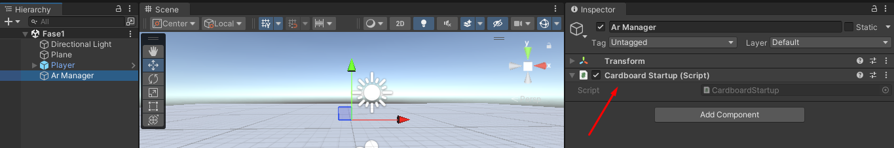

A principal mecânica dos games criados para o Google Cardboard e outros que não possuem controles é a de olhar para um objeto para interagir com ele, assim como na cena HelloCardboard em que, ao encarar um objeto, ele pode trocar de cor.

Mas como isso é feito no script? Na verdade é muito fácil e são necessárias apenas 2 funções:

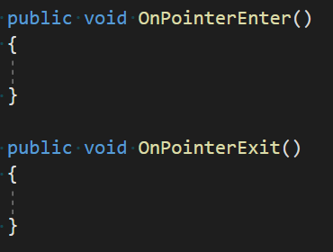

A função **OnPointerEnter()** é executada toda vez que um objeto é olhado diretamente na câmera e o **OnPointerExit()** é quando desviamos o olhar, basta o objeto possuir um collider. Muito simples! Com isso podemos montar diversas mecânicas, como a próxima que faremos agora: teleportes para o Player mudar de posição!

Vamos replicar aqui a mesma mecânica do objeto que muda de cor na cena HelloCardboard e, após encarar esse objeto por um tempo, mudaremos de posição. Coloque na cena alguns cubos que serão os pontos de teleporte e vamos criar um script para eles:

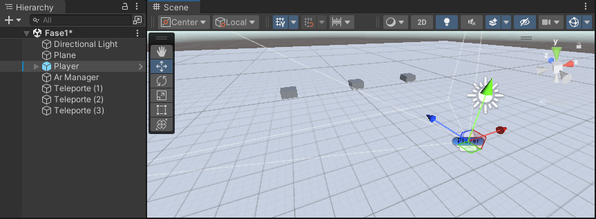

```cs
using UnityEngine;

public class Teleport : MonoBehaviour
{
  GameObject player;
  bool isLooking;
  float timer = 0;

  private void Start()
  {
    player = GameObject.FindGameObjectWithTag("Player");
  }

  private void Update()
  {
    if (isLooking)
    {
      timer += Time.deltaTime;
      if(timer >= 3)
      {
        Vector3 new_position = new Vector3(transform.position.x,
            player.transform.position.y, transform.position.z);

        player.transform.position = new_position;
        timer = 0;
      }
    }
  }

  public void OnPointerEnter()
  {
    isLooking = true;
  }

  public void OnPointerExit()
  {
    isLooking = false;
    timer = 0;
  }
}
```

A lógica acima faz apenas o teleporte do Player por enquanto e ela funciona da seguinte forma: caso o Player esteja olhando para o objeto, a variável isLooking será verdadeira e no Update() nós temos um timer que aumentará de 1 em 1 segundo enquanto esse objeto está sendo olhado. Ao passar de 3 segundos o Player então irá para aquela posição e esse timer é resetado.

**Basta colocar o script nos objetos, colocar a tag Player no Player e fazer o teste!** Ele pode ser feito direto na Unity mesmo, no modo Play você pode rotacionar a câmera manualmente até ela apontar para o teleporte, mas caso queira testar no smartphone é importante lembrar que será necessário colocar essa nova cena no Build Settings, senão a cena aberta será o HelloCardboard.

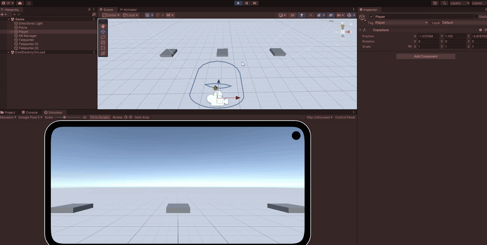

Nosso teleporte está funcionando corretamente e agora podemos fazer a mecânica da troca de cores. Vamos fazer algumas alterações no script Teleport.

```cs
public class Teleport : MonoBehaviour
{
  GameObject player;
  bool isLooking;
  float timer = 0;

  [SerializeField] Color lookingColor; // new
  [SerializeField] Color defaultColor; // new

  MeshRenderer renderer; // new

  private void Start()
  {
    player = GameObject.FindGameObjectWithTag("Player");
    renderer = GetComponent<MeshRenderer>(); // new
    renderer.material.color = defaultColor; // new
  }

  private void Update()
  {
    if (isLooking)
    {
      timer += Time.deltaTime;
      renderer.material.color = Color.Lerp(renderer.material.color, lookingColor, Time.deltaTime); // new

      if(timer >= 3)
      {
        Vector3 new_position = new Vector3(transform.position.x,
            player.transform.position.y, transform.position.z);

        player.transform.position = new_position;
        timer = 0;
      }
    }
  }

  public void OnPointerEnter()
  {
    isLooking = true;
  }

  public void OnPointerExit()
  {
    isLooking = false;
    timer = 0;
    renderer.material.color = defaultColor; // new
  }
}
```

Note que no topo do script são criados dois objetos Color, um deles representa a cor padrão do objeto (defaultColor) e o outro a cor que o objeto terá quando for olhado (lookingColor). No Update() a troca dessas cores é feita usando a função Color.Lerp(), nos permitindo fazer essa mudança de forma suave, onde o último parâmetro determina quanto tempo levará para essa troca acontecer. Na função OnPointerExit() o material volta para a cor padrão caso o Player não esteja mais olhando para ele.

## **Lesson 03 | Preenchendo Valores**

Algo semelhante pode ser feito se quisermos interagir com uma UI, por exemplo, e preencher uma barra de progresso. Vamos criar um objeto vazio na cena, inserir um cubo e dentro dele um Canvas indicando o início do game (vamos posicionar esse Canvas na frente do cubo, da mesma forma que fizemos com a barra de vida do projeto anterior):

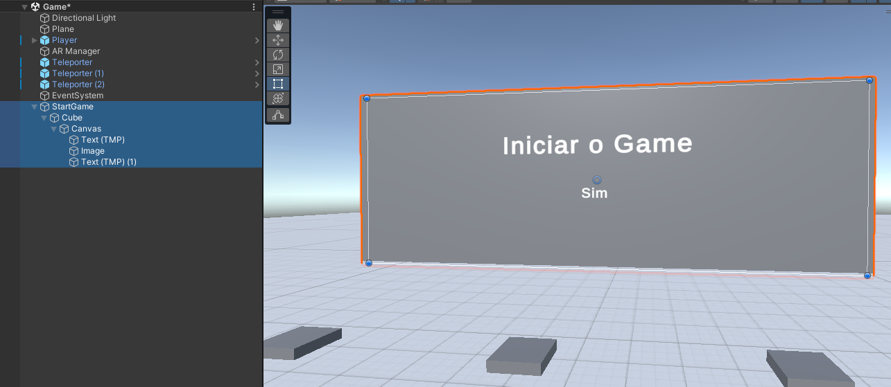

Colocaremos uma Image em cima do texto Sim com as configurações para ela ser preenchida como uma barra de progresso. Ela deverá também ter uma BoxCollider para que a função **OnPointerEnter()** possa ser chamada.

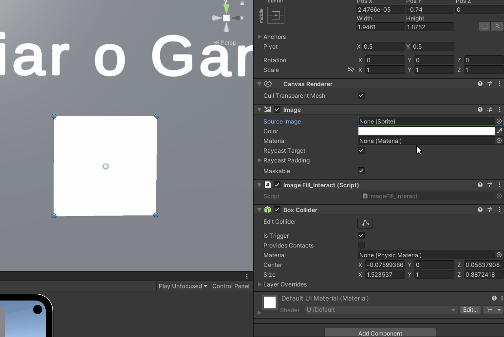

Agora para o script, faremos um chamado ImageFill_Interact, ele funcionará de forma muito semelhante ao script anterior:

```cs
using UnityEngine;
using UnityEngine.UI;

public class ImageFill_Interact : MonoBehaviour
{
  Image fillImage;
  bool isLooking;

  private void Start()
  {
    fillImage = GetComponent<Image>();
  }

  private void Update()
  {
    if (isLooking)
    {
      fillImage.fillAmount += Time.deltaTime * 0.2f; 
    }
    else
    {
      fillImage.fillAmount -= Time.deltaTime * 0.2f;
    }
  }

  public void OnPointerEnter()
  {
    isLooking = true;
  }

  public void OnPointerExit()
  {
    isLooking = false; 
  }
}
```

Basta colocar o script na Imagem e fazer o teste!


## **Lesson 04 | Ativando Animações**

Podemos criar uma animação para que esse cubo desça quando a imagem for preenchida. Para isso, vamos selecionar o objeto **pai do cubo** e ir em *Window > Animation > Animation*. Nessa janela clique no botão Create e crie duas animações: **Door_Close** e **Door_Idle**

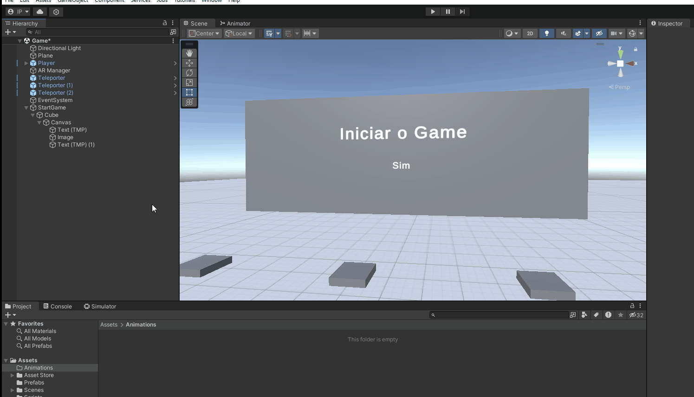

Na animação Door_Idle clique em Add Properties e salve a posição atual do cubo:

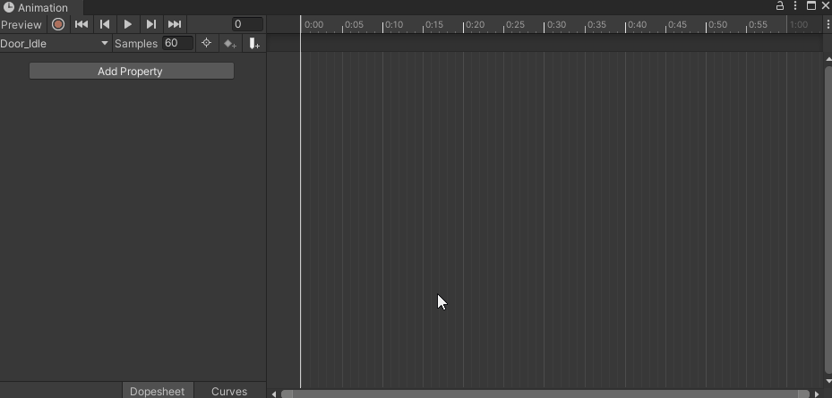

Já na animação Door_Close faremos algo semelhante mas vamos mudar a posição do cubo no final da animação e clicar em Add Keyframe para salvar essa mudança:

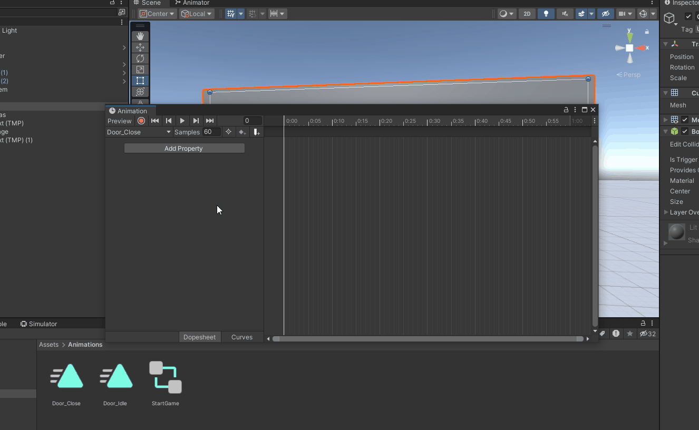

**Importante:** a animação Door_Close não pode ser executada em loop, então vamos clicar nela e tirar o Loop Time

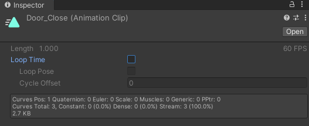

No Animator Controller, se a animação **Door_Close** estiver definida como padrão, clique com o botão direito em Entry e selecione Set StateMachine Default State, em seguida seleciona o **Door_Idle**.

Voltando ao script ImageFill_Interact faremos uma pequena alteração:

```cs
Image fillImage;
bool isLooking;

public UnityEvent OnImageFilled; // nova linha

private void Start()
{
  fillImage = GetComponent<Image>();
}

private void Update()
{
  if (isLooking)
  {
    fillImage.fillAmount += Time.deltaTime * 0.2f;
    // novo IF
    if(fillImage.fillAmount >= 1)
    {
      OnImageFilled.Invoke();

      fillImage.fillAmount = 0;
    }
  }
  else
  {
    fillImage.fillAmount -= Time.deltaTime * 0.2f;
  }
}
```

Vamos disparar um evento assim que a imagem for completamente preenchida, então basta arrastar o objeto pai para o script e chamar a animação **Door_Close**:

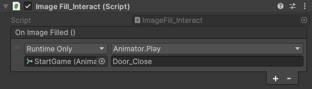

Faça o teste e veja que, ao finalizar o preenchimento da imagem, a porta se abre dando início à partida.