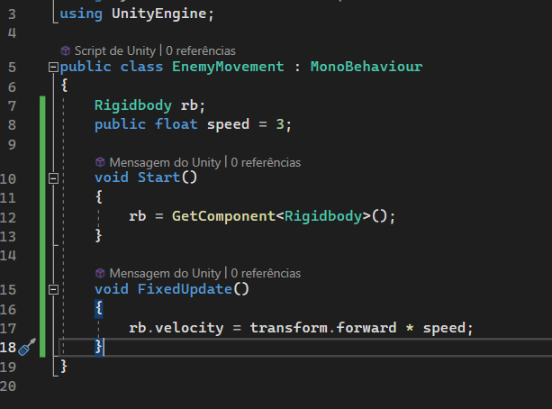
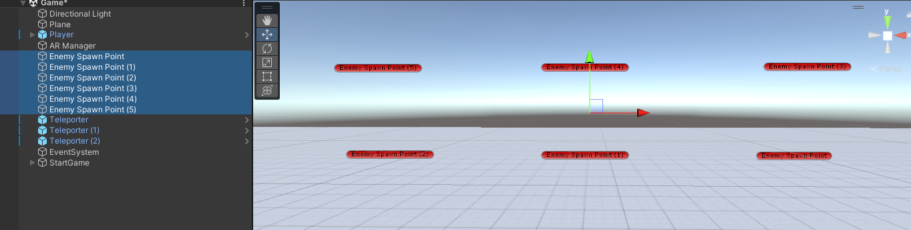
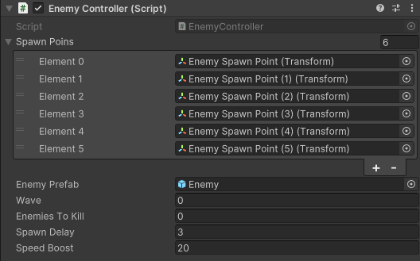
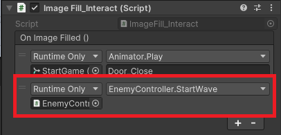
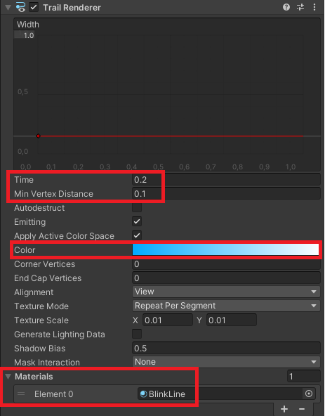
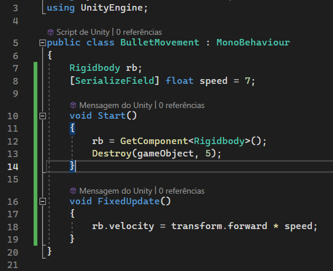

# RV - Inimigos

Hoje trabalhamos com os inimigos do nosso game, onde eles são spawnados em waves (mecânica que trabalha com “rodadas”, onde cada nova rodada terá mais inimigos na tela) e se movimentam em direção ao Player.

- Criação do Inimigo 
  - Procure um modelo para o inimigo (lembre-se que ele será do tipo que flutua)
    - foi utilizanda na preparação o modelo [Low Poly Combat Drone](https://www.google.com/url?q=https://assetstore.unity.com/packages/3d/low-poly-combat-drone-82234&sa=D&source=editors&ust=1701182267416670&usg=AOvVaw37DPNpZ7sxFA876q6XYVYu)
  - Crie um objeto vazio na cena para fazer o inimigo de nome Enemy
    - adicione o modelo do inimigo ao objeto criado
    - adicione os componentes a ele
      - BoxCollider & Rigidbody
  - Faça o script da movimentação do inimigo
    - 
    - Adicione ao objeto Enemy
  - Transforme o Enemy em um Prefab
  - Crie 6 pontos de spawn para os inimigos
    - Recomendo motar algo semelhante a uma grade do tipo 2x3 (linha x colunas)
    - 
- Spawn dos Inimigos
  - Crie um objeto vazio de nome EnemyController, ele será responsável pelo controle das waves
  - Crie um script de nemo EnemyController
    - Adicione ao objeto EnemyController
    - ```cs
      using UnityEngine;

      public class EnemyController : MonoBehaviour
      {
        public List<Transform> spawnPoins;
        public GameObject enemyPrefab;

        public int wave;
        public int enemiesToKill;

        [SerializeField] float spawnDelay = 3;
        [SerializeField] float speedBoost = 2;

        private void Start()
        {
          NextWave();
        }

        public void StartWave()
        {

          if (!IsInvoking("SpawnEnemy"))
          {
            NextWave();
            InvokeRepeating("SpawnEnemy", spawnDelay, spawnDelay);
            }
        }

        public void StopWave()
        {
          CancelInvoke("SpawnEnemy");
        }

        void NextWave()
        {
          wave++;

          enemiesToKill = wave * 10;
          speedBoost = speedBoost + speedBoost * 0.2f;
          spawnDelay = spawnDelay - spawnDelay * 0.1f;
        }

        public void SpawnEnemy()
        {
          Transform spawnPoint = spawnPoins[Random.Range(0, spawnPoins.Count)];

          GameObject new_enemy = Instantiate(enemyPrefab, spawnPoint.position, spawnPoint.rotation);

          new_enemy.GetComponent<EnemyMovement>().speed += speedBoost;
        }
      }
      ```
    - Volta na Unity e preencha os campos
      - 
  - Adicione ao ImageFill_Interact mais uma chamada no evento para iniciar as waves
    - 
- Faça o teste e veja se está tudo certo
  - 
- Configurando a Arma e Projéteis
  - Procure pelo modelo da arma
    - foi utilizado o modelo [Sci-fi Pistol [PBR]](https://www.google.com/url?q=https://assetstore.unity.com/packages/3d/props/guns/sci-fi-pistol-pbr-213679&sa=D&source=editors&ust=1701182267426585&usg=AOvVaw2b29F7P_b2Nj7OVe8JYiEW)
      - Caso a textura não carregue altere a propriedade Shader (logo abaixo do nome do material) para **Universal Render Pipeline/Lit**
    - Nele está incluso o projétil, mas é permitido que os alunos façam seus próprios projéteis
  - Posicione a arma como filha da câmera. Cuidado para não atrapalhar a visão
  - Vá até o prefab do projétil e adicione o componente **Trail Renderer**
    - 
      - Abra o prefab e aperte o botão de play para ver o resultado do Trail
  - Crie o script **BulletMovement**
    - 