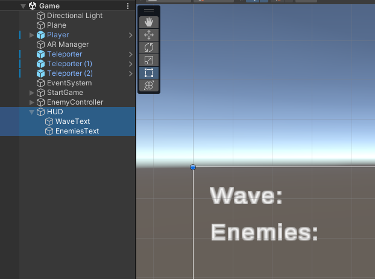
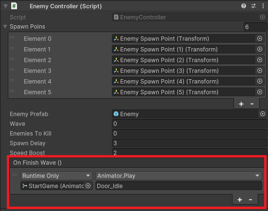

# Finalização do Projeto

- Sistema de Waves
  - Iremos exibir a quantidade de inimigos restantes e o número atual de ondas de inimigos através da HUD
    - Para isto adicione um Canvas com dois Text Mesh Pro como na imagem abaixo
    - 
  - Crie o Script para o Canvas
    - ```cs
      public class HUD : MonoBehaviour
      {
          public TextMeshProUGUI waveText;
          public TextMeshProUGUI enemiesText;

          public EnemyController enemyController;

          private void Update()
          {
              waveText.text = "Wave: "
                  + enemyController.wave.ToString();

              enemiesText.text = "Enemies: "
                  + enemyController.enemiesToKill.ToString();
          }
      }
      ```
  - Para que esses valores sejam atualizados, voltaremos ao script **EnemyController** para criar uma função que contabiliza os inimigos que foram derrotados e dispara um evento *OnFinishWave* que será usado mais adiante para fazer uma "pausa" entre as waves.
    - ```cs
      public UnityEvent OnFinishWave;

      public void UpdateKillCount()
      {
        enemiesToKill--;

        if(enemiesToKill <= 0)
        {
          StopWave();
          OnFinishWave.Invoke();

          GameObject[] enemyList = GameObject.FindGameObjectsWithTag("Enemy");
          foreach(GameObject enemy in enemyList)
          {
              Destroy(enemy);
          }
        }
      }
      ```
  - Essa função será chamada no script **EnemyMovement**, toda vez que ele for destruído
    - ```cs
        private void OnCollisionEnter(Collision collision)
        {
          if (collision.gameObject.GetComponent<Bullet_Movement>())
          {
            OnPointerExit();

            // Linha nova
            GameObject.Find("EnemyController").GetComponent<EnemyController>().UpdateKillCount();

            Destroy(gameObject);
            Destroy(collision.gameObject);
          }
        }
      ```
  - A partir do evento criado inicie a animação **Door_idle** como na imagem a seguir
    - 
  - 