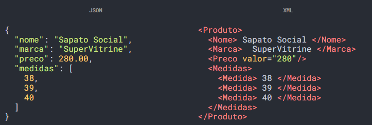

# Preparando o Ambiente

Nesta aula teremos a preparação do ambiente para que os alunos possam preparar o mesmo ambiente em casa e a criação de alguns projetos para entender o react.

## Instalar o Node JS versão LTS

Após a instalação:
- verificar versão do Node 
- verificar versão do NPM
- instalar o react
- instalar o create-react-app

## Instalar o VS Code

Garantir que é possível abrir o VS Code ao clicar com o botão direito em uma pasta. Isto é feito durante a instalação.

## Criando primeiro projeto React

Através do prompt/terminal acesse a pasta em que deseja criar o projeto e então utilize o comando abaixo para criar um projeto de nome **proj01** em branco que será utilizado para entender o básico sobre o React

```js
npx create-react-app proj01 --template empty
```

## Estrutura de pastas

- **/node_modules**
  - Nesta pasta temos os pacotes que foram baixados para fazer a aplicação react funcionar. Portanto não altere nada nesta pasta
- **/public**
  - Nesta pasta teremos os arquivos que iremos disponibilizar para o usuário da aplicação, como arquivos HTML e CSS, imagens, vídeos e etc.
- **/src**
  - Aqui teremos a lógica da aplicação React.
- *.gitignore*
  - Neste arquivo teremos os arquivos que devem ser ignorados quando a aplicação for colocada no ar
- *package.json* e *package-lock.json*
  - estes são os arquivos de documentos que registram todas as informações tecnicas da aplicação

## Entendendo o JSX

Passando pelos arquivos existentes na aplicação notamos que temos arquivos com HTML e JS misturados, e não da mesma forma como era quando vimos anteriormente.

Para programarmos os componentes no React, usamos uma sintaxe chamada de JSX, que é basicamente a mistura entre a linguagem de programação JavaScript que já conhecemos com a linguagem de marcação XML.

É muito possível que você não conheça, mas o XML já foi uma linguagem bastante usada (isso em um passado não tão distante) para a transferência de dados pela internet e atualmente foi substituído pelo performático JSON.

Abaixo um exemplo entre as diferenças do JSON e o XML para contextualizar:



Deu pra ter uma noção da diferença entre as duas maneiras de enviar a informação. O JSON é mais simples e menos encorpado comparado ao XML que é robusto e altamente estruturado.

Mas não há motivos para se assustar, porque o JSX nesse caso se parece bastante com HTML. Abaixo está um outro exemplo de um elemento botão pode ser armazenado dentro de uma constante:

```js
const botao = <button> Clica em mim! </button>
```

Com o JSX é possível armazenar um ou vários elementos dentro de variáveis e assim podemos usar quando precisarmos.

E isso abre um leque de imenso de possibilidades. Imagina só você construir um menu e salvá-lo dentro de uma variável, aí quando precisarmos usar o menu é só chamar a variável. Isso facilita demais!

Aqui abaixo tem um outro exemplo, se liga. Tem uma constante salvando o nome e outra para salvar o elemento **< h1 >**. Veja que o elemento **< h1 >** usa a constante nome em seu conteúdo.

```js
const nome = "Pedro"
const titulo = <h1> Meu nome é { nome }! </h1>
```

Dessa maneira podemos interpolar os dados com os elementos JSX deixando tudo mais dinâmico e interessante de ser utilizado.

Esse exemplo funciona muito bem para quando temos que mostrar para o usuário um texto fixo e em seguida uma variável que vai sofrer atualização.

## Primeiro componente

Vamos partir para a aprendizagem de um conceito muito importante na programação do React, que são os componentes.

Os componentes são estruturas com funcionamento independente que contém um conjunto de elementos visuais. Na prática os componentes são funções javascript que retornam elementos JSX.

E para ficar mais claro, podemos pensar que os componentes são os órgãos do corpo humano, cada um tem o seu funcionamento e em conjunto formam o funcionamento do corpo humano.

Agora chega de explicações, vamos partir para a programação!

Comece criando um novo arquivo para a pasta src chamado Componente.jsx:

```jsx
import React from "react" 

export default function Componente() {
  return (
    <div>
      <h1> Pousando em React! </h1>
      <p> SuperGeeks </p>
      
    </div> 
  );
}
```

Dentro do componente, criamos o elemento *< div>* no return para sustentar os outros elementos, e em seguida programar os elementos *< h1>*, *< p>* e *< img/>*.

No elemento *< h1>* preencha com o texto "Pousando em React!" e no conteúdo do *< p>* preencha com o texto "SuperGeeks".

No elemento *< img/>* vamos colocar um link especial de um serviço de imagens aleatórias da internet, então no source (src) da imagem digite o link abaixo e no alternative text (alt) coloque a descrição da imagem.

Depois de finalizado a programação, temos que conectar de alguma forma o componente com o arquivo index.js para que possamos fazer a renderizar na origem e ver o resultado no localhost.

Em index.js

```jsx
import Component from "./Componente"
```

No index.js devemos fazer importação do componente que criamos usando com comando import passando o nome e localização do arquivo.

No endereço devemos usar o "./" para indicarmos o ponto de partida para encontrar a pasta do arquivo desejado. Nesse caso o componente:

```jsx
ReactDOM.render(
  <React.StrictMode>
    <Componente /> // mudou aqui
  </React.StrictMode>,
  document.getElementById('root')
);
```

E por fim, para conseguirmos fazer a origem renderizar o componente que foi programado, precisamos passar o componente.

E pronto, agora você pode ir lá conferir como está ficando a aplicação!
