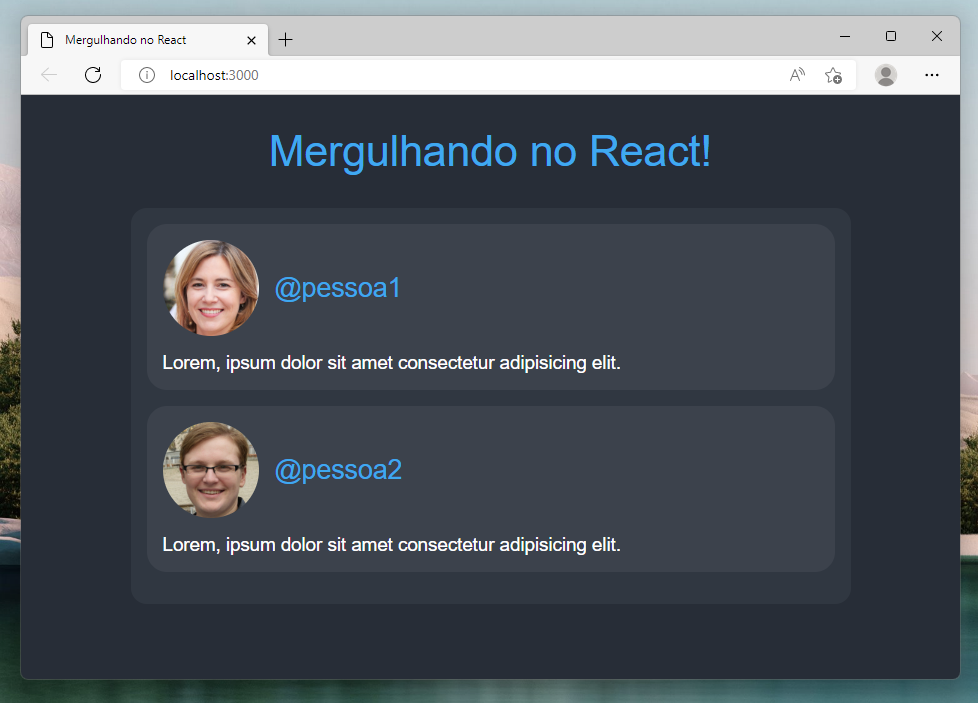
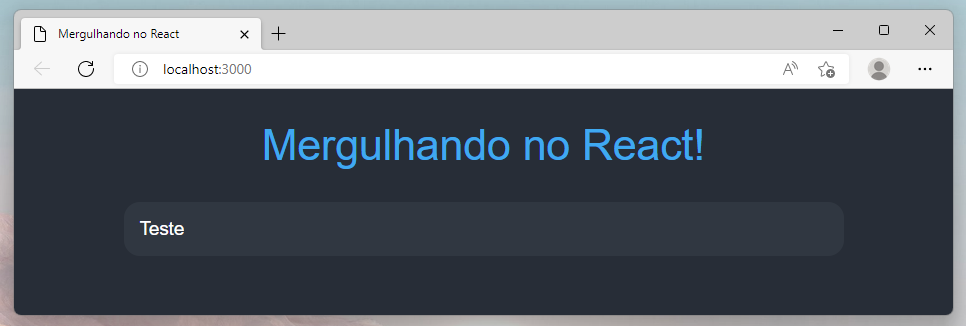
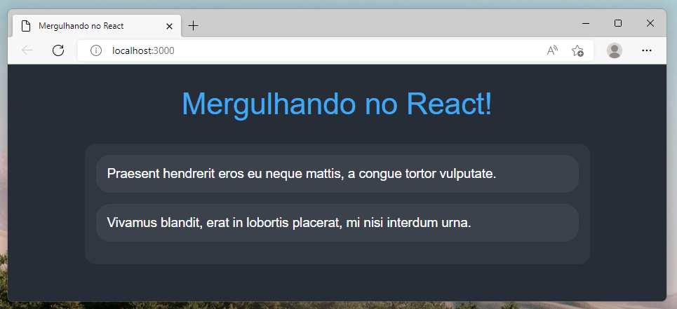
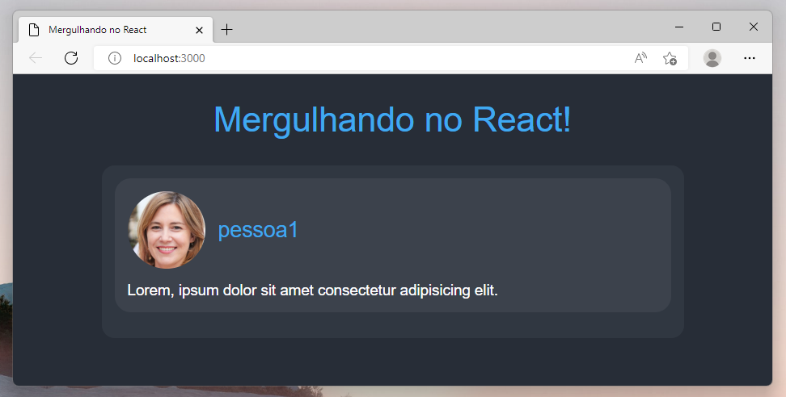
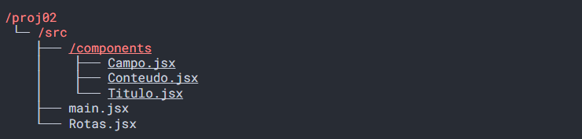
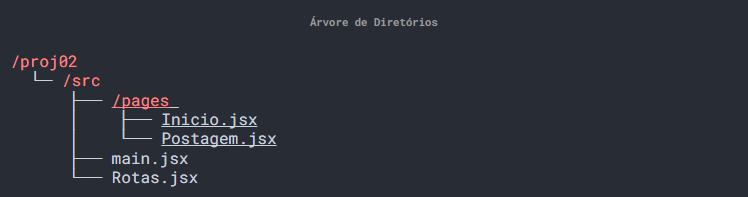
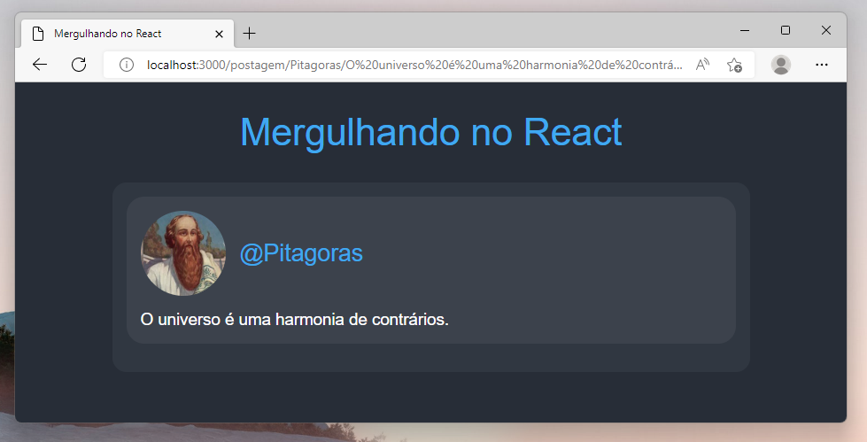
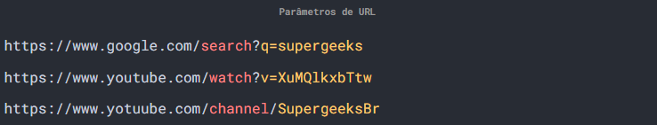

# Mergulhando no React

## Novo desafio!


Olá, aluno!

Espero que tenha treinado a criação da aplicação: mudando os estilos das páginas e dos elementos e também adicionando novos componentes na aplicação.

Porque agora faremos uma nova aplicação totalmente diferente da primeira, faremos uma aplicação que vai mostrar postagens de pessoas fictícias em um estilo como se fosse os feeds de redes sociais.

O feed é a página inicial do usuário onde geralmente aparece as notícias mais recentes ou publicações de pessoas amigas como no caso do Twitter, Facebook e Instagram.

Veja que a imagem acima mostra bastante do que teremos que fazer, e aposto que você vai se sair muito bem nesse novo desafio. Então prepare o Terminal e vamos nessa!

## Criando um novo projeto
Vamos começar criando uma nova aplicação.

Então para usuários do windows abra o Prompt de Comando, para usuários de distribuições Linux ou do sistema operacional macOS abram o Terminal.

E em seguida precisamos usar aquela sequência de comandos para acessar a área de trabalho, criar uma aplicação do React e instalar o Styled Components. Então adicione comando por comando no seu Terminal:

```bash
cd Desktop
npx create-react-app proj02 --template empty
cd proj02
npm install
npm install styled-components --save
```

Relembrando: O comando cd serve para acessar os diretórios do sistema. Já o comando npx que está em vermelho serve para fazer download do projeto do React e o npm nesse caso vai servir para instalar o pacote do Styled Components.

Aguarde a aplicação ser criada. Assim que finalizar o download abra o arquivo index.html:

No index.html configure através do elemento **< meta>**:

- O conjunto de caracteres para aceitar as letras especiais da língua portuguesa;
- O ajuste de escala a partir do dispositivos que o usuário estiver utilizando;

Agora, na pasta "public" crie o arquivo de estilo style.css:

```css
body {
  background: #262d37;
  color: white;
  font-family: "Arial", sans-serif;
  font-size: 14pt;
  margin: 0 auto;
  width: 720px;
}
```

Para a página ficar com o tema escuro, vamos colocar um azul-escuro de cor de fundo, daí para as letras ficarem legíveis vamos mudar a cor para o branco. Na fonte podemos usar Arial no tamanho de 14 pontos.

Removemos a margem vertical da página e alinhamos o conteúdo automaticamente na horizontal com o comprimento de 720 pixels. É basicamente isso que teremos que adicionar no estilo css.

Use a tag link no arquivo index.html para adicionar o css criado:

```html
<link rel="stylesheet" href="/style.css">
```

> lembre de colocar a / antes do style.css ou ele vai ser carregado apenas na página inicial da aplicação

Agora podemos passar para a próxima programação!

## Configurando o React
Pule para o arquivo main.jsx, devemos fazer as configurações iniciais de definir o contentor e a origem para a aplicação renderizar um componente.

Na documentação do React as constantes que estamos chamamos de contentor e origem são usadas com a nomenclatura de Container e Root, mas para fins didáticos usamos uma tradução próxima.

Em seguida vamos colocar um componente chamado Rotas para ser importado e renderizado, como mostra o código abaixo:

```js
import React from 'react'
import ReactDOM from 'react-dom/client'
import Rotas from './Rotas'

ReactDOM.createRoot(document.getElementById('root')).render(
  <React.StrictMode>
    <Rotas />
  </React.StrictMode>,
)
```

Precisamos importar o pacote do **React** e do **React DOM** para que a aplicação funcione. Vamos então criar a raíz da nossa aplicação usando o **createRoot()** e utilizar o **render()** para exibir nossos componentes dentro dela.

Agora podemos criar o componente Rotas.jsx e iniciar a programação (dentro da pasta src):

```js
import React from "react" 

export default function Rotas() {
    return <> 
        Teste
    </> 
}
```

Essa é a estrutura mais simples que podemos chegar de um componente. Possui apenas a importação do React, uma função que está sendo exportada por padrão e que consegue retornar um elemento visual.

Por questão de praticidade podemos fazer o componente retornar um elemento vazio com diversos outros elementos dentro como mostrado no último código acima.

E agora que finalizado podemos iniciar a aplicação com o comando:

```bash
npm start
```

O comando "npm start" é a ignição da aplicação, faz o arquivo main.jsx ser interpretado pelo Node.

Só esperar uns segundinhos para que o "localhost" seja aberto!


## Título e Campo



Como mostrado na imagem, temos um longo trabalho a se fazer. Precisamos criar o **componente Título** da página e adicionar o **componente Campo** para receber o texto **"Teste"** na página.

Comece importando o **Styled Components** (instale, caso ainda não tenha feito e sempre lembre de tomar cuidado com a digitação):

```jsx
import styled from 'styled-components';
```

O Título da página vai ser um elemento de texto mostrado no centro da tela com a cor azul claro e um tamanho grande de 32 pontos. Ainda podemos colocar um espaçamento interno na vertical para que nenhum outro elemento fique próximo.

O código no **modelo** ficaria assim:

```jsx
const Titulo = styled.div`
  color: #2da9f3;
  font-size: 32pt;
  padding: 32px 0;
  text-align: center;
`
```

E agora que o modelo está pronto, temos que aplicar o Titulo para dentro do Componente Rotas, adicione o elemento **< Titulo>**:

```jsx
export default function Rotas() {
  return (
    <>
      <Titulo> Mergulhando no React! </Titulo>
    </>
  );
}
```

Agora passaremos para a programação do Campo, a ideia é criar um espaço onde poderão ficar os conteúdos que as pessoas publicam na aplicação. Bem semelhante ao que as redes sociais tem em suas páginas iniciais.

O modelo do campo vai ter o fundo de cor azul-médio-escuro, com as bordas arredondadas em 16 pixels nas quatro pontas e um espaçamento interno na vertical e horizontal de 16 pixels.

O código **modelo** ficaria assim:

```jsx
const Campo = styled.div`
  background: #303741;
  border-radius: 16px;
  padding: 16px;
`
```

E agora podemos passar o modelo campo para o elemento JSX **< Campo>** e utilizar abaixo do Título no componente Rotas. Como ainda não temos os conteúdos programados, vamos deixar um texto de preenchimento como **"Teste"**.

E o código final no componente Rotas ficaria:

```jsx
<>
  <Titulo> Mergulhando no React! </Titulo>
  <Campo>
    Teste
  </Campo>
</>
```

Agora temos a base do projeto, o modelo Título para destacar ao usuário em qual página ele está e o modelo Campo para representar o espaço onde os conteúdos dos usuários ficarão.

Agora bora programar os conteúdos!

## Conteúdo


Chegou o momento de desenvolvermos os conteúdos para serem colocados para dentro do elemento **< Campo>**.

O conteúdo vai ser um elemento JSX que vai comportar as fotos e nome do usuário na parte superior e abaixo a descrição, que é o texto que o usuário publicou. Vai ser bem parecido com o modelo de um tweet.

O modelo do conteúdo vai ter o fundo azul-médio-claro, com os quatro cantos de bordas arredondadas em 16 pixels, uma margem inferior de 16 pixels para evitar um elemento encostar no outro e um espaçamento interno de 16 pixels:

```jsx
const Conteudo = styled.div`
  background: #3b424c;
  border-radius: 16px;
  margin-bottom: 16px;
  padding: 16px;
`
```

O elemento **< Conteúdo>** vai permitir ter outros elementos dentro, por isso temos que levar em consideração que vai ser preenchido com informações da publicação do usuário.

Aproveite e coloque o modelo de conteúdo para dentro do elemento Campo:

```jsx
<Titulo> Mergulhando no React! </Titulo>
<Campo>
    <Conteudo> 
        Lorem
    </Conteudo> 
    <Conteudo> 
        Lorem
    </Conteudo>
</Campo>
```

Como ainda não fazemos nenhuma ideia do que colocar dentro do Conteúdo, você pode usar o comando **Lorem Ipsum** do VSCode para gerar um texto aleatório de preenchimento:

O Lorem Ipsum é um texto em latim de preenchimento, e não tem nenhum significado específico, mas serve para ‘encher linguiça’ e simular como ficaria um texto ali no lugar.

Et Complevit!

## Finalizando o Conteúdo



Nossa missão agora é adicionar a foto e o nome do usuário na parte superior do conteúdo para especificar quem realizou a publicação e na parte inferior adicionar o texto ou descrição.

Para seguir essa lógica da construção do conteúdo, temos que criar dois elementos para separar a parte superior da parte inferior.

Vamos criar um modelo chamado **"ConteudoTopo"** que vai ter o comportamento de exibição flex, o que vai permitir colocar a foto ao lado do nome do usuário e um separação de 16 pixels:

```jsx
const ConteudoTopo = styled.div`
  display: flex;
  gap: 16px;
`
```

Acima está mostrado como o código do modelo ficaria. E aproveitando que o modelo Conteúdo Topo está programado, vamos desenvolver os modelos para mostrar a foto e o nome do usuário.

O modelo **"ConteudoFoto"** vai ter a borda totalmente arredondada com a altura e largura de 96 pixels. E o modelo **"ConteudoNome"** vai alinhar-se ao centro na posição vertical e com a cor de fonte azul-capri para destacar do fundo:

```jsx
const ConteudoFoto = styled.img` 
  border-radius: 100%;
  height: 96px;
  width: 96px;
`

const ConteudoNome = styled.div`
  align-self: center;
  color: #2ca8f2;
`
```


E os modelos **"ConteudoFoto"** e  **"ConteudoNome"** estão prontos! Agora para finalizar a criação, vamos partir para o modelo da parte inferior dos conteúdos.

O modelo **"ConteudoDescricao"** recebe uma margem superior de 16 pixels para precisamente não ficar próximo da foto e o alinhamento de texto justificado.

Abaixo o resultado do modelo:

```jsx
const ConteudoDescricao = styled.div` 
  margin-top: 16px;
  text-align: justify;
`
```

Agora podemos transformar todos os modelos criados acima para elementos JSX e colocar para dentro dos Conteúdos que temos.

E os elementos Conteúdos dentro do componente Rotas ficariam:

```jsx
<Conteudo> 
  <ConteudoTopo> 
    <ConteudoFoto src="/pessoa1.jpg" alt="foto"/>
    <ConteudoNome> @pessoa1 </ConteudoNome> 
  </ConteudoTopo> 
  <ConteudoDescricao> 
    Lorem, ipsum dolor sit amet consectetur adipisicing elit. 
  </ConteudoDescricao> 
</Conteudo>
```

No elemento **< ConteudoFoto>** devemos passar no **source** (src) a imagem da pessoa e no **alternative text** (alt) a descrição da foto. Já no elemento **< ConteudoNome>** preencha com o nome e no **< ConteudoDescricao>** o texto de publicação do usuário.

Temos o conteúdo finalizado!

## Componentizando

Percebeu que enquanto estávamos construindo a página os elementos ficaram muito bem definidos como o Título que ficou na parte superior da página, o Campo que comportou todos os Conteúdos colocados e por sua vez o próprio Conteúdo.

A estratégia é que podemos dividir esses elementos em código menores chamados de componentes.

É recomendado criarmos uma nova pasta para deixar organizado todos os componentes que iremos programar para a aplicação. Siga como mostrado na árvore:



Agora com uma nova pasta, podemos criar os três novos arquivos sendo o: **"Titulo.jsx"**, **"Campo.jsx"** e o **"Conteudo.jsx"**. Vamos agora programar cada um desses componentes, ou melhor, passar a programação para esses componentes!

Na verdade, já temos a programação feita.

A grande vantagem de fazer esse processo chamado de **"Componentização"** é facilitar a programação tornando modular, deixar o processo de manutenção do código mais prático e padronizar o sistema de utilização de componentes.

No componente **"Titulo.jsx"** comece importando os pacotes necessários, o modelo do título e crie a função Título retornando o modelo:

```jsx
import React from "react"
import styled from "styled-components" 

const ModeloTitulo = styled.div`
    color: #2da9f3;
    font-size: 32pt;
    padding: 32px 0;
    text-align: center;
`

export default function Titulo() {
    return <ModeloTitulo> Mergulho no React </ModeloTitulo> 
}
```

Como você pode ver no código acima, o componente Título ficou bem mais simples e curto do que na programação do componente Rotas.

Agora podemos voltar no componente Rota e fazer a importação do componente Título:

```jsx
import Titulo from "./components/Titulo" 
```

E para fazermos o uso do componente basta utilizar o elemento JSX:

```jsx
<Titulo/> 
```

Na parte visual da aplicação não haverá nenhuma diferença visual, mas na maneira de programar vai facilitar de diversas formas daqui em diante.

O primeiro componente foi criado e importado com sucesso!

## O que são as Propriedades ?

Você viu em uma explicação anterior que os componentes são funções que retornam um ou mais elementos visuais. Mas os componentes também podem receber entradas!

Fizemos o exercício de imaginar os componentes sendo órgãos humanos. Imagine então o componente Pulmão, o pulmão trabalha com entradas e saída de gases. Se fôssemos imaginar o componente coração, trabalha com a entrada e saída de sangue, assim bombeando-o.

O mesmo podemos fazer com os componentes, usando as entradas via propriedades. Aqui vai um exemplo:

```jsx
function Carro(props) {
    return <div> { props.combustivel } </div>
}

<Carro combustivel="80%" />
```

Veja que no código, a função Carro está recebendo props como **entrada de dados** e retornando um elemento **< div>** com a informação do combustível.

Sempre que tivermos que passar algum dado como entrada precisamos usar o atributo do elemento JSX e receber como parâmetro (**props**) da função.

E agora bora colocar os props nos componentes!

## Propriedades no Título

Agora que sabemos que existe uma maneira de transferir dados de um componente para outro através do uso do **props**, podemos atualizar o código do componente Título e entender na prática como funciona.

Comece colocando o parâmetro **props** na função do componente e em seguida troque o texto fixo que estava no elemento **< ModeloTitulo>** pelo **props.nome**.

E ficaria assim o código:

```jsx
export default function Titulo(props) {
    return <ModeloTitulo>
        { props.nome }
    </ModeloTitulo> 
}
```

Depois de adicionado a propriedades ao componente, podemos ajustar o atributo para mudar o Título que será mostrado.

Agora passamos o atributo nome para o elemento **< Titulo>** desta forma:

```jsx
<Titulo nome="Mergulhando no React"/> 
```

Iremos fazer o mesmo processo para os outros componentes, imagine que em algum momento tivéssemos que mudar o valor de um componente. Agora com propriedades basta trocar o valor que vai ser passado através do elemento.

Atualização do componente finalizado!

## Componente Campo

Deu pra entender como passa os dados por propriedades para os componentes. Mas como eu faço para passar os elementos como propriedades, é possível ?

Sim é perfeitamente possível! Existe uma forma que é usando o props.children, aí conseguimos passar os elementos como propriedades de um componente.

Olha só o código abaixo como foi feito:

```jsx
import React from "react"
import styled from "styled-components"

const ModeloCampo = styled.div`
  background: #303741;
  border-radius: 16px;
  padding: 16px;
`

export default function Campo(props) {
  return <ModeloCampo>
    { props.children }
  </ModeloCampo>
}
```

O componente Campo recebe o **props.children** através do elemento **< ModeloCampo>**, assim qualquer elemento que passarmos pelo componente será renderizado.

Bem fácil né, a é só importar o componente Campo para dentro do Rotas:

```jsx
import Campo from "./components/Campo"
```

E já está funcionando.

##  Componente Conteúdo

Agora partiremos para montar as propriedades para o componente Conteúdo!

Precisamos apenas passar as propriedades do **endereço de imagem da foto**, o **nome de usuário** e a **descrição da postagem** publicada.

Olha só como podemos fazer o sistema de **props** para o componente Conteúdo:

```jsx
import React from "react" 
import styled from "styled-components" 

const ModeloConteudo = styled.div`...` 

const ConteudoTopo = styled.div`...`

const ConteudoFoto = styled.img`...`

const ConteudoNome = styled.div`...` 

const ConteudoDescricao = styled.div`...` 

export default function Conteudo(props) {
    return (
      <ModeloConteudo> 
        <ConteudoTopo> 
            <ConteudoFoto src={ props.foto } alt="foto"/>
            <ConteudoNome> { props.nome } </ConteudoNome> 
        </ConteudoTopo> 
        <ConteudoDescricao> 
            { props.descricao } 
        </ConteudoDescricao> 
    </ModeloConteudo> 
    );
}
```

No elemento **< ConteudoFoto>** passamos o **"props.foto"** no source para preencher com o endereço de imagem da foto. Aí o próximo é o elemento **< ConteudoNome>** que colocamos o **"props.nome"** para mostrar o nome do usuário.

E por fim temos o **< ConteudoDescricao>** que inclui o texto do usuário para dentro do elemento através do **"props.descricao"**.

```jsx
import Conteudo from "./components/Conteudo" ;
```

Você pode importar o conteúdo para dentro do componente Rotas, mas não se esqueça de que o conteúdo vai dar uma encolhida nas quantidades de linha!

O código do componente Conteúdo vai ficar desse jeito:

```jsx
<Conteudo 
  foto="/pessoa1.jpg" 
  nome="@pessoa1" 
  descricao="Lorem ipsum dolor sit amet consectetur adipisicing elit." 
/>
```

Muito mais prático, colocamos todos os dados em um só elemento e o componente se vira para organizar a forma que vai ser mostrado ao usuário.

Nossa parte de componentização e propriedades dos componentes está feito! Agora bora para um novo desafio!

## O que são as Rotas?

Agora vamos trabalhar com o conceito de Rotas na aplicação React.

Até o momento não temos navegar entre páginas pelo React, o que podemos fazer no máximo é programar uma página estática que tem componentes com propriedades.

Mas agora com o sistema de rotas, poderíamos criar diversas páginas e acessá-las quando o entrarmos em um certo endereço. Por exemplo:

- **http://localhost:5173/** -> O usuário é levado para a página inicial da aplicação, onde é possível ver todas as postagens dos usuários.

- **http://localhost:5173/geeks/ola** -> O usuário é levado para a página de publicação da publicação, onde é mostrado uma postagem específica de um usuário.

E tudo vai depender de qual endereço o usuário vai estar acessando e qual página vai ser renderizada na aplicação.

Depois de entender os conceitos, bora para a programação!

## Instalando novo pacote

Para termos o sistema de rotas funcionando precisamos fazer a instalação do pacote externo no projeto do React chamado React Router DOM.

Abra o Terminal e faça a instalação a partir do comando:

```bash
npm install react-router-dom@6 --save
```

O gerenciador de pacotes do node vai fazer a instalação do pacote React Router DOM na versão 6 mais atualizada.

E depois de feito a instalação devemos fazer a importação no arquivo Rotas.jsx:

```jsx
import { BrowserRouter, Routes, Route } from "react-router-dom";
```

São três elementos que devemos importar:

- **BrowserRouter**: O elemento responsável por interpretar e receber o endereço que o usuário está acessando.

- **Routes**: O elemento que contém todas as rotas e fica responsável por decidir qual a rota acessada pelo usuário.

- **Route**: Que é a representação da página.

Podemos imaginar o elemento **< BrowserRouter>** sendo a Chapeuzinho Vermelho, o **< Routes>** são as rotas que a Chapeuzinho Vermelho pode pegar para chegar até a casa da vovozinha. Nesse exemplo teríamos dois elementos **< Route>** sendo o caminho pelo bosque e o caminho da trilha conhecida.

```jsx
<ChapeuzinhoVermelho>
    <Rotas>
        <Rota caminho="/BosqueAtalho"/>
        <Rota caminho="/TrilhaConhecida"/>
    </Rotas>
</ChapeuzinhoVermelho>
```

E agora você tem uma noção de como podemos usar o React Router DOM para fazer as páginas funcionarem. Agora nossa missão é colocar o sistema de rotas na aplicação.

Se prepare!

## Novas rotas

Vamos começar criando uma nova pasta com o nome de **Pages**, e nessa pasta vamos colocar tudo o que for relacionado as páginas que os usuários podem acessar.

Crie duas páginas, sendo que página **"Inicio.jsx"** já está programada:



Tudo o que programamos no componente Rotas podemos passar para o arquivo de página **"Inicio.jsx"**.

Alguns componentes vão deixar de ser encontrados pelo React, e isso é normal. O motivo é por conta do endereço de referência. Devemos atualizar colocando as importações de componentes para retornar uma pasta.

Ficaria assim a correção do endereço da importação:

```jsx
import react from "react";
import Titulo from "../components/Titulo" ;
import Campo from "../components/Campo";
import Conteudo from "../components/Conteudo";

export default function Inicio() {
  return (
    <>
      <Titulo nome="Mergulhando no React"/>

      <Campo>
        <Conteudo 
          foto="/foto-mulher.jpg" 
          nome="@mulher" 
          descricao="Lorem ipsum dolor sit amet consectetur adipisicing elit." 
        />

        <Conteudo 
          foto="/foto-homem.jpg" 
          nome="@homem" 
          descricao="Lorem ipsum dolor sit amet consectetur adipisicing elit." 
        />
      </Campo>
    </>
  );
}
```

Note que a única alteração feita é no endereço dos componentes, agora é usado ../ para retornar uma pasta.

E ainda mantém o código da função Início sem nenhuma linha a mais. Abaixo um exemplo de como deveria estar o componente.

Já o código das rotas, ficou vazio!

Tudo o que programamos até o momento foi passado para a página **"Inicio.jsx"**. Temos que começar do zero, com a importação do React e dessa vez com o **React Router DOM**.

Devemos também fazer a importação da página Início e em seguida programar a rota "/" passando como elemento o elemento **< Inicio/>**.

E o resultado seria esse:

```jsx
import react from "react";
import { BrowserRouter, Routes, Route } from "react-router-dom" 

import Inicio from "./pages/Inicio";

export default function Rotas() {
  return (
    <BrowserRouter>
      <Routes>

        <Route index path='/' element={ <Inicio /> } />

      </Routes>
    </BrowserRouter>
  );
}
```

Temos até então um exército de uma rota só!

Mas ainda estamos aprendendo mais sobre esse sistema de rotas. Agora você pode testar a aplicação, qualquer outra rota acessada deixará a página sem nenhum elemento aparente.

E assim finalizamos a rota Início!

## Página Postagem



Agora vamos construir uma nova página, e vamos reaproveitar os componentes que já temos para criar algo bem bacana e inovador na aplicação React.

Comece digitando um novo elemento **< Route/>** para dentro do componente Rotas:

```jsx
<Route path="/postagem/:nome/:descricao" element={ <Postagem/> }/>
```

Acima está o exemplo de como ficaria o código. Colocamos o símbolo dois pontos ( : ) indicar onde os parâmetros poderão ser colocados no endereço.

Os **parâmetros de endereço** é algo bem comum na internet, é usado até mesmo em sites como o **Google** e **Youtube**. Acho que você já chegou a reparar.

Exemplo quando iremos pesquisar algo no google, assistir um vídeo no youtube ou acessar algum canal do youtube, os endereços são mudados para essas rotas:



Então os parâmetros são maneiras de passarmos os dados para a aplicação via endereço URL. Agora tenho certeza que você vai sair por aí caçando parâmetros em vários sites da internet.

Não se esqueça de fazer a importação da página Postagem e criar o arquivo na pasta pages:

```jsx
import Postagem from "./pages/Postagem";
```

Abra o arquivo Postagem.jsx salvo na pasta Pages. E agora podemos usar o React Router DOM para pegar os parâmetros que foram digitados na barra de endereço.

Da uma olhada só como é a importação:

```jsx
import React from "react";
import { useParams } from "react-router-dom";

export default function Postagem() {
  return (
    <></>
  );
}
```

Primeiro, fazemos a importação da função chamada **"useParams"** que está contida dentro do pacote React Router DOM. O comando vai possibilitar a coleta do parâmetro digitado pelo usuário.

E em segundo, fazemos a construção de duas constantes para fazer a coleta dos parâmetros, no caso os parâmetros dessa aplicação são:

- **Nome**: que vai ser o campo do nome do usuário;

- **Descrição**: que vai ser o campo do conteúdo da postagem do usuário;

E assim conseguimos usar esses parâmetros coletados nas propriedades do **componente Conteúdo**, dessa forma:

```jsx
export default function Postagem() {

  const { nome, descricao } = useParams() 

  return <>
    <Titulo nome="Mergulhando no React"/>
    <Campo>
      <Conteudo 
        foto="/pessoa3.jpg" 
        nome={ "@" + nome }
        descricao={ descricao }
      />
    </Campo>
  </> 
}
```

E o resultado é incrível, podemos acessar o endereço e mudar instantaneamente o conteúdo que vai ser mostrado na postagem. Isso possibilita diversas possibilidades na aplicação:

http://localhost:5173/postagem/NOMEAQUI/DESCRICAOAQUI

Dê uma acessada no link acima e mude os parâmetros para ver como a programação se adequa aos dados digitados pelo endereço.

Finalizamos mais uma aplicação!

## Finalização

Começamos desenvolvendo um novo projeto desafiador, mas tenho certeza que você conseguiu dar conta de aprender e fazer tudo funcionar direitinho. Espero que tenha gostado de programar usando o Styled Components e ter criado um layout de aplicação em React totalmente diferenciado!


Agora vamos relembrar tudo o que vimos nesse conteúdo:


- Começamos criando um novo projeto;
- Configuramos todos os arquivos iniciais para o funcionamento;
- Você programou os componentes bases como o Título, Campo e Conteúdo.
- Aprendeu o que é a componentização.
- Como utilizar as propriedades para mudar os dados do componentes;
- Criou uma pasta apenas para componentes do projeto.
- Aprendeu o que são as rotas
- Criou duas rotas diferentes na aplicação.

Parabéns por ter chegado até aqui!

Agora é o seu momento de relembrar os conceitos aprendidos. Agora modifique as rotas programadas e crie novas postagens de usuários na aplicação. Boa sorte!