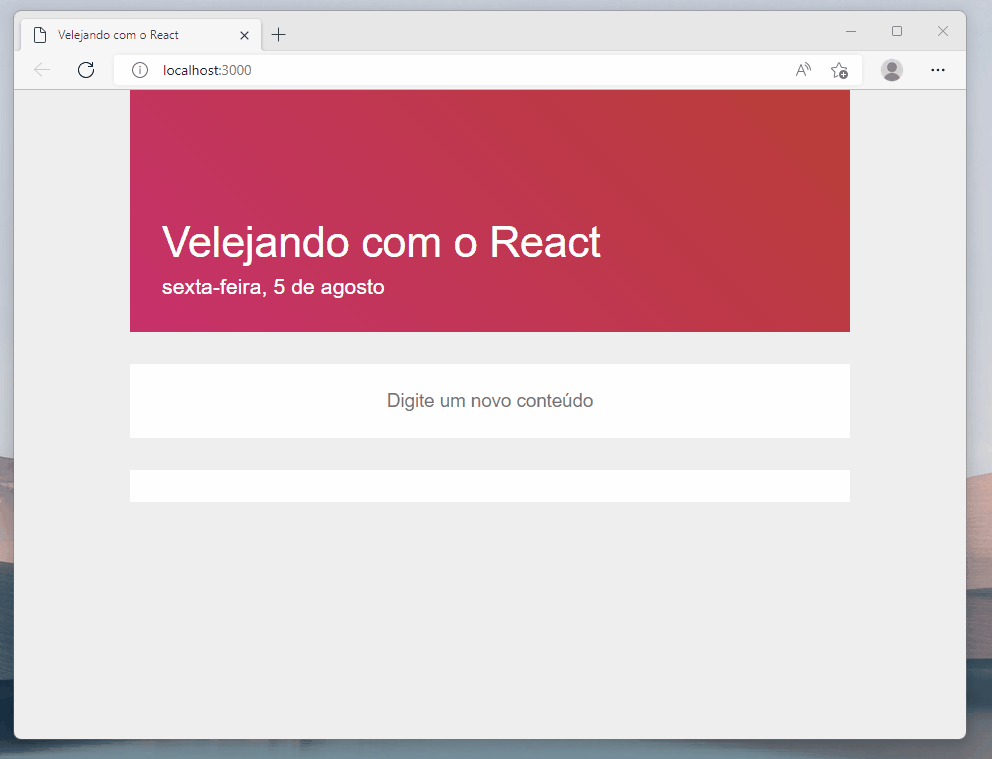
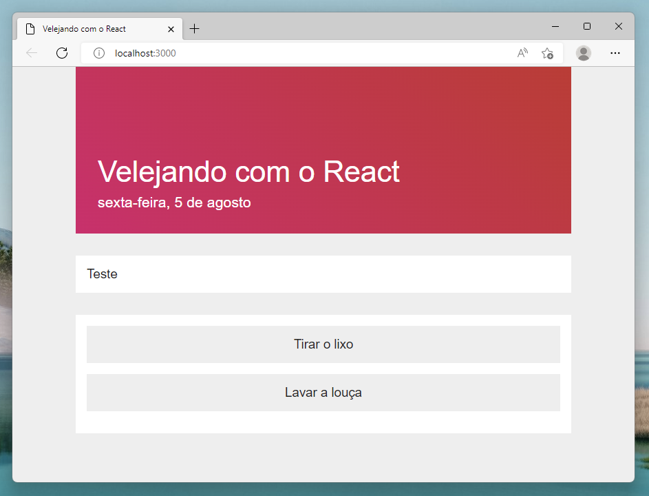
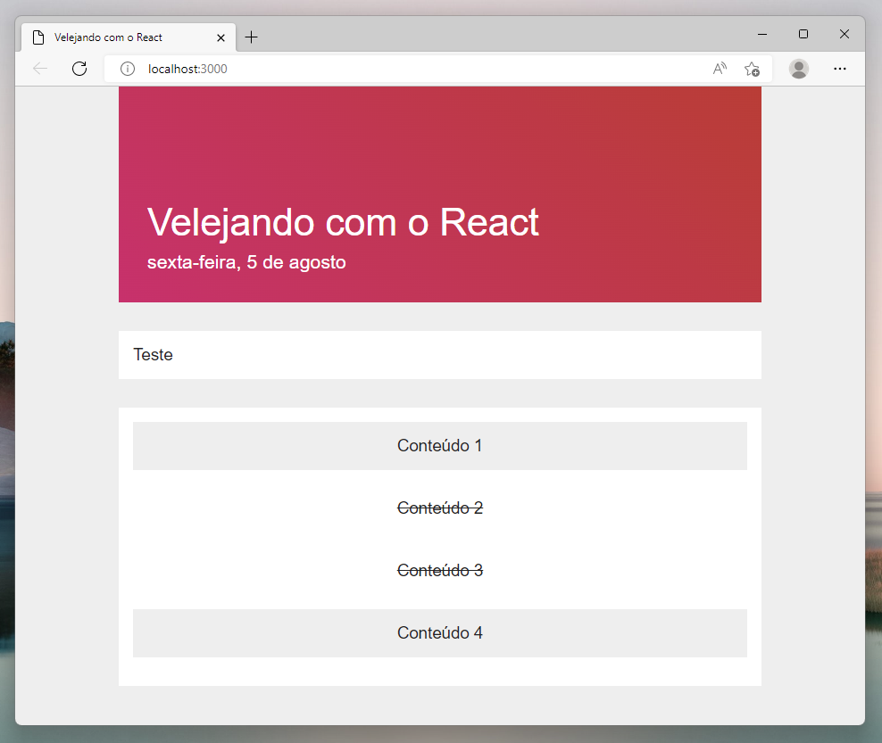

# Velejando no React



Olá, aluno!

Aqui vai um novo projeto para nos desenvolvermos. Vamos criar uma aplicação para armazenar as tarefas que temos que fazer no dia, estilo uma todo-list.

O objetivo é aprender como armazenar os dados de estado dos componentes usando o styled components para alterar a aparência quando o estado for alterado, adicionar novos itens em uma lista e renderizar os itens da lista através do mapeamento.

Vamos armazenar as informações nos estados e conseguir colocar as tarefas como feitas e não-feitas usando as propriedades no Styled Components. Então se prepare!

E vamos para mais uma nova aplicação!

## Criando nova aplicação

Vamos começar criando o terceiro projeto no React, no Terminal acesse a área de trabalho da sua máquina e digite o comando para criar um nova aplicação React.

Depois de criado o projeto, acesse a pasta e instale o pacote externo Styled Componentes, você pode seguir os passos através dos comandos de Terminal abaixo:

```bash
npx create-react-app proj03 --template empty
cd proj03
npm install
npm install styled-components --save
```

Agora com o projeto criado e configurado. Abra o editor de código Visual Studio Code e adicione a pasta da aplicação. É possível fazer o mesmo processo do VSCode através do comando "code ." no Terminal.

Vamos começar a programação pelos arquivos index.html e o style.css para deixar a estrutura base e os estilos da página feitas.

No arquivo index.html definimos o conjuntos de caracteres para o UTF-8 e o viewport ajustável de acordo com a proporção do dispositivo, não se esqueça de conectar o arquivo de estilo CSS.

Falando em CSS, vamos deixar a página com o fundo cinza-claro, a cor das letras em cinza-escuro, fonte Arial tamanho 14 pontos, sem margem vertical e ajustar o tamanho para 720 pixels no centro.

E no código esse seria o resultado:

```css
body {
  background: #eee;
  color: #222;
  font-family: "Arial", sans-serif;
  font-size: 14pt;
  margin: 0 auto;
  width: 720px;
}
```

E agora com o estilo e página configuradas podemos passar para a programação do React!

## Início
No index.js começamos importando os pacotes React e do React DOM para fazer o uso do Contentor e da Origem no código.

O contentor indica o elemento que vai ser utilizado para colocar os componentes do React e a origem faz a renderização dos componentes na página.

```jsx
import React from 'react';
import ReactDOM from 'react-dom';
import Inicio from './Inicio';

ReactDOM.render(
  <React.StrictMode>
    <Inicio />
  </React.StrictMode>,
  document.getElementById('root')
);
```

Nesse projeto vamos precisar criar um componente chamado Inicio.jsx para ser a página principal da aplicação. Diferente do projeto que fizemos anteriormente, esse não vai precisar do React Router DOM, porque vamos usar apenas uma página.

Então no componente Início crie e exporte a função:

```jsx
import React from "react" 

export default function Inicio() {

  return (
    <> 
      Teste
    </>
  );
}
```

Para darmos partida na aplicação, use o comando do npm para inicializar. Lembrando que pode levar alguns minutos até o "localhost" ser aberto e o resultado ser mostrado. 

```bash
npm start
```

Mantenha a aplicação do React ligada e vamos partir para a programação dos componentes!

## Título da Página


O primeiro componente que teremos que criar é o Título , nesse caso vamos criar um título mais bem elaborado com um background em degradê e com mais informações que ajudam o usuário a se orientar pelo dia.

O **componente Título** vai ter o **nome da aplicação** destacado na parte superior e abaixo do nome vai ter a informação por extenso da **data atual**, contendo o dia da semana, dia do mês e o mês.

Vamos primeiro criar o modelo do fundo colorido que vai comportar o nome e data. Vamos chamar esse modelo de **"ModeloTitulo"**:

```jsx
const ModeloTitulo = styled.div`
  background: linear-gradient(45deg, #cb356b, #bd3f32);
  color: white;
  padding: 32px;
`

const TituloNome = styled.div`
  font-size: 32pt;
  margin-top: 96px;
`

const TituloData = styled.div`
  font-size: 16pt;
  margin-top: 8px;
`
```

Passamos para o "ModeloTitulo" a cor do fundo com o comando **linear-gradient()** e passamos os três parâmetros:

- Ângulo do degradê;
- Cor primária do degradê;
- Cor secundária do degradê;

Ai mantemos a cor das letras como branco, então evite colocar cores muito claras como cor de fundo do degradê e um espaçamento interno de 32 pixels.

No modelo **"TituloNome"** só aumentamos o tamanho da letra e colocamos uma margem superior para o nome ficar distante do topo da página.

E por fim o modelo **"TituloData"** colocamos um tamanho de fonte média e uma margem superior pequena de 8 pixels só para a data não ficar próxima do nome da aplicação.

E agora podemos usar os modelos para dentro do **Componente Título**:

```jsx
export default function Titulo() {

  return (
    <ModeloTitulo> 
        <TituloNome> Velejando com o React </TituloNome> 
        <TituloData> Segunda-feira, 01 de Janeiro </TituloData> 
    </ModeloTitulo> 
  );
}
```

Por enquanto coloque texto para ver o resultado de como ficou o Título, em seguida faremos a alteração dos valores da forma correta.

Bora ver como é manipular a estrutura de datas no JavaScript?

## Formatando a data

O primeiro passo que temos que fazer é obter a data atual pelo JavaScript.

Com o comando **Date** no JavaScript conseguimos obter a data atual, só que a data vem em um formato diferente do que estamos acostumados. Ao imprimimos com o **console.log** o valor retornado da data é:

```jsx
Set Aug 05 2022 16:00:00 GMT-0300
```

Mas queremos uma manter o padrão de data assim:

```jsx
sexta-feira, 5 de agosto
```

E para esse formato funcionar precisamos obter o **dia da semana por extenso**, o **dia no formato numérico** e o **mês por extenso**. Não precisamos do horário e do ano, muito menos mostrar o tempo do fuso horário:

```jsx
// dentro da função
const dataHoje = new Date();
const dataFormato = { weekday: "long", day: "numeric", month: "long" };
const dataFinal = dataHoje.toLocaleDateString("pt-br", dataFormato);
```

Então criamos duas constantes, sendo uma para salvar o formato e a outra para obter a data convertida e formatada:

- dataHoje: Set Aug 05 2022 16:00:00 GMT-0300
- dataFormato: { weekday: "long", day: "numeric", month: "long" }
- dataFinal: sexta-feira, 5 de agosto

Para converter precisamos usar a função **toLocaleDataString()**, é uma função que formata a data a partir do país e das regras que passamos.

E agora você vai configurar a data para ser mostrada no **< TituloData>**, no elemento **< TituloNome>** usamos a propriedade nome passado pelo atributo do componente:

```jsx
return (
  <ModeloTitulo> 
    <TituloNome> { props.nome } </TituloNome> 
    <TituloData> { dataFormatada } </TituloData> 
  </ModeloTitulo>
);
```

E prontinho, agora você deve incluir o componente Título para dentro da página de Início.

Não se esqueça de configurar a página de Início assim:

```jsx
/* Inicio.jsx */
<Titulo nome="Velejando com o React"/>
```

Vá até o localhost para ver qual foi a mudança feita na aplicação. Com certeza agora você vai ter um belo componente para a sua página.

Se possível, você pode testar novas combinações de cores para o fundo degradê, substituir o texto ou alterar o modo que a data vai ser mostrada ao usuário!

## Campo
Bora construir o **componente Campo**!

O componente Campo vai ser usado **duas vezes** no código da página Início, o primeiro campo vai servir para ajustar a **caixa de entrada** de texto e o segundo campo vai servir para **mostrar os conteúdos**.

Basicamente o caixa de entrada de texto vai ser para os usuários digitarem as tarefas e os conteúdos mostrados vão ser as tarefas inseridas pelos usuários.

Programe o modelo campo:

```jsx
const ModeloCampo = styled.div`
  background: white;
  margin: 32px 0;
  padding: 16px;
`
```

O **Modelo Campo** é bem simples em questão de  estilo, é um elemento de fundo branco com margem superior de 32 pixels e um espaçamento de 16 pixels.

Aí depois de programado, coloque para dentro da função Campo:

```jsx
export default function Campo(props) {
  return (
    <ModeloCampo>
      { props.children }
    </ModeloCampo>
  )
}
```

Como explicado, precisamos de dois elementos Campo dentro da página Início.

Então volte para a página Início, **importe** o componente Campo e coloque dois elementos Campo para serem retornados. Para identificar qual campo é qual, coloque um **atributo ID** e sua numeração:

```jsx
/* Inicio.jsx */
<Campo id="1">
  Teste
</Campo>

<Campo id="2">
  Teste
</Campo>
```

E a próxima missão é programar o conteúdo para os elementos Campos!

## Criando tarefas



Devemos agora desenvolver o componente Conteúdo.

A programação do modelo é a **etapa mais fácil**, porque precisamos apenas de um componente simples sem tantos detalhes. Precisamos programar um retângulo com um texto centralizado.

Então você terá de criar um **modelo de conteúdo**. O fundo é uma cor cinza-claro, uma margem inferior de 16 pixels, espaçamento interno de 16 pixels, os textos alinhados no centro e sem nenhuma decoração no texto:

```jsx
const ModeloConteudo = styled.div` 
  background: #eee;
  margin-bottom: 16px;
  padding: 16px;
  text-align: center;
  text-decoration: none;
`
```

A programação do modelo ficaria como mostrado acima.

E adicionamos o elemento para dentro do componente Conteúdo. A propriedade texto obtida pelo componente vai ser o conteúdo do elemento, e o resultado esperado é:

```jsx
<Campo id='2'>
  <Conteudo texto="Tirar o lixo" />
  <Conteudo texto="Fazer o café" />
</Campo>
```

A parte de aparência do componente foi programada, mas ainda temos que fazer a lógica funcionar. Vamos agora aprender um conceito muito importante para o React e depois voltamos no componente para programar a lógica.

Então fique ligado!

## o que é useState

Como conseguimos salvar os dados nos componentes?

Tem como armazenar dados através dos estados no componentes. Basicamente o estado de componente é uma variável que armazena dados relacionados ao funcionamento do componente.

Para entendermos melhor vamos programar um pouquinho, comece importando o useState de dentro do pacote React:

```jsx
import React, { useState } from 'react';
```

O useState é um Hook do React, uma forma de aprimorar o funcionamento dos componentes e deixar a programação mais dinâmica, como: salvando e alterando os dados do componente.

Dê uma olhada de como é a sintaxe do useState:

```jsx
const [ estado, definidor ] = useState(valorInicial)
```

Temos duas constantes, sendo o estado e o definidor:

- O **estado** é onde fica armazenado o dado atual. Usamos geralmente para obter o dado e mostrar para o usuário no componente.
- O **definidor**: serve para alterar o estado. Usamos geralmente em alguma ação, como o clique de um botão, como digitamos algo numa caixa de texto.
- E o **valor inicial**: indica qual vai ser o primeiro dado armazenado no estado, outra função muito importante é indicar qual é o tipo de dado que vai ser armazenado, se é: texto, número, booleano, objeto ou lista.

Abaixo tem um exemplo muito claro de como usar o Hook **UseState**:

```jsx
const [ dinheiro, definirDinheiro ] = useState(100)
console.log(dinheiro) // imprime o valor 100
definirDinheiro(500)  // define o estado para 500
console.log(dinheiro) // imprime o valor 500
```

Quando o exemplo é dinheiro, fica mais fácil de entender!

Iniciamos o estado de dinheiro com o valor 100, então no primeiro console.log é mostrado o valor 100. Em seguida, ao ser utilizado a função definir dinheiro, o valor passa para 500 e então o segundo console.log mostra o resultado 500.

Com essa maneira simples de estado e definidor, conseguimos bolar um esquema bacana para o componente Conteúdos!

## Alterando os estados



Agora voltando para o componente Conteúdo, vamos programar a lógica!

Teremos que usar o Hooks UseState nesse caso para: Quando **clicarmos** sobre o componente conteúdo o estado de feito vai ser **alterado para True** e quando clicado novamente **alterado para False**. Assim vai funcionar a lógica do componente de conteúdo.

Comece importando o UseState de dentro do pacote React. Nesse caso, precisamos obrigatoriamente usar as chaves para obter o Hooks:

```jsx
/* Conteudo.jsx */
import React, { useState } from "react" 
```

Agora que configurado, vamos avançar para a programação do estado.

Vamos chamar o estado de **"Feito"** e o definidor de **"DefinirFeito"**, o tipo de dados armazenado vai ser booleano, ou seja, só vai permitir valor True ou False. No valor inicial colocamos False.

E em seguida, temos que criar uma **função de alternar** o valor do estado **"Feito"**:

```jsx
/* Conteudo.jsx */
export default function Conteudo(props) {
  const [ feito, definirFeito ] = useState(false);

  function Alterar() {
    definirFeito(!feito);
  }

  return (
    <ModeloConteudo onClick={ Alterar } estado={ feito.toString() }>
      { props.texto }
    </ModeloConteudo>
  )
}
```

Para funcionar, é preciso acionar a função "Alternar" quando o modelo for clicado, então usamos o atributo "onClick" com a função de valor.

A próxima etapa é mudar a aparência do componente conteúdo quando houver a alteração do valor no estado "Feito". Para isso precisaremos configurar as propriedades de estilo do modelo!

E assim, o conteúdo já vai estar funcionando.

## Alterando o estilo

## Entrada

## Configurando lista

## Mudando a tarefa

## Adicionando tarefas

## Mapeando

## Finalização