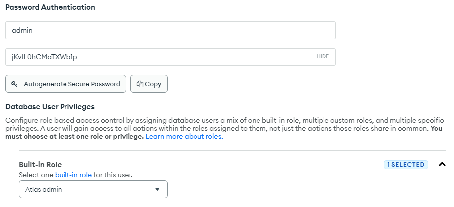
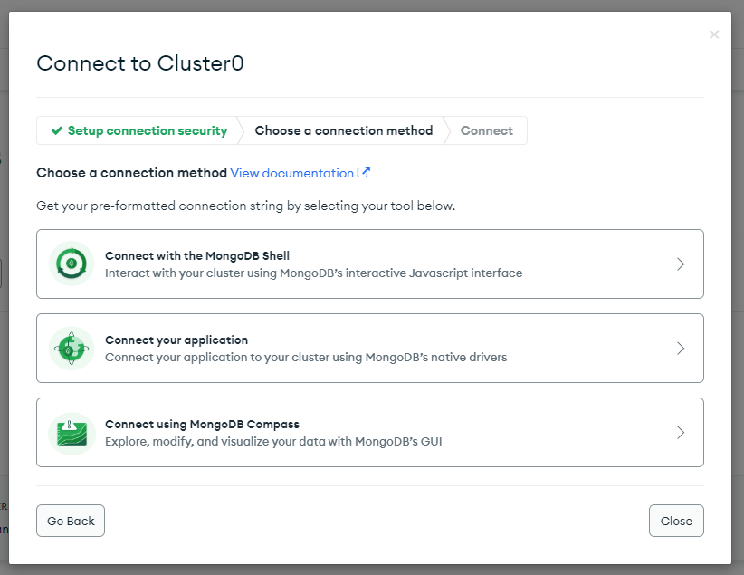
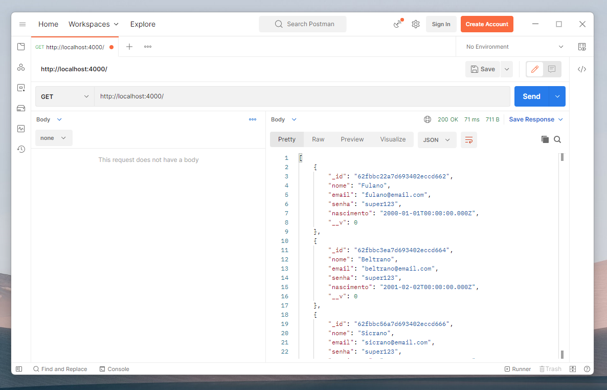

# Armazenando com o MongoDB

- Criando servidor
  - Criando rotas
  - Cadastrando MongoDB
    - Conectando com o MongoDB
    - Mongoose ações
  - Rota para obter dados
    - Ferramenta Nova!
  - Rota para adicionar dados
- A aplicação
  - Configurando a aplicação
  - Formulário
    - Estados e entradas
  - Publicando entradas
  - Deixando Seguro
- Resultado FInal

# Criando servidor

```bash
cd Desktop

mkdir proj05b

cd proj05b

npm init -y

npm install express cors mongoose --save
```

Após os programas terminarem altere o package.json para adicionar/modificar os seguintes parâmetros

```json
{
  ...
  "main": "./src/index.js",
  "type": "module",
  "scripts": {
    "start": "node ./src/index.js"
  },
  ...
}
```

## Criando rotas
A criação de rotas será semelhante ao da aula passada, mas agora teremos uma rota para o método POST

```js
import express from 'express'
import cors from 'cors'

const server = express()

server.use(cors())
server.use(express.json())

server.get('/', function(request, response) {
  response.json( { mensagem:"ROTA/GET" } )
})

server.post('/', function(response, request){
  response.json( { mensagem:"ROTA/POST" } )
})

server.listen(4000, function(){
  console.log('SERVIDOR EM FUNCIONAMENTO')
  console.log('http://localhost:4000/')
})
```

## Cadastrando MongoDB

Usaremos o banco de dados não relacional chamado MongoDB!

- Bancos de Dados Relacionais: abreviado diversas vezes pela sigla **RDBMS** e tem serviços como o Postgres, SQL Server e MySQL.
- Banco de dados Não relacionais: chamados pela comunidade carinhosamente de **NoSQL** para simplificar, tem serviços como o MongoDB e DynamoDB.

E a principal diferença está na estruturação e no comportamento na manipulação dos dados. Por questão de praticidade e tendência os banco de dados não relacionais estão sendo mais utilizados em tecnologias recentes.

Comece criando uma conta no MongoDB através do link [https://account.mongodb.com/account/register](https://account.mongodb.com/account/register)

Coloque a opção *Company Name* como SuperGeeks

Após a realização do cadastro lembre-se de verificar seu e-mail.

Feita a verificação você irá retornar para o site do MongoDB onde ele irá perguntar sobre o projeto. Marque a lingagem utilizada, o tipo de projeto (other) e que é para fins de estudo (no momento em que minha conta foi feita isso não afetou em nada o progresso do cadastra e escolha de planos), após isto você irá para a escolha dos planos.

Escolha a opção FREE, escolha a região do cluster mais próxima de você e para esta aula foi utilizado o **AWS**, no nome do Cluster é recomendado utilizar o nome do projeto.

E em seguida devemos criar um usuário com permissão de administrador para conseguir fazer todas as manipulações de dados e alterar as configurações do banco de dados, para criar o usuário vá em Database e clique em Database Access:



Ao criar o usuário você deve colocar um nome, como é o usuário que tem todas as permissões de acesso coloque como **"Admin"** e gere uma nova **senha segura** e copie. Essa senha é importante salvar em algum documento ou bloco de notas porque usaremos mais tarde!

Agora com o Cluster e o usuário configurado, vamos passar para as variáveis de conexões para conseguirmos fazer a aplicação do servidor se comunicar com o banco de dados do MongoDB usando o serviço Atlas, clique em Connect:



Ao criar uma conexão com o Cluster escola a opção **Node.js** e ela dará as instruções para a realização da conexão.

### Conectando com o MongoDB

Agora devemos fazer a conexão entre o Servidor e o banco de dados do MongoDB. Olhando de uma visão geral, o Servidor vai ser o intermediador entre o banco de dados e os clientes e aplicações.

Para conectar ao MongoDB vamos precisar de um novo Script o **conexao.js**

```js
/* scr/conexao.js */
import mongoose from "mongoose" 

// os dados abaixo são dados quando clicamos em connect no Cluster
const endereco = "mongodb+srv://<USUÁRIO>:<SENHA>@<CLUSTER>.mongodb.net/" 
//------------------
const configuracao = { useNewUrlParser: true, useUnifiedTopology: true }

mongoose.connect(endereco, configuracao, function() {
    console.log("CONECTADO COM O BANCO DE DADOS!")
})

mongoose.Promise = global.Promise
```

Seguindo o código **conexao.js** que criamos, quando o mongoose conectar com o banco de dados vai ser impresso no Terminal a mensagem de sucesso passado pela função.

E com o Mongoose Promise conseguimos fazer o uso do **mongoose** em qualquer parte do código, assim deixando Global. Foi bastante utilizado nas versões antigas como o Mongoose 4.

E agora criaremos o esquema do banco de dados para **armazenar** os dados de **forma estruturada**. Com o Mongoose **Schema** podemos criar campos com tipos de dados específico:

```js
/* src/bancodedados.js */
import mongoose from "mongoose"

const EsquemaUsuario = new mongoose.Schema({
  nome: String,
  email: String,
  senha: String,
  nascimento: Date
})

const usuario = mongoose.model("usuario", EsquemaUsuario)

export { usuario }
```

O Esquema Usuário criado no código é estruturado com o campo de nome, email e senha no formato de Texto e o campo de nascimento no formato de Data.

E o esquema é transformado em um modelo para executar as funções como armazenar, consultar, alterar e deletar os dados do MongoDB.

E em seguida iremos estudar as funções que podem ser executadas pelo Modelo do Mongoose conseguimos fazer as primeiras ações com o Banco de Dados através de comandos no Servidor Express que estamos programando.

Conexão com banco de dados configurada!

### Mongoose ações
Agora estudaremos as ações dos Modelos do pacote **Mongoose**.

Todos os Bancos de Dados possuem maneiras de manipular os dados que chamamos no MongoDB de ações. As principais são:

- Armazenar dados: onde podemos pegar dados e salvar de forma consistente no banco de dados;
- Consultar os dados: a ação que permite obtermos os dados armazenados anteriormente no banco de dados pelos clientes;
- Alterar os dados: essa ação permite alterarmos uma propriedade de algum dado que foi armazenado através da sua identificação;
- Excluir dados: é a função mais perigosa, que exclui as informações que foram armazenadas de forma permanente.
  
Essas ações também são conhecidas em inglês pela sigla **CRUD** ou Create, Read, Update and Delete. E agora aprenderemos a aplicar essas ações na programação do Servidor.

Vamos começar pelo comando **Find** que é equivalente a ação Consultar, mas é usado para consultar todas as informações armazenadas no banco de dados de uma única vez:

```js
/* exemplo */
const resultados = await usuario.find()
console.log(resultados)
```

Acima, tem o exemplo de uso do comando Find, veja que o comando junto com o **await** retorna todos os valores em uma constante que nomeamos como "Resultados".

E para recebermos um único dado específico do banco de dados usamos o comando **FindOne**, e como parâmetros passamos um dado que indique o que deve ser procurado:

```js
/* exemplo */
const resultado = await usuario.findOne({ 
  email: "fulano@mail.com"
})
console.log(resultado)
```

O parâmetro do FindOne é exigido um campo e valor que identifique quais os dados devem ser encontrados, e o parâmetro deve ser no formato de Objeto do JavaScript como mostrado no código acima.

Para inserir novos dados no MongoDB devemos criar um novo modelo contendo o objeto dos dados e em seguida usamos a função Save dentro do modelo criado. E assim as informações serão enviadas e armazenadas no MongoDB:

```js
/* exemplo */
const novoUsuario = new usuario({
    nome: "Fulano",
    email: "fulano@mail.com",
    senha: "super123",
    nascimento: new Date("2000-01-01")
})
const resultado = await novoUsuario.save()
console.log(resultado)
```

Quando armazenamos os dados no MongoDB é retornado um resultado que pode ser mostrado em um console.log.

Através do comando DeleteOne podemos fazer a exclusão de um dado dentro do banco de dados MongoDB, mas precisamos indicar qual o dado deve ser excluído com o parâmetro:

```js
/* exemplo */
const resultado = await usuario.deleteOne({
  nome: "Fulano"
})
console.log(resultado)
```

## Rota para obter dados

Agora que sabemos como utilizar as ações do banco de dados MongoDB através do pacote externo que instalamos, o Mongoose, vamos criar a rota para obter todos os dados do Banco de Dados.

Começando pelos códigos HTTP, acessando os sites abaixo podemos encontrar uma sessão completa com diversos códigos e imagens engraçadas de gatinhos e cachorros:

- https://http.cat/
- https://httpstatusdogs.com/

Cada código representa uma mensagem que pode ser enviada pelo Servidor aos clientes como resposta. E cada centena dos códigos representa uma categoria de resposta como mostrado abaixo:

> 100 -> Usados para Respostas de informação
> 
> 200 -> Usados para Respostas de sucesso
> 
> 300 -> Usados para Redirecionamentos
> 
> 400 -> Usados para Erros do cliente
> 
> 500 -> Usados para Erros do servidor

Então sabendo dessas categorias, podemos classificar como tipos de respostas. Se o servidor precisar enviar uma informação básica para o cliente será utilizado o código de centena 100. Caso o servidor tenha conseguido efetuar alguma operação ou ação pedida pelo cliente com sucesso o código de resposta deverá ser da centena 200 e assim por diante.

Abaixo está listado os códigos mais utilizados e conhecidos quando falamos de códigos de status HTTP:

> 200 -> OK
> 201 -> Created
> 
> 400 -> Bad Request 
> 404 -> Not Found
> 
> 500 -> Internal Server Error

O famoso 404 é um código de status que indica um erro de acesso do Cliente, ou seja sempre que for realizado uma requisição em uma rota que o servidor não tenha registrado será retornado a mensagem de "404 Not Found".

Voltado agora para o código...

No index.js vamos importar os dois arquivos criados anteriormente, o conexao.js para fazer a ligação entre o servidor e o MongoDB e as ações do Mongoose no arquivo bancodados.js:

```js
/* src/index.js */
import "./conexao.js" 
import { usuario } from "./bancodados.js"
```

Assim podemos fazer a conexão com o serviço Atlas do MongoDB assim que o servidor for acionado e usar as ações para manipular os dados do usuário.

Na rota GET de endereço "/" vamos adicionar a ação para obter todos os dados armazenados com o Mongoose usando o comando Find e o resultado retornado da ação é enviado como resposta para o cliente no formato JSON com o código HTTP 200:

```js
/* src/index.js */
servidor.get("/", async function(requisicao, resposta) {
  const resultados = await usuario.find()
  resposta.status(200).json(resultados)
})
```

Com a Rota GET configurada podemos passar para a programação da Rota POST e elaborar para armazenar os dados de usuários a partir do corpo recebido na requisição.

Rota para obter dados está finalizada!

### Ferramenta Nova!
Antes de partirmos para a programação da Rota para adicionar dados ao banco de dados. Vamos aprender uma nova ferramenta!

A requisição e resposta HTTP seguem um protocolo de envio e tem um padrão em sua estrutura. É construída com um cabeçalho onde possui todas as informações necessárias para o tráfego e abaixo o corpo contendo informações primordiais de funcionamento das aplicações.

Abaixo tem o exemplo de uma resposta HTTP:

```http
GET / HTTP/1.1
HOST: http://localhost:4000
Content-Type: application/json; charset=UTF-8
Content-Length: 100
Transfer-Encoding: chunked
Date: Wed, 05 May 2010 21:10:14 GMT

[
  {
    "_id": ObjectId("909c523ccacd440b"),
    "nome": "Fulano",
    "email": "fulano@email.com",
    "senha": "super123",
    "nascimento": "2000-01-01",
    "__v": 0
  }
  ...
]
```

Veja a quantidade de informações que são passadas e enviadas pela internet enquanto o servidor está funcionando.

Nesse caso tem um conjunto de informações estruturadas e para ajudar a compreensão foi colocado de forma colorida e organizada, mas o que temos na verdade é um texto sendo enviado e às vezes sem os espaçamentos corretos.

- Para conseguirmos visualizar os dados de uma forma mais organizada iremos instalar uma nova ferramenta para facilitar as requisições do servidor. Usaremos o Postman, bastante conhecido no ambiente web e utilizado pelos programadores de backend.

Acesse o site oficial e faça o download da ferramenta:

- https://www.postman.com/downloads/

A instalação é bem trivial e semelhante às demais ferramentas, leia os termos de uso da ferramenta e concorde, então prossiga avançando até concluir a instalação da ferramenta em sua máquina.

No site terá disponíveis todas as versões e também para todos os sistemas operacionais. 

Caso não queira fazer a instalação é possível fazer o uso da versão online sem a necessidade de fazer o download do software e de instalar alguma dependência na máquina. Basta acessar o site:

- https://web.postman.co/

Agora com a ferramenta aberta em sua máquina, selecione o Workspace e preencha com o endereço do Localhost do servidor com a porta correta. Em seguida faça a requisição da Rota GET.

Essa ferramenta vai auxiliar a visualizar o corpo, tempo de resposta entre servidor-cliente, tamanho da resposta HTTP em bytes e entre outras informações que podem ser exploradas, como mostrado na imagem abaixo:



Temos agora uma grande arma em nossas mãos, estamos preparados até os dentes para enfrentar o próximo desafio de programar a rota para adicionar dados e podemos realizar testes minuciosos para ver o comportamento da rota.

Ferramenta instalada com sucesso!

## Rota para adicionar dados

Faremos a programação da Rota POST para adicionar novos usuários ao banco de dados do MongoDB!

Para usar a ação do Mongoose para armazenar os dados, precisamos antes entender uma estrutura utilizada no JavaScript para verificar se um conjunto de comandos obteve êxito ou não na execução.

Com a estrutura de comandos Try e Catch podemos realizar uma tentativa de execução em um conjunto de comandos. Funciona da seguinte forma:

```js
/* exemplo */
try {
  // Código para ser tentado executar
}
catch(erro) {
  // Código para ser executado se a tentativa der errado
}
```

O comando Try serve para receber dentro de si os comandos para a execução, para o caso prático que teremos usaremos os comandos de criação de usuário e o método Save para armazenar o usuário criado.

Agora, caso os comandos contidos dentro do comando Try venham a falhar ou gerar algum erro o Catch é imediatamente acionado e o erro é retornado na estrutura.

A rota ficaria assim com a aplicação da estrutura Try-Catch:

```js
/* src/index.js */
servidor.post("/", async function(requisicao, resposta) {
  try {
    const novoUsuario = new usuario(requisicao.body) 
    const resultado = await novoUsuario.save()
    resposta.status(201).json(resultado)
  }
  catch(erro) {
    console.log(erro.message) 
    resposta.sendStatus(500) 
  }
})
```

Se tudo acontecer exatamente como esperado, o cliente vai receber como resposta o resultado e o código enviado pelo servidor será Created ou conhecido pelo código de status HTTP 201.

Se não houver êxito na execução o cliente recebe o Internal Server Error, o temido código 500. E no console é printado a mensagem do erro para auxiliar nós programadores e encontrar o possível erro da aplicação do servidor.

Dentro da ferramenta Postman podemos adicionar o corpo da requisição e montar uma estrutura JSON para ser enviada para o servidor. Ao configurar e realizar o envio da requisição vai ser retornada a resposta na lateral direita com a mensagem de êxito:

# A aplicação

## Configurando a aplicação

## Formulário

### Estados e entradas

## Publicando entradas

## Deixando Seguro

# Resultado FInal