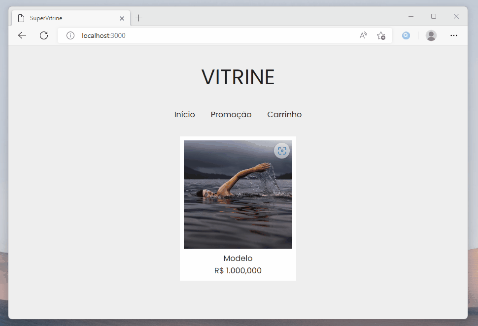

# SuperVitrine: Construindo a Vitrine


Agora faremos um novo projeto que será maior do que os projetos que desenvolvemos anteriormente, porque vai contar com **todos os conceitos** que aprendemos antes em um só projeto.

Iremos programar a **SuperVitrine**, é um projeto baseado em uma categoria de sites que são as vitrines virtuais. As **vitrines virtuais** são sites que contém fotos em exibição e informações de produtos, diferentes das lojas onlines não contam com um sistema complexo de logística, entrega ou estoque.

Será desenvolvido o essencial para conseguirmos anunciar **produtos para venda na internet**. O projeto vai ser dividido em **cinco partes** onde começamos produzindo a página inicial com a vitrine dos produtos!

Bora começar o projeto!

## Lesson 02 - Criando a aplicação

Agora que foi apresentado o projeto que iremos desenvolver, vamos começar criando a aplicação em React!

Acesse a área de trabalho do seu sistema operacional e em seguida faça a **criação** da aplicação React. É recomendado colocar no nome do projeto a letra **‘F’** como sufixo para indicar que estamos desenvolvendo o **Front End**:

```bash
npx create-react-app proj06f --template empty
```

Com a aplicação React criada acesse a pasta e realize a instalação do pacote **React Router Dom** em sua versão 6 para programarmos as rotas e o **Styled Components** para estilizar os componentes:

```bash
cd proj06f
npm install
npm install react-router-dom@6 styled-components --save
```

Agora com a configuração da aplicação em **React** finalizada, abra a pasta através do **VSCode** para programarmos. Você pode usar o comando abaixo para abrir o editor automaticamente:

```bash
code .
```

Com o editor aberto podemos partir para a programação da aplicação!

## Lesson 03 - Configurando Public

Nessa etapa vamos fazer a configuração dos arquivos que estão na pasta public!

Comece abrindo o arquivo **index.html** para fazer a programação da estrutura da página. E vamos configurar o **título**, conjunto de **caracteres**, **visualização** da página, conectar o **arquivo de estilo** e incluir o **ícone**:

```html
<!DOCTYPE html>
<html>
  <head>
    <meta http-equiv="Content-Type" content="text/html;charset=UTF-8" /> 
    <meta name="viewport" content="width=device-width, initial-scale=1.0" /> 
    <title> SuperVitrine </title> 
    <link rel="stylesheet" href="/style.css" />
    <link rel="shortcut icon" href="/favicon.png" type="image/png" />
  </head>
  <body> 
    <div id="root"></div> 
  </body>
</html>
```

Para o favicon é recomendado usar formato de imagens compatíveis como png, ico e jpg ou jpeg.

Antes de passar para a programação da folha de estilo, acesse o site **fontgoogle** e escolha uma bela fonte de texto. Faça a seleção e copie o comando de inclusão via import no CSS:

- https://fonts.google.com/

Agora dentro do **style.css**, cole na primeira linha o comando de importação da fonte:

```css
@import url("https://fonts.googleapis.com/css2?family=Poppins");

* {
  font-family: "Poppins", sans-serif;
  font-size: 12pt;
}

body {
  background: #eee;
  color: #222;
  margin: 0 auto;
  width: 768px;
}

a {
  color: #222;
  text-decoration: none;
}
```

Com o seletor de todos os elementos, mude a fonte para "Poppins" e o tamanho para 12 pontos. No elemento body altere o fundo para a cor branca, as letras de cor cinza escuro, margem para alinhar ao centro na horizontal e um comprimento de 768 pixels.

No elemento **< link>** altere a propriedade de estilo para a letra cinza escura e remova o detalhe de sublinhado padrão dos links de página.

E assim finalizamos a configuração da pasta public.

## Lesson 04 - Configurando Source
Faremos uma rápida configuração no arquivo **main.jsx**!

Comece fazendo a importação do pacote do React e da função **CreateRoot** de dentro do **React DOM** Client. Em seguida, faça a importação do arquivo Rotas que iremos criar mais adiante.

```jsx
import React from "react" 
import { createRoot } from "react-dom/client" 

import Rotas from "./Rotas" 

const contentor = document.getElementById("root")
const origem = createRoot(contentor) 

origem.render(<Rotas/>)
```

O contentor vai receber o elemento **< div>** de atributo id de valor **root** e a origem vai ser criada com no contentor.

Faça a origem renderizar o elemento Rotas que iremos programar a seguir!

## Lesson 05 - Rotas da aplicação

Crie o arquivo **Rotas.jsx** dentro da pasta **SRC**!

O arquivo **rotas** vai ser responsável em renderizar a página correspondente ao acesso feito pelo usuário na aplicação do **React**. Precisamos criar uma rota principal para ser a **Vitrine** do site para exibir todos os produtos oferecidos.

Programe a importação dos pacotes no arquivo **Rotas**:

```jsx
import React from 'react';
import { BrowserRouter, Routes, Route } from 'react-router-dom';

export default function Rotas() {
  return (
    <BrowserRouter>
      <Routes>
        
      </Routes>
    </BrowserRouter>
  )
}
```

Após criar a estrutura das **Rotas**, vamos criar a pasta para colocarmos as páginas da aplicação, dentro do **SRC** crie uma pasta com o nome de **"pages"**.

No arquivo **rotas** faremos a importação da página **Vitrine**:

```jsx
import Vitrine from "./pages/Vitrine";
```

E com a página **Vitrine** importada vamos configurar uma nova **Rota**.

Adicione para dentro do componente uma Rota com o atributo **Index** habilitado para indicar que a página é a **inicial**, adicione o caminho e o elemento que vai ser renderizado:

```jsx
<Route inde path='/' element={ <Vitrine /> } />
```

O caminho padrão da aplicação **React** é o "/" e o elemento que devemos colocar para ser **renderizado** é o arquivo da página Vitrine que importamos.

Configurado o arquivo **Rotas**!

## Lesson 06 - Página Vitrine

Vamos agora criar o arquivo **Vitrine.jsx**.

Na página Vitrine importe o pacote do **React** e crie uma **função** para ser exportada por padrão. Tudo o que colocarmos dentro do da função vai ser renderizado quando o usuário acessar a **página inicial**.

Faremos **futuramente** os componentes para mostrar a barra de navegação no topo e a vitrine principal abaixo. No arquivo programe como mostrado abaixo:

```jsx
import React from 'react'

export default function Vitrine() {
  return (
    <>
      
    </>
  )
}
```

Depois de **programada** toda a etapa inicial da página da Vitrine, podemos fazer o **teste** e **verificar** se a aplicação até o momento está funcionando corretamente.

Faça a **inicialização** da aplicação através do comando:

```bash
npm start
```

Podemos partir para os **componentes** para a página!

## Lesson 07 - Componente Navegação


Vamos desenvolver o componente de **Navegação** para o **topo** das páginas.

O componente **Navegação** vai servir para guiar o usuário entre as páginas que podem ser acessadas e indicar em destaque o nome da página. Agora para começarmos a **programar**, importe o pacote do **React** e o **Styled Componentes**:

```jsx
import React from "react"
import styled from "styled-components"
```

Vamos começar pelo modelo:

Faça a construção do modelo através do styled usando o **elemento** div, como propriedade de estilo passe o **overflow** como hidden para esconder qualquer elemento que transborde o limite permitido.

```jsx
const Modelo = styled.div`
  overflow: hidden;
`
```

Em seguida devemos fazer o modelo para ser o **Título** e uma região para colocar os **Botões** e serão adicionados no componente **Navegação**!

Faça a declaração do **“ModeloTitulo”** e o **“ModeloBotoes”**. Para o modelo de título coloque o tamanho de fonte para 32 pontos, usando o espaçamento vertical de 32 pixels, assim nenhum elemento ficará próximo do título destacando ao topo. E por fim, alinhe o texto ao centro.

```jsx
const ModeloTitulo = styled.div`
  font-size: 32pt;
  padding: 32px 0;
  text-align: center;
`

const ModeloBotoes = styled.div`
  display: flex;
  gap: 32px;
  justify-content: center;
`
```

Para o modelo de botões coloque a propriedade de distribuição **flexível** e use o espaçamento de vão para 32 pixels justificando os botões ao centro.

O **“ModeloBotões”** irá permitir colocar qualquer botão que leve o usuário a outra página, como exemplo: Página de **Produto**, **Promoção** e ao **Carrinho**.

Com os modelo declarados passe para a criação do componente **Navegação**:

```jsx
export default function Navegacao(props) {
  return (
    <Modelo>
      <ModeloTitulo> { props.titulo } </ModeloTitulo>
      <ModeloBotoes> { props.children } </ModeloBotoes>
    </Modelo> 
  )
}
```

Faça a exportação padrão de uma função com o nome **“Navegacao”** e dentro de parênteses use o **“props”** do React para receber **propriedades** via importação.

Retorne o elemento **Modelo**, contendo dentro:

- Modelo de **Título** com a propriedade de Título para ser o texto;
- Modelo de **Botões** com a propriedade children;

Aí a **criação** do componente está feita até o momento, o que faremos em seguida é construir os demais **componentes** que serão utilizados nesta aplicação!

## Lesson 08 - Componente Principal


O componente **Principal** é o mais importante de todos!

Agora faremos a construção do componente principal, onde ficará contido a parte **visual** de todos os produtos **catalogados** no sistema, portanto devemos ter uma maior **atenção** na criação deste componente.

O Componente **Principal** segue o mesmo princípio de criação que os demais, precisamos fazer a importação dos pacotes do **React** e **Styled-Components**, como é reforçado abaixo:

```jsx
import React from 'react'
import styled from 'styled-components'
```

Depois de feita a importação dos pacotes que serão usados nesse componente, faça a **declaração** dos modelos de **Elementos**.

Comece declarando o **Modelo**:

Como propriedade de estilo coloque a exibição como **flexível**, para o caso em que os elementos de produtos excedam o espaço horizontal será quebrado para a linha de baixo habilitando a propriedade flex-wrap:

```jsx
const Modelo = styled.div`
  display: flex;
  flex-wrap: wrap;
  gap: 16px;
  justify-content: center;
  padding: 32px 0;
`
```

Para cada produto haverá um vão interno de 16 pixels, todos alinhados ao centro com um espaçamento de contorno de 32 pixels.

E em seguida o modelo de estilo do **Produto**, que terá o fundo da cor branca para destacar do fundo cinza claro e um espaçamento opcional de 8 pixels para ficar no estilo de **contorno** da foto:

```jsx
const Produto = styled.div`
  background: #fff;
  padding: 8px;
`
```
O **Produto** será o responsável por **conter** a **imagem** principal do produto e também todos os **dados** que serão mostrados na página inicial como o modelo, marca e preço.

Por isso devemos declarar dois novos modelos para servir de base ao produto e **estilizar** da forma correta, comece criando a constante **“ProdutoImagem”** com o elemento de imagem com o Styled-components:

```jsx
const ProdutoImagem = styled.img`
  height: 220px;
  object-fit: cover;
  width: 220px;
`

const ProdutoDados = styled.div`
  text-align: center;
`
```

O **“ProdutoImagem”** terá o comprimento e altura de 220px, ou seja, um quadrado. As **imagens** que são fora de escala deverão ser ajustadas sem serem achatadas para a dimensão definida, usamos a propriedade **object-fit** para alinhar corretamente.

O **“ProdutoDados”** irá contar apenas com uma única **propriedade** de estilo sendo o text-align para alinhar os textos ao centro da modelo **Produto**.


```jsx
export default function Principal() {
  return (
    <Modelo>
      <Produto>
        <ProdutoImagem 
          src="https://picsum.photos/800/800"
          alt="Foto do Produto"/>
        <ProdutoDados>
          <div> Modelo </div>
          <div> R$ 1.000,000 </div>
        </ProdutoDados>
      </Produto>
    </Modelo> 
  )
}
```

Quando finalizado os dois modelos de estilo, faça a adição para dentro do Produto e inclua os atributos de imagem ao **“ProdutoImagem”** como o src e alt. E dentro do elemento **“ProdutoDados”** coloque duas divisões para ser o respectivamente o modelo e o preço do produto.

Com os **componentes** finalizados podemos voltar para a página e incluí-los e ver a grande mudança acontecer na **página inicial** da aplicação!

## Lesson 09 - Usando os componentes


Nas últimas duas Lessons passamos fazendo a programação sem ver o resultado nitidamente dentro da página, chegou o momento de **incluirmos** os componentes para a **página Vitrine** e assim vermos o resultado.

O **primeiro passo**, assim como feito em projetos anteriores é importar os componentes: É necessário nesse caso passarmos o **endereço** correto de onde está localizado os arquivos, caso contrário não irá funcionar e um erro será mostrado!

Siga como mostrado abaixo a importação dos **componentes** na página:

```jsx
import Navegacao from '../components/Navegacao'
import Principal from '../components/Principal'
```

E dois de digitado as linhas de **importação**, faremos a inclusão para a **página Vitrine** da seguinte forma:

Faça a inclusão do elemento **“Navegacao”** e como atributo passe o título como String, dentro do conteúdo do elemento coloque três elementos de **link** para ser o início, promoção e o carrinho.

Abaixo coloque o elemento **Principal** como tag única, até o momento não será preciso passar nenhum **atributo** específico, porém quando criado os **produtos** de exemplo será passado via **props**.

```jsx
export default function Vitrine() {
  return (
    <>
      <Navegacao>
        <a href="/"> Início </a>
        <a href="/produto/1234"> Promoção </a>
        <a href="/carrinho"> Carrinho </a>
      </Navegacao>

      <Principal />
    </>
  )
}
```

Em resumo as etapas seguidas foram, **importar** os componentes logo após fazer o uso como elementos dentro da página Vitrine passando todos os **atributos** e elementos necessários para o **funcionamento**.

E assim que encerrado, abra o **Terminal** e faça a **inicialização** do React!

## Lesson 10 - Produtos de Exemplo


Chegou o momento de **adicionar** os **produtos** na página de vitrine!

Para que os produtos sejam mostrados de uma forma mais eficiente ao invés de programar cada componente, um por um na mão. **Precisamos** criar um arquivo para ser como uma base de dados de exemplo.

Nesse arquivo **javascript** é preciso retornar uma lista contendo vários produtos no formato de objeto do javascript, contendo as principais informações como: **código**, marca, modelo, preço, descrição e etc.

Comece criando o arquivo **“ProdutosExemplo.js”** no diretório “datas” na pasta SRC:

```js
/* src/datas/ProdutosExemplo.js */
const ProdutosExemplo = [ /.../ ]
```

Depois de criado o arquivo, declare uma **constante** com o nome do arquivo, **“ProdutosExemplos”** e atribua uma **lista** que será preenchida com informações e dados dos produtos usando a estrutura de **objetos** do javascript.

Em seguida crie o **primeiro produto** como mostrado abaixo:

```js
/* src/datas/ProdutosExemplo.js */
const ProdutosExemplo = [
  {
    codigo: "1234",
    marca: "Marca",
    modelo: "Modelo1",
    preco: 1000,
    descricao: "O produto é muito bonito porque...",
    imagens: [
      "https://foto.com/produto-imagem-1.jpg",
      "https://foto.com/produto-imagem-2.jpg",
      "https://foto.com/produto-imagem-3.jpg",
    ]
  },
  /.../
]
```

>
> Deixe um arquivo disponível para os alunos para não gastar tempo de aula preparando isto
>

Para fazer o objeto do produto dentro da lista de **array**, use a **propriedade** código passando um valor de **string**, assim como a marca, modelo e descrição. Para a propriedade preço passe o tipo de dado **numérico**, inclusive é passível de ser preenchido com valores decimais como estamos lidando com dinheiro é preciso ter o centavos de **Reais**.

O caso em especial é da propriedades imagens, onde será passado uma lista com **3 strings** para armazenar as três imagens do produto. O **recomendado** é ter diferenciação para o usuário conseguir ter uma noção visual abrangente sobre o que está procurando.

Assim depois de terminado a adição dos **produtos**, no final do código faça a exportação da **constante** declarada:

```js
/* src/datas/ProdutosExemplo.js */
.../
export default ProdutosExemplo
```

Por fim, você tem agora uma base de dados exemplo que servirá **temporariamente** como o fornecimento de dados para a aplicação enquanto não temos o servidor para transferir os dados do **MongoDB**, mas esta tarefa fica para um futuro breve!

## Lesson 12 - Personalizando componente



Antes de ajustar o funcionamento do **componente** para receber toda a lista que produzimos de produtos de exemplo, é necessário colocar um **estilo** para a **interação** do usuário.

Como mostra a **imagem** acima, é possível colocar uma ação de estilo quando o **mouse** estiver por cima, assim o usuário consegue interagir e até mesmo **aumentar** o tamanho da imagem para ter uma percepção melhor sobre o produto.

Voltando ao arquivo **“Principal.jsx”** dentro do diretório componentes, faça a adição do evento hover no modelo de estilo do Produto, como mostra abaixo:

```jsx
/* src/components/Principal.jsx */
const Produto = styled.div`
  background: #fff;
  padding: 8px;
  transition: 0.2s;
  &:hover {
    transform: rotateZ(2deg) scale(1.1);
    transition: 0.2s;
  }
`
```

Para funcionar corretamente o **efeito de interação** use a propriedade de estilo **“transform”** alterando a **rotação Z** do elemento em 2 graus e a escala aumentada em 10 por cento para a melhor visualização.

Se não tiver a propriedade transition o efeito será instantâneo passando uma ideia de uma aplicação **“quebrada”** para ter o efeito suave use o tempo de duração definido no **transition**.

E está feito e aplicado a **interação visual** com o produto!

## Lesson 13 - Ajustando componente
Chegou o momento de fazer os **ajustes** de funcionamento no componente Principal!

Para que o **componente Principal** mostre todos os produtos que são passados através do **parâmetro props**, precisamos programar um mapeamento do **array** produtos: E para cada produto contido na lista será criado uma **estrutura** de apresentação.

O mapeamento deve ser feito através do método **map** do javascript, sendo que dentro conterá uma função passando como **parâmetro** os dados estruturados em objeto do produto e a contagem através do **índice**:

```jsx
/* src/components/Principal.jsx */
.../
export default function Principal(props) {
  return (
    <Modelo> 
      {
        props.produtos.map(function(produto, indice) {
          ...
        })
      }
    </Modelo>
  )
}
```

O método **map** deve ser incluído junto ao comando **props.produtos**, como está descrito no código acima!

E para que seja mostrado o produto deve retornar os Modelos que foi produzido no topo do código como o **“Produto”**, **“ProdutoImagem”** e o **“ProdutoDados”**, todos recebendo as variáveis passada pelo parâmetro do produto:

```jsx
/* src/components/Principal.jsx */
.../
export default function Principal(props) {
  return (
    <Modelo> 
      {
        props.produtos.map(function(produto, indice) {
          return (
            <Produto key={ indice }>
              <ProdutoImagem
                src={ produto.imagens[0] }
                alt="Foto do Produto"/>
              <ProdutoDados>
                  <div> { produto.modelo } </div>
                  <div> R$ { produto.preco } </div>
              </ProdutoDados>
            </Produto> 
          )
        })
      }
    </Modelo>
  )
}
```

Um **detalhe** importante a ficar registrado: O elemento de **repetição** deve sempre conter uma chave de identificação, para esse caso usaremos o atributo **key** contendo o valor do índice!

Para o recurso gráfico da imagem, passe a **primeira imagem** da lista como **destaque**, nos dados do produto coloque o **modelo** no topo e o **preço** com o símbolo de cifrão da moeda Real na frente.

Está finalizada a etapa de ajuste!

## Lesson 14 - Completando a Vitrine


A última etapa é mostrar os produtos em um **sistema de lista** na página Vitrine, e chegou o momento de unificar os **produtos** de exemplo com o componente Principal!

Comece importando o arquivo **“ProdutoExemplo.js”** para dentro da página **Vitrine**, não se esqueça de colocar corretamente o endereço, quando a pasta **indicada** está disposta em uma raiz comum é preciso usar o “../” para indicar o retorno à raiz:

```jsx
/* src/pages/Vitrine.jsx */
.../
import ProdutosExemplo from "../datas/ProdutosExemplo"
/...
```

O esperado é que seja retornado a constante contida dentro do arquivo de produtos fornecidos. Portanto faça a inclusão do **“ProdutosExemplos”** ao componente **Principal**.

Sendo mais específico passamos através do props então a forma correta é usando o **atributo** produtos como é mostrado no **código** de exemplo abaixo:

```jsx
/* src/pages/Vitrine.jsx */
.../
<Principal produtos={ ProdutosExemplo }/>
/...
```

Agora que os comandos foram incluídos, faça a **inicialização** da aplicação caso seja necessário e veja a página **vitrine** cheia de produtos!

## Lesson 15 - Finalização

E você acaba de finalizar a **primeira etapa** do projeto SuperVitrine, até o momento foi iniciado um novo **projeto** contando com a fabricação da página vitrine onde foram colocados diversos produtos para as pessoas acessarem na **página inicial**.

Falando agora mais tecnicamente, criamos o projeto do **React** e em seguida foi feito a configuração para o funcionamento correto. Foi **instalado** os pacotes iniciais para o roteamento com o **React Router DOM** e o desenvolvimento dos **principais** componentes.

O desafio agora é colocar o máximo possível de produtos **diversificados** para a vitrine ter uma qualidade maior, caso precise **programar** novamente, retorne as lessons anteriores e dedique-se a criar novas **funcionalidades**!