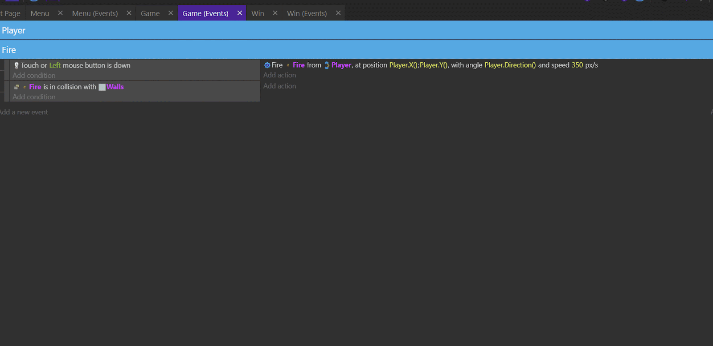

# Pathfind

## Pré-aula
- Baixe o arquivo no portal
- Abra no GDevelop para os alunos
- Explique-os que o arquivo está disponível para download no portal

Neste jogo o nosso personagem deve chegar até o final da fase, que é marcado por uma bandeira, sem ser pego pelos zumbis no meio do labrinto.

Nós podemos matar os zumbis para abrir caminho e para isso vamos atirar neles.

## Movimentação e Colisão
Comoce adicionando ao Player o comportamento *TopDown* e *FireBullets* (Search New Behaviors).

O *FireBullets* deve ser configurado com Coldown em 0.25

Com isso nosso Player pode andar, mas ainda não atira e também não colide com as paredes. Para resolver isto vamos até *Game (Events)* programar .

Para programar a colisão entre o Player e as paredes, vá até a aba *Game (Events)*. Como queremos que o Player colida com as paredes a todo momento, então não precisamos de nenhuma condição, apenas uma ação: clique em **Add action**, selecione o **Player** e clique na opção **Separate objects**. Depois, selecione o objeto **Walls** e clique em ok.

## Criando Grupos
Grupos de eventos são um recurso muito útil no GDevelop pois podemos agrupar elementos comuns e dessa forma nosso código fica mais organizado, o que facilita o entendimento do código.

Para criar um novo grubo basta clicar com o botão direito na tela e escolher a opção **Add Other > Event Group** e damos um nome para o nosso grupo.

Para adicionar um evento em um grupo nós precisamos apenas arrastar o evento para o grupo.

O nome desse primeiro grupo será *Player*

## Rotacionando o Player
Clique em *Add action*, selecione o player e depois a opção **Rotate Toward Position**. Na opção X position, digite MouseX(), e na opção Y position, digite MouseY(). Em Angular speed, digite 0. Depois, clique em ok.

## Programando a Câmera para seguir o Jogador
Clique em *Add action* e digite **Center the camera on an object** e clique na opção de mesmo nome depois selecione o **Player** e clique em ok.

## Bola de Fogo
Crie um novo grupo clicando com o botão direito no botão add a new event e selecione a opção Group. Depois, mude o nome desse grupo para Fire.

Agora, é preciso criar um novo evento. Para criar um evento dentro de um grupo vazio, clique com o botão direito sob o nome do grupo e selecione a opção Add Sub-event.

Agora que o evento foi criado, você pode começar a programar a bola de fogo. Para isso, clique na opção *Add condition*, digite “mouse” na caixa de busca e selecione a opção **Mouse button pressed or touch held**, e do lado direito na opção button to test, selecione Left (primary). Depois, clique em ok.

Agora, clique em *Add action*, selecione o *Player* e clique em **Fire bullet**. Na opção X position, digite **Player.X()**. Na opção Y position, digite **Player.Y()**. Na opção The bullet object, selecione **Fire**. Na opção Angle of bullets, digite **Player.Direction()**. Por último, na opção speed of the bullet, digite 350.

Perceba que as bolas de fogo estão atravessando as paredes, e desse jeito vai ser muito fácil destruir os inimigos. Para aumentar um pouco a dificuldade, programe para que a bola de fogo seja destruída quando ela tocar os muros.

Crie um novo Sub-event clicando com o botão direito em cima do grupo, e depois clique em *Add condition* e selecione *Fire*. Então, na caixa de busca, digite **Collision**, clique na opção de mesmo nome e selecione o objeto *Walls*. Depois, clique em ok.

Agora, clique em Add action, selecione Fire na caixa de busca, digite “delete”, selecione a opção Delete an object e clique em ok.

A última coisa que você irá programar no grupo Fire é a colisão entre o fogo e os inimigos. Quando isso acontecer, tanto o fogo como o inimigo devem ser destruídos, e para isso você precisará duplicar o código que você acabou de criar.

Clique com o botão direito ao lado do botão add condition e selecione a opção copiar. Depois, clique com o botão direito no mesmo lugar e clique em colar.

Clique em Walls e mude para Enemy, conforme mostra a imagem a seguir. Do lado direito, mantenha a parte em que o fogo é destruído. Porém, para fazer com que o inimigo também seja destruído, clique em Add action, selecione o Enemy, clique em Delete an object e depois em ok.

Adicione um inimigo no cenário e teste

> Dependendo da turma essa quantidade de conteúdo pode já ser o bastante então é possível interromper a aula e continuar na aula seguinte
> Avalie o seu tempo e o cansaço mental dos alunos, não adianta continuar se eles estiverem cançados do conteúdo

## Programando Inimigos
Para começar, crie um grupo chamado Enemy, e dentro dele você irá programar para que, sempre que o  timer chamado EnemySpawner chegar a 3 segundos, ele crie um novo inimigo e volte a 0.

Crie um *sub-evento* dentro do grupo Enemy, clique em *Add condition* e digite "begin" na caixa de busca. Então selecione a opção **At the beginning of the scene**. Clique em *Add Action* e digite "timer" na caixa de pesquisa e escola **Start (or reset) a scene timer**, e na opção **Timer's name** digite "EnemySpawner" (com àspas).

Crie um novo *sub-evento* dentro do grupo Enemy, clique em *Add condition* e digite "scene timer" na caixa de busca. Então, selecione a opção *Value of a scene timer*. Na opção Timer’s name digite/escolha “EnemySpawner”, na opção *Sign of the test* escolha **greather or equal to** e em *Time in seconds* coloque 3. Clique em ok.

Clique em *Add Action* e digite "timer" na caixa de pesquisa e escola **Start (or reset) a scene timer**, e na opção **Timer's name** escolha "EnemySpawner" para que o nosso timer reinicie.

Clique em *Add Action* e digite "create" na caixa de pesquisa e escolha **Create a object**  e nas opções coloque-as da seguinte forma:
- *Object to create*: Enemy
- *X position*: RandomInRange(0, 800)
- *Y position*: RandomInRange(0, 600)

## Pathfinding
O inimigo já nasce e morre, então agora só falta ele perseguir o jogador. Para que ele faça isso, você utilizará um conceito chamado **Pathfind**, que serve para que um personagem vá até uma posição desviando de obstáculos. Por sorte, o GDevelop tem um behavior que serve exatamente para isso! Para adicionar este behavior ao inimigo, dê um clique duplo sobre ele na aba Objects, vá até a aba behaviors e clique no botão Add a behavior to the object. Então, selecione o behavior Pathfinding e digite 200 na opção Acceleration e 50 na opção Max. speed. Finalmente,clique em Apply.

Para que este behavior funcione, além de adicioná-lo ao personagem, é necessário programá-lo. Para isso, clique na aba *Game (Events)* e crie um novo *sub-evento* no grupo *Enemy*. Como queremos que os inimigos corram atrás do *player* o tempo todo, não precisamos de uma condição, apenas de uma ação. Assim sendo, clique em *Add action*, selecione o *Enemy*, clique na opção *Move to a position* e, na opção *Destination X* position digite **Player.X()**. Já na opção *Destination Y* position, digite **Player.Y()** e depois clique em ok.

Salve e teste seu jogo, e perceba que agora os inimigos já seguem os players, porém ainda não desviam das paredes. Para isso, é necessário marcar as paredes como obstáculos. Para fazer isso, vá até a aba Game, clique duas vezes no objeto Walls, adicione a ele o behavior **Obstacle of pathfinding** e clique em apply. Depois, salve e teste novamente o jogo.

> Esta parte é o principal da aula
> Considere o que vem a seguir é importante, para eles verem como é simples fazer a pontuação
> Pode simplificar os próximos tópicos o quanto achar necessário

## Pontuação
> No portal é considerado que a variável já existe e este não é o caso.
> Mas como esta unidade não se foca em explicar o que é uma variável basta criar uma com os alunos

Vá até o **Project Manager > Global Variables** e crie uma variável chamada **Points** tipo *number* com valor inicial 0

Agora na programação vá até o evento em que o inimigo é destruido e clique em *Add Action* digite "global variable" na caixa de pesquisa e escola **Change number variable**, as opções ficarão assim:
- *Variable*: Points
- *Modification's sign*: + (Add)
- *Value*: 1
  
Com isto a pontuação muda, mas ainda precisamos mostrar ela na tela.

Dentro deste evento, clique em *Add action*, selecione o objeto **ScoreBoard** e, na caixa de busca que aparecer, digite modify. Então, selecione a opção **Modify the text** e, na opção *Modification’s sign*, selecione a opção **= (set to)**. Na opção Value digite “Points: “ + GlobalVariableString(Points) e clique em ok.

## Programando a condição de vitória
Vá até o grupo Player e crie um sub-evento. Então, clique em Add condition e selecione o Player. Na caixa de busca, digite collision e clique na opção Collision. Depois, selecione o objeto Flag e clique em ok.

Agora clique em Add action. Na caixa de busca, digite scene e selecione a opção Change the scene. Na opção Name of the new scene, digite “Win” e clique em ok.

