# Batalhando nas Nuvens

## Pré-aula
Neste ponto vale lembrar aos alunos que eles devem começar a pensar no TCC para fazer em casa nas próximas aulsa. Veja o progresso deles no portal e informe aos pais. Mantenha-os atualizados sobre o que deve ser feito em casa.

Garanta que os assets para o projeto estão em algum local acessível para os alunos.

Esta aula foi divida em 3 já no portal por ser longa. O quanto for possível adiantar das próximas aulas, melhor.

## Início
Crie um projeto em branco (não esqueça de colocar o nome do aluno).

Após criado o projeto vá até o **Project Manager** e altere as configurações de resolução para que a tela tenha o tamanho de *800x600* como nas outras aulas, o **Game resolution mode** para *No changes in game size* e o **Scale Mode** para *Nearest* que mostrará um novo campo **Rouded Pixels** que devemos marcar.

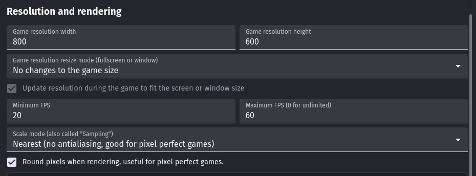

Aproveite o mude o nome da cena para **Game**

## Adicionando Objetos
Mias uma vez teremos os objetos separados em 4 camadas, então abra o aba Layers e vamos criar as mesmas camdas do Super Pong

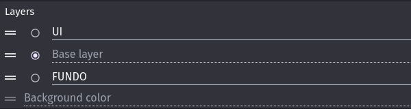

Os objetos que vamos criar os objetos:
- Fundo (ele tem tamanho inicial de 800x800)
- Avião
- Inimigo1
- Inimigo2
- Disparo

As imagens dos inimigos podem ser escolhidas pelos alunos

Monte o cenário e tome cuidado com as camadas:
- O objeto Fundo fica na posião 0x0 e na camada **FUNDO**
- Os outros objetos ficarão na camada **Base Layer**

## Adicionando Behaviors
### **Pilotando o Avião**
Adione ao Avião o comportamento Top-down Movement e configure os seguitnes campos:
- Acceleration = 2000
- Deceleration = 4000
- Max Speed = 600
- Default Controls = False
- Alow Diagonals = False
- Rotate Object = False

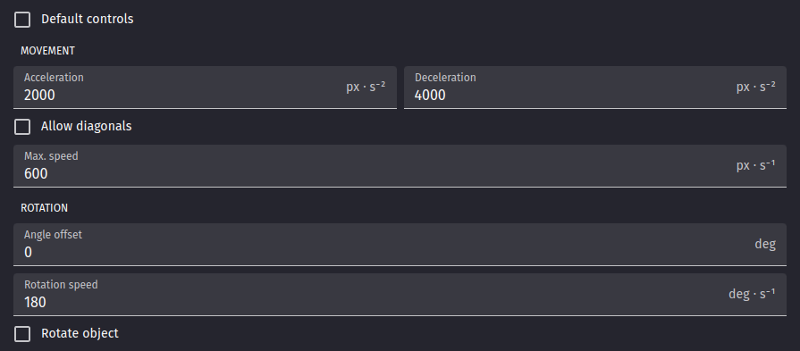

Também criaremos uma variável no Avião chamada **Combustível** que será igual a 5

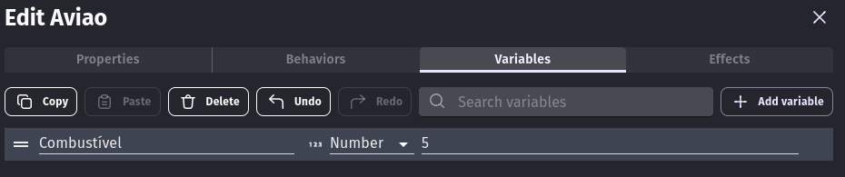

Agora vamos programar o avião para que ele se movimente, começaremos criando um grupo de eventos chamado **Movimento Avião**.

A lógica será semelhante ao Super Pong: quando apertarmos a tecla para a dirieita (que será D) nós simularemos o controle para a direita e o mesmo se faz para a esquerda (que será a tecla A).

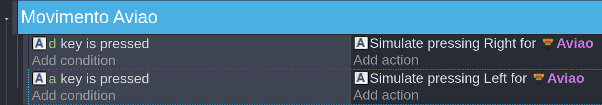

### **Programando os disparos**
Comece indo até o objeto Disparo e crie duas variáveis:
- Dano = 1
- Velocidade = -800

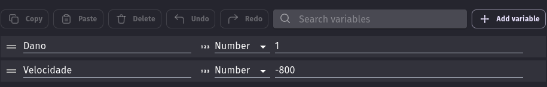

Daí criamos o grupo do Disparo e fazemos para que quando a telca Space for pressionada o Disparo seja criado na posição do Player (com um desconto para corrigir a posição) e então aplicamos uma força permanete nele

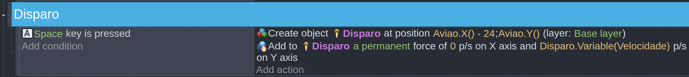

### **Criando Inimigos**
Cada inimigo terá uma característica:
- O Inimigo1 será resistente e lento
- O Inimigo2 será fraco e veloz

Então em cada inimigo duas variáveis devem ser criadas:
- Vida: o Inimigo1 deve ter menos vida que o Inimigo2
- Velocidade: O Inimigo1 deve ver mais velocidade que o Inimigo2

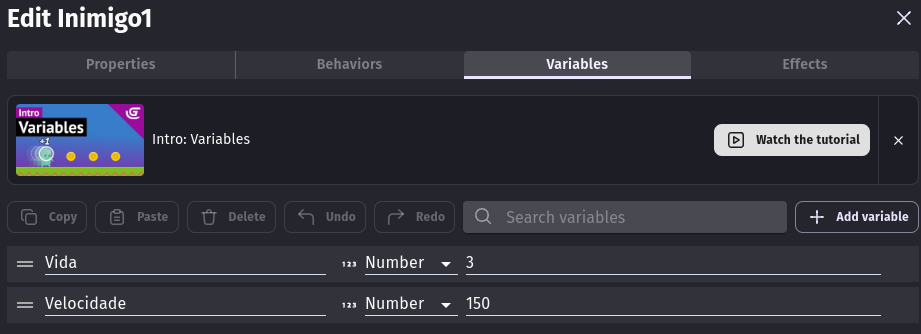

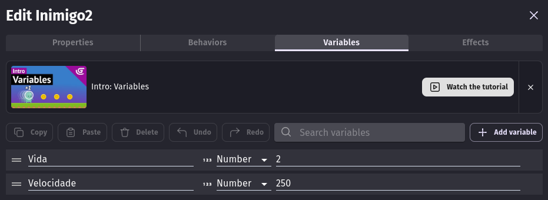

For ser mais lento o primeiro inimigo deverá ter o comportamento **Sine** que será responsável por fazer ele se mover em zig-zag

Vamos instalar ele ao projeto e depois adicionar ao Inimigo1.

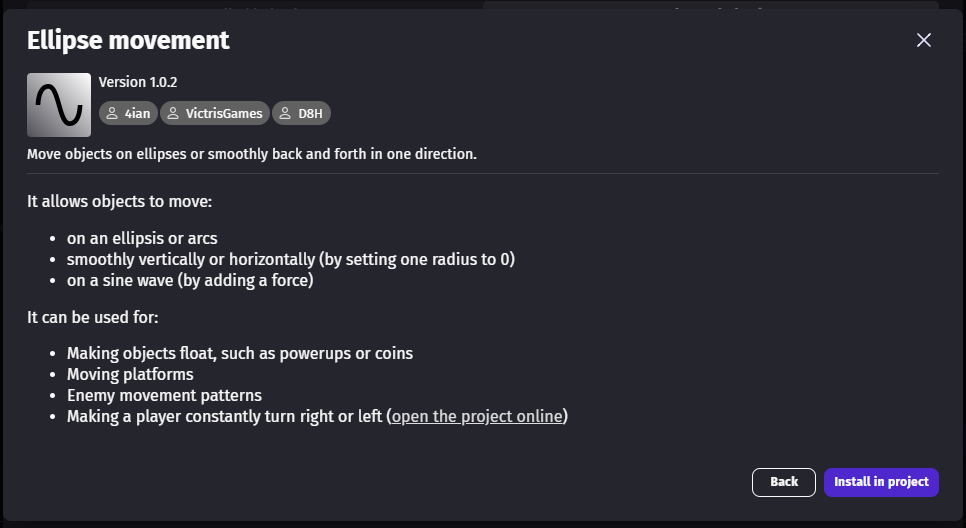

Para dar spawn nos inimigos durante o jogo precisaremos de dois timers, o primeiro para o Inimigo1 e o segundo para o Inimigo2. Fazer dessa forma também facilitará o balanceamento do jogo para não deixarmos muito fácil ou muito difícil.

Na programação criaremos um novo grupo com um evento de quando a cena começar e nele teremos duas ações para iniciar dois timers.

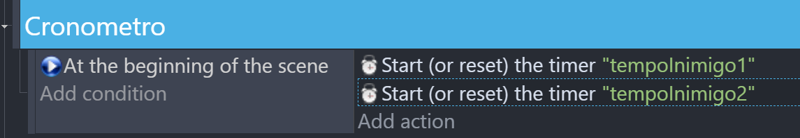

Agora só precisamos programar o Spawn dos inimigos no mesmo grupo. Quando a quantidade de tempo que desejamos passar nós criaremos um inimigo numa posição aleatória, adicionamos velocidade permanente e então reiniciamos o timer. Isso será válido para ambos os inimigos.

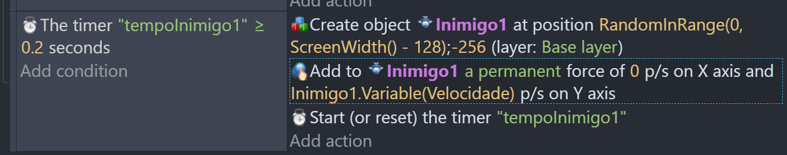

Repita a mesma lógica para o inimigo 2

