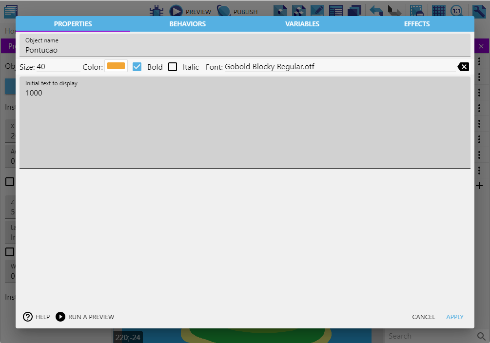

# Batalha nas Nuvens - pt2

## Pré-aula
Esta aula deve continuar do ponto onde foi finalizada a aula anterior. Caso algum dos alunos não tenha acesso ao projeto ele finalizado da aula anterior é possível encontrar nas anotações da Lesson 14.

Garanta que todos os alunos estarão no mesmo ponto antes de prosseguir.

## Programando o Sistema de Dano
Para que o inimigo sofra dano vamos fazer um evento cuja condição é o Disparo colidir com o Inimigo. Suas ações serão duas:
- Reduzir a *Vida* do Inimigo no valor da variável *Dano* do Disparo
- Destruir o Disparo para que ele não cause danos em mais que um inimigo

> Para a condição de colisão procure no Disparo por Collision e então escolha o inimigo que sofrerá dano

O resultado é como abaixo:

## Sistema de Vida dos Inimigos

Apesar do dano estar sendo corretamente aplicado os inimigos não morrem. Isto ocorre pois a vida dele não está funcionando corretamente, então precisamos programar para que ela funcione.

Mas é importante que ganhemos pontos quando os inimigos morrerem, então vamos criar uma variável para a nossa pontuação.

Agora podemos programar a vida do inimigo

## Sistema de Combustível

O combustível será essencial para manter o avião voando, precisamos programar:

- O surgimento do combustível
- A velocidade com a qual ele se movimenta
- E a coleta do combustível;

Vamos começar criando uma Sprite e colocando a imagem do item de combustível na animação. Dentro da Sprite também criaremos uma nova variável, que será a de **velocidade**. Esse valor não pode ser muito baixo, se não o jogador não terá tempo para reabastecer, então vamos definir ele como 80 e depois de testar o jogo, podemos redefini-lo de acordo com a dificuldade que desejamos.

Em seguida, bora programar!

Seguindo a lógica que utilizamos para criar os inimigos no jogo, precisaremos criar e iniciar o “timer” ‘tempoCombustivel’, para que a cada N segundos, o combustível possa surgir na tela.

Sendo assim, vamos definir que quando o ‘tempoCombustivel’ for maior do que 30, o nosso código vai criar um novo combustível, em uma posição horizontal aleatória, já que assim como os inimigos eles surgirão fora tela.

## Coletando Combustível
A coleta do combustível tera uma programação semelhante a como causamos dano no inimigo: quando nosso avião toca o combustível nós ganhamos combustível.

Logo a programação fica assim:

## Programando a vida do Jogador
Até agora o nosso jogador é intocável e por isso nós não perdemos o jogo. Vamos mudar isso agora.

Vamos começar criando uma nova cena chamada **GameOver**, ela não precisa ter algo dentro, por enquanto basta que exista.

Vamos aproveitar e criar uma cena para o **Menu**

Vamos programar para que quando o combustível acabar nós ejamos levados para tela de GameOver, além disso vamos programar para que percamos combustível sempre que um inimigo nos tocar.

## Iniciando a Interface
Depois que as principais mecânicas do jogo foram implementadas, vamos desenvolver a interface dele, ou seja, as informações visuais que o jogador precisa consultar para entender o que está acontecendo ao longo da partida, como a quantidade de pontos, a vida do personagem e assim por diante.

Dito isso, vamos começar adicionando os objetos visíveis na camada que criamos lá no começo do projeto, para guardar todos os componentes da interface. Eles são:

- A barra de combustível:
  - Que mostrará a quantidade de combustível disponível no tanque do Avião.
- O texto da pontuação:
  - Que mostrará a quantidade de pontos que marcamos ao longo do jogo.

Sendo assim, a Barra de Combustível, será adicionada como um Tiled Sprite para conseguirmos diminuir o tamanho sem achatar a imagem ou perder a proporção da altura. Mas não se esqueça de posicioná-la em um canto que não atrapalhe a visão ou a movimentação do jogador.

Feito isso, vamos a programação, onde criaremos um novo grupo, para colocarmos os comandos relacionados a interface que estamos trabalhando. E um detalhe importante sobre ele é que não teremos condições ou eventos, apenas ações

Na ação precisamos definir que o tamanho da barra de combustível, deve seguir uma fórmula que é o valor da nossa variável combustível, multiplicado por 32. Que é justamente o tamanho da imagem que utilizamos, só que em pixel.

