# Batalha nas Nuvens - pt3

## Pré-aula
Esta aula deve continuar do ponto onde foi finalizada a aula anterior. Caso algum dos alunos não tenha acesso ao projeto ele finalizado da aula anterior é possível encontrar nas anotações da Lesson 14.

Garanta que todos os alunos estarão no mesmo ponto antes de prosseguir.

Nesta aula faremos o chefão e as delas de Menu e GameOver.

## Crindo o chefão
O primeiro passo é criar o Sprite do Chefão. Ele será o inimigo mais forte então terá bastante vida, mas não ficar muito difícil vamos deixar ele com pouca velocidade. Daremos a ele 20 de vida e 80 de velocidade.

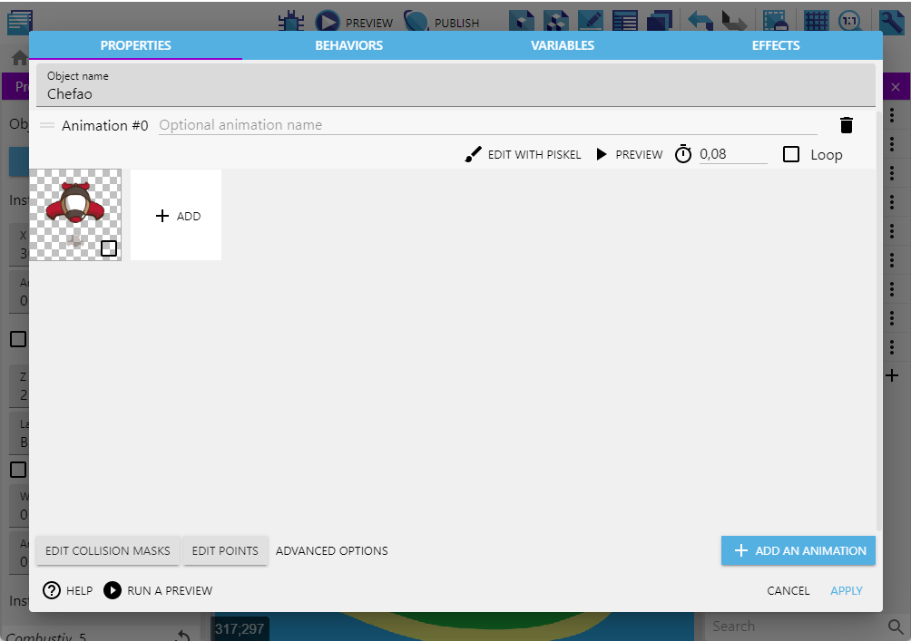

Na programação dos Events, faremos que quando iniciar a fase o cronômetro do tempo chefão seja inicializado. Usaremos o comando Start (or Reset) Timer.

Quando o cronômetro bater 60 segundos, devemos fazer o Chefão surgir fora do mapa e ir em direção do Avião para tentar destruí-lo. No comando da Action usaremos o Create An Object junto com o Add Force e o Reset Timer.

Lembre-se de colocar no comando Add Force como Permanent, assim a força sempre será constante e o Chefão não ficará atracado no cenário. Outro ponto muito importante é configurar o RandomInRange na posição X assim o Chefão aparecerá de surpresa em qualquer posição horizontal do mapa.

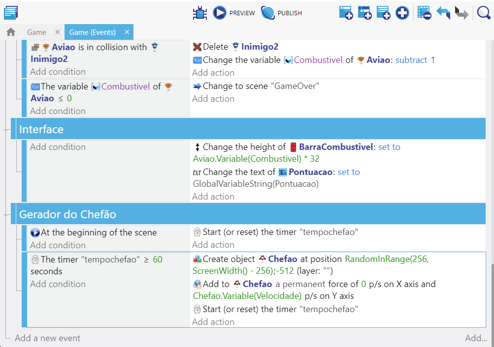

Pronto, o chefão está adicionado ao jogo, boa sorte!

## Programando a vida do Chefão
Criaremos um novo Event Group para organizar e agrupar as programações e comportamento do Chefão dentro do cenário. Começaremos adicionando a programação de dano do Chefão pela colisão do disparo.

Quando o Chefão for derrotado, destrua a sprite e adicione uma pontuação de 1000 pontos do Avião como forma de recompensa do trabalho árduo de destruir o chefão.

Não se esqueça de deletar o disparo, assim não haverá problemas ao levar dano. Também exclua o Chefão quando a sua vida for igual ou menor a zero.

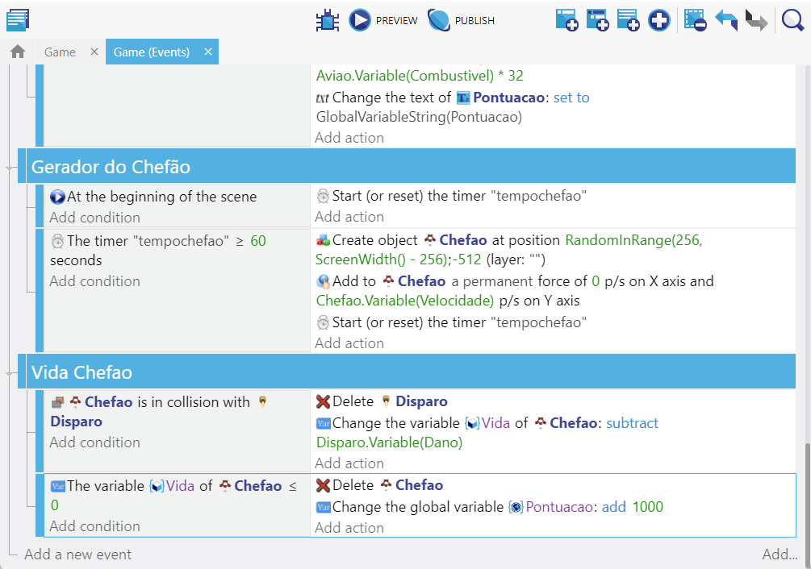

## Sistema de Dano do Chefão
Muito cuidado ao colidir com o Chefão!

Nesse caso, quando houver a colisão do chefão com o avião a tela imediatamente será mudada para o GameOver, será Hit-Kill (termo usado para dizer que o acerto é fatal). A programação é simples, o difícil é derrotar o Chefão.

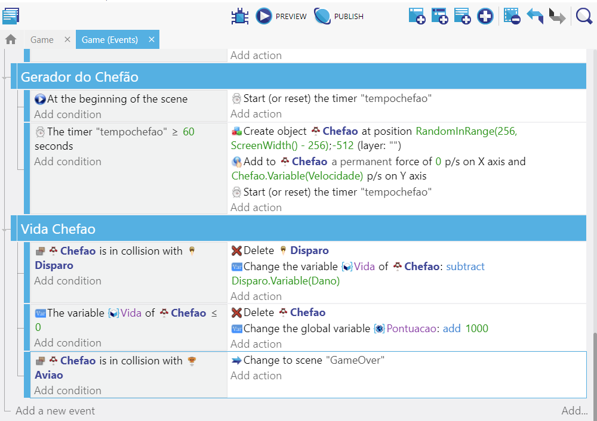

Dica: assim que o Chefão aparecer, dispare o mais rápido possível, assim os 20 pontos de vida serão reduzidos e será mais fácil derrotá-lo.

## Criando a tela de GameOver
Partimos agora para o desenvolvimento da scene de GameOver. Nesta tela será mostrado a pontuação alcançada pelo jogador, uma mensagem de fim de jogo e um botão para reiniciar e voltar para a jogatina. Podemos começar adicionando o fundo para o jogo e o título.

No título da tela de game over coloque o tamanho adequado da fonte, com uma cor destaque e selecione a fonte padrão do projeto.

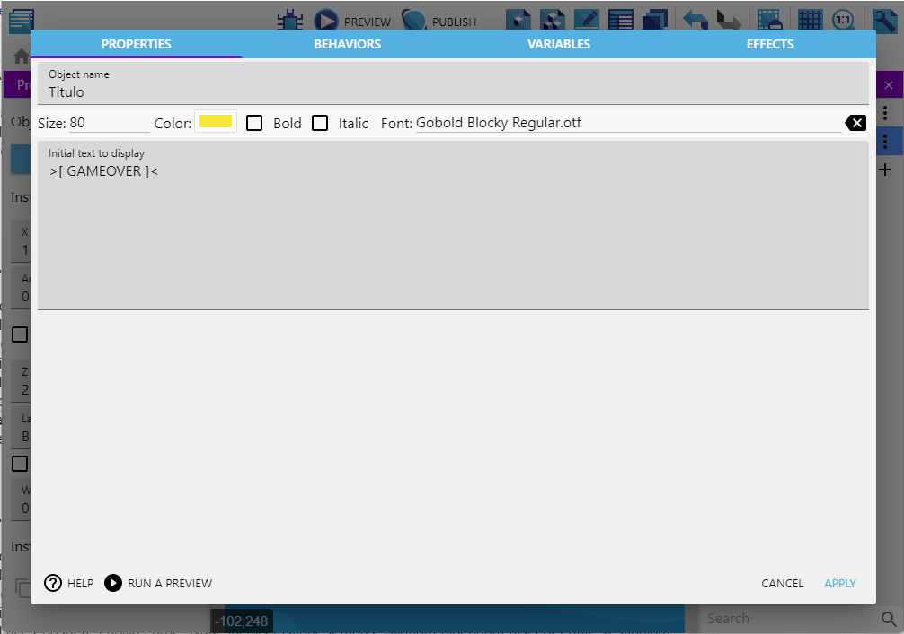

O mesmo será feito com a pontuação em placar, coloque uma fonte do mesmo tamanho do título e com uma cor de destaque para mostrar a pontuação adquirida no final do jogo. Utilize apenas números para representar a pontuação.

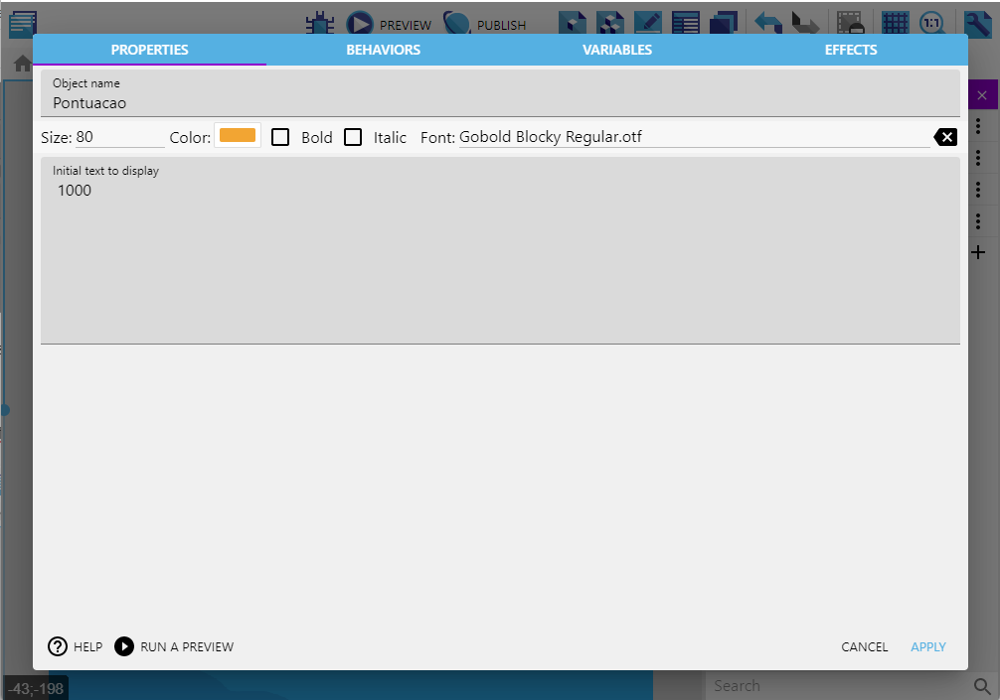

Não perca tempo, coloque um botão abaixo da pontuação para o jogador conseguir ter uma nova chance de jogar e obter um placar maior do que o placar anterior. O botão terá um texto menor do que o Placar de Pontuação e também do Título já adicionados.

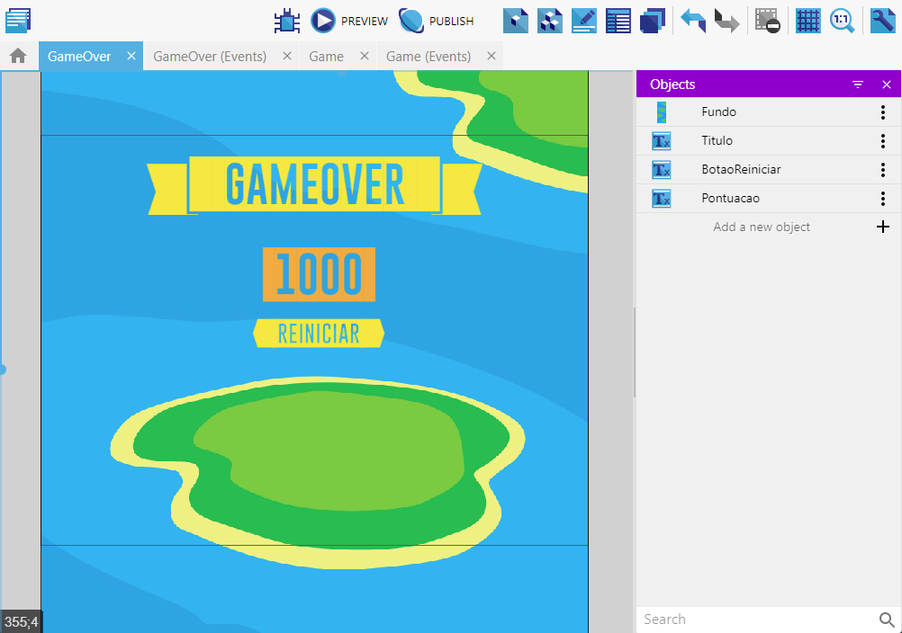

Opa, deixe a tela de game over com a sua cara, encontre a melhor posição para adicionar os objetos.

## Programando o GameOver
Comece a programação da tela de GameOver organizando em dois grupos de eventos.

No grupo de eventos Botão Reiniciar, faremos a verificação dentro da condição se o mouse está em cima do texto BotaoReiniciar e se o botão esquerdo do mouse foi pressionado.

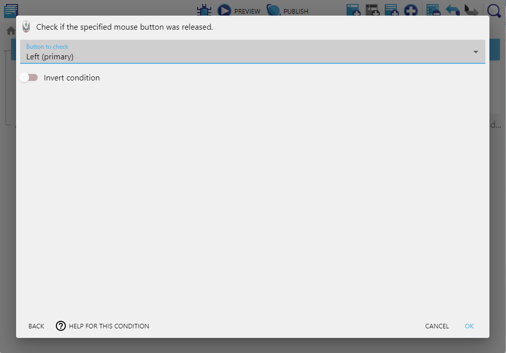

Na ação faremos a variável global ser resetada para o jogador conseguir gerar um nova pontuação dentro do jogo, sem começar com o valor da partida anterior. Logo em seguida adicionaremos o comando Change The Scene para Game, e assim o jogo será totalmente resetado e pronto para ser jogado do inicio.

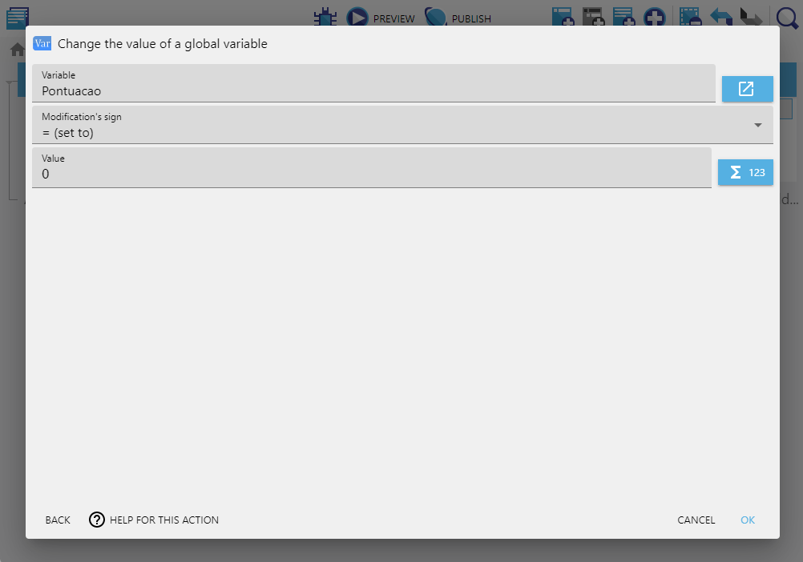

No grupo de evento Mostrar Pontuação, faremos que no início do jogo seja definido a pontuação do jogador no texto que inserimos dentro do cenário. Usando o comando Modify The Text na Action colocamos o valor da variável global.

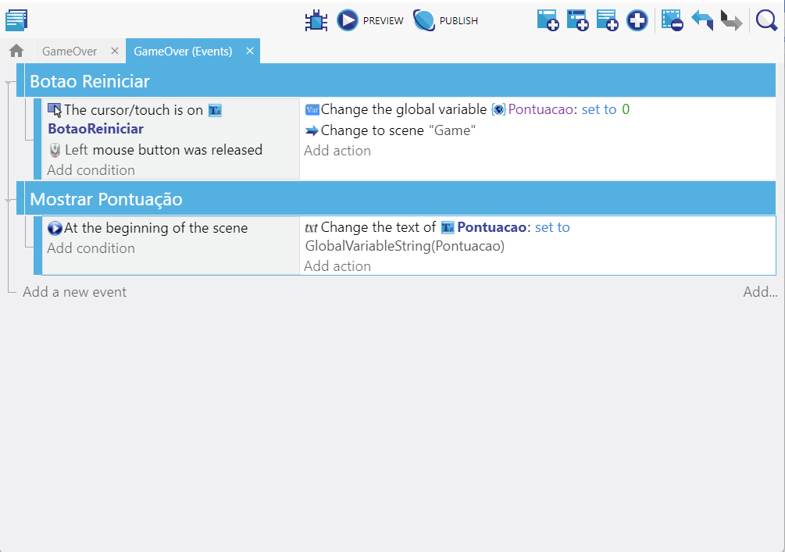

Enfim, finalização da tela de GameOver.

## Tela de Menu

A tela de menu será composta por uma imagem de fundo, o título superior destacando o nome do jogo e dois botões inferiores para começar a jogar e outro para sair do jogo.

Comece adicionando o Título da tela de menu, escolha o melhor tamanho e a cor, é opcional selecionar a caixa Bold ou Italic para personalizar a aparência do texto.

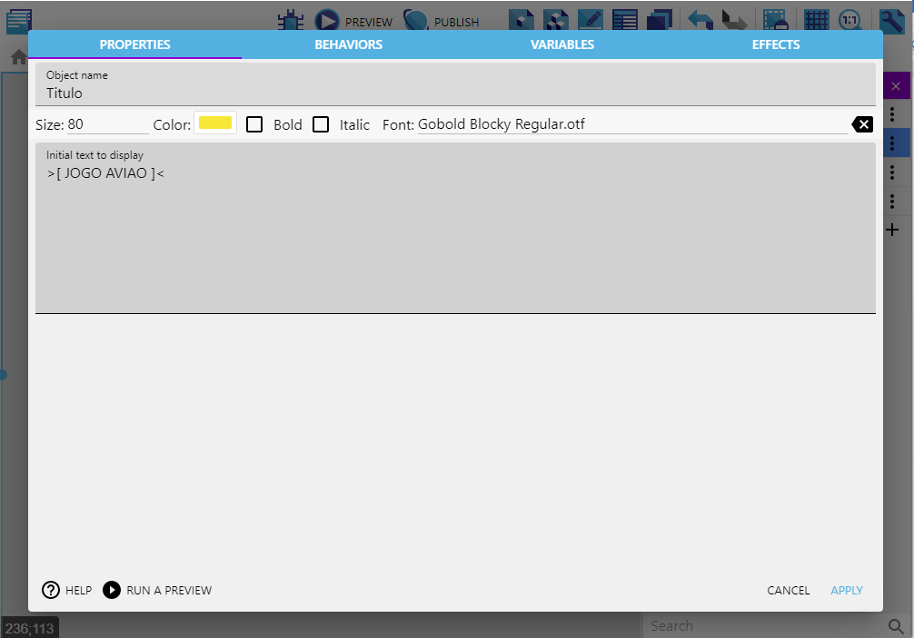

Ajuste o título para a melhor posição do cenário do menu, no caso o topo e os cantos é mais indicado para isso.

Abaixo, coloquei os dois botões de ação do menu. Caso necessário, pode inserir mais novos botões como configurações, tutorial ou ligando uma página externa.

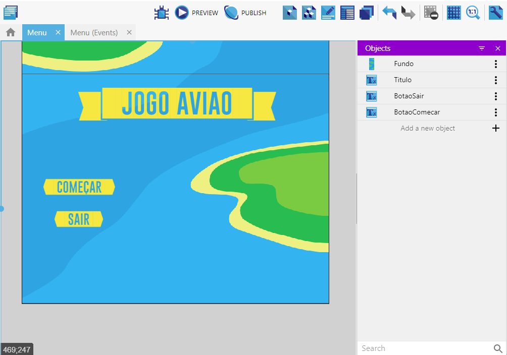

Prontinho, deixe o seu menu bonitinho e agradável para os outros jogadores!

## Programando o Menu
Antes de iniciarmos a programação é importante definirmos uma Scene como a principal do jogo. Será responsável por ser a primeira carregada quando o jogo for aberto. Nesse caso devemos selecionar o Menu como Start Scene.

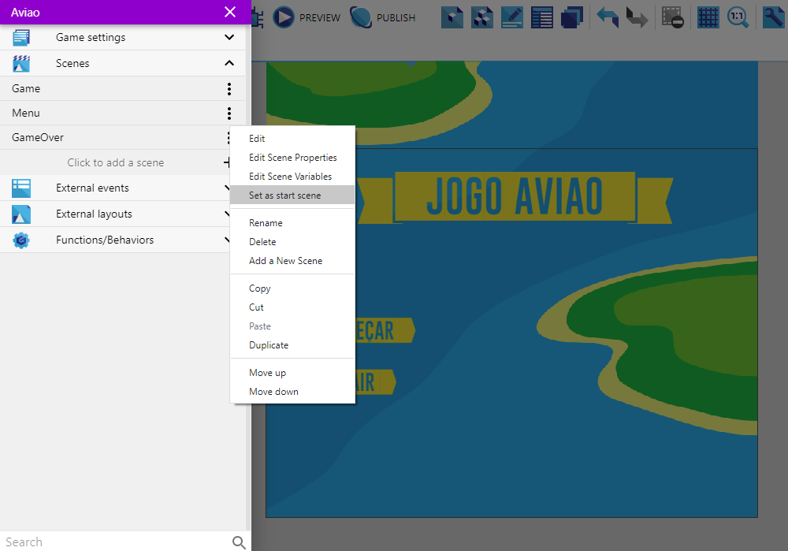

Em seguida, vamos organizar os Event Groups por botões e suas respectivas ações que serão programadas em breve.

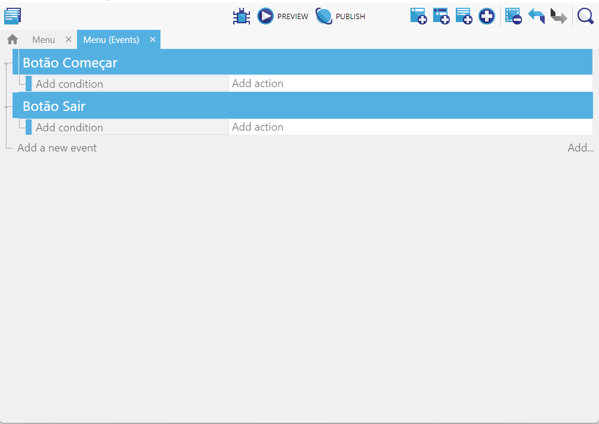

Em ambos eventos, coloque na ação a verificação se determinado Texto foi selecionado e clicado, para em seguida programarmos a ação que será executada. Lembrando que nessas condições usamos dois comandos sendo o The Cursor Is On An Object e o Mouse Released.

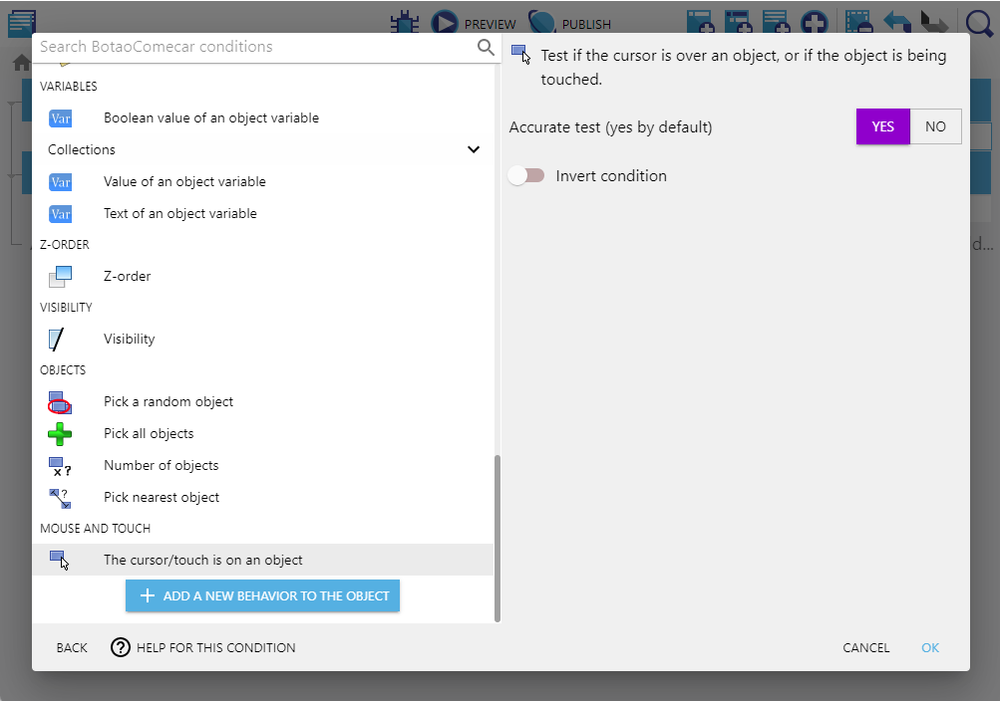

Agora nas ações adicione o comando Change The Scene para Game para o Botão Começar e no botão sair coloque o comando Quit The Game para o jogador conseguir fechar a janela do jogo via botão.

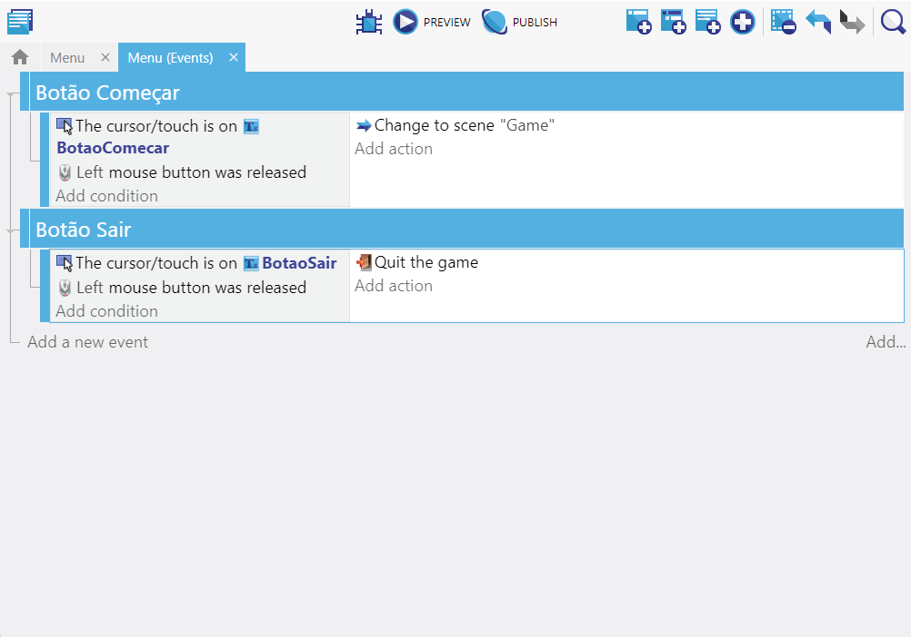

Você é fera, parabéns por ter chegado até aqui e concluído mais um jogo. Tenho certeza que ficou excelente