# Pirâmides

## Resumo da aula 
Hoje, iremos aprender um pouquinho sobre como fazer sequências de números, e para isso iremos jogar um jogo onde precisamos ajudar um faraó a construir novas pirâmides para seu reino no egito. Precisaremos programar nosso jogo para que ele funcione corretamente, ou não será possível jogá-lo. Vamos aprender como funcionará o nosso jogo.

## Entendendo o Jogo
Nesta aula você precisará ajudar o faraó a construir o máximo de pirâmides possíveis para seu reino em 1 minuto.

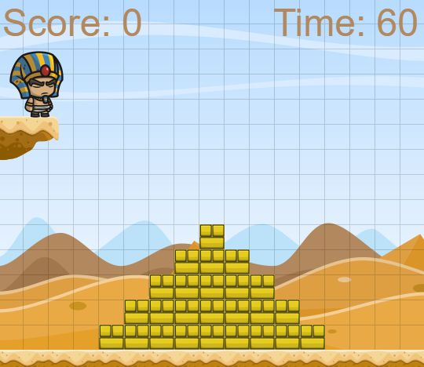

Para construí-las iremos usar pequenos blocos que precisaremos colocar no formato de uma pirâmide para que ela esteja correta, e para construir os blocos nós iremos usar o mouse.

Você pode observar no seu jogo que a tela está dividida em vários quadrados pequenos que nós chamamos de GRID. São nesses quadradinhos que iremos construir os blocos da pirâmide. Cada quadrado pode conter apenas 1 bloco por vez. Para construir um bloco você precisa apenas segurar ou clicar com o botão do mouse em cima do quadrado que você deseja para criar um bloco.

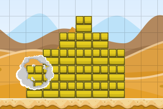

Você pode perceber que uma pirâmide sempre será mais alta no meio, e vai diminuindo sua altura dos lados, sempre diminuindo a quantidade de blocos necessários até precisarmos apenas de um bloco de altura:

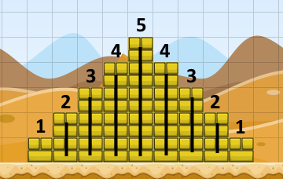

Nossa pirâmide então é feita do que chamamos de uma sequência numérica. Uma sequência numérica é um conjunto de números em uma ordem padronizada. Mas como assim? Vamos observar nossa pirâmide novamente:

Se observarmos essa pirâmide você verá que suas colunas seguem uma sequência de números: 1, 2, 3, 4, 5, 4, 3, 2, 1. Vamos agora olhar essa outra pirâmide:

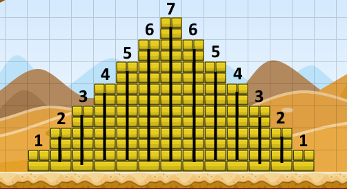

Essa pirâmide é bem parecida com a anterior, a diferença ela é um pouco maior, porém ainda podemos observar nossa sequência numérica: 1, 2, 3, 4, 5, 6, 7, 6, 5, 4, 3, 2, 1.

Com isso sabemos que todas as nossas pirâmides serão sequências numéricas, onde o maior número dessa sequência será a coluna do meio, ou seja, a altura da nossa pirâmide!

Para construir nossas pirâmides então precisamos apenas saber qual será a altura do meio da nossa pirâmide, e com isso conseguiremos construir o resto da nossa pirâmide com base na sequência numérica.

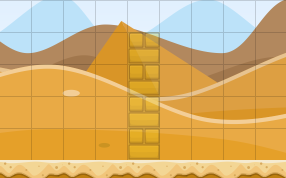
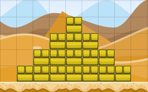

Sempre que precisarmos criar uma nova pirâmide então o jogo dirá para nós qual deve ser a altura dessa pirâmide, e com isso nós conseguiremos construí-la!

	Sabemos então como iremos construir nossas pirâmides, porém nada funciona ainda no nosso jogo, pois precisaremos programar tudo isso que aprendemos.

O nosso grande desafio nessa aula será nós terminarmos de programar o jogo para que os as pirâmides possam ser construídas. Também precisaremos programar o tempo que irá se passar e nossa pontuação

Precisamos então pensar em como iremos fazer isso. O algoritmo que iremos criar precisará das seguintes coisas para funcionar corretamente:

Quando um quadrado da grid for clicado, se ele estiver vazio será  construído um novo bloco e os pontos irão aumentar.

A cada 1 segundo o tempo irá diminuir

Quando o jogo começar gerar uma pirâmide para construir

Sempre que uma pirâmide estiver completa, gerar outra pirâmide para ser construída.

Agora que temos um objetivo em mente vamos entender os blocos que teremos

## Blocos
Assim como na última aula nós teremos nesse jogo blocos de eventos, e eles são blocos que irão executar comandos alguma coisa específica acontecer. Na aula de hoje usaremos os blocos de evento **EVERY N SECONDS**, **WHEN RUN** e **WHEN GRID PRESSED**.

### Every N Seconds
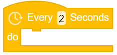

Assim como na aula passada, temos o bloco EVERY N SECONDS. Ele é um bloco de evento, e serve para executar um conjunto de comandos a cada intervalo de tempo. Na aula passada nós usamos este bloco para criar um asteroide com o passar do tempo, porém nessa aula nós precisaremos dele para podermos diminuir nosso contador de tempo do jogo.

### When Run

O bloco WHEN RUN serve para começar seu código, então quando o jogo começar todos os blocos conectados abaixo dele serão executados. nós iremos usá-lo para criar uma nova pirâmide quando o jogo começar e também para detectarmos se nossa pirâmide está correta. conectados abaixo dele serão executados. nós iremos usá-lo para criar uma nova pirâmide quando o jogo começar e também para detectarmos se nossa pirâmide está correta.

### When Grid Pressed
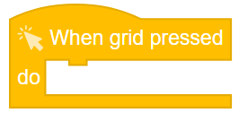

O bloco WHEN GRID PRESSED é um bloco de evento, e ele irá realizar um conjunto de comandos quando você clicar em algum quadrado da grid. Se pensarmos em como nosso jogo deverá ser, quando nós clicarmos em um quadrado nós precisamos verificar se ele está vazio, e se estiver, iremos criar um bloco nesse quadrado.

### Forever 

Você se lembra do FOREVER? O FOREVER repete seu código para sempre enquanto seu jogo está sendo executado. Usamos ele em uma de nossas aulas junto com o bloco IF para detectar se estamos apertando alguma tecla do teclado para ajudar o Alien a destruir os lixos que estavam caindo no rio.

No caso da aula de hoje, iremos usar o FOREVER para detectar se a pirâmide está completa, pois quando estiver nós precisamos gerar uma nova pirâmide para o jogador construir. O nosso computador precisa detectar o tempo todo se uma pirâmide está completa, pois quando ela estiver completa precisamos gerar outra pirâmide, e continuar detectando se a próxima pirâmide gerada está completa.

### IF
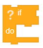

O bloco IF funciona da mesma forma que o das últimas aulas, e na aula de hoje usaremos ele para verificarmos duas coisas, uma para verificar se a pirâmide que estamos construindo está completa (se ela estiver completa precisamos gerar uma nova pirâmide para ser construída, se não o jogo não irá continuar em frente), e outra para verificar se a grid que nós clicamos está vazia (quando eu clicar em uma grid, se ela estiver vazia eu preciso construir um novo bloco).

### Grid is Empty/Full

O bloco GRID IS EMPTY / FULL diz se um quadrado na grid está vazio (empty) ou se ele já tem um bloco construído nele (full), e iremos usá-lo junto com o bloco IF, pois quando a grid for clicada nós precisamos ver se o bloco está vazio, pois se estiver nós precisamos criar um bloco, e quem irá nos dizer se o quadrado da grid está vazio ou não é o bloco GRID IS EMPTY / FULL.

### Piramid is Complete

O bloco PYRAMID IS COMPLETE / INCOMPLETE é bem parecido com o bloco GRID IS EMPTY / FULL. Ele nos diz se a pirâmide que estamos construindo no momento está completa (complete) ou não (incomplete), e também iremos usá-lo junto com o bloco IF, pois o tempo todo se a pirâmide está completa nós precisamos gerar uma nova pirâmide para nós construirmos.

### Create block

O bloco CREATE BLOCK  cria um bloco. Nós precisamos usar ele em conjunto com o bloco de evento WHEN GRID PRESSED para criamos um bloco quando nós clicarmos na grid (não se esqueça de antes de criar o bloco verificar se a grid está vazia).

### Spawn Smoke

O bloco SPAWN SMOKE  assim como nas última aulas, cria uma pequena explosão de fumaça onde o bloco foi construído. Esse bloco servirá apenas para deixar o nosso jogo mais bonito, pois agora quando construirmos um bloco ele não irá simplesmente aparecer na tela, e sim terá uma animação bem legal. Nós iremos usá-lo junto com o bloco WHEN GRID PRESSED, pois quando você clicar em algum quadrado da grid, precisamos verificar se ele está vazio, e se estiver precisamos criar um bloco e também precisamos criar uma explosão de fumaça.

### Generate Piramid With Size

O bloco GENERATE PYRAMID gera uma pirâmide com a altura que você quiser para ser construída (pode ser um número específico ou até um número aleatório). Nós iremos usá-lo em conjunto com o bloco de evento WHEN RUN para gerarmos uma nova pirâmide quando o jogo começar. Além disso também precisaremos gerar uma nova pirâmide se a pirâmide que estamos construindo no momento está completa. Precisaremos então usar os blocos FOREVER e IF.

### Play Sound Effect

O bloco PLAY SOUND EFFECT  toca um pequeno efeito sonoro com o som de “correto”. Nós precisamos usar ele quando nós completarmos uma pirâmide para o nosso jogo ficar um pouco mais legal. Precisaremos então usar o efeito sonoro se a pirâmide estiver completa.

### Change Player Animation

O bloco CHANGE PLAYER ANIMATION  troca a animação do player para uma animação diferente. Nós iremos usar ele quando nós completarmos uma pirâmide para o nosso jogo ficar um pouco mais legal, assim como o PLAY SOUND EFFECT. Precisaremos então trocar a animação do player se a pirâmide estiver completa.

### Incremente/Decrement
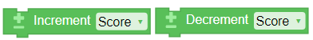

O bloco INCREMENT aumenta o valor da pontuação ou do tempo, e o bloco DECREMENT diminui o valor do tempo ou da pontuação. Nós iremos usar ele quando nós precisarmos mudar algum desses dois valores. No caso da nossa pontuação, precisamos aumentá-la quando construirmos um bloco, e no caso do countdown precisamos diminuí-lo a cada segundo, para que nosso tempo seja reduzido

### Pick Random

O bloco PICK RANDOM escolhe um número aleatório entre dois valores. Nós podemos usá-lo junto com o bloco GENERATE PYRAMID, para gerar uma pirâmide com sua altura aleatória.

## Sua vez. 
Programe o jogo

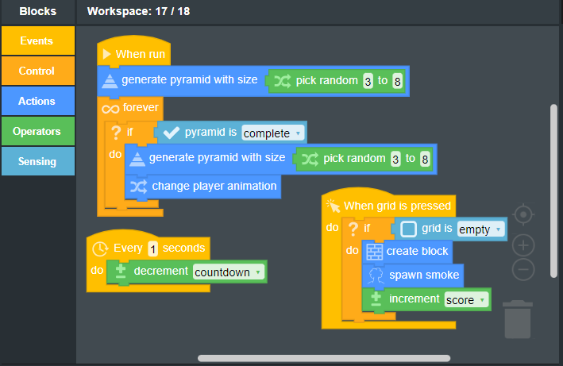