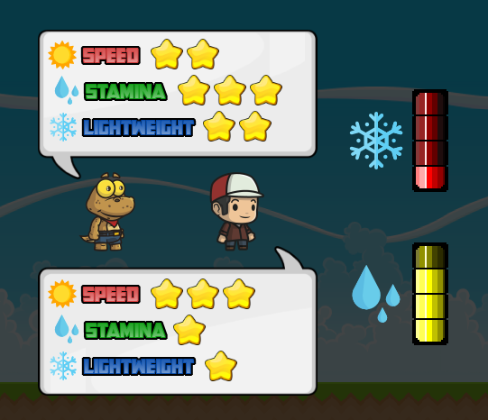
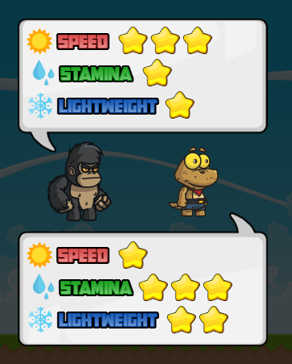
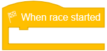

# Probabilidades

Nas próximas atividades, iremos aprender um pouquinho sobre probabilidade, e para entendermos isso melhor nós iremos jogar um jogo de corrida de personagens! Vamos aprender como funcionará o nosso jogo e o que precisaremos para programá-lo.

## Entendendo o Jogo
Nesta aula você precisará escolher o melhor corredor para vencer a corrida de acordo com suas habilidades.

Você pode perceber que cada corredor tem diferentes habilidades: 
- Speed (velocidade)
- Stamina (resistência)
- Lightweight (leveza)

Cada uma dessas habilidades terá sua vantagem dependendo da previsão do tempo do nosso jogo. Você percebeu o ícone do Sol ao lado da palavra Speed? Isso quer dizer que se no momento que acontecer a corrida estiver um dia ensolarado quem tiver mais estrelinhas em Speed vencerá, não importando se o outro personagem tem mais Stamina ou Lightweight. Para entender melhor vamos dar uma olhada nesse exemplo:

Se por acaso no momento que a corrida começasse estivesse um dia ensolarado, quem ganharia a corrida seria o Gorila, pois ele tem três estrelas em Speed enquanto o Lagarto tem apenas uma estrela (não importa se o lagarto tem mais Stamina ou Lightweight). Porém se por acaso no momento que a corrida começasse estivesse um dia chuvoso, quem ganharia seria o Lagarto, pois ele tem três estrelas em Stamina enquanto o Gorila tem apenas uma, e em dias chuvosos quem tem mais estrelas em Stamina vence.

Agora que você já entendeu como funciona vamos fazer um resumo:

- Dias ensolarados - Speed
- Dias chuvosos - Stamina
- Dias com neve - Lightweight

Então lembre-se de escolher o melhor personagem para previsões do tempo diferentes! 

Exemplo: Se no momento da corrida a chance de chover for muito alta, o correto seria escolher alguém com mais Stamina, pois a probabilidade desse personagem ganhar é maior.

Nós iremos selecionar nossos personagens usando o mouse, então sempre que já tiver feito sua decisão de qual personagem você acredita que irá ganhar você precisa clicar nele!

## Programando
Na atividade de hoje nós iremos programar a primeira parte do nosso jogo, que é gerar nossos personagens, poder selecioná-los e iniciar nossa corrida, e na próxima atividade adicionaremos as previsões do tempo para que o jogo fique mais desafiador. Como na atividade de hoje nós não teremos dias chuvosos e com neve apenas os personagens com as maiores Speeds vencerão, mas não se preocupe!

Vamos entender o que precisamos programar para que o nosso jogo funcione. Quando você entrar na sua atividade encontrará apenas isso:

Isso quer dizer que a primeira coisa que precisamos fazer é com que os personagens apareçam. Porém precisaremos também programar para que os personagens possam ser selecionados, e quando for selecionado um dos personagens precisamos iniciar a corrida, e quando chegarmos na linha de chegada precisamos ganhar ou perder medalhas de acordo com qual personagem chegou primeiro. Vamos aprender então sobre os blocos que nós temos.

## Blocos

### When Run

O bloco WHEN RUN serve para começar seu código, então quando o jogo começar todos os blocos conectados abaixo dele serão executados. nós iremos usá-lo para criar novos personagens quando o jogo começar.

### When Race Started

O bloco WHEN RACE STARTED é outro bloco de evento, e ele irá realizar um conjunto de comandos quando a corrida começar. Nós precisamos fazer com que a câmera do nosso jogo siga o personagem selecionado e que os personagens tenham a animação de correr.

### 