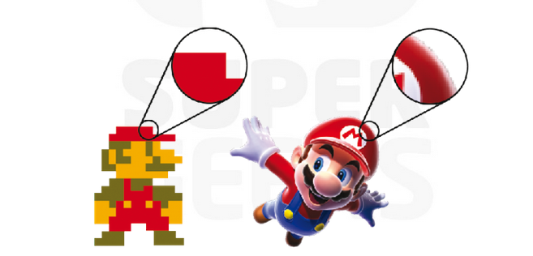

# Aseprite I | Aprendendo sobre Pixel Art

- [Aseprite I](#aseprite-i--aprendendo-sobre-pixel-art)
- [o que é um pixel]()

## O que é um Pixel

Vocês já devem ter ouvido falar que a tela do nesso celular, do computador e até mesmo a televisão da nossa casa é formada por vários pontinhos colorigos muito pequenos.

Isso é um pixel

Uma imagem qualquer é formada por vários desses quadradinhos que acendem na nossa tela até mesmo as imagens com altíssima qualidade.

Quanto maior a qualidade de uma imagem mais pixels são utilizados nela.

Um pixel art nada mais é do que pintar estes quadrados com a cor queremos e onde queremos. Pintando eles individualmente para criarmos a imagem completa. 

Sua principal característica é mostrar claramente que é formada por uma baixa quantidade de pixels, assim fazendo referência aos gráficos de consoles e games das primeiras gerações, ou seja, dar um estilo retrô.

## Resolução e tamanho

**Resolução** refere-se a quantidade de pixels em uma polegada quadrada. Quanto mais pixels por polegada, maior a qualidade da imagem, porém mais pesada ela será.

Em pixel art normalmente não temos problema com o peso da imagem pois normalmente trabalhamos com poucos pixels por polegada.

**Tamanho** ou **Dimensão** é medido pela quantidade de pixels de largura e altura que a nossa imagem tem.

## Técnicas de Pixel Art

### Proporção e Organização
Para que uma pixel art pareça limpa e agradável, precisamos que as linhas não tenham mais que um pixel de largura, isto é, não sejam muito grossas.

### Retas e consistência
É importante manter a consistência ao se desenhar linhas para que não fiquem tortas ou desproporcionais.

Se formos desenhar uma linha na diagonal é importante que sigamos um padrão na descida para que a linha não pareça uma escada estranha.

### Curvas
Quanto mais proporcional for a curva, mais redonda e suave ela será, caso contrário irá mais parecer um bloco do que uma curva.

### Simetria
Criar círculos perfeitos pode ser um pouco complicado, mas seguindo duas simples dicas tudo começa a ficar mais simples.

1. A altura e a largura devem ser as mesmas
2. O circulo deve ser simétrico tanto horizontalmente quanto verticalmente

> **Simetria**:
> 
> Conformidade, em medida, forma e posição relativa, entre as partes dispostas em cada lado de uma linha divisória, um plano médio, um centro ou um eixo.
