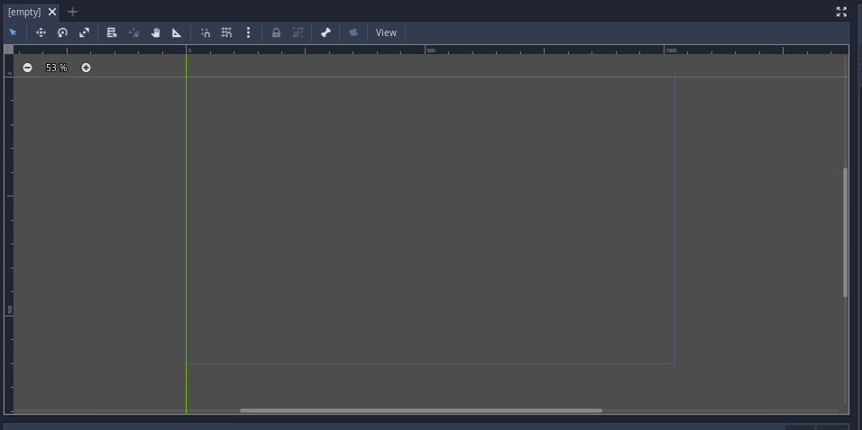
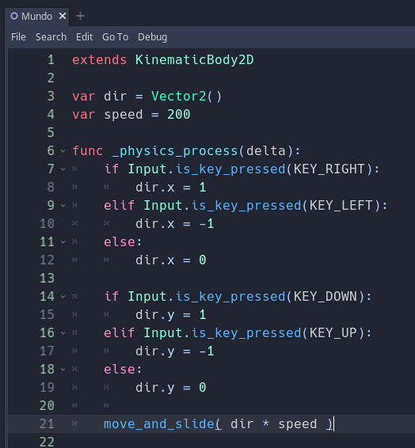

# Geek Brawl - Iniciando o Jogo

### Pré-aula
* Este material foi preparado em 13 de abril de 2023, então a versão utilizada foi a 3.5.2 LTS pois a Franquia ainda não atualizou o conteúdo do portal pra a versão 4.0.2 Lastest.

## Criando o Projeto
> **OBS**:\
> O Godot é composto por duas telas:
> * Prompt (tela preta)
> * Godot
> 
> Ambas as janelas precisam estar funcionando para a Godot se manter funcionando. Caso uma delas feche ambas as telas irão fechar.\
> Caso a janela do *Prompt* não abra não há problema, o problema acontece de ela ser fechada depois de aberta pois isto irá fechar a Godot junto.

### Entendendo a interface
Ao entrar na Godot será recebido pela seguinte interface:

Vamos entender cada parte antes de sair fazendo as coisas.

- **Região Central**
  - Nessa parte você vai ver como seu cenário está ficando e ajustar os elementos que fazem parte dele. O retângulo azul representa o tamanho da câmera no jogo.
  - 
- **Scene**
  - Nessa parte da tela estarão dispostos todos os elementos que fazem parte do cenário porém aqui eles são mostrados no formato de uma lista. É aqui também onde vamos para adicionar novos elementos no cenário.
    - 
- **FileSystem**
  - Nessa parte ficarão todos os arquivos importados para o projeto (Imagens, Sons, Vídeos, entre outros). 
    - 
- **Inspector**
  - Nele é possível configurar qualquer objeto que estiver selecionado a aba **Scene**. Podemos mudar posição, rotação, cor e qualquer outra configuração que o elemento tenha. 
    - 

## Criando um personagem
Antes de termos um personagem precisamos criar um *cenário* para que o nosso personagem possa Se mover por ele. Então vamos simplesmente na aba **Scene** e clicar em **2D Scene**. Teremos então um **Node2D**

Para criar um personagem é preciso entender primeiro que cada elemento na Godot tem um função específica e que para termos elementos que fazem muitas coisas nós precisamos ir juntando os elementos um no outro.

Para o nosso personagem precisamos de um elemento que possa se movimentar na tela e ele se chama **KinematicBody2D**, então vamos clicar com o botão direito no objeto **Node2D** que está na aba **Scene** e escolher a opção **Add Child Node**

Após isto seremos recebido por uma janela com várias opções

Use a caixa de pesquisa na parte superor para pesquisar por **KinematicBody2D**, ele será o responsável pela movimentação do personagem. Note que não precisamos pesquisar pelo nome completo para que ele apareça e cuidado para escolher a opção errada, afinal estamos fazendo um jogo 2D

É importante dar nomes aos nossos elementos pois por padrão a Godot dá aos objetos o mesmo nome de seu tipo e isso nem sempre ajuda quando estamos desenvolvendo algo... vamos renomear o **KinematicBody2D** para **Player**.

> Lembre-se que o nome é dado de acordo com o papel que o elemento vai desempenhar no jogo então se o seu Player vai se chamar "Jorginho" então o nome dele ainda será Player pois o Jorginho é um Player e Jorginho é apenas uma característica desse Player, não o papel dele.

Entretanto como foi dito anteriormente cada elemento faz algo específico na Godot, poranto o elemento que colocamos agora apenas pode se movimentar, precisamos de um elemento que mostre algo na tela.

Para isso vamos usar o elemento **Sprite** ele é capaz de mostrar imagens na tela

Então clique com o botão direito no **Player** e escolha novamente **Add Child Node**, mas desta vez pesquise pelo **Sprite**.

O resultado será algo parecido como o da imagem abaixo:

Agora precisamos adicionar uma imagem/sprite ao nosso elemento **Sprite** e para isto vamos até os nossos arquivos abrir a pasta ***Sprites*** e lá encontraremos o arquivo **Character_Idle1.png** como na imagem abaixo (para abrir pastas basta dar um click duplo na pasta):

Quando encontrar a imagem selecione o elemento **Sprite** na nossa lista de elementos (aba Scene) e no Inspecto você verá o seguinte:

O campo **Texture** está vazio e por isto não temos uma imagem aparecendo na tela. Então arras a imagem que encontramos nos nossos arquivos e então arraste até o campo Texture. Tome cuidado para não soltar a imagem no meio do cenário ou teremos que lidar com 2 Sprites e vai ser trabalhoso corrigir isso depois.

Se você fez certo o resultado é o seguinte (sim a imagem é pequena, mas podemos corrigir isto logo logo):

Para aumentar o tamanho da imagem precisamos multiplicar o tamanho dela e isto é feito na propriedade **Transform Scale**.

1. Selecione o Sprite
2. Localize a propriedade Transform e abra-a para ver o que tem dentro dela
3. Localize a propriedade Scale
4. Aumento os valores X e Y para números maiores que 1 
   1. Caso não tenham o mesmo valor a imagem ficará distorcida, então escolha com cuidado
Antes:

Depois

Vamos colocar o personagem no meio da cena. Para isso precisamos fazer com que os elementos que estão presos no Player não possam ser selecionados através do cenário. Isto é feito ao selecionar o Player na nossa lista marcar uma opção chamada **Group Selected Nodes**

E o resultado é:

Agora é só arrastar o Player para o meio do cenário:

## Rodando o jogo

Para que o nosso jogo rode temos várias opções, mas indepente de qual vamos escolher precisamos primeiro salvar a cena, então utilize o atalho **Ctrl + S** para salvar e dê o nome de **World** ou **Mundo** para o arquivo e salve na pasta **Scenes**

Após salvar a cena as nossas opções são:

- Pressionar F6: essa função irá rodar diretamente a cena aberta no momento
- Pressionar F5: essa função irá rodar a cena marcada como a primeira cena do jogo e casa não haja uma ele irá pedir para que você escolha uma. Essa opção é usada quando queremos testar o jogo do início
  
Escolha qualquer uma delas e então veja o estado atual.

Não é muita coisa, temos um personagem pequeno que faz... nada...

É meio decepcionante, mas faz sentido afinal não programamos nada no jogo ainda. Estranho seria ele fazer coisas sem programação!

## Programando nosso Personagem
Para programarmos o Player vamos precisar adicionar um script ao Player. Já temos um pronto na pasta Scripts chamado **PlayerCode.gd** então apenas arraste ele até o Player na nossa lista.

> Para criar um novo Script podemos selecionar o Player e clicar no pergaminha na aba **Scene**:\
> 
> Aparecerá uma telinha para fazer as configurações do script: onde ele será salvo, que tipo terá, entre outras configurações. Clique em Create para criar o Script.

Após isto vamos até a área de programação da Godot clicando neste botão para vermos o código do nosso Script

Veremos a seguinte tela

A linguagem de programação se chama **GDScript** e é bem parecida com *Python*:

> 
> 1. Aqui, como falado anteriormente, o código consegue acessar algumas funções especiais de KinematicBody2D que serão utilizadas, como colisão, por exemplo. 
> 2. Nessa parte o código mostra exemplos de como é possível declarar variáveis em GDScript; no caso, são mostradas variáveis do tipo string (texto) e tipo número. 
> 3. A função Ready será executada assim que o objeto com esse script entrar em cena. Pode-se colocar aqui, por exemplo, a vida inicial do player, velocidade inicial dos inimigos, posição inicial do aliado, etc. 
> 4. A palavra reservada pass (reservada, pois não podemos usá-la como nome de variável ou função, por exemplo) tem a função de continuar o código, logo depois de executar a função. 
> 5. A função func _process(delta) é chamada a cada frame e o mais rápido possível. Então, se o seu jogo roda a 60 FPS (60 frames por segundo), por exemplo, ela será executada 60 vezes por segundo, mas o tempo entre um frame e outro pode variar. Ela vem comentada no template, mas podemos tirar o # para utilizá-la. 

## Movimentando o personagem
A movimentação do personagem será feita dentro da função Process, pois, como visto anteriormente, esse método sempre é chamado enquanto o jogo estiver sendo executado, e uma vez que a movimentação precisa ser verificada sempre, é um bom método para ser utilizado. 

> **Informações importantes sobre GDScript**
> 
> Assim como no *Python*, a linguagem *GDScript* usa indentação, ou seja, para que uma linha de código esteja dentro de uma função, por exemplo, é necessário que a mesma esteja indentada na função, como no exemplo a seguir: 
> 

Para movimentar o personagem iremos utlizar o comando **move_and_slide**, porém este comando deve ser utilizado dentro de uma certa função ou então ele não irá funcionar e essa função é a **_physics_process(delta)**.

Comecemos apagando todo o código que estiver abaixo da linha 2 e vamos começar

Então colocamos a função **_physics_process(delta)** e dentro dela o **move_and_slide** que para funcionar necessita de um vetor para indicar sua velocidade:

> *O que é vetor?*
> Vetor é uma forma matemática de indicar a direção do movimento. Como estamos fazendo um jogo 2D utilizaremos um Vetor com duas dimensões X e Y
> X indica a direção do nosso movimento Horizontal:
> > X = 0 ficamos parados nesse eixo\
> > X = 1 vamos para o lado poitivo do eixo (direita)\
> > X = -1 vamos para o lado negativo do eixo (esquerda)\
> 
> Y indica a direção do nosso movimento Vertical
> > Y = 0 ficamos parados nesse eixo\
> > Y = 1 vamos para o lado poitivo do eixo (baixo)\
> > Y = -1 vamos para o lado negativo do eixo (cima)
> 

**LEMBRE DE USAR O AUTO COMPLETAR!**

> **Autocomplete**\
> Você deve ter percebido que, na hora que começou a digitar, aparecem sugestões para completar o que você está digitando. \
> A esse recurso damos o nome de **“autocomplete”**. Ele é muito interessante para nos ajudar a lembrar nomes de métodos e atributos e também serve para agilizar a programação. 
> 
>

Teste o jogo agora e veja o resultado!

**Desafio: tente fazer o personagem andar:**
1. mais rápido para a direita
2. Para esquerda
3. Para baixo
4. Para cima
5. na diagonal (qualquer uma)

Como deixar o personagem mais rápido:

## Controlando o personagem

Atualmente, se você prestou bem atenção, o player se move sozinho, mas esse não é o objetivo do jogo, o jogador deve controlar o personagem. Para fazer isso vamos utilizar o comando **Input**, mas primeiro vamos melhorar o nosso script adicionando variáveis

Inputs são as entradas de dados no seu computador. Quando você aperta uma tecla do teclado, ou o clique do mouse, ou o botão do seu joystick, por exemplo, você está enviando um input para o seu computador, para que ele verifique qual tecla foi apertada.

Para verificar uma condição no computador, ou, no seu caso, verificar uma tecla sendo pressionada, será necessário usar o comando if. O if significa SE, por exemplo: 
- Se você está sujo: 
  - Toma banho. 
- Se você está cansado: 
  - Vai dormir. 
- Se você tem lição de casa para fazer: 
  - Vai fazer. 
- Se a tecla espaço for pressionada: 
  - O personagem pula. 

No script do player será feito um ajuste dentro do método Process, onde primeiro será verificado se uma tecla foi pressionada (no caso, a seta para a direita) para que o personagem possa se movimentar. O código para verificar se uma tecla está sendo pressionada está contido dentro do  Input. 

Teste e verifique se o personagem anda para a direita.

Agora que o código funciona fica o desafio: faça os controles para as outras direções, ele deve se mover para direita, esquerda, cima e baixo.

Agora que terminou seu código deve estar semelhante ao código abaixo:

A boa notícia é que ele funciona a má é que ele não funciona bem, mas se utilizar o ELIF e o ELSE teremos um resultado muito melhor

