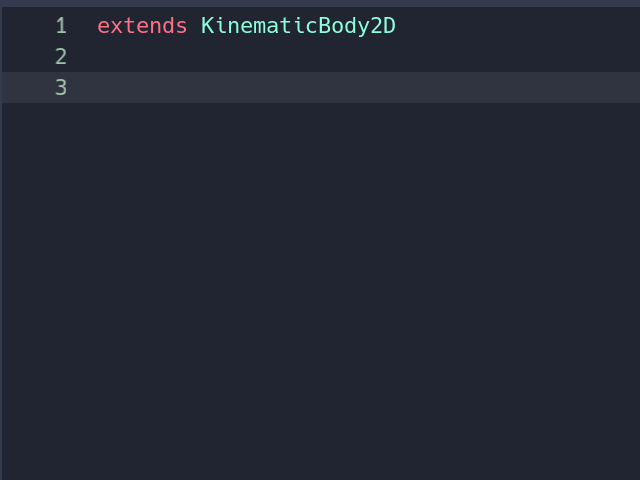

# Geek Brawl - Iniciando o Jogo

### Pré-aula
* Este material foi preparado em 13 de abril de 2023, então a versão utilizada foi a 3.5.2 LTS pois a Franquia ainda não atualizou o conteúdo do portal pra a versão 4.0.2 Lastest.

* Esta primeira aula está sendo preparada tendo em vista que o conteúdo do portal será passado para casa como atividade de casa então não serão utilizados Sprites, entretanto eles ainda serão adicionados ao final da aula como ponto de partida para os alunos verem o que tem no portal.

## Criando o Projeto
> **OBS**:\
> O Godot é composto por duas telas:
> * Prompt (tela preta)
> * Godot
> 
> Ambas as janelas precisam estar funcionando para a Godot se manter funcionando. Caso uma delas feche ambas as telas irão fechar.\
> Caso a janela do *Prompt* não abra não há problema, o problema acontece de ela ser fechada depois de aberta pois isto irá fechar a Godot junto.


Para criar um projeto clique no botão **New Project** no lado direito da tela e uma nova janela irá aparecer


Cuidado onde irá salvar o projeto para não esquecer, então recomendo que salve em **Documents/Godot/Projects**, caso este caminho não exista então basta criar.


Quanto ao nome do projeto dê preferência siga um padrão para a aula: **[Dia da Semana] [Hora da aula] [Nome do aluno Aluno]** como no exemplo: **Sexta 14h Davi**


### Entendendo a interface
Ao entrar na Godot será recebido pela seguinte interface:


Vamos entender cada parte antes de sair fazendo as coisas.


* **Scene**
  

  Nessa parte da tela estarão dispostos todos os objetos da cena, como inimigos, plataformas, player, entre outros. Cenas são as telas do jogo (Menu, Game, Lose, etc.). 


  

* **FileSystem**
  

  Nessa parte ficarão todos os arquivos importados para o projeto (Imagens, Sons, Vídeos, entre outros). 


  

* **Inspector**
  
  
  Nele é possível configurar qualquer objeto que estiver selecionado na Viewport. Por exemplo: tamanho, posição na tela, cor, entre outros (veremos um pouco mais sobre isso a seguir). 


  


## Criando um personagem
Antes de termos um personagem precisamos criar uma *cena* para que o nosso personagem possa existir. Então vamos simplesmente na aba **Scene** e clicar em **2D Scene**


Para criar um personagem é preciso entender primeiro que cada objeto na Godot tem um função específica e que para termos elementos mais complexos temos que ir incrementando o nosso objeto com mais objetos que fazem outras coisas. Dessa forma eles vão se complementando.

Para o nosso personagem precisamos de um objeto que possa se movimentar na tela e ele se chama **KinematicBody2D**, então vamos clicar com o botão direito no objeto **Node2D** que está na aba **Scene** e escolher a opção **Add Child Node**


Após isto seremos recebido por uma janela com várias opções


Use a caixa de pesquisa na parte superor para pesquisar por **KinematicBody2D**, ele será o responsável pela movimentação do personagem. Note que não precisamos pesquisar pelo nome completo para que ele apareça e cuidado para escolher a opção errada, afinal estamos fazendo um jogo 2D


É importante dar nomes aos nossos objetos pois por padrão a Godot dá aos objetos o mesmo nome de seu tipo e isso nem sempre ajuda quando estamos desenvolvendo algo... vamos renomear o **KinematicBody2D** para **Player**

Entretanto como foi dito anteriormente cada objeto faz algo específico na Godot, poranto o objeto que colocamos agora apenas pode se movimentar, precisamos de um objeto que mostre algo na tela.

Para isso vamos usar o objeto **ColorRect** ele é apenas um quadrado colorido na tela, mas servirá para vermos onde está o personagem.

> Antes que surjam reclamações o nosso projeto não será sobre as aventuras de um quadrado branco lutando contra outros polígonos
> Isto está sendo feito apenas nesta aula por motivos didáticos

Então clique com o botão direito no **Player** e escolha novamente **Add Child Node**, mas desta vez pesquise pelo **ColorRect**.

O resultado será algo parecido como o da imagem abaixo:


## Rodando o jogo

Para que o nosso jogo rode temos várias opções, mas indepente de qual vamos escolher precisamos primeiro salvar a cena, então utilize o atalho **Ctrl + S** para salvar e dê o nome de **World** para a cena.

Após salvar a cena as nossas opções são:

- Pressionar F6: essa função irá rodar diretamente a cena aberta no momento
- Pressionar F5: essa função irá rodar a cena marcada como a primeira cena do jogo e casa não haja uma ele irá pedir para que você escolha uma. Essa opção é usada quando queremos testar o jogo do início
  
Escolha qualquer uma delas e então veja o estado atual.


Não é muita coisa, temos um quadrado branco que faz... nada...

É meio decepcionante, mas faz sentido afinal não programamos nada no jogo ainda. Estranho seria ele fazer coisas sem programação!

## Programando nosso Personagem
Para programarmos o personagem vamos selecionar o **Player**, clicar com o botão direito e escolher a opção **Attach Script**


> Para os preguiçosos podemos apenas clicar no pergaminho no topo da aba **Scene**:\
> 

Aparecerá uma telinha para fazer as configurações do script: onde ele será salvo, que tipo terá, entre outras configurações. Clique em Create para criar o Script.


A linguagem de programação se chama **GDScript** e é bem parecida com *Python*:

> 
> 1. Aqui, como falado anteriormente, o código consegue acessar algumas funções especiais de KinematicBody2D que serão utilizadas, como colisão, por exemplo. 
> 2. Nessa parte o código mostra exemplos de como é possível declarar variáveis em GDScript; no caso, são mostradas variáveis do tipo string (texto) e tipo número. 
> 3. A função Ready será executada assim que o objeto com esse script entrar em cena. Pode-se colocar aqui, por exemplo, a vida inicial do player, velocidade inicial dos inimigos, posição inicial do aliado, etc. 
> 4. A palavra reservada pass (reservada, pois não podemos usá-la como nome de variável ou função, por exemplo) tem a função de continuar o código, logo depois de executar a função. 
> 5. A função func _process(delta) é chamada a cada frame e o mais rápido possível. Então, se o seu jogo roda a 60 FPS (60 frames por segundo), por exemplo, ela será executada 60 vezes por segundo, mas o tempo entre um frame e outro pode variar. Ela vem comentada no template, mas podemos tirar o # para utilizá-la. 

## Movimentando o personagem
A movimentação do personagem será feita dentro da função Process, pois, como visto anteriormente, esse método sempre é chamado enquanto o jogo estiver sendo executado, e uma vez que a movimentação precisa ser verificada sempre, é um bom método para ser utilizado. 

> **Informações importantes sobre GDScript**
> 
> Assim como no *Python*, a linguagem *GDScript* é baseada na indentação, ou seja, para que uma linha de código esteja dentro de um método, por exemplo, é necessário que a mesma esteja indentada ao método, como no exemplo a seguir: 

Para movimentar o personagem precisaremos utilizar um função chamada **move_and_collide** dentro da **_process**. Ela precisa de um parâmetro para funcionar que é o vetor velocidade, mas para simplificar o código vamos dividir este vetor em vetor direção e velocidade.

> *O que é vetor?*
> Vetor é uma forma matemática de indicar a direção do movimento. Como estamos fazendo um jogo 2D utilizaremos um Vetor com duas dimensões X e Y\
> X vai indicar a direção do nosso movimento no eixo X que é o Horizontal:
> > X = 0 ficamos parados nesse eixo\
> > X = 1 vamos para o lado poitivo do eixo (direita)\
> > X = -1 vamos para o lado negativo do eixo (esquerda)\
> 
> A mesma ideia se aplica ao Y porém ele diz respeito ao eixo Vertical
> > Y = 0 ficamos parados nesse eixo\
> > Y = 1 vamos para o lado poitivo do eixo (baixo)\
> > Y = -1 vamos para o lado negativo do eixo (cima)
> 

Sabendo o que é um vetor vamos fazer a movimentação do personagem para a direita:

```lua
func _process(delta):
  move_and_collide( Vector2(1, 0) )
```

> **Autocomplete**\
> Você deve ter percebido que, na hora que começou a digitar, aparecem sugestões para completar o que você está digitando. \
> A esse recurso damos o nome de **“autocomplete”**. Ele é muito interessante para nos ajudar a lembrar nomes de métodos e atributos e também serve para agilizar a programação. 
> 
>

Teste o jogo agora e veja o resultado!

**Desafio: tente fazer o personagem andar:**
1. Para esquerda
2. Para baixo
3. Para cima
4. na diagonal (qualquer uma)
5. mais rápido para a direita

## Controlando o personagem

Atualmente, se você prestou bem atenção, o player se move sozinho, mas esse não é o intuito de um jogo, pois é mais legal o jogador controlar o personagem. Para fazer isso, você irá aprender agora o conceito de input.

Inputs são as entradas de dados no seu computador. Quando você aperta uma tecla do teclado, ou o clique do mouse, ou o botão do seu joystick, por exemplo, você está enviando um input para o seu computador, para que ele verifique qual tecla foi apertada.

Para verificar uma condição no computador, ou, no seu caso, verificar uma tecla sendo pressionada, será necessário usar o comando if. O if significa SE, por exemplo: 
- Se você está sujo: 
  - Toma banho. 
- Se você está cansado: 
  - Vai dormir. 
- Se você tem lição de casa para fazer: 
  - Vai fazer. 
- Se a tecla espaço for pressionada: 
  - O personagem pula. 

No script do player será feito um ajuste dentro do método Process, onde primeiro será verificado se uma tecla foi pressionada (no caso, a seta para a direita) para que o personagem possa se movimentar. O comando para verificar se uma tecla está sendo pressionada está contido dentro do grupo Input. 

```lua
func _process(delta):
  if Input.is_key_pressed(KEY_RIGHT):
    move_and_collide( Vector2(1, 0) )
```

Teste e verifique se o personagem anda para a direita.

Agora que o código funciona fica o desafio: faça os controles para as outras direções, ele deve se mover para direita, esquerda, cima e baixo.

Agora que terminou seu código deve estar semelhante ao código abaixo:

```lua
func _process(delta):
  if Input.is_key_pressed(KEY_RIGHT):
    move_and_collide( Vector2(1, 0) )

  if Input.is_key_pressed(KEY_LEFT):
    move_and_collide( Vector2(-1, 0) )

  if Input.is_key_pressed(KEY_DOWN):
    move_and_collide( Vector2(0, 1) )

  if Input.is_key_pressed(KEY_UP):
    move_and_collide( Vector2(0, -1) )
```

A boa notícia é que ele funciona a má é que ele não é muito eficiente, pois mesmo que tenhamos escolhido o movimento para a direita o nosso código ainda vai tentar andar para todas as outras...

Vamos otimizar o código para que fique mais leve para o computador executar. Essa otimização pode ser feita através da construção de métodos, variáveis ou escrevendo de uma maneira mais "inteligente" o código.

Por exemplo: imagine que você está em uma sala vazia, encostado na parede, e no outro canto da sala está um objeto que você precisa pegar. Qual seria a forma mais rápida de se fazer isso?

1. Ir reto em direção ao objeto e pegá-lo. 
2. Ficar andando em círculos e depois ir pegar o objeto. 

Provavelmente você escolheu a primeira opção. Otimizar o código é a mesma coisa, buscando sempre ir direto ao objetivo, sem muitos rodeios, ajudando o programador a encontrar erros mais facilmente e rodar o código com mais eficiência. 

Para melhorar o código podemos fazer algumas coisas:
- utilizar apenas um vetor para direção e com os IF's mudar o seu valor
- utilizar apenas um **move_and_collide**
- Utilizar os comandos ELIF e ELSE
- utilizar uma veriável para guardar a velocidade do personagem

Vamos aplicar todas elas:

Comecemos criando uma variável para a direção antes da função **_process**
```lua
var direction = Vector2()
```

Agora vamos modificar os IF's para que apenas alterem a direção e utilizaremos apenas um **move_and_collide**

```lua
var direction = Vector2()

func _process(delta):
  if Input.is_key_pressed(KEY_RIGHT):
    direction.x = 1

  if Input.is_key_pressed(KEY_LEFT):
    direction.x = -1

  if Input.is_key_pressed(KEY_DOWN):
    direction.y = 1

  if Input.is_key_pressed(KEY_UP):
    direction.y = -1
  
  move_and_collide( direction )
```

Agora vamos utilizar o ELIF e o ELSE

```lua
var direction = Vector2()

func _process(delta):
  if Input.is_key_pressed(KEY_RIGHT):
    direction.x = 1
  elif Input.is_key_pressed(KEY_LEFT):
    direction.x = -1
  else:
    direction.x = 0

  if Input.is_key_pressed(KEY_DOWN):
    direction.y = 1
  elif Input.is_key_pressed(KEY_UP):
    direction.y = -1
  else:
    direction.y = 0
  
  move_and_collide( direction )
```

Por fim vamos guardar nossa velocidade em uma variável:

```lua
var direction = Vector2()
var speed = 5

func _process(delta):
  if Input.is_key_pressed(KEY_RIGHT):
    direction.x = 1
  elif Input.is_key_pressed(KEY_LEFT):
    direction.x = -1
  else:
    direction.x = 0

  if Input.is_key_pressed(KEY_DOWN):
    direction.y = 1
  elif Input.is_key_pressed(KEY_UP):
    direction.y = -1
  else:
    direction.y = 0
  
  move_and_collide( direction * speed )
```

>Antes de terminar vamos adicionar um personagem para que vocês tenham uma dose do que verá em casa:
>
> Comece procurando no computador pelo persoangem que usaremos (deve estar em Documentos ou Downloads ou Imagens), é a imagem de um personagem parado. Basta arrastar esta imagem pra o **File System** da Godot e então o personagem estará importado.

Façam as atividades para casa e escolham suas missões!

---
## Atividade de casa
Para casa os alunos devem fazer a aula do portal. O conteúdo é bem parecido, mas lá será usado um personagem ao invés de uma mero quadrado branco.

---
## Missões
As missões são por dificuldade e quem concluir as missões corretamente até a próxima aula irá receber bônus
* [1] Qual a diferença entre **_process** e **_physics_process**
* [1] Qual a diferença entre **move_and_collide** e **move_and_slide**
* [1] O que é um **Sprite**
* [1] O que é um **AnimatedSprite**
* [2] O que é um **CollisionShape2D**
* [2] Qual comando uso para pegar a posição do mouse na tela?
* [2] O que é o **delta**?
* [3] O que é **input_map**?
* [4] Como mudar o tamanho/formato da tela do jogo?


