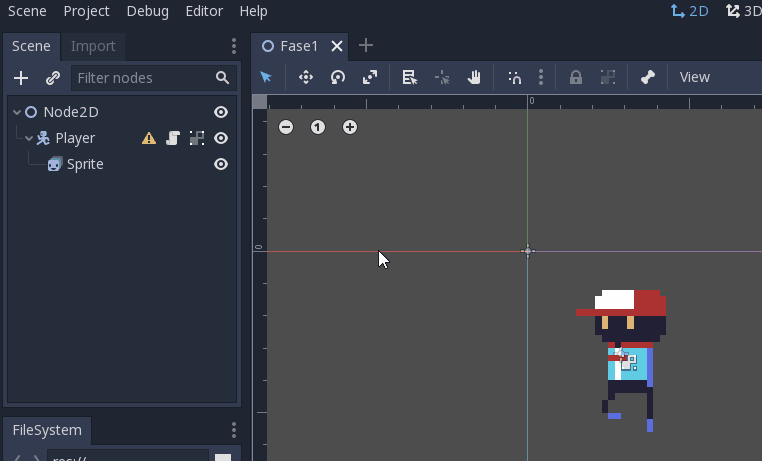
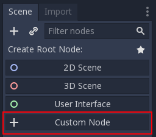
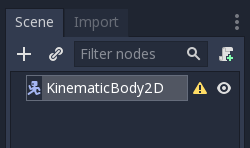
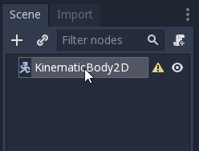
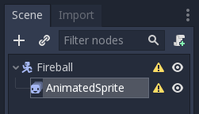
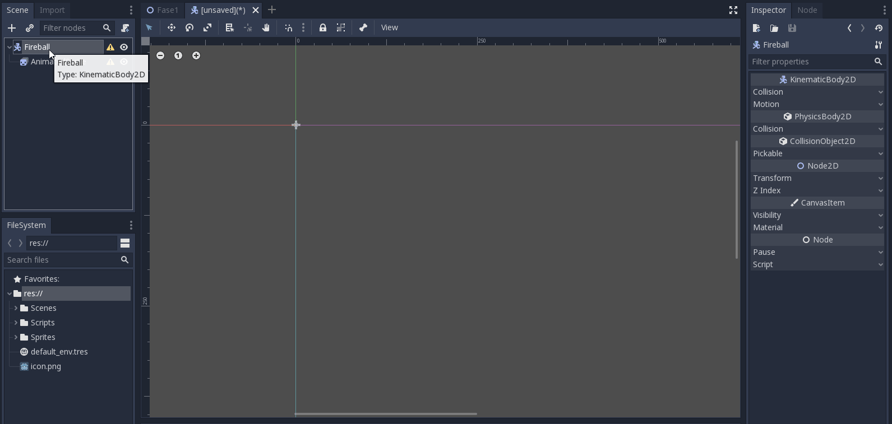
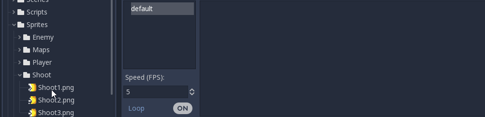
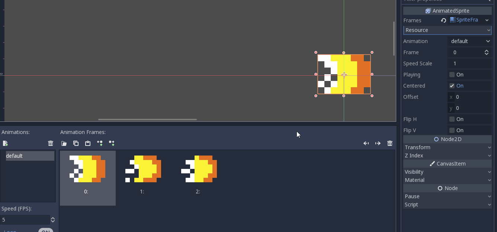
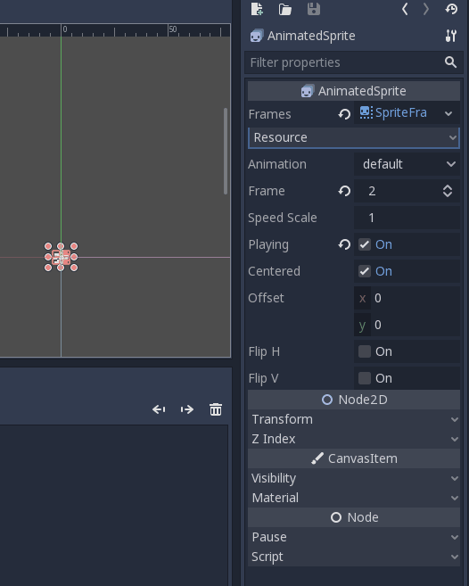
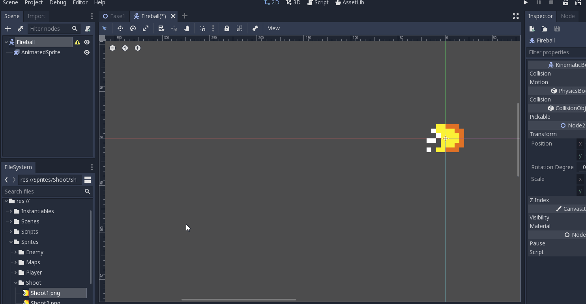

# Gerando Bolas de Fogo

## Pré-aula
Para a aula de hoje é preciso que todos os alunos estejam com o arquivo do projeto até onde foi concluído na aula anterior que também pode ser contrado na pasta **Project/Inicio**.

Para estudar o conteúdo da aula e ver onde ela será encerrada basta ferificar o projeto na pasta **Project/Final**

Este arquivo está sendo mais longo para retirar possíveis dúvidas do instrutor, então ele deve resumir o conteúdo removendo explicações desnecessarias para a aula.

Lembre de verificar o progresso dos alunos nas atividades de casa, tanto no portal quanto as extras.

### Progresso do Projeto
- [X] Criando Objetos
- [X] Movimentação do personagem
- [X] Importando arquivos
- [X] Trabalhando com Animações
- [ ] **Instâncias**
- [ ] **Gerando bolas de fogo**
- [ ] Gerando Inimigos
- [ ] Destruindo Inimigos
- [ ] Canvas e HUD
- [ ] Criando o cenário
- [ ] Menu Inicial e Mudança de cena

## Criando objetos instanciáveis
Nessa Unit, serão criadas as bolas de fogo que o player conseguirá lançar. Para fazê-las, você precisará criar uma nova cena com a bola de fogo, tornando-a um objeto instanciável, ou seja, um objeto que pode ser criado enquanto o jogo estiver rodando.

Para criar um objeto instanciável clique em no *menu Scene* e depois na opção *New Scene*.

Uma vez que o que você está criando não é uma fase, não será escolhida a opção 2D Scene, pois será criado um objeto, sendo assim, clique na opção Custom Node para escolher outro tipo de node.

Na tela que aparece procure pelo tipo **KinematicBody2D** e selecione-o

Assim como foi usado no player o KinematicBody2D, a bola de fogo também utilizará funções desse tipo de objeto para poder se movimentar.

Renomeie o objeto para *Fireball*.

Para que você possa ver a bola de fogo é preciso colocar um sprite como sendo filho do KinematicBody2D.

Clique com o botão direito sobre a *Fireball*, vá até a opção *Add Child Node* e adicione um **AnimatedSprite**.

## Animando a FireBall
O mesmo processo que foi feito com o player será feito com a bola de fogo para poder animá-la.

Primeiro com o *AnimatedSprite* selecionado, clique na propriedade Frames no Inspector (que está marcada como empty), selecione *New Sprite Frames* e clique novamente para abrir a janela de animações.

Não será necessário mudar o nome da animação, uma vez que a bola de fogo possui apenas uma.

Vá até a pasta **Sprites/Shoot** e pegue os frames que compõem a animação da fireball colocando-os na área de animação.

Para verificar a velocidade da animação, clique na opção Playing no Inspector (lembrando que o *AnimatedSprite* deve estar selecionado). Caso queira aumente a velocidade da animação.

Na hora de salvar a bola de fogo, crie uma pasta com o nome Instantiables (referência aos objetos instanciáveis).

## Programando a FireBall
Antes de mais nada, caso você queira aumentar o tamanho da bola de fogo, selecione- o AnimatedSprite e vá até o Inspector na opção **Transform/Scale**.

Selecione a Fireball e adicione um script à ela clicando no pergaminho. Mude a pasta que será salvo o script para pasta Scripts.

