# Trabalhando com Animações

### Pré-aula
Para a aula de hoje é preciso que todos os alunos estejam com o arquivo do projeto até onde foi concluído na aula anterior que também pode ser contrado na pasta **Project/Inicio**.

Para estudar o conteúdo da aula e ver onde ela será encerrada basta ferificar o projeto na pasta **Project/Final**

Este arquivo está sendo mais longo para retirar possíveis dúvidas do instrutor, então ele deve resumir o conteúdo removendo explicações desnecessarias para a aula.

Lembre de verificar o progresso dos alunos nas atividades de casa, tanto no portal quanto as extras.

### Progresso do Projeto
- [X] Criando Objetos
- [X] Movimentação do personagem
- [ ] **Importando arquivos**
- [ ] **Trabalhando com Animações**
- [ ] Instâncias
- [ ] Gerando bolas de fogo
- [ ] Gerando Inimigos
- [ ] Destruindo Inimigos
- [ ] Canvas e HUD
- [ ] Criando o cenário
- [ ] Menu Inicial e Mudança de cena

## Importando arquivos
Aprender a importar arquivos externos para a Godot é algo muito importante, afinal precisamos adicionar as animações dos personagens, as músicas, e vários outros recursos que vão nos ajudar na construção do nosso projeto.

Para a aula de hoje iremos utilizar um conjunto de recursos que está disponível para download no próprio portal da SuperGeeks para facilitar, mas podemos utilizar arquivos obtidos em outros sites como o [Open Game Art](https://opengameart.org) ou o [Itch.io](https://itch.io/game-assets).

Baixe o arquivo e ele virá em um formato compactado. Isto quer dizer que temos um ou mais arquivos todos juntos em uma mesma pasta que teve seu tamanho reduzido para facilitar o download e/ou a cópia para outros computadores.

Ainda é possível abrir essa pasta e ver o que tem dentro, mas nem sempre será possível utilizar o que está la dentro desta forma então é preciso extrair o que tem dentro dela para termos os arquivos originais e assim utilizar. Para isto basta clicar com o botão direito e seguir um dos 3 passos a seguir (algum deles irá funcionar, mas qual deles irá depender do computador que está usando em casa):

- Escolha a opção **Extrair Tudo**, então ele irá perguntar onde quer salvar os arquivos extraídos, mas tudo que precisamos fazer é clicar em **Extrair**
- Escolha a opção **Extrair Para**, normalmente esta opção tem um nome maior como: **Extrair Para [Nome da Pasta]**, mas ainda será esta oção
- Escolha a opção **Winrar**, depois procure pelação **Extrair Para** e o restante é como no passo anterior.

Feito isto uma nova pasta será criada e ela terá o mesmo nome do arquivo baixado. Agora vamos entrar nesta pasta até encontrarmos uma pasta com o nome **Player** dentro dela teremos uma nova pasta com o nome **Idle** e dentro dela teremos algumas imagens.

Para importar estes arquivos basta arrastar o arquivo para dentro do **FileSystem** na Godot e pronto. O resultado será algo semelhante a imagem abaixo:

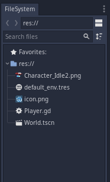

Para utilizar esta imagem no nosso projeto vamos primeiro abrir o nosso cenário que no meu caso se chama **World.tscn**, para isto dê um duplo clique nele.

Vemos que ainda temos o projeto como era antes: um quadrado branco qualquer na nossa cena. Para mudar isso façamos o seguinte:

1. Delete o *ColorRect*
2. Adicione, como filho do *Player*, um objeto chamado *Sprite*
3. Arraste a imagem que foi importada anteriormente para o nosso objeto *Sprite*
4. Ele mostrará algumas opções, basta escolher *Texture*

Agora temos o nosso personagem!

Infelizmente ele está muito pequeno, então vamos selecionar o objeto *Sprite* e vamos até o *Inspector*. Lá demos procurar pela opção **Transform** e dar um clique nela para que ela abra. Dentro dela teremos algumas opções novas, uma telas é a opção **Scale** com dois valores X e Y. Mudemos, então, os valores de X e de Y para 3 para que seu tamanho seja triplicado e então teremos um personagem maior.

Infelizmente ainda temos um problema:

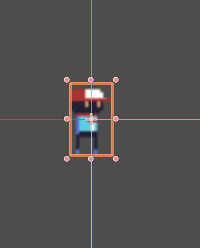

O nosso personagem está com a aparência muito embaçada e isto acontece porque por padrão as ferramentas de desenvolvimento de jogos aplicam um filtro para melhorarem as artes dos jogos, mas no nosso caso estamos trabalhando com um Pixel Art, uma imagem que é naturalmente de baixa qualidade então o filtro acaba atrapalhando.

Para remover o filtro siga os passos abaixo:

1. Selecione a imagem que deseja remover o filtro
2. Vá até a aba **Import** (ela fica ao lado da aba *Scene*)
3. Procure pela propriedade **Filter** e desmarque-a
4. Clique no botão **Reimport**

Seguidos estes passos o resultado será o seguinte:

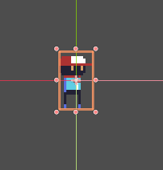

Perfeito! 

Infelizmente tenho más notícias, vamos precisar fazer isso para todas as 60 imagens que vamos precisar importar...

Ou precisariamos se a Godot não fosse uma ferramenta profissional de desenvolvimento de jogos.

Para não termos que fazer tudo isso várias vezes basta definirmos as configurações da imagem atual como sendo a configuração padrão para todas as imagens que serão importadas.

Siga os passos abaixo:

1. Selecione a imagem que configuramos
2. Vá novamente até a aba *Import*
3. Procupre pelo botão *Preset*
4. Selecione a opção *Set as Default for 'Textures'*

Com isto feito podemos importar as outras imagens e elas já virão com o filtro desabilitado.

## Organizando o Projeto
Antes de começarmos a importar mais arquivos vamos começar a organizar o nosso projeto para que ele não cabe virando um galinheiro e isso acabe complicando a nossa vida na hora de procruar nossos arquivos.

Vamos criar algumas pastas para guardar tipos específicos de arquivos entre os arquivos que já temos até o momento:

1. Clique com o botão direito na pasta **res://**
2. Escola a opção **New Folder**

Este passo a passo irá se repetir para todas as pastas que vamos criar no projeto e vamos precisar das seguintes pastas:

* *Codes*: onde iremos guardar nossos Scripts
* *Scenes*: onde iremos guardar nossas Cenas
* *Sprites*: onde iremos guardar nossos Sprites

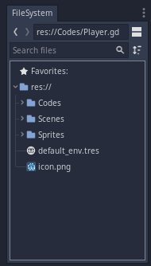

No futuro teremos mais pastas, mas por enquanto estas irão servir. 

Lembre-se de arrastar os arquivos para as pastas corretas.

Agora que temos as novas pastas vamos importar todos os nossos sprites. Para isso vamo começar selecionando a pasta *Sprites*


Após isto vamos voltar até a pasta onde estão os arquivos que extraímos e vamos procurar por estas pastas:

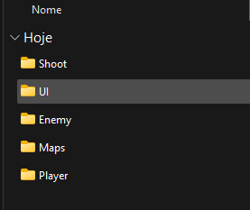

Selecione todas e arraste para o *FileSystem* na Godot. Isso também pode ser feito de uma por uma, o resultado será o mesmo.

A Godot irá carregar os novos arquivos e isso vai demorar alguns instantes, mas será rápido pois não estamos importanto muita coisa. E então teremos o seguinte dentro da pasta Sprites:

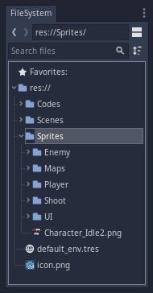

## Trabalhando com Animações
O Objeto Sprite é muito bom, mas sozinho ele pode apenas mostrar imagens estáticas. Se quisermos trabalhar com animações vamos precisar de um outro objeto que é o **AnimatedSprite**.

Para fazer nossas animações vamos começar apagando o objeto **Sprite** que está dentro do nosso Player e então adicionar o **AnimatedSprite**, lembre de alterar a propriedade Transform/Scale para 3 tanto no X quanto no Y para que o personagem não fique parecendo pequeno demais.

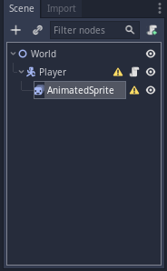

Para criarmos nossas animações no *AnimatedSprite* nós precisaremos criar elas e começaremos isso no *Inspector*. Siga os passos abaixo:

1. Selcione o *AnimatedSprite*
2. Vá até o *Inspector* e procure a propriedade *Frames*, ela estará marcada como *Empty*
3. Clique no *Empty* e então escolha a opção *New SpriteFrames*
4. Agora a propriedade *Frames* está marcada como *SpriteFrames* (e o alerta do AnimatedSprites terá desaparecido se você havia se incomado com ele antes era essa a razão)
5. Clique no *SpriteFrames* e uma nova janela aparecerá na parte inferior da Godot

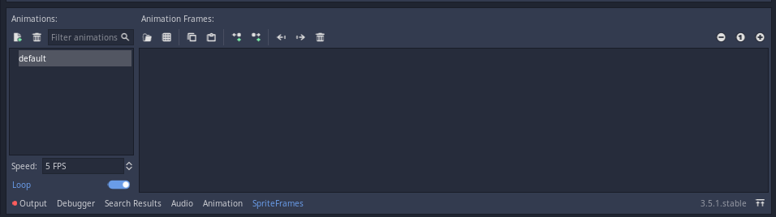

Ela vem por padrão com uma animação chamada *default*, mas que não possui imagens (as imagens devem aparecer nesse espaço maior na direita).

Vamos começar criando as animações do nosso personagem que serão duas: IDLE e WALK.

> Nessa parte recomendo que siga padrões para a nomenclatura das animações para evitar erros e encorege os alunos a fazerem o mesmo
>
> O padrão que eu sigo é colocar tudo em minúsculo, mas para este projeto farei em maiúsculo para ajudar a explicar.
>
> Faça da sua preferência.

Para fazer a animação de IDLE vamos clicar duas vezes no nome *default* e renomear para *IDLE*

Agora faremos os seguintes passos:

1. Vá até o *FileSystem*
2. Vá até a pasta **Sprites/Player/Idle**
3. Clique na primeira imagem (não clique em nada mais depois disso)
4. Desça até a última imagem desta pasta (ainda não clique em nada)
5. Segure a tecla *Shift*
6. Clique na última imagem (dessa forma selecionaremos todas as imagens da pasta)
7. Agora arraste a seleção para a região onde ficam as imagens da animação

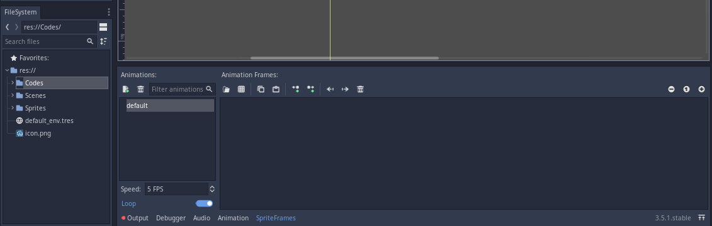

Infelizmente a animação não sai do primeiro quadro (primeira imagem), mas isto é apenas por não termos ativado o *AnimatedSprites*.

Para ativar ele basta selecionar o AnimatedSprites, procurar a propriedade *Playing* e ativar.

> Todas as instruções dadas até o momento são funcionais na Godot 3.5.2, mas não na versão 4.0 então tenha certeza de confirmar a versão que os alunos vão usar pois muito muda de uma versão para outra

Para criar uma nova animação vamos voltar a janela do SpriteFrames (a que fica na parte de baixo da Godot com as animações) clicar no botão que fica abaixo do nome *Animations*

> Caso ela tenha fechado basta ir até o AnimatedSprites e clicar novamente em *SpriteFrames* lá na propriedade *Frames*

Um novo nome de animação irá aparecer, mode o nome para WALK e tente criar a animação de andar:

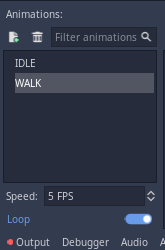

Agora podemos ver que a animação está bem lenta. Isso acontepe pela velocidade que estamos passando os quadros. Para deixar mais rápido aumente o valor da propriedade *Speed* como na imagem abaixo:

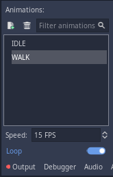

Agora está bem melhor.

Se dermos Play no jogo veremos que ele não sai da animação WALK independente do que fazemos. Para mudar de animação vamos fazer isso pela programação.

## Programando a mudança das animações
Para a programação das animações precisamos saber quando vamos fazer essa mudança, mas a resposta é bem simples: sempre que andamos!

Faremos então no código da **_process** e depois faremos melhorias.

A ideia é a seguinte: 

* O *AnimatedSprite* tem uma propriedade chamada **animation** que indica qual a animação que ele está tocando no momento. Vamos mudar o nome dessa animação sempre que precisarmos. 
* Já no caso do Player para o lado nós iremo verificar a posição do mouse. A razão é que nosso Player, mais para frente, irá atirar na direção do mouse então hoje faremos ele olhar na direção do mouse.
* Usaremos o **flip_h** do *AnimatedSprite* e o **get_global_mouse_position** da Godot para ter acesso ao que nos falta

O código será colocado após o comando **move_and_collide** ficará assim:

```lua
move_and_collide( direction * speed )
	
if direction.x == 0 and direction.y == 0:
    get_child(0).animation = "IDLE"
else:
    get_child(0).animation = "WALK"

if global_position.x > get_global_mouse_position().x :
    get_child(0).flip_h = true
else:
    get_child(0).flip_h = false
```

A aula fica por aqui, mas caso queira melhorar o código pode continuar.

## Melhorando o Código
O código já funciona e é ótimo ver isso, mas sempre podemos melhorar para evitar muitas códigos para coisas diferentes estando misturado.

Para melhorar criaremos a nossa própria função. Assim como a Godot tem a **_process** nós podemos criar as nossas próprias funções. Para isso precisamos de 3 coisas:

1. Usar o comando **func**
2. dar um nome para a nossa função que termine com parênteses
3. Chamar a nossa função para ser executada em algum lugar (no nosso caso será na **_process**)

Dessa forma o nosso código pode ser feito da seguinte forma:

```lua
func _process(delta):
	if Input.is_key_pressed(KEY_RIGHT):
		direction.x = 1
	elif Input.is_key_pressed(KEY_LEFT):
		direction.x = -1
	else:
		direction.x = 0
	
	if Input.is_key_pressed(KEY_DOWN):
		direction.y = 1
	elif Input.is_key_pressed(KEY_UP):
		direction.y = -1
	else:
		direction.y = 0
	
	move_and_collide( direction * speed )
	animate()

func animate():
	if direction.x == 0 and direction.y == 0:
		get_child(0).animation = "IDLE"
	else:
		get_child(0).animation = "WALK"
	if global_position.x > get_global_mouse_position().x :
		get_child(0).flip_h = true
	else:
		get_child(0).flip_h = false
```

Podemos melhorar ainda mais o nosso código ao acessar o nosso AnimatedSprite com outro comando para evitar erros e comparar todo o nosso vetor ao invés das partes dele:

```lua
func _process(delta):
	if Input.is_key_pressed(KEY_RIGHT):
		direction.x = 1
	elif Input.is_key_pressed(KEY_LEFT):
		direction.x = -1
	else:
		direction.x = 0
	
	if Input.is_key_pressed(KEY_DOWN):
		direction.y = 1
	elif Input.is_key_pressed(KEY_UP):
		direction.y = -1
	else:
		direction.y = 0
	
	move_and_collide( direction * speed )
	animate()

func animate():
	if direction == Vector2.ZERO:
		get_node("AnimatedSprite").animation = "IDLE"
	else:
		get_node("AnimatedSprite").animation = "WALK"
	if global_position.x > get_global_mouse_position().x :
		get_node("AnimatedSprite").flip_h = true
	else:
		get_node("AnimatedSprite").flip_h = false

```


